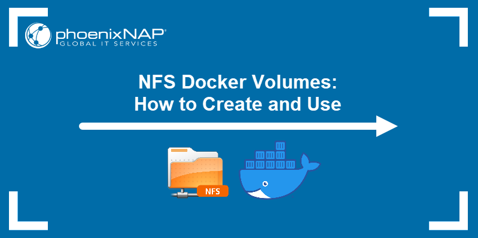
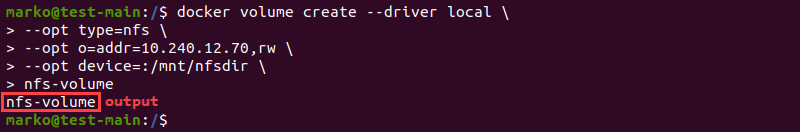
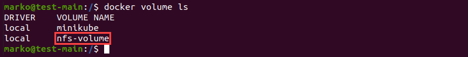
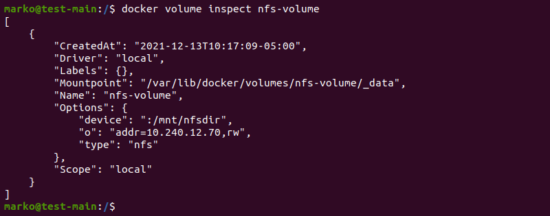
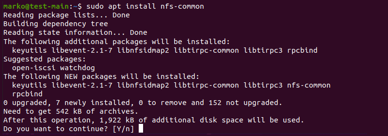
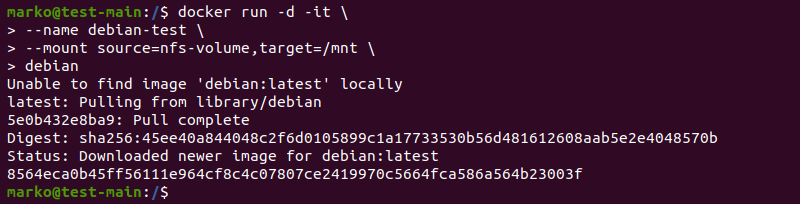
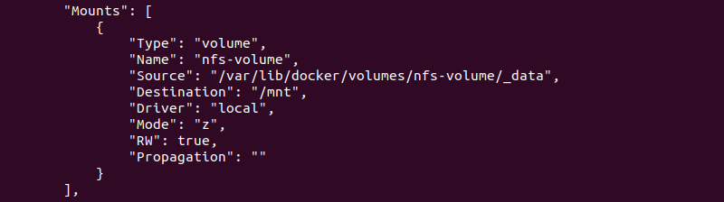
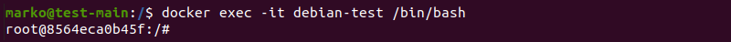
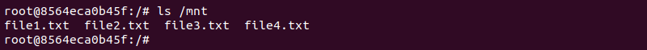
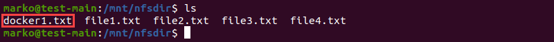

# NFS Docker Volumes: как создавать и использовать


Ссылка на оригинальную статью: [NFS Docker Volumes: How to Create and Use](https://phoenixnap.com/kb/nfs-docker-volumes)

Опубликовано: 15 декабря 2021

Автор: Marko Aleksic


## Введение

[Тома Docker](https://phoenixnap.com/kb/docker-volumes) — это предпочтительный механизм для настройки постоянного хранилища для ваших [контейнеров Docker](https://phoenixnap.com/kb/docker-container-management). Тома — это существующие каталоги в файловой системе хоста, смонтированные внутри контейнера. Доступ к ним возможен как из контейнера, так и из хост-системы.

Docker также позволяет пользователям монтировать каталоги, совместно используемые через систему удаленного обмена файлами NFS. Тома, созданные для этой цели, используют собственный драйвер NFS Docker, что устраняет необходимость монтирования каталога NFS в хост-системе.

Из этого туториала вы узнаете, как создавать и использовать тома NFS Docker.

<figure><figcaption></figcaption></figure>

## Предварительные условия

* [Сервер NFS установлен и настроен](https://phoenixnap.com/kb/ubuntu-nfs-server) на удаленном компьютере.
* [Докер установлен](https://phoenixnap.com/kb/install-docker-on-ubuntu-20-04) на локальной машине.
* Учетная запись пользователя с правами root/sudo.


Bare Metal Cloud предлагает масштабируемое распределенное сетевое хранилище файлов для чувствительных к задержкам и высокопроизводительных рабочих нагрузок. Посмотрите наше [видеоруководство](https://youtu.be/dt4sC3SF1do), в котором объясняется, как развернуть сервер NFS с помощью Bare Metal Cloud.


## Создание тома Docker NFS

Самый простой способ создания томов Docker и управления ими — использование команды `docker volume` и ее подкоманд.

Синтаксис создания тома NFS Docker включает два варианта.

* Параметр `--driver` определяет драйвер локального тома, который принимает параметры, аналогичные команде монтирования в Linux.
* Опция `--opt` вызывается несколько раз для предоставления дополнительной информации о томе.

Подробности включают в себя:

* Тип тома.
* Режим записи.
* IP- или веб-адрес удаленного сервера NFS.
* Путь к общему каталогу на сервере.

```bash
docker volume create --driver local \
  --opt type=nfs \
  --opt o=addr=[ip-address],rw \
  --opt device=:[path-to-directory] \
  [volume-name]
```

В приведенном ниже примере показано создание тома NFS Docker с именем nfs-volume. Том содержит каталог `/mnt/nfsdir`, расположенный на сервере, с разрешением rw (чтение/запись). IP-адрес сервера — 10.240.12.70.

Успешно выполненная команда выводит имя тома.

<figure><figcaption></figcaption></figure>


Прежде чем создавать том NFS, убедитесь, что [IP-адрес](https://phoenixnap.com/kb/how-to-find-ip-address-linux) вашей хост-системы Docker указан в файле `/etc/exports` на сервере.


Выведите список доступных томов Docker.

```bash
docker volume ls
```

В выходных данных указан созданный вами том.

<figure><figcaption></figcaption></figure>

Проверьте том с помощью подкоманды inspect.

```bash
docker volume inspect [volume-name]
```

Вывод показывает конфигурацию тома.

<figure><figcaption></figcaption></figure>

## Монтируем NFS в контейнер

Чтобы смонтировать том NFS в контейнер, установите пакет nfs-common в хост-системе.

Начните с обновления репозиториев.

```bash
sudo apt update
```

Используйте APT для установки пакета nfs-common.

```bash
sudo apt install nfs-common
```

Подтвердите, что вы хотите установить пакет, и дождитесь завершения установки.

<figure><figcaption></figcaption></figure>


Если вы используете YUM или RPM для управления пакетами, пакет DNS-клиента называется nfs-utils.


Используйте [команду docker run](https://phoenixnap.com/kb/docker-run-command-with-examples), чтобы запустить контейнер. Укажите том NFS и точку монтирования в разделе --mount.

```bash
docker run -d -it \
  --name [container-name] \
  --mount source=[volume-name],target=[mount-point]\
  [image-name]
```

В приведенном ниже примере том NFS с именем nfs-volume монтируется в каталог /mnt контейнера.

<figure><figcaption></figcaption></figure>

Подтвердите, что том был успешно смонтирован, с помощью команды `docker inspect`.

```bash
docker inspect [container-name]
```

Раздел выходных данных Mounts содержит тома, смонтированные в контейнер.

<figure><figcaption></figcaption></figure>

Войдите в оболочку bash контейнерной среды с помощью `docker exec`:

```bash
docker exec -it [container-name] /bin/bash
```

<figure><figcaption></figcaption></figure>

Выведите содержимое каталога `/mnt`.

```bash
ls /mnt
```

В выводе показаны файлы, размещенные в каталоге `/mnt/nfsdir` на сервере.

<figure><figcaption></figcaption></figure>

Если вы создадите файл внутри контейнера Docker, он также будет доступен в исходном каталоге на сервере. Для проверки используйте [команду touch](https://phoenixnap.com/kb/touch-command-in-linux), чтобы создать пустой файл в каталоге `/mnt`.

```bash
touch /mnt/docker1.txt
```

На сервере перейдите к каталогу, которым вы поделились, и перечислите его содержимое. Появится файл, созданный в контейнере Docker.

<figure><figcaption></figcaption></figure>

## Монтирование томов NFS с помощью Docker Compose

Если вы используете [Docker Compose](https://phoenixnap.com/kb/docker-compose) для управления контейнерами, смонтируйте том NFS, определив его в файле YML.

Создайте файл YML.

```bash
nano docker-compose.yml
```

Определите том NFS в разделе томов.

```yaml
version: "3.2"
services:
  [service-name]:
    image: [docker-image]
    ports:
      - "[port]:[port]"
    volumes:
      - type: volume
        source: [volume-name]
        target: /nfs
        volume:
          nocopy: true
volumes:
  [volume-name]:
    driver_opts:
      type: "nfs"
      o: "addr=[ip-address],nolock,soft,rw"
      device: ":[path-to-directory]"
```


Параметры nolock и soft гарантируют, что Docker не зависнет в случае потери соединения с сервером NFS.


Создайте и запустите контейнер с помощью команды `docker-compose up`.

## Заключение

В статье объясняется, как создавать и монтировать тома Docker, содержащие каталоги, доступные через NFS. Методы, описанные в статье, включают монтирование томов с помощью командной строки или Docker Compose.

Если вас интересует Docker, прочитайте, как [размещение контейнеров в Bare Metal Cloud](https://phoenixnap.com/bare-metal-cloud) может помочь вам [оптимизировать производительность Docker](https://phoenixnap.com/kb/docker-optimize-performance).
