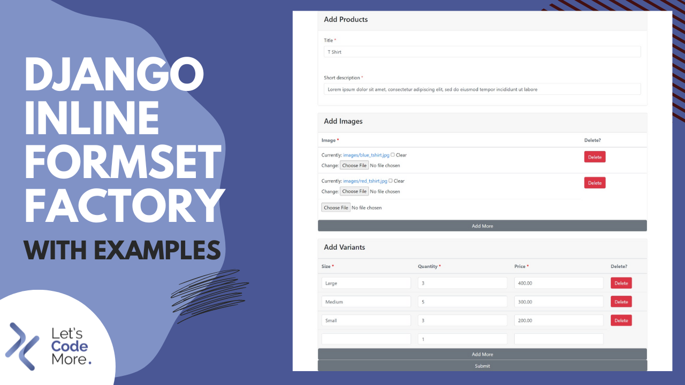
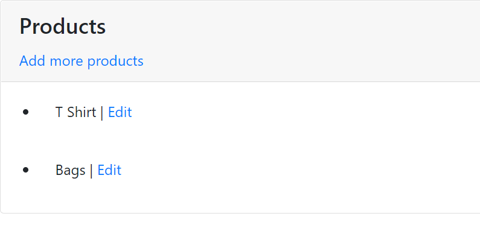
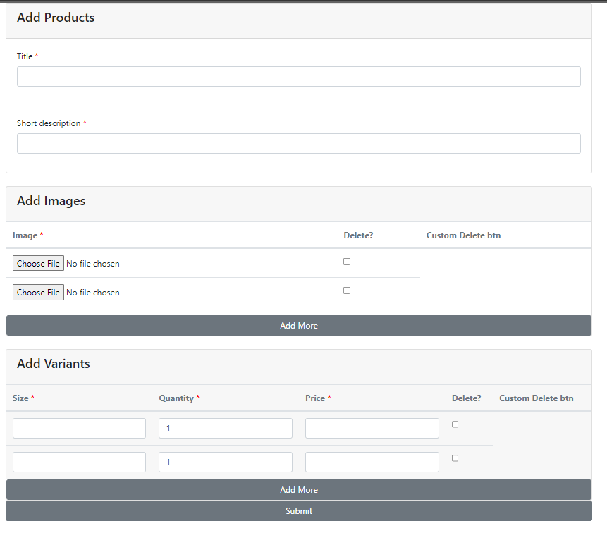
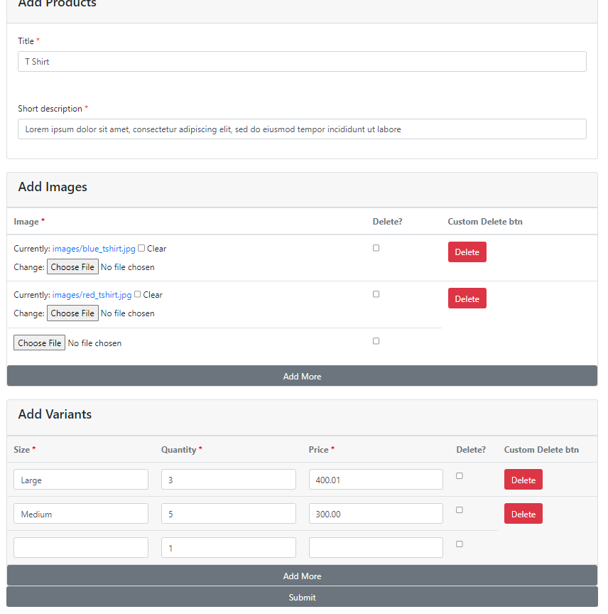

# Django inline formset factory с примерами


Ссылка на оригинальную статью: [Django Inline Formset Factory with Examples](https://www.letscodemore.com/blog/django-inline-formset-factory-with-examples/)

Опубликовано: 12 сентября 2022

Автор: Areeba Seher


<figure><figcaption></figcaption></figure>

Для недавнего проекта мне пришлось использовать встроенную фабрику форм Django с использованием представлений на основе классов. Вы можете обновить несколько одинаковых форм на одной странице, используя встроенную фабрику наборов форм Django. По сути, это позволяет вам массово редактировать несколько вещей одновременно.

Я видел несколько статей. Они используют некоторые внешние пакеты javascript для этой работы. Здесь я использую пользовательский JS. И это очень легко.

## Прежде всего, зачем нам нужен встроенный набор форм Django:

Разрешить пользователю создавать и обновлять связанные через внешний ключ объекты из представлений создания/обновления ссылочного объекта на одной странице.

## Сценарий: добавьте изображения и варианты к продукту

Предположим, мы работаем над веб-сайтом электронной коммерции и у нас есть модель продукта **Product**. Поскольку мы знаем, что у одного продукта может быть много **изображений** и **вариантов**, и мы не знаем, сколько изображений или вариантов пользователи выберут для одного продукта. Поэтому мы хотим, чтобы пользователь мог добавлять столько изображений и вариантов, сколько ему нужно, просто нажимая кнопку «добавить еще», которая создает новую строку в форме «Добавить продукт».

## Что мы будем делать в этой статье?

1. Выводить список всех продуктов.
2. Создавать новые продукты с изображениями и вариантами.
3. Обновлять продукты с изображениями и вариантами.
4. Удалять наборы форм, используя встроенные флажки удаления django. А также пользовательскую кодированную функциональность кнопки удаления.

## Вот как выглядит конечный результат:

#### 1) Выводить список всех продуктов.

<figure><figcaption></figcaption></figure>

#### 2) Создавать новые продукты с изображениями и вариантами.

<figure><figcaption></figcaption></figure>

#### 3) Обновлять продукты с изображениями и вариантами.

<figure><figcaption></figcaption></figure>

## Что такое встроенная (inline) фабрика форм?

Встроенные наборы форм — это небольшой уровень абстракции поверх наборов форм моделей. Это упрощает работу со связанными объектами через внешний ключ.

```python
# function::
def inlineformset_factory(
    parent_model,
    model,
    form=ModelForm,
    formset=BaseInlineFormSet,
    fk_name=None,
    fields=None,
    exclude=None,
    extra=3,
    can_order=False,
    can_delete=True,
    max_num=None,
    formfield_callback=None,
    widgets=None,
    validate_max=False,
    localized_fields=None,
    labels=None,
    help_texts=None,
    error_messages=None,
    min_num=None,
    validate_min=False,
    field_classes=None,
    absolute_max=None,
    can_delete_extra=True,
    renderer=None,
    edit_only=False
)
```

В версии **Django 3.2** добавлены два новых аргумента:

1. **absolute\_max**: ограничение максимального количества создаваемых форм. Параметр **absolute\_max** позволяет ограничить количество форм, которые могут быть созданы при отправке данных POST. Это защищает от атак с исчерпанием памяти с использованием поддельных запросов POST.
2. **can\_delete\_extra** (новый аргумент **can\_delete\_extra** позволяет удалить опцию удаления лишних форм)

В **Django 4.1** добавлен один новый аргумент:

1. **edit\_only** (новый аргумент **edit\_only** для **inlineformset\_factory** позволяет предотвратить создание новых объектов.)

### Сведения о параметрах встроенной функции inline Formset:

* **parent\_model\***: Родительская модель — это ваша основная модель. В нашем примере **Product** — это **parent\_model**. Это обязательное поле.
* **model\***: Модель, у которой есть внешний ключ к родительской модели. В нашем примере **Image** и **Variant** являются такими моделями.
* **form\***: определяет форму модели. В нашем случае **ImageForm** и **VariantForm** являются формами.
* **formset**: вы можете предоставить набор форм модели, переопределив **BaseInlineFormSet**, по умолчанию **BaseInlineFormSet** предоставляется django.
* **fk\_name**: если ваша модель имеет более одного: class:`~django.db.models.ForeignKey` для **parent\_model**, вы должны указать **fk\_name**.
* **fields**: необязательный список имен полей. Если указано, в возвращаемые поля будут включены только именованные поля.
* **exclude**: необязательный список имен полей. Если указано, именованные поля будут исключены из возвращаемых полей, даже если они перечислены в аргументе **fields**.
* **extra**: Количество дополнительных встроенных форм, которые вы хотите показать. По умолчанию это 3.
* **can\_order**: чтобы помочь с упорядочением форм в наборах форм. По умолчанию `False`.
* **can\_delete**: чтобы помочь с удалением форм в наборах форм. По умолчанию `True`.
* **max\_num**: дает вам возможность ограничить количество форм, которые будет отображать набор форм.
* **formfield\_callback**: это вызываемый объект, который принимает поле модели и возвращает поле формы. Этот метод запускается перед преобразованием поля модели в поле формы.
* **widgets**: это словарь имен полей модели, сопоставленных с виджетом. Вы можете добавить виджеты для настройки полей формы.
* **validate\_max**: если передано значение `validate_max=True`, то проверка также проверит, что количество форм в наборе данных за вычетом тех, которые помечены для удаления, меньше или равно **max\_num**. Он строго проверяется на соответствие **max\_num**, даже если **max\_num** было превышено, потому что количество предоставленных исходных данных было чрезмерным.
* **localized\_fields**: это список имен полей, которые должны быть локализованы так же, как мета-опция формы модели. Он добавляет поле набора форм с поддержкой разных языков.
* **labels**: словарь имен полей модели, сопоставленных с меткой. Используется для переопределения меток полей набора форм, как мета-параметр формы модели.
* **help\_texts**: словарь имен полей модели, сопоставленных с текстом справки. Используется для добавления текста справки в поля набора форм, как мета-параметр формы модели.
* **error\_messages**: это словарь имен полей модели, сопоставленный со словарем сообщений об ошибках. Используется для добавления сообщений об ошибках в поля набора форм.
* **min\_num**: дает вам возможность ограничить минимальное количество форм, которые будет отображать набор форм.
* **validate\_min**: Если передано значение `validate_min=True`, проверка также проверит, что количество форм в наборе данных за вычетом тех, которые помечены для удаления, больше или равно **min\_num**.


Связанная статья о **min\_num** и **validate\_min**: [как установить хотя бы одну встроенную форму, необходимую для встроенного набора форм django](https://www.letscodemore.com/blog/how-to-set-atleast-one-inline-form-required-in-django-inline-formset/)


* **field\_classes**: это словарь имен полей модели, сопоставленный с классом поля формы.
* **absolute\_max**: ограничение максимального количества создаваемых форм. Параметр **absolute\_max** позволяет ограничить количество форм, которые могут быть созданы при отправке данных POST. Это защищает от атак с исчерпанием памяти с использованием поддельных запросов POST.
* **can\_delete\_extra**: новый аргумент **can\_delete\_extra** позволяет удалить опцию удаления лишних форм. При установке `can_delete=True` указание `can_delete_extra=False` удалит возможность удаления дополнительных форм.
* **edit\_only**: новый аргумент **edit\_only** для **inlineformset\_factory** позволяет предотвратить создание новых объектов.

Перейдём к кодированию.

### Требования

```
django==3.2.15
pillow
```

### Модели

Здесь у нас есть 3 простые модели.

```python
# models.py

from django.db import models

class Product(models.Model):
    title = models.CharField(max_length=150)
    short_description = models.TextField(max_length=100)

    def __str__(self):
        return self.title

class Image(models.Model):
    product = models.ForeignKey(
        Product, on_delete=models.CASCADE, null=True
        )
    image = models.ImageField(blank=True, upload_to='images')

    def __str__(self):
        return self.product.title

class Variant(models.Model):
    product = models.ForeignKey(
        Product, on_delete=models.CASCADE
        )
    size = models.CharField(max_length=100)
    quantity = models.PositiveIntegerField(default=1)
    price = models.DecimalField(max_digits=12, decimal_places=2)

    def __str__(self):
        return self.product.title
```

### Формы

```python
# forms.py

from django import forms
from django.forms import inlineformset_factory

from .models import (
    Product, Image, Variant
)

class ProductForm(forms.ModelForm):
    class Meta:
        model = Product
        fields = '__all__'
        widgets = {
            'title': forms.TextInput(
                attrs={
                    'class': 'form-control'
                    }
                ),
            'short_description': forms.TextInput(
                attrs={
                    'class': 'form-control'
                    }
                ),
        }

class ImageForm(forms.ModelForm):
    class Meta:
        model = Image
        fields = '__all__'

class VariantForm(forms.ModelForm):
    class Meta:
        model = Variant
        fields = '__all__'
        widgets = {
            'size': forms.TextInput(
                attrs={
                    'class': 'form-control'
                    }
                ),
            'quantity': forms.NumberInput(
                attrs={
                    'class': 'form-control'
                    }
                ),
            'price': forms.NumberInput(
                attrs={
                    'class': 'form-control'
                    }
                ),
        }

VariantFormSet = inlineformset_factory(
    Product, Variant, form=VariantForm,
    extra=1, can_delete=True, can_delete_extra=True
)
ImageFormSet = inlineformset_factory(
    Product, Image, form=ImageForm,
    extra=1, can_delete=True, can_delete_extra=True
)
```

В этой статье я использую встроенную функцию удаления django formset, указав `can_delete=True` и `can_delete_extra=True` в функции **inlineformse\_factory**, а также создаю кнопку удаления с пользовательским кодом.

### Представления

Импорт модулей

```python
# views.py

from django.shortcuts import render, redirect
from django.contrib import messages
from django.views.generic import ListView
from django.views.generic.edit import (
    CreateView, UpdateView
)

from .forms import (
    ProductForm, VariantFormSet, ImageFormSet
)
from .models import (
    Image,
    Product,
    Variant
)
```

В этой статье мы следуем принципу DRY (не повторяйтесь). Вот почему я создаю родительский класс **ProductInline**. И наши классы **ProductCreate** и **ProductUpdate** наследуют его.

```python
# views.py

class ProductInline():
    form_class = ProductForm
    model = Product
    template_name = "products/product_create_or_update.html"

    def form_valid(self, form):
        named_formsets = self.get_named_formsets()
        if not all((x.is_valid() for x in named_formsets.values())):
            return self.render_to_response(self.get_context_data(form=form))

        self.object = form.save()

        # для каждого набора форм попытайтесь найти конкретную функцию
        # сохранения набора форм, в противном случае просто сохраните.
        for name, formset in named_formsets.items():
            formset_save_func = getattr(self, 'formset_{0}_valid'.format(name), None)
            if formset_save_func is not None:
                formset_save_func(formset)
            else:
                formset.save()
        return redirect('products:list_products')

    def formset_variants_valid(self, formset):
        """
        Хук для сохранения пользовательского набора форм.
        Полезно, если у вас несколько наборов форм.
        """
        variants = formset.save(commit=False)  # self.save_formset(formset, contact)
        # добавьте эти 2 строки, если у вас есть параметр can_delete = True,
        # установленный в функции inlineformset_factory.
        for obj in formset.deleted_objects:
            obj.delete()
        for variant in variants:
            variant.product = self.object
            variant.save()

    def formset_images_valid(self, formset):
        """
        Хук для сохранения пользовательского набора форм.
        Полезно, если у вас несколько наборов форм
        """
        images = formset.save(commit=False)  # self.save_formset(formset, contact)
        # добавьте эти 2 строки, если у вас есть параметр can_delete = True,
        # установленный в функции inlineformset_factory.
        for obj in formset.deleted_objects:
            obj.delete()
        for image in images:
            image.product = self.object
            image.save()
```

У нас есть две встроенные формы.

1. для изображений
2. для вариантов

Вам нужно указать функцию для каждого встроенного набора форм, и мы сделали это в приведенном выше фрагменте кода. Такие, как:

```python
def formset_variants_valid(self, formset):

def formset_images_valid(self, formset):
```

Теперь добавьте классы **ProductCreate** и **ProductUpdate**.

```python
# views.py

class ProductCreate(ProductInline, CreateView):

    def get_context_data(self, **kwargs):
        ctx = super(ProductCreate, self).get_context_data(**kwargs)
        ctx['named_formsets'] = self.get_named_formsets()
        return ctx

    def get_named_formsets(self):
        if self.request.method == "GET":
            return {
                'variants': VariantFormSet(prefix='variants'),
                'images': ImageFormSet(prefix='images'),
            }
        else:
            return {
                'variants': VariantFormSet(
                    self.request.POST or None,
                    self.request.FILES or None,
                    prefix='variants'
                ),
                'images': ImageFormSet(
                    self.request.POST or None,
                    self.request.FILES or None,
                    prefix='images'
                ),
            }


class ProductUpdate(ProductInline, UpdateView):

    def get_context_data(self, **kwargs):
        ctx = super(ProductUpdate, self).get_context_data(**kwargs)
        ctx['named_formsets'] = self.get_named_formsets()
        return ctx

    def get_named_formsets(self):
        return {
            'variants': VariantFormSet(
                self.request.POST or None,
                self.request.FILES or None,
                instance=self.object,
                prefix='variants'
            ),
            'images': ImageFormSet(
                self.request.POST or None,
                self.request.FILES or None,
                instance=self.object,
                prefix='images'
            ),
        }
```

Функции **get\_named\_formsets** в обоих классах очень просты для понимания.

Теперь мы добавляем представление для списка продуктов.

```python
# views.py

class ProductList(ListView):
    model = Product
    template_name = "products/product_list.html"
    context_object_name = "products"
```

Теперь добавьте функции для удаления изображений и вариантов.

```python
# views.py

'''Эти 2 функции предназначены для добавления пользовательских функций кнопки удаления.
Если вы не хотите использовать настраиваемые кнопки удаления, не добавляйте это'''


def delete_image(request, pk):
    try:
        image = Image.objects.get(id=pk)
    except Image.DoesNotExist:
        messages.success(
            request, 'Object Does not exit'
            )
        return redirect('products:update_product', pk=image.product.id)

    image.delete()
    messages.success(
            request, 'Image deleted successfully'
            )
    return redirect('products:update_product', pk=image.product.id)


def delete_variant(request, pk):
    try:
        variant = Variant.objects.get(id=pk)
    except Variant.DoesNotExist:
        messages.success(
            request, 'Object Does not exit'
            )
        return redirect('products:update_product', pk=variant.product.id)

    variant.delete()
    messages.success(
            request, 'Variant deleted successfully'
            )
    return redirect('products:update_product', pk=variant.product.id)
```

### Маршруты (urls)

```python
# products/urls.py

from django.urls import path

from .views import (
    ProductList, ProductCreate, ProductUpdate,
    delete_image, delete_variant
)

app_name = 'products'

urlpatterns = [
    path('products/', ProductList.as_view(), name='list_products'),
    path('create/', ProductCreate.as_view(), name='create_product'),
    path('update/<int:pk>/', ProductUpdate.as_view(), name='update_product'),
    path('delete-image/<int:pk>/', delete_image, name='delete_image'),
    path('delete-variant/<int:pk>/', delete_variant, name='delete_variant'),
]
```

### Шаблоны

```django
<!-- product_list.html -->




    <div class="card">
        <div class="card-header card-header-secondary">
            <h4 class="card-title">Products</h4>
            <a href="">Add more products</a>
        </div>
        <ul>
            
                <li class="card-body">{{ product.title }} | <a href="">Edit</a></li>
            
        </ul>
    </div>


```

Теперь добавьте `product_create_or_update.html`.


Прочтите все комментарии, добавленные к этому файлу (`product_create_or_update.html`). Потому что все комментарии очень важно читать и понимать.


```django
<!-- product_create_or_update.html -->





<form enctype="multipart/form-data" class="container" method="post" id="product_form">
    
    <!-- начало главной формы --- в нашем случае форма продукта -->
    <div class="card">
        <div class="card-header card-header-secondary">
            <h4 class="card-title">Add Products</h4>
        </div>
        
            <div class="form-group card-body">
                <label>{{field.label}}</label>
                
                    <span style="color: red;" class="required">*</span>
                
            
                {{field}}
                
                    <small style="color: grey">{{ field.help_text }}</small>
                
                
                    <p style="color: red">{{ error }}</p>
                
            </div>
        
    </div>
    <!-- конец основной формы --- в нашем случае форма продукта -->

    <!-- начало встроенной формы для изображений Images -->

    <!-- ОБЪЯСНЕНИЕ с named_formsets.images как formset -->
    <!-- Примечание: named_formsets используется в функции get_context_data в views.py -->
    <!-- Примечание: здесь images — это имя нашего ImageFormSet, -->
    <!-- используемого в функции get_named_formsets в views.py -->
      
        {{ formset.management_form }}
        <script type="text/html" id="images-template">   // id="inlineformsetname-template"
            <tr id="images-__prefix__" class= hide_all>  // id="inlineformsetname-__prefix__"
                
                    {{ fields }}
                
            
                
                    <td>{{fields}}</td>
                
            </tr>
        </script>

        <div class="table-responsive card mt-4">
            <div class="card-header card-header-secondary">
                <h4 class="card-title">Add Images</h4>
            </div>
            <table class="table card-body">
                <thead class="text-secondary">
                    <th>Image <span style="color: red;" class="required">*</span></th>
                    <th>Delete?</th>
                    <th>Custom Delete btn</th>
                </thead>
                <tbody id="item-images">  <!-- id="item-inlineformsetname" -->
                    <!-- formset non forms errors -->
                    
                        <span style="color: red">{{ error }}</span>
                    
                    
                        {{ formss.management_form }}
                        <tr id="images-{{ forloop.counter0 }}" class= hide_all>  <!-- id="inlineformsetname-counter" -->
                            {{ formss.id }}
                            
                                <td>
                                    {{field}}
                                    
                                        <span style="color: red">{{ error }}</span>
                                    
                                </td>
                            
                            <!-- delete code -->
                            
                                <td>
                                    <button type="button" class="btn btn-danger" data-toggle="modal" data-target="#exampleModal{{formss.instance.pk}}">
                                        Delete
                                    </button>
                                    <!-- Modal -->
                                    <div class="modal fade" id="exampleModal{{formss.instance.pk}}" tabindex="-1" role="dialog" aria-labelledby="exampleModalLabel{{formss.instance.pk}}" aria-hidden="true">
                                        <div class="modal-dialog" role="document">
                                        <div class="modal-content">
                                            <div class="modal-header">
                                            <h5 class="modal-title" id="exampleModalLabel{{formss.instance.pk}}">Are Your Sure You Want To Delete This?</h5>
                                            <button type="button" class="close" data-dismiss="modal" aria-label="Close">
                                                <span aria-hidden="true">&times;</span>
                                            </button>
                                            </div>
                                            <div class="modal-footer">
                                                <a href="" type="button" class="btn btn-primary">Yes, Delete</a>
                                                <button type="button" class="btn btn-secondary" data-dismiss="modal">Close</button>
                                            </div>
                                        </div>
                                        </div>
                                    </div>
                                </td>            
                            
                        </tr>
                    
                </tbody>
            </table>
            <a href="#" id="add-image-button" class="btn btn-secondary add-images">Add More</a> <!-- id="add-inlineformsetname-button" -->
        </div>
    
    <!-- конец встроенной формы для Images -->

    <!-- начало встроенной формы для Variant -->

    <!-- ОБЪЯСНЕНИЕ с named_formsets.variants как набором форм -->
    <!-- Примечание: named_formsets используется в функции get_context_data в views.py -->
    <!-- Примечание: здесь variants — это наше имя VariantFormSet, -->
    <!-- используемое в функции get_named_formsets в views.py -->
    
        {{ formset.management_form }}
        <script type="text/html" id="variants-template">  // id="inlineformsetname-template"
            // id='inlineformsetname-__prefix__' 
            <tr id="variants-__prefix__" class= hide_all>
                
                    {{ fields }}
                
            
                
                    <td>{{fields}}</td>
                
            </tr>
        </script>
        <div class="table-responsive card mt-4">
            <div class="card-header card-header-secondary">
                <h4 class="card-title">Add Variants</h4>
            </div>
            <table class="table card-header">
                <thead class="text-secondary">
                    <th>Size <span style="color: red;" class="required">*</span></th>
                    <th>Quantity <span style="color: red;" class="required">*</span></th>
                    <th>Price <span style="color: red;" class="required">*</span></th>
                    <th>Delete?</th>
                    <th>Custom Delete btn</th>
                </thead>
                <tbody id="item-variants">  <!-- id="item-inlineformsetname" -->
                    <!-- formset non forms errors -->
                    
                        <span style="color: red">{{ error }}</span>
                    
                    
                        {{ formss.management_form }}
                        <tr id="variants-{{ forloop.counter0 }}" class= hide_all>  <!-- id="inlineformsetname-counter" -->
                            {{ formss.id }}
                            
                                <td>
                                    {{field}}
                                    
                                        <span style="color: red">{{ error }}</span>
                                    
                                    
                                     {{ field.DELETE }} 
                                </td>
                            
                             for delete 
                            
                                <td>
                                    <button type="button" class="btn btn-danger" data-toggle="modal" data-target="#exampleModal{{formss.instance.pk}}">
                                        Delete
                                    </button>
                                    <!-- Modal -->
                                    <div class="modal fade" id="exampleModal{{formss.instance.pk}}" tabindex="-1" role="dialog" aria-labelledby="exampleModalLabel{{formss.instance.pk}}" aria-hidden="true">
                                        <div class="modal-dialog" role="document">
                                        <div class="modal-content">
                                            <div class="modal-header">
                                            <h5 class="modal-title" id="exampleModalLabel{{formss.instance.pk}}">Are Your Sure You Want To Delete This?</h5>
                                            <button type="button" class="close" data-dismiss="modal" aria-label="Close">
                                                <span aria-hidden="true">&times;</span>
                                            </button>
                                            </div>
                                            <div class="modal-footer">
                                                <a href="" type="button" class="btn btn-primary">Yes, Delete</a>
                                                <button type="button" class="btn btn-secondary" data-dismiss="modal">Close</button>
                                            </div>
                                        </div>
                                        </div>
                                    </div>
                                </td>            
                            
                        </tr>
                    
                </tbody>
            </table>
            <a href="#" id="add-variant-button" class="btn btn-secondary add-variants">Add More</a> <!-- id="add-inlineformsetname-button" -->
        </div>
        
        
        <!-- конец встроенной формы для Images -->

        <div class="form-group">
            <button type="submit" class="btn btn-secondary btn-block">Submit</button>
        </div>
</form>

<script src="https://code.jquery.com/jquery-3.2.1.slim.min.js" integrity="sha384-KJ3o2DKtIkvYIK3UENzmM7KCkRr/rE9/Qpg6aAZGJwFDMVNA/GpGFF93hXpG5KkN" crossorigin="anonymous"></script>

<script>
    $(document).ready(function() {
        // когда пользователь нажимает, добавляет больше кнопок картинок
      $('.add-images').click(function(ev) {
          ev.preventDefault();
          var count = $('#item-images').children().length;
          var tmplMarkup = $('#images-template').html();
          var compiledTmpl = tmplMarkup.replace(/__prefix__/g, count);
          $('#item-images').append(compiledTmpl);
  
          // обновить количество форм
          $('#id_images-TOTAL_FORMS').attr('value', count+1);
      });
  });

  $(document).ready(function() {
    // когда пользователь нажимает, добавляет больше кнопок вариантов
      $('.add-variants').click(function(ev) {
          ev.preventDefault();
          var count = $('#item-variants').children().length;
          var tmplMarkup = $('#variants-template').html();
          var compiledTmpl = tmplMarkup.replace(/__prefix__/g, count);
          $('#item-variants').append(compiledTmpl);
  
          // обновить количество форм
          $('#id_variants-TOTAL_FORMS').attr('value', count+1);
      });
  });
</script>
        


```

Это все на данный момент. Надеюсь, вы найдете ее полезной. Не забудьте нажать кнопку хлопка в ладоши, если вам это нравится, и вы также можете выразить поддержку, [купив мне кофе](https://www.buymeacoffee.com/letscodemore). Если у вас есть какие-либо вопросы или вы столкнулись с какими-либо проблемами, не стесняйтесь оставлять комментарии в разделе комментариев. А чтобы не пропустить новые статьи, не забудьте подписаться на нашу рассылку.

Исходный код можно найти [здесь](https://github.com/LetsCodeMore/Django-Inline-Formset-Tutorials).

Спасибо.

Удачного кодирования.

## Источник:

[Документация](https://django.readthedocs.io/en/stable/topics/forms/formsets.html).

## Связанные статьи

* [Как установить хотя бы одну встроенную форму, необходимую для встроенного набора форм django](https://www.letscodemore.com/blog/how-to-set-atleast-one-inline-form-required-in-django-inline-formset/)
* [Django Inline Admin с примерам](https://www.letscodemore.com/blog/django-inline-admin-with-examples/)и

Буду очень признателен, если вы подпишитесь на мой канал YouTube Let's Code More
