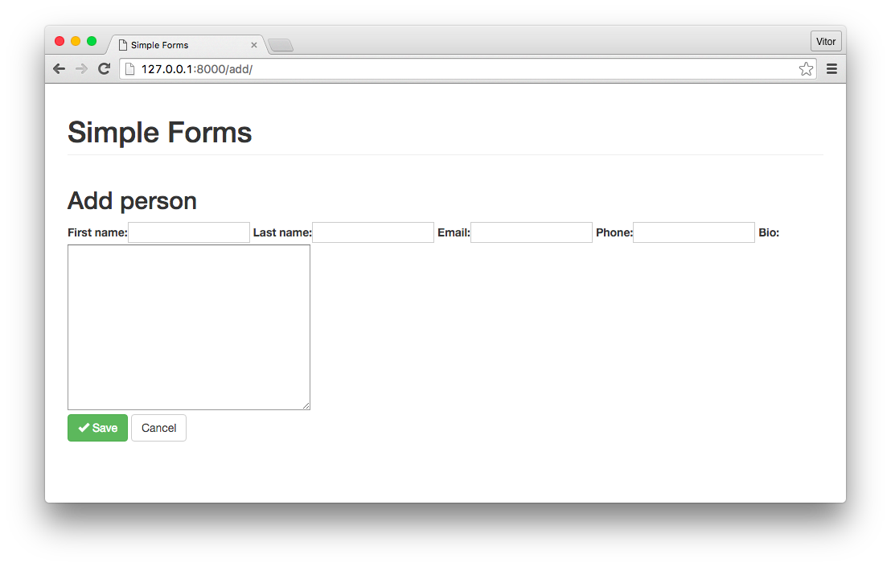
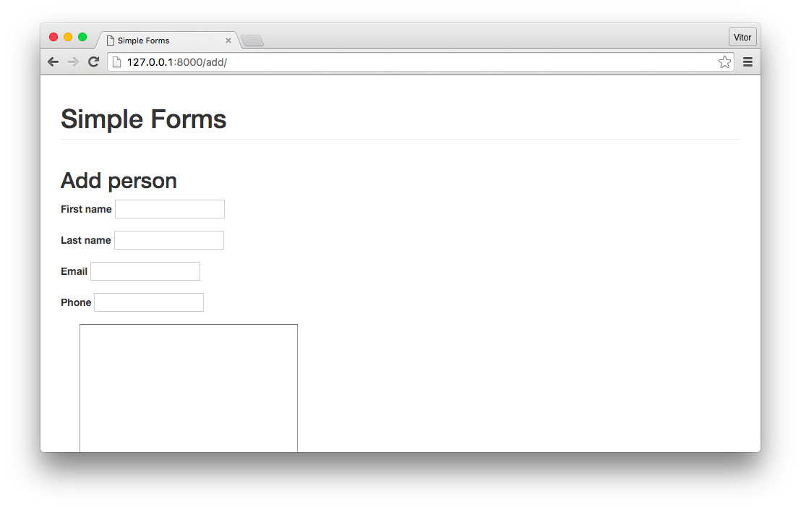
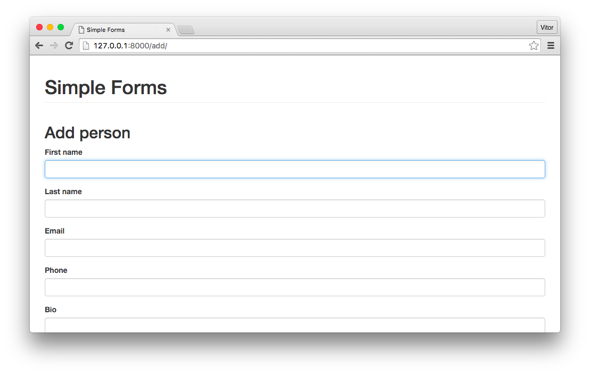

# Как использовать Django Widget Tweaks

Когда дело доходит до создания форм, [Django Forms](https://docs.djangoproject.com/en/1.9/topics/forms/) может быть очень удобным. Если ваше приложение позволяет конечному пользователю вводить данные, настоятельно рекомендуется делать это с помощью встроенных форм Django. Он автоматизирует большой объем работы, а также обеспечит действительно стабильную и безопасную функциональность.

В двух словах, Django обрабатывает три отдельные части работы, связанной с формами:

1. Подготовка и реструктуризация данных для подготовки к рендерингу;
2. Создание HTML-форм для данных;
3. Прием и обработка представленных форм и данных от клиента.

Части 1 и 3 обычно подходят для большинства случаев. Но когда дело доходит до реального рендеринга HTML-форм, иногда не хватает некоторых опций.

Вот где происходят изменения [Django Widget Tweaks](https://pypi.python.org/pypi/django-widget-tweaks). Я использовал его в своих прошлых проектах, и я нахожу его действительно полезным. В этой краткой статье я познакомлю вас с основами этого пакета и покажу некоторые варианты его использования.

## Проблема

Прежде чем мы начнем говорить о самом пакете **Django Widget Tweaks**, я хотел немного подробнее рассказать о проблеме, с которой я обычно сталкиваюсь, которая побудила меня искать это решение.

В большинстве своих проектов я использую [Bootstrap](http://getbootstrap.com/) в качестве основы для CSS. В некоторых случаях я даже использую его из коробки. Если вы знакомы с **Bootstrap**, вы, вероятно, знаете, что для того, чтобы элементы форм выглядели хорошо, ему нужны классы css.

Базовым примером формы, использующей классы **Bootstrap**, может быть:

```html
<form>
  <div class="form-group">
    <label for="id_email">Email address</label>
    <input type="email" class="form-control" id="id_email" name="email">
  </div>
  <div class="form-group">
    <label for="id_password">Password</label>
    <input type="password" class="form-control" id="id_password" name="password">
  </div>
  <button type="submit" class="btn btn-default">Submit</button>
</form>
```

Проблема обычно заключается в необходимости добавить некоторые дополнительные атрибуты к элементу HTML, сохранив старые, которые будут автоматически генерироваться Django на основе ваших моделей. В данном случае это будет элемент **div** с классом **form-group**, а также класс **form-control** в элементе **input**.

Например, если мы рассмотрим следующую модель:

```python
from django.db import models

class Person(models.Model):
    first_name = models.CharField(max_length=30)
    last_name = models.CharField(max_length=30)
    email = models.EmailField(max_length=254)
    phone = models.CharField(max_length=20)
    bio = models.TextField(max_length=500)
```

И для этой модели мы создаем Django Form:

```python
from django import forms
from simple_forms.apps.core.models import Person

class PersonForm(forms.ModelForm):
    class Meta:
        model = Person
        fields = ('first_name', 'last_name', 'email', 'phone', 'bio',)
```

Если мы сразу визуализируем эту форму, используя следующий код:

```django
<form method="post">
  

  {{ form }}
  <div class="form-group">
    <button type="submit" class="btn btn-success">
      <span class="glyphicon glyphicon-ok"></span> Save
    </button>
    <a href="
" class="btn btn-default">Cancel</a>
  </div>
</form>
```

Он будет выглядеть сломанным, как на картинке ниже:

<figure><figcaption></figcaption></figure>

## Установка

Вы можете установить его с помощью **pip** или загрузить с [PyPI](https://pypi.python.org/pypi/django-widget-tweaks), если хотите:

```bash
$ pip install django-widget-tweaks
```

Теперь добавьте **widget\_tweaks** в **INSTALLED\_APPS**:

```python
INSTALLED_APPS = [
    'django.contrib.auth',
    'django.contrib.contenttypes',
    'django.contrib.sessions',
    'django.contrib.messages',
    'django.contrib.staticfiles',

    'widget_tweaks',

    'simple_forms.apps.core',
]
```

## Использование

Я покажу лишь некоторые из множества опций, предлагаемых пакетом. Вы можете узнать больше, читая официальные документы.

Чтобы начать использовать его, вы должны загрузить тег шаблона в шаблон, в котором вы хотите использовать его функции:

```django



```

Теперь разверните форму, перебирая ее поля, чтобы открыть теги ввода, заменив это:

```django
{{ form }}
```

Для этого:

```django


  {{ hidden }}



  <div class="form-group">
    <label for="{{ field.id_for_label }}">{{ field.label }}</label>
    {{ field }}
    
      <span class="help-block">{{ error }}</span>
    
  </div>


```

На данный момент мы уже добавили несколько элементов **Bootstrap**, но наша форма все еще выглядит сломанной:

<figure><figcaption></figcaption></figure>

Теперь, чтобы запустить **Django Widget Tweaks**, добавьте дополнительный атрибут к элементу **field**:

```django
{{ field|add_class:'form-control' }}
```

<figure><figcaption></figcaption></figure>

Окончательный результат нашего шаблона показан ниже:

```django






  <h2>Add person</h2>
  <form method="post">
    

    
      {{ hidden }}
    

    
      <div class="form-group">
        <label for="{{ field.id_for_label }}">{{ field.label }}</label>
        {{ field|add_class:'form-control' }}
        
          <span class="help-block">{{ error }}</span>
        
      </div>
    

    <div class="form-group">
      <button type="submit" class="btn btn-success">
        <span class="glyphicon glyphicon-ok"></span> Save
      </button>
      <a href="" class="btn btn-default">Cancel</a>
    </div>
  </form>


```

Другой способ рендеринга полей — использование тега шаблона **render\_field**, который дает вам гибкий способ рендеринга полей Django с использованием HTML-подобного синтаксиса:

```django



```

Вы также можете использовать переменные шаблона в качестве значений атрибутов:

```django



```

Лично я нахожу этот пакет действительно полезным, потому что он позволяет вам настраивать элементы формы ненавязчивым способом, без необходимости добавлять дополнительный класс CSS внутри определения формы. Кроме того, так более понятно, потому что в конце концов классы css связаны с макетом страницы.

Опять же, вы можете сделать с ним гораздо больше, вы можете узнать больше, прочитав его [документацию](https://pypi.python.org/pypi/django-widget-tweaks). Кроме того, проект, который я создал для иллюстрации этой статьи, можно найти на GitHub [sibtc/simple-django-widget-tweaks](https://github.com/sibtc/simple-django-widget-tweaks).
