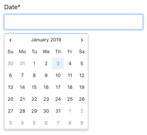

# Как использовать выбор даты с Django


Ссылка на оригинальную статью: [How to Use Date Picker with Django](https://simpleisbetterthancomplex.com/tutorial/2019/01/03/how-to-use-date-picker-with-django.html)

Опубликовано: 3 января 2019

Автор: [Vitor Freitas](https://simpleisbetterthancomplex.com/about/)


<figure><figcaption></figcaption></figure>

В этом руководстве мы собираемся изучить три варианта выбора даты/даты и времени, которые вы можете легко использовать в проекте Django. Сначала мы рассмотрим, как сделать это вручную, затем как настроить пользовательский виджет и, наконец, как использовать стороннее приложение Django с поддержкой средств выбора даты и времени.

## Оглавление

* Введение
* Tempus Dominus Bootstrap 4
  * Прямое использование
  * Пользовательский виджет
* XDSoft DateTimePicker
  * Прямое использование
  * Пользовательский виджет
* Fengyuan Chen’s Datepicker
  * Прямое использование
  * Пользовательский виджет
* Выводы

## Введение

Реализация средства выбора даты в основном выполняется во внешнем интерфейсе.

Ключевая часть реализации — гарантировать, что Django получит входное значение даты в правильном формате, а также то, что Django сможет воспроизвести формат при рендеринге формы с исходными данными.

Мы также можем использовать пользовательские виджеты, чтобы обеспечить более глубокую интеграцию между интерфейсом и сервером, а также способствовать более эффективному повторному использованию в рамках проекта.

В следующих разделах мы собираемся изучить следующие средства выбора даты:

**Tempus Dominus Bootstrap 4** [Docs ](https://tempusdominus.github.io/bootstrap-4/)/ [Source](https://github.com/tempusdominus/bootstrap-4)

<figure><figcaption></figcaption></figure>

**XDSoft DateTimePicker** [Docs ](https://xdsoft.net/jqplugins/datetimepicker/)/ [Source](https://github.com/xdan/datetimepicker)

<figure><figcaption></figcaption></figure>

**Fengyuan Chen’s Datepicker** [Docs ](https://fengyuanchen.github.io/datepicker/)/ [Source](https://github.com/fengyuanchen/datepicker)

<figure><figcaption></figcaption></figure>

## **Tempus Dominus Bootstrap 4**

[Docs ](https://tempusdominus.github.io/bootstrap-4/)/ [Source](https://github.com/tempusdominus/bootstrap-4)

Это отличная библиотека JavaScript, и она хорошо интегрируется с **Bootstrap 4**. Недостатком является то, что для нее требуется **moment.js** и **Font-Awesome** для иконок.

Использовать эту библиотеку имеет смысл только в том случае, если вы уже используете Bootstrap 4 + jQuery, иначе список CSS и JS может показаться немного перегруженным.

Чтобы установить его, вы можете использовать их [CDN](https://tempusdominus.github.io/bootstrap-4/Installing/#cdn) или загрузить последнюю версию со [страницы выпусков GitHub](https://github.com/tempusdominus/bootstrap-4/releases).

Если вы загрузили код со страницы релизов, возьмите обработанный код из папки **build/**.

Ниже приведен статический HTML-пример средства выбора даты:

```html
<!doctype html>
<html lang="en">
  <head>
    <meta charset="utf-8">
    <meta name="viewport" content="width=device-width, initial-scale=1, shrink-to-fit=no">
    <title>Static Example</title>

    <!-- Bootstrap 4 -->
    <link rel="stylesheet" href="https://stackpath.bootstrapcdn.com/bootstrap/4.2.1/css/bootstrap.min.css" integrity="sha384-GJzZqFGwb1QTTN6wy59ffF1BuGJpLSa9DkKMp0DgiMDm4iYMj70gZWKYbI706tWS" crossorigin="anonymous">
    <script src="https://code.jquery.com/jquery-3.3.1.slim.min.js" integrity="sha384-q8i/X+965DzO0rT7abK41JStQIAqVgRVzpbzo5smXKp4YfRvH+8abtTE1Pi6jizo" crossorigin="anonymous"></script>
    <script src="https://cdnjs.cloudflare.com/ajax/libs/popper.js/1.14.6/umd/popper.min.js" integrity="sha384-wHAiFfRlMFy6i5SRaxvfOCifBUQy1xHdJ/yoi7FRNXMRBu5WHdZYu1hA6ZOblgut" crossorigin="anonymous"></script>
    <script src="https://stackpath.bootstrapcdn.com/bootstrap/4.2.1/js/bootstrap.min.js" integrity="sha384-B0UglyR+jN6CkvvICOB2joaf5I4l3gm9GU6Hc1og6Ls7i6U/mkkaduKaBhlAXv9k" crossorigin="anonymous"></script>

    <!-- Font Awesome -->
    <link href="https://stackpath.bootstrapcdn.com/font-awesome/4.7.0/css/font-awesome.min.css" rel="stylesheet" integrity="sha384-wvfXpqpZZVQGK6TAh5PVlGOfQNHSoD2xbE+QkPxCAFlNEevoEH3Sl0sibVcOQVnN" crossorigin="anonymous">

    <!-- Moment.js -->
    <script src="https://cdnjs.cloudflare.com/ajax/libs/moment.js/2.23.0/moment.min.js" integrity="sha256-VBLiveTKyUZMEzJd6z2mhfxIqz3ZATCuVMawPZGzIfA=" crossorigin="anonymous"></script>

    <!-- Tempus Dominus Bootstrap 4 -->
    <link rel="stylesheet" href="https://cdnjs.cloudflare.com/ajax/libs/tempusdominus-bootstrap-4/5.1.2/css/tempusdominus-bootstrap-4.min.css" integrity="sha256-XPTBwC3SBoWHSmKasAk01c08M6sIA5gF5+sRxqak2Qs=" crossorigin="anonymous" />
    <script src="https://cdnjs.cloudflare.com/ajax/libs/tempusdominus-bootstrap-4/5.1.2/js/tempusdominus-bootstrap-4.min.js" integrity="sha256-z0oKYg6xiLq3yJGsp/LsY9XykbweQlHl42jHv2XTBz4=" crossorigin="anonymous"></script>

  </head>
  <body>

    <div class="input-group date" id="datetimepicker1" data-target-input="nearest">
      <input type="text" class="form-control datetimepicker-input" data-target="#datetimepicker1"/>
      <div class="input-group-append" data-target="#datetimepicker1" data-toggle="datetimepicker">
        <div class="input-group-text"><i class="fa fa-calendar"></i></div>
      </div>
    </div>

    <script>
      $(function () {
        $("#datetimepicker1").datetimepicker();
      });
    </script>

  </body>
</html>


```

### Прямое использование

Теперь задача состоит в том, чтобы этот входной фрагмент был интегрирован с формой Django.

#### forms.py

```python
from django import forms

class DateForm(forms.Form):
    date = forms.DateTimeField(
        input_formats=['%d/%m/%Y %H:%M'],
        widget=forms.DateTimeInput(attrs={
            'class': 'form-control datetimepicker-input',
            'data-target': '#datetimepicker1'
        })
    )
```

#### template

```django
<div class="input-group date" id="datetimepicker1" data-target-input="nearest">
  {{ form.date }}
  <div class="input-group-append" data-target="#datetimepicker1" data-toggle="datetimepicker">
    <div class="input-group-text"><i class="fa fa-calendar"></i></div>
  </div>
</div>

<script>
  $(function () {
    $("#datetimepicker1").datetimepicker({
      format: 'DD/MM/YYYY HH:mm',
    });
  });
</script>
```

Тег скрипта можно разместить где угодно, потому что фрагмент `$(function () { ... });` запустит инициализацию **datetimepicker**, когда страница будет готова. Единственное требование состоит в том, чтобы этот тег скрипта размещался после тега скрипта **jQuery**.

### Пользовательский виджет

Вы можете создать виджет в любом приложении, которое вы хотите, здесь я собираюсь рассмотреть, что у нас есть приложение Django с именем **core**.

#### **core/widgets.py**

```python
from django.forms import DateTimeInput

class BootstrapDateTimePickerInput(DateTimeInput):
    template_name = 'widgets/bootstrap_datetimepicker.html'

    def get_context(self, name, value, attrs):
        datetimepicker_id = 'datetimepicker_{name}'.format(name=name)
        if attrs is None:
            attrs = dict()
        attrs['data-target'] = '#{id}'.format(id=datetimepicker_id)
        attrs['class'] = 'form-control datetimepicker-input'
        context = super().get_context(name, value, attrs)
        context['widget']['datetimepicker_id'] = datetimepicker_id
        return context
```

В приведенной выше реализации мы генерируем уникальный идентификатор **datetimepicker\_id**, а также включаем его в контекст виджета.

Затем интерфейсная реализация выполняется внутри фрагмента HTML виджета.

#### **widgets/bootstrap\_datetimepicker.html**

```django
<div class="input-group date" id="{{ widget.datetimepicker_id }}" data-target-input="nearest">
  


  <div class="input-group-append" data-target="#{{ widget.datetimepicker_id }}" data-toggle="datetimepicker">
    <div class="input-group-text"><i class="fa fa-calendar"></i></div>
  </div>
</div>

<script>
  $(function () {
    $("#{{ widget.datetimepicker_id }}").datetimepicker({
      format: 'DD/MM/YYYY HH:mm',
    });
  });
</script>
```

Обратите внимание, как мы используем встроенный шаблон `django/forms/widgets/input.html`.

Теперь использование:

#### core/forms.py

```python
from .widgets import BootstrapDateTimePickerInput

class DateForm(forms.Form):
    date = forms.DateTimeField(
        input_formats=['%d/%m/%Y %H:%M'], 
        widget=BootstrapDateTimePickerInput()
    )
```

Теперь просто визуализируйте поле:

#### template

```django
{{ form.date }}
```

Преимущество наличия виджета заключается в том, что ваша форма может иметь несколько полей даты с использованием виджета, и вы можете просто отобразить всю форму, например:

```django
<form method="post">
  


  {{ form.as_p }}
  <input type="submit" value="Submit">
</form>
```

## **XDSoft DateTimePicker**

[Docs ](https://xdsoft.net/jqplugins/datetimepicker/)/ [Source](https://github.com/xdan/datetimepicker)

**XDSoft DateTimePicker** — очень универсальный инструмент для выбора даты, который не зависит от **moment.js** или **Bootstrap**, хотя выглядит хорошо на веб-сайте Bootstrap.

Он прост в использовании и очень прямой.

Вы можете скачать исходный код со [страницы релизов GitHub](https://github.com/xdan/datetimepicker/releases).

Ниже приведен статический пример, чтобы вы могли увидеть минимальные требования и то, как все части собираются вместе:

```html
<!doctype html>
<html lang="en">
<head>
  <meta charset="utf-8">
  <meta name="viewport" content="width=device-width, initial-scale=1, shrink-to-fit=no">
  <title>Static Example</title>

  <!-- jQuery -->
  <script src="https://code.jquery.com/jquery-3.3.1.slim.min.js" integrity="sha384-q8i/X+965DzO0rT7abK41JStQIAqVgRVzpbzo5smXKp4YfRvH+8abtTE1Pi6jizo" crossorigin="anonymous"></script>

  <!-- XDSoft DateTimePicker -->
  <link rel="stylesheet" href="https://cdnjs.cloudflare.com/ajax/libs/jquery-datetimepicker/2.5.20/jquery.datetimepicker.min.css" integrity="sha256-DOS9W6NR+NFe1fUhEE0PGKY/fubbUCnOfTje2JMDw3Y=" crossorigin="anonymous" />
  <script src="https://cdnjs.cloudflare.com/ajax/libs/jquery-datetimepicker/2.5.20/jquery.datetimepicker.full.min.js" integrity="sha256-FEqEelWI3WouFOo2VWP/uJfs1y8KJ++FLh2Lbqc8SJk=" crossorigin="anonymous"></script>
</head>
<body>

  <input id="datetimepicker" type="text">

  <script>
    $(function () {
      $("#datetimepicker").datetimepicker();
    });
  </script>

</body>
</html>


```

### Прямое использование

Базовая интеграция с Django будет выглядеть так:

#### forms.py

```python
from django import forms

class DateForm(forms.Form):
    date = forms.DateTimeField(input_formats=['%d/%m/%Y %H:%M'])
```

Простая форма, виджет по умолчанию, ничего особенного.

Теперь используем его в шаблоне:

#### template

```django
{{ form.date }}

<script>
  $(function () {
    $("#id_date").datetimepicker({
      format: 'd/m/Y H:i',
    });
  });
</script>
```

**id\_date** — это идентификатор по умолчанию, который Django генерирует для полей формы (`id_ + name`).

### Пользовательский виджет

#### **core/widgets.py**

```python
from django.forms import DateTimeInput

class XDSoftDateTimePickerInput(DateTimeInput):
    template_name = 'widgets/xdsoft_datetimepicker.html'
```

#### **widgets/xdsoft\_datetimepicker.html**

```django




<script>
  $(function () {
    $("input[name='{{ widget.name }}']").datetimepicker({
      format: 'd/m/Y H:i',
    });
  });
</script>
```

Чтобы иметь более общую реализацию, на этот раз мы выбираем поле для инициализации компонента, используя его имя вместо идентификатора, если пользователь изменит префикс идентификатора.

Теперь использование:

#### **core/forms.py**

```python
from django import forms
from .widgets import XDSoftDateTimePickerInput

class DateForm(forms.Form):
    date = forms.DateTimeField(
        input_formats=['%d/%m/%Y %H:%M'], 
        widget=XDSoftDateTimePickerInput()
    )
```

#### template

```django
{{ form.date }}
```

## **Fengyuan Chen’s Datepicker**

[Docs ](https://fengyuanchen.github.io/datepicker/)/ [Source](https://github.com/fengyuanchen/datepicker)

Это очень красивый и минималистичный инструмент выбора даты. К сожалению нет временной поддержки. Но если вам нужны только даты, это отличный выбор.

Чтобы установить этот **datepicker**, вы можете либо использовать их [CDN](https://cdnjs.com/libraries/datepicker), либо загрузить исходники с их [страницы выпусков GitHub](https://github.com/fengyuanchen/datepicker/releases). Обратите внимание, что они не предоставляют скомпилированные/обработанные файлы JavaScript. Но вы можете загрузить их на свой локальный компьютер, используя CDN.

```html
<!doctype html>
<html lang="en">
<head>
  <meta charset="utf-8">
  <meta name="viewport" content="width=device-width, initial-scale=1, shrink-to-fit=no">
  <title>Static Example</title>
  <style>body {font-family: Arial, sans-serif;}</style>
  
  <!-- jQuery -->
  <script src="https://code.jquery.com/jquery-3.3.1.slim.min.js" integrity="sha384-q8i/X+965DzO0rT7abK41JStQIAqVgRVzpbzo5smXKp4YfRvH+8abtTE1Pi6jizo" crossorigin="anonymous"></script>

  <!-- Fengyuan Chen's Datepicker -->
  <link rel="stylesheet" href="https://cdnjs.cloudflare.com/ajax/libs/datepicker/0.6.5/datepicker.min.css" integrity="sha256-b88RdwbRJEzRx95nCuuva+hO5ExvXXnpX+78h8DjyOE=" crossorigin="anonymous" />
  <script src="https://cdnjs.cloudflare.com/ajax/libs/datepicker/0.6.5/datepicker.min.js" integrity="sha256-/7FLTdzP6CfC1VBAj/rsp3Rinuuu9leMRGd354hvk0k=" crossorigin="anonymous"></script>
</head>
<body>

  <input id="datepicker">

  <script>
    $(function () {
      $("#datepicker").datepicker();
    });
  </script>

</body>
</html>


```

### Прямое использование

Базовая интеграция с Django (обратите внимание, что теперь мы используем **DateField** вместо **DateTimeField**):

#### **forms.py**

```
from django import forms

class DateForm(forms.Form):
    date = forms.DateTimeField(input_formats=['%d/%m/%Y %H:%M'])
```

#### template

```django
{{ form.date }}

<script>
  $(function () {
    $("#id_date").datepicker({
      format:'dd/mm/yyyy',
    });
  });
</script>
```

### Пользовательский виджет

#### **core/widgets.py**

```python
from django.forms import DateInput

class FengyuanChenDatePickerInput(DateInput):
    template_name = 'widgets/fengyuanchen_datepicker.html'
```

#### **widgets/fengyuanchen\_datepicker.html**

```django




<script>
  $(function () {
    $("input[name='{{ widget.name }}']").datepicker({
      format:'dd/mm/yyyy',
    });
  });
</script>
```

Использование:

#### **core/forms.py**

```python
from django import forms
from .widgets import FengyuanChenDatePickerInput

class DateForm(forms.Form):
    date = forms.DateTimeField(
        input_formats=['%d/%m/%Y %H:%M'], 
        widget=FengyuanChenDatePickerInput()
    )
```

#### template

```django
{{ form.date }}
```

## Выводы

Реализация очень похожа независимо от того, какое средство выбора даты/даты и времени вы используете. Надеемся, что это руководство дало некоторое представление о том, как интегрировать такую библиотеку внешнего интерфейса в проект Django.

Как всегда, лучшим источником информации о каждой из этих библиотек является их официальная документация.

Я также создал пример проекта, чтобы показать использование и реализацию виджетов для каждой из библиотек, представленных в этом руководстве. Загрузите исходный код из [github.com/sibtc/django-datetimepicker-example](https://github.com/sibtc/django-datetimepicker-example).
