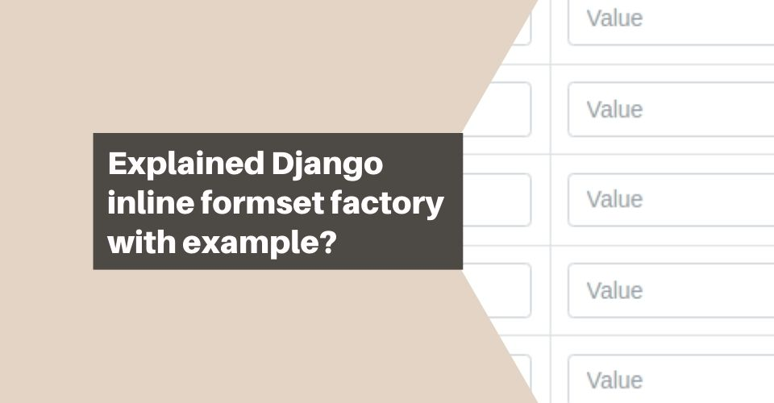
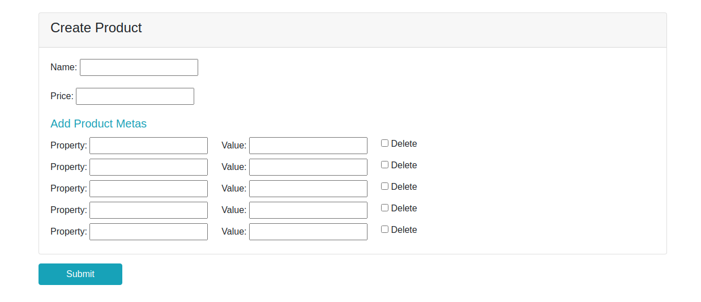

# Объяснить фабрику встроенных форм Django на примере?


Ссылка на оригинал: [Explained Django inline formset factory with example?](https://techincent.com/explained-django-inline-formset-factory-with-example/)

Опубликовано: 8 июня 2021

Автор: [Sajal Mia](https://techincent.com/author/sajalmia/)


<figure><figcaption></figcaption></figure>

Недавно я завершил проект электронной коммерции. Я использовал формы Django с интересной функцией **formset factory**. Это простое формирование, но это полезно. Так почему полезно, где место, где вам нужна функция фабрики форм.

Просто мы используем форму фабричного набора форм в одном представлении. так почему мы используем мультиформу в сингле? Вы видели, что существуют поля, связанные с моделями сценариев, или поля внешнего ключа. Теперь мы хотим создать/обновить поля внешнего ключа модели на одной странице/одной странице.

Итак, я собираюсь объяснить фабрику встроенных форм django на примере…

## Объяснение inlineformset\_factory

**Inlineformset\_factory** — это метод для работы с объектами, связанными с django, через внешний ключ. django называет это небольшим макетом абстракции поверх набора моделей моделей

```python
inlineformset_factory(parent_model, model, form=ModelForm,
                          formset=BaseInlineFormSet, fk_name=None,
                          fields=None, exclude=None, extra=3, can_order=False,
                          can_delete=True, max_num=None, formfield_callback=None,
                          widgets=None, validate_max=False, localized_fields=None,
                          labels=None, help_texts=None, error_messages=None,
                          min_num=None, validate_min=False, field_classes=None)
```

Таким образом, требования встроенного набора форм **parent\_model** в качестве первого параметра, **model** в качестве второго параметра и значение параметра формы в качестве **ModelForm**. Итак, посмотрите описание параметров…

* **parent\_model\*** - Предоставляет модель внешнего ключа. который был определен во внешнем ключе модели.
* **model\*** - Определите класс модели, в котором был создан набор форм.
* **form\*** - Определите форму модели, которая использовалась в параметре модели.
* **formset** - Предоставьте набор форм модели, который был [переопределен BaseInlineFormSet](https://docs.djangoproject.com/en/3.2/topics/forms/modelforms/#overriding-methods-on-an-inlineformset), по умолчанию **BaseInlineFormSet** предоставляется django.
* **fk\_name** - Если ваша модель содержит более одного внешнего ключа, вы должны указать **fk\_name**, по умолчанию `None`.
* **fields** - Предоставьте поля формы модели, чтобы включить их как часть модели, чтобы создать набор форм модели — точно так же, как параметр формы метамодели полей.
* **exclude** - Определенная метамодель модели определяет удаление полей формы модели как части модели для создания набора форм модели, аналогичного параметру формы.
* **extra** - Укажите количество дополнительных полей, которые вы хотите показать, по умолчанию было 3.
* **can\_order** - Укажите `True`, если вы хотите контролировать свой набор форм. По умолчанию это `False`.
* **can\_delete** - По умолчанию элементы формы являются удаляемыми. Предоставляя значение `False`, нет возможности удалить элемент формы
* **max\_num** - Укажите максимальное количество элементов набора форм, которое вы хотите ограничить.
* **validate\_max** - Увеличьте количество проверок максимального количества элементов формы. По умолчанию это `False`.
* **formfield\_callback** - Предоставление **formfield\_callback** для настройки поля формы модели. Этот метод будет выполняться до создания поля формы из поля модели.
* **widgets** - Предоставление пользовательских виджетов для полей формы настройки, по умолчанию `None`.
* **localized\_fields** - создает поле набора форм моделей, так как поддерживает несколько языков.. это похоже на мета-опцию формы модели.
* **labels** - Предоставление label переопределяет метки полей набора форм. Это как мета-опция формы модели
* **helper\_texts** - Предоставление helper\_text переопределяет вспомогательные тесты поля набора форм. Это как мета-опция формы модели
* **error\_messages** - Переопределение сообщений об ошибках для поля формы набора форм. Это как мета-опция формы модели
* **min\_num** - Укажите минимальное количество элементов набора форм, которое вы хотите ограничить.
* **validate\_min** - Увеличьте количество проверок минимального набора элементов формы. По умолчанию это `False`.
* **field\_classes** - предоставление переопределяющих классов поля field\_classess для формы модели для создания набора форм модели.

В версии Django 3.2 добавлено два поля

* **absolute\_max** -&#x20;
* **can\_delete\_extra** - управление дополнительными полями разрешается, по умолчанию `False`.

## Пример inlineformset\_factory

### Для настройки и создания моделей

```python
class Product(models.Model):
    """ Product """
    name = models.CharField(max_length=250)
    price = models.PositiveIntegerField()

    def __str__(self):
        return self.name

class ProductMeta(models.Model):
    """ Product Meta """
    product = models.ForeignKey(Product, on_delete=models.CASCADE)
    name = models.CharField('Property', max_length=50)
    value = models.CharField(max_length=200, blank=True, null=True)

    def __str__(self):
        return f'Id: {self.pk }, {self.name} for ProductId: {self.product.pk}'
```

Отлично мы создали модели под названием **Product** и **ProductMeta**. Итак, мы готовы к примеру с набором форм

## Фабрика встроенных форм (inline formset factory)

### Создание inline form factory

```python
from django import forms
from django.forms import inlineformset_factory

from .models import Product, ProductMeta

class ProductForm(forms.ModelForm):
    class Meta:
        model = Product
        fields = ('name', 'price')

class ProductMetaForm(forms.ModelForm):
    class Meta:
        model = ProductMeta
        fields = ('name', 'value')

ProductMetaInlineFormset = inlineformset_factory(
    Product,
    ProductMeta,
    form=ProductMetaForm,
    extra=5,
    # max_num=5,
    # fk_name=None,
    # fields=None, exclude=None, can_order=False,
    # can_delete=True, max_num=None, formfield_callback=None,
    # widgets=None, validate_max=False, localized_fields=None,
    # labels=None, help_texts=None, error_messages=None,
    # min_num=None, validate_min=False, field_classes=None
)
```

### Итак, теперь создайте представление для формы встроенной модели.

в **view.py** создайте представление **ProductCreate**.

```python
from django.forms import modelformset_factory
from django.shortcuts import render, get_object_or_404
from django.views.generic import UpdateView, ListView, CreateView
from django.shortcuts import redirect
from django.urls import reverse

from .models import Product
from .forms import ProductForm, ProductMetaInlineFormset

class ProductCreateView(CreateView):
    form_class = ProductForm
    template_name = 'product/product_form.html'

    def get_context_data(self, **kwargs):
        context = super(ProductCreateView, self).get_context_data(**kwargs)

        context['product_meta_formset'] = ProductMetaInlineFormset()
        return context

    def post(self, request, *args, **kwargs):
        self.object = None
        form_class = self.get_form_class()
        form = self.get_form(form_class)
        product_meta_formset = ProductMetaInlineFormset(self.request.POST)
        if form.is_valid() and product_meta_formset.is_valid():
            return self.form_valid(form, product_meta_formset)
        else:
            return self.form_invalid(form, product_meta_formset)

    def form_valid(self, form, product_meta_formset):
        self.object = form.save(commit=False)
        self.object.save()
        # сохранить экземпляры ProductMeta
        product_metas = product_meta_formset.save(commit=False)
        for meta in product_metas:
            meta.product = self.object
            meta.save()
        return redirect(reverse("product:product_list"))

    def form_invalid(self, form, product_meta_formset):
        return self.render_to_response(
            self.get_context_data(form=form,
                                  product_meta_formset=product_meta_formset
                                  )
        )
```

### Прикрепить представление к URL-адресу в Django

В файле **urls.py**:

```python
from django.urls import path

from .views import ProductListView, ProductCreateView

app_name = 'product'
urlpatterns = [
    # ...
    path('products', ProductListView.as_view(), name="product_list"),
    path('products/create', ProductCreateView.as_view(), name="product_form"),
    # ...
]
```

### Шаблон представления

Создать шаблон `product/product_form.html`:

```django
<div class="container mt-4">
    <form method="post">
        

        <div class="card">
            <div class="card-header">
                <h4>Create Product</h4>
            </div>
            <div class="card-body">
                {{ form.non_form_errors }}
                {{ form.as_p }}
                <h5 class="text-info">Add Product Metas</h5>
                {{ product_meta_formset.non_form_errors }}
                {{ product_meta_formset.management_form }}
                
                <div class="d-flex py-1 inline {{ product_meta_formset.prefix }}">
                    <div>{{form.name.label}}: {{ form.name }}</div>
                    <div class="ml-4">{{form.value.label}}: {{ form.value }}</div>
                    
                        <div class="ml-4">{{ form.DELETE }} {{ form.DELETE.label }}</div>
                    
                </div>
                

            </div>
        </div>
        <div class="mt-3 mb-5">
            <button type="submit" class="px-5 btn btn-info">Submit</button>
        </div>
    </form>
</div>
```

### Проверка UI вида

<figure><figcaption></figcaption></figure>
