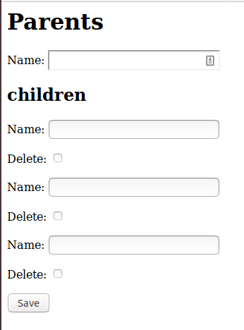

# Работа с вложенными формами в Django


Ссылка на оригинальную статью: [Working with nested forms with Django](https://swapps.com/blog/working-with-nested-forms-with-django/)

Опубликовано: 31 июля 2019

Автор: [José Ariza](https://swapps.com/blog/author/jariza/)


<figure><figcaption></figcaption></figure>

Одним из самых больших преимуществ Django является его способность без усилий создавать приложения [CRUD](https://en.wikipedia.org/wiki/Create,\_read,\_update\_and\_delete). Вам просто нужно определить свои модели, зарегистрировать их в [админке](https://docs.djangoproject.com/en/2.2/ref/contrib/admin/#module-django.contrib.admin) и все. Если вы не собираетесь следовать административному подходу, вы можете использовать [представления на основе классов Django](https://docs.djangoproject.com/en/2.2/ref/class-based-views/) для определения каждого из представлений, которые вам потребуются для управления объектами в вашей базе данных. Для создания и обновления экземпляров модели вам даже не нужно определять форму, потому что [CreateView](https://docs.djangoproject.com/en/2.2/ref/class-based-views/flattened-index/#createview) и [UpdateView](https://docs.djangoproject.com/en/2.2/ref/class-based-views/flattened-index/#updateview) сделают это за вас. Всего за пару часов у вас может быть очень стабильное CRUD-приложение практически без усилий.

Однако эта удивительность, кажется, исчезает, когда мы начинаем устанавливать отношения между нашими моделями; такие как [внешние ключи](https://docs.djangoproject.com/en/2.2/ref/models/fields/#django.db.models.ForeignKey) или [отношения один к одному](https://docs.djangoproject.com/en/2.2/ref/models/fields/#django.db.models.OneToOneField). Следуя предыдущему подходу, трудно редактировать родительский объект при редактировании дочернего или одновременно редактировать несколько дочерних объектов.

Админка Django решает эту ситуацию с помощью [встроенных строк админки](https://docs.djangoproject.com/en/2.2/ref/contrib/admin/#using-generic-relations-as-an-inline). Но что мы можем сделать, когда наше приложение будет использовать свои собственные представления для управления нашим CRUD? Ну, мы используем [Formsets](https://docs.djangoproject.com/en/2.2/topics/forms/formsets/). В этом сообщении блога мы проверим, как использовать их вместе с нашими представлениями на основе классов, чтобы получить потрясающий CRUD с несколькими отношениями и с небольшим количеством кода. Итак, начнем!

## Настройка наших моделей

Для этого сообщения в блоге я буду использовать две маленькие модели, **Parent** и **Child**. Как видно из их названия, у родителя может быть несколько дочерних элементов, но у дочернего элемента может быть только один родитель.

```python
from django.db import models

class Parent(models.Model):
    name = models.CharField(max_length=250)
    class Meta:
        verbose_name = "Parent"
        verbose_name_plural = "Parents"
    def __str__(self):
        return self.name

class Child(models.Model):
    name = models.CharField(max_length=250)
    parent = models.ForeignKey(Parent, on_delete=models.CASCADE)
    class Meta:
        verbose_name = "Child"
        verbose_name_plural = "Children"
    def __str__(self):
        return self.name
```

Теперь давайте добавим представление создания для родителя, где мы также хотим создать связанные дочерние элементы.

```python
from django.views.generic.list import ListView
from django.views.generic.edit import CreateView, UpdateView
from .models import Parent

class ParentListView(ListView):
    model = Parent

class ParentCreateView(CreateView):
    model = Parent
    fields = ["name"]
```

Если мы оставим все так, мы не сможем добавлять детей для родителя. Но если мы добавим **child\_set** в массив полей **fields**, возникнет ошибка `«FieldError: Unknown field(s) (child_set) specified for Parent»`. Так что нам делать?

## Настройка форм и представлений

Для создания встроенных форм мы будем использовать [наборы встроенных форм Django](https://docs.djangoproject.com/en/2.2/topics/forms/modelforms/#inline-formsets). Такие наборы форм позволяют создавать несколько дочерних объектов из родительского объекта в одной и той же форме. Это основа того, что админка Django использует при регистрации [встроенных экземпляров](https://docs.djangoproject.com/en/2.2/ref/contrib/admin/#using-generic-relations-as-an-inline).

В нашем примере мы пойдем дальше и будем еще более абстрактными. Мы будем использовать метод [inlineformset\_factory](https://docs.djangoproject.com/en/2.2/ref/forms/models/#inlineformset-factory), который всего одной строкой создаст нужный нам набор форм.

```python
from django.forms.models import inlineformset_factory

ChildFormset = inlineformset_factory(
    Parent, Child, fields=('name',)
)
```

Теперь мы обновим наш **CreateView**, чтобы добавить встроенный набор форм.

```python
class ParentCreateView(CreateView):
    model = Parent
    fields = ["name"]

    def get_context_data(self, **kwargs):
        # нам нужно перезаписать get_context_data, чтобы убедиться,
        # что наш набор форм отображается
        data = super().get_context_data(**kwargs)
        if self.request.POST:
            data["children"] = ChildFormset(self.request.POST)
        else:
            data["children"] = ChildFormset()
        return data

    def form_valid(self, form):
        context = self.get_context_data()
        children = context["children"]
        self.object = form.save()
        if children.is_valid():
            children.instance = self.object
            children.save()
        return super().form_valid(form)

    def get_success_url(self):
        return reverse("parents:list")
```

Как видите, мы добавили набор форм в наш контекст, чтобы иметь возможность отобразить его. Кроме того, в методе **form\_valid** после сохранения нашего родительского объекта мы назначаем его экземпляром набора форм, проверяем его достоверность и сохраняем; создание дочерних объектов такое же.

Чтобы отобразить форму, мы можем создать файл `parent/parent_form.html`:

```django
<h1>Parents</h1>
<form method="post">


    {{ form.as_p }}
    <h2>children</h2>
    {{ children.as_p }}
    <input type="submit" value="Save">
</form>
```

Этот шаблон будет выглядеть так:

<figure><figcaption></figcaption></figure>

Как видите, форма позволяет не только добавить родителя, но и создать трех дочерних элементов.

Для представления обновления мы можем использовать тот же подход. Единственное отличие состоит в том, что мы инициируем объект **ChildFormSet** с аргументом экземпляра. Таким образом, наш набор форм будет инициализирован дочерними элементами родительского элемента, который мы редактируем.

```python
class ParentUpdateView(UpdateView):
    model = Parent
    fields = ["name"]

    def get_context_data(self, **kwargs):
        # Нам нужно перезаписать get_context_data, чтобы убедиться,
        # что наш набор форм отображается. Разница с CreateView
        # заключается в том, что в этом представлении мы передаем
        # аргумент экземпляра набору форм, потому что у нас
        # уже есть созданный экземпляр.
        data = super().get_context_data(**kwargs)
        if self.request.POST:
            data["children"] = ChildFormset(self.request.POST, instance=self.object)
        else:
            data["children"] = ChildFormset(instance=self.object)
        return data

    def form_valid(self, form):
        context = self.get_context_data()
        children = context["children"]
        self.object = form.save()
        if children.is_valid():
            children.instance = self.object
            children.save()
        return super().form_valid(form)

    def get_success_url(self):
        return reverse("parents:list")
```

Вот и все! Используя всего несколько методов и объектов из Django, мы смогли создать вложенную форму для создания или редактирования родительского объекта и его дочерних элементов одновременно практически без усилий.

Я работаю с Django почти четыре года, и он до сих пор поражает меня своей простотой и всеми полезными инструментами, которые он предоставляет. В этом случае это позволяет сделать очень сложную задачу, для которой в других случаях потребовался бы запрос **AJAX** или что-то подобное, только с использованием python и чистого html.

И это только простой случай. Если вам нужен другой уровень отношений, например, если у вашей дочерней модели есть внучок, вы можете создать набор форм, который позволит вам редактировать родителя, дочернего элемента и внучатого без использования другого подхода. Вы можете увидеть отличный пример [здесь](https://github.com/philgyford/django-nested-inline-formsets-example).
