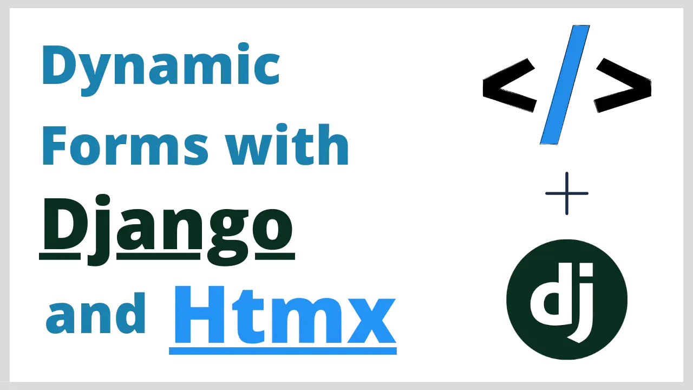
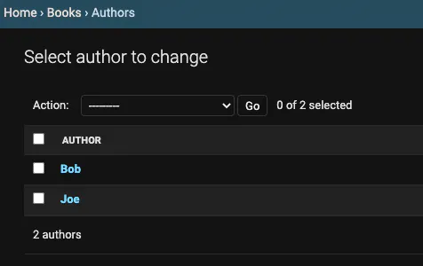
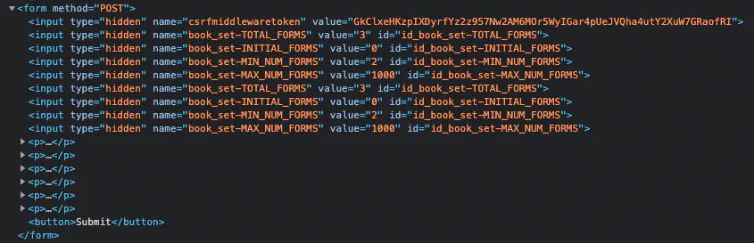

# Учебник по Django Formsets — создание динамических форм с помощью Htmx


Ссылка на оригинальную статью: [Django Formsets Tutorial - Build dynamic forms with Htmx](https://justdjango.com/blog/dynamic-forms-in-django-htmx)

Опубликовано: 24 августа 2021

Автор: [**Matthew Freire**](https://justdjango.com/blog)****


Узнайте, как создавать динамические формы с помощью Django и Htmx.

<figure><figcaption></figcaption></figure>

В этом руководстве рассказывается, как создавать динамические формы в Django с использованием **Htmx**. Также будут рассмотрены основные концепции наборов форм Django. Но больше всего мы сосредоточимся на том, как заставить динамические формы выглядеть и чувствовать себя хорошо.

Вы можете найти код из этого руководства в [этом репозитории GitHub](https://github.com/justdjango/django\_htmx\_dynamic\_forms).

Если вы хотите посмотреть видео, а не читать: (_ссылка отсутствует_)

## Настройка проекта

Начните с создания проекта Django:

```bash
virtualenv env
source env/bin/activate
pip install django
django-admin startproject djforms
```

> Последняя версия Django на момент написания этого руководства — 3.2.6.

Запустите миграции:

```bash
python manage.py migrate
```

### Модели

Для этого проекта мы будем работать с тем же набором моделей. Создайте приложение Django и зарегистрируйте его в настройках:

```bash
python manage.py startapp books
```

```python
# settings.py
INSTALLED_APPS = [
    # ...
    'django.contrib.staticfiles',
    'books'
]
```

Добавьте его в **INSTALLED\_APPS** в **settings.py.** Внутри `books/models.py` добавьте следующие модели:

```python
# books/models.py
from django.db import models

class Author(models.Model):
    name = models.CharField(max_length=50)

    def __str__(self):
        return self.name

class Book(models.Model):
    author = models.ForeignKey(Author, on_delete=models.CASCADE)
    title = models.CharField(max_length=100)
    number_of_pages = models.PositiveIntegerField(default=1)

    def __str__(self):
        return self.title
```

И добавьте следующее в `books/admin.py`:

```python
# books/admin.py
from django.contrib import admin
from .models import Author, Book

class BookInLineAdmin(admin.TabularInline):
    model = Book

class AuthorAdmin(admin.ModelAdmin):
    inlines = [BookInLineAdmin]

admin.site.register(Author, AuthorAdmin)
```

Используя эти модели, мы можем создать автора и добавить этому автору столько книг, сколько захотим.

Запустите миграции:

```bash
python manage.py makemigrations
python manage.py migrate
```

## Как использовать Django Formsets

Наборы форм — одна из лучших частей Django. Идея наборов форм заключается в том, что вы получаете действительно гибкую визуализацию форм в своем шаблоне, и вам не нужно писать много кода для этого.

> Набор форм — это уровень абстракции для работы с несколькими формами на одной странице — Django docs

Фабрики наборов форм — это основные инструменты, которые вы можете использовать для создания наборов форм в Django:

```python
from django.forms.models import (
    inlineformset_factory, 
    formset_factory, 
    modelform_factory, 
    modelformset_factory
)
```

Создайте файл **forms.py** в приложении **books** и добавьте следующее:

```python
# books/forms.py
from django import forms
from .models import Book

class BookForm(forms.ModelForm):
    class Meta:
        model = Book
        fields = (
            'title',
            'number_of_pages'
        )
```

Мы будем использовать **inlineformset\_factory** для создания набора форм, но другие функции работают почти так же. Единственная разница заключается в том, что **modelform\_factory** и **modelformset\_factory** работают специально с формами, унаследованными от `forms.ModelForm`.

Внутри **forms.py** добавьте следующее:

```python
# books/forms.py
from django.forms.models import inlineformset_factory
from .models import Author

...

BookFormSet = inlineformset_factory(
    Author,
    Book,
    form=BookForm,
    min_num=2,  # минимальное количество форм, которые необходимо заполнить
    extra=1,  # количество пустых форм для отображения
    can_delete=False  # показать флажок в каждой форме, чтобы удалить строку
)
```

Здесь мы создаем встроенный набор форм. Первый аргумент — это родительская модель, в данном случае это **Author**. Второй аргумент — это дочерняя модель, которая является **Book**. Аргумент **form** — это форма, используемая для создания экземпляров **Book**, а другие аргументы изменяют стиль формы.

Теперь мы будем использовать эту форму в функциональном представлении. Внутри `books/views.py` добавьте следующее:

```python
# books/views.py
from django.shortcuts import redirect, render
from .forms import BookFormSet
from .models import Author


def create_book(request, pk):
    author = Author.objects.get(id=pk)
    books = Book.objects.filter(author=author)
    formset = BookFormSet(request.POST or None)

    if request.method == "POST":
        if formset.is_valid():
            formset.instance = author
            formset.save()
            return redirect("create-book", pk=author.id)

    context = {
        "formset": formset,
        "author": author,
        "books": books
    }

    return render(request, "create_book.html", context)
```

В этом представлении мы создаем экземпляр **BookFormSet** и передаем его в контекст. Если метод запроса является запросом **POST**, мы затем передаем запрос в форму, проверяем, является ли он допустимым, а затем вызываем метод **save()**. Поскольку мы используем **ModelForm**, это сохранит значения формы как экземпляры **Book**. Обратите внимание, что мы также назначаем экземпляр набора форм в качестве автора. Свойство экземпляра необходимо для связи дочерних моделей с родительской.

Важно отметить, что для этого представления требуется первичный ключ автора, к которому мы будем добавлять книги. Создайте несколько авторов в админке Django:

```bash
python manage.py createsuperuser
```

Добавьте суперпользователя, чтобы вы могли войти в систему администратора:

<figure><figcaption></figcaption></figure>

Добавьте представление в проект **urls.py**:

```python
# urls.py
from django.contrib import admin
from django.urls import path

from books.views import create_book

urlpatterns = [
    path('admin/', admin.site.urls),
    path('<pk>/', create_book, name='create-book')
]
```

В корне проекта создайте папку **templates** и внутри нее создайте **create\_book.html**. Добавьте к нему следующее:

```html
<!DOCTYPE html>
<html lang="en">

<head>
    <meta charset="UTF-8">
    <meta http-equiv="X-UA-Compatible" content="IE=edge">
    <meta name="viewport" content="width=device-width, initial-scale=1.0">
    <title>Create a book</title>
</head>

<body>
    <h1>Create books for {{ author.name }}</h1>
    <form method="POST">
        

        {{ formset.management_form }}
        {{ formset.as_p }}
        <button>Submit</button>
    </form>
    
    <hr>

    <h2>Books</h2>
    
    <p>{{ book.title }} - {{ book.number_of_pages }}</p>
    

</body>

</html>
```

Прописываем папку **templates** в **settings.py**:

```python
# settings.py
TEMPLATES = [
    {
        ...
        'DIRS': [BASE_DIR / "templates"],
        ...
    },
]
```

Посетите `http://127.0.0.1:8000/1`, и вы увидите три формы для создания книг, а также заголовок **«Create books for Joe»**.

Осмотрите страницу и перейдите на вкладку **Elements** в инструментах разработчика — вы должны увидеть следующее:

<figure><figcaption></figcaption></figure>

Наборы форм Django включают множество скрытых полей. `{{ formset.management_form }}` отображает их в шаблоне. Эти поля очень важны, потому что они предоставляют Django метаинформацию о формах. **Чтобы понять, как создавать динамические наборы форм, важно понимать, как формы отображаются**.

### Создайте несколько книг

Заполните форму книги и отправьте ее. Вы должны увидеть только что созданные книги в нижней части страницы.

## Как настроить Htmx с Django

Не дописано, так как нужны были только формсеты...
