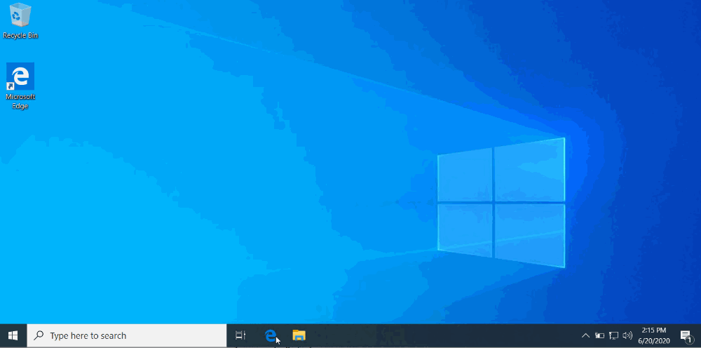
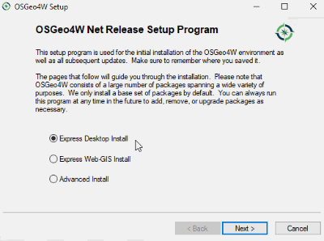
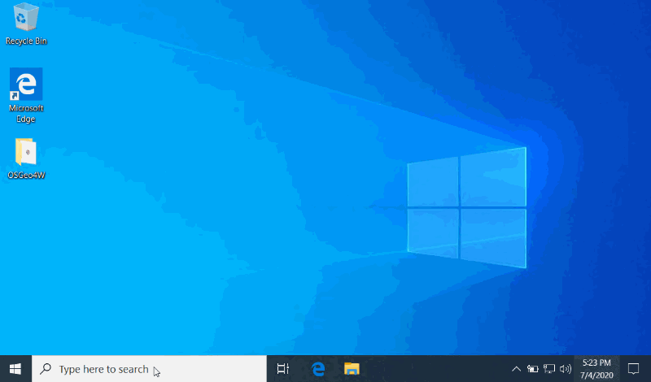
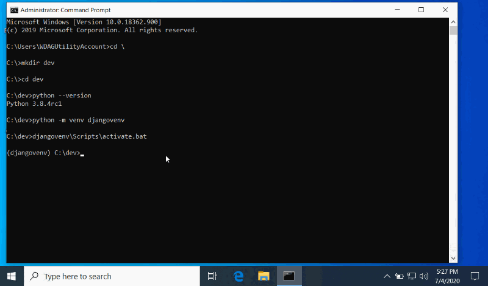

# Настройка Geodjango-GDAL для Windows 10

## Вступление

[GeoDjango](https://docs.djangoproject.com/en/3.0/ref/contrib/gis/) — это геопространственное расширение [Django](https://www.djangoproject.com/). **GeoDjango** — это дополнение к мощной среде веб-разработки, которая позволяет интегрировать пространственные данные в веб-сайты и REST API. После того, как среда разработки настроена, этот мощный инструмент прост в освоении и использовании; однако заставить все работать в среде Windows 10 иногда может быть сложно. Если вы профессионал/энтузиаст ГИС, как и я, у вас, вероятно, есть несколько программ, использующих геопространственные библиотеки, такие как [GDAL](https://www.lfd.uci.edu/\~gohlke/pythonlibs/#gdal), которые периодически обновляются, чтобы не отставать от таких программ, как **QGIS**. Это может привести к проблемам при разработке с Django на том же компьютере, поскольку виртуальная среда Python может быть чувствительна к изменениям во внешних библиотеках ГИС. Следующее руководство расскажет нам, как настроить нашу среду разработки, чтобы мы могли начать работать с пространственными данными в GeoDjango/Django с включенными библиотеками Python **GDAL** и **OSGEO**. Надеемся, что этот процесс поможет новым пользователям быстро начать работу с GeoDjango и поможет существующим разработчикам GeoDjango выявить проблемные области, если ошибки библиотеки зависимостей начнут возникать после обновлений.

## Обзор

* Установка Python
* Установка OSGeo4W
* Настройка виртуальной среды Python
* Установка Джанго
* Установка GDAL Python
* Создание проект Джанго
* BAT-файл GeoDjango
* Изменение Django settings.py
* Обновление файла Django GDAL (libgdal.py)
* Тестирование

## Шаг 1. Установка Python

**Django/GeoDjango** — это фреймворки, основанные на языке Python, а именно на [Python 3](https://www.python.org/download/releases/3.0/). Если у вас уже установлена версия Python 3, вы можете пропустить этот шаг, в противном случае установите последнюю стабильную версию Python 3 для Windows [здесь](https://www.python.org/downloads/windows/).

При установке Python я рекомендую устанавливать его с выбранной опцией установки для всех пользователей. Это упростит дальнейшие шаги по настройке переменных PATH в Windows 10. Если ваша учетная запись Windows не имеет прав администратора, вы сможете установить ее только для той учетной записи, с которой вы вошли в Windows. Вы по-прежнему можете установить и использовать Python, просто не забудьте указать место установки (например, `C:\Users\username\AppData\Local\Programs\Python\Python3X`).

Чтобы установить для всех пользователей, вам нужно будет выбрать опцию `"Customized installation"`. В следующем меню обязательно выберите **"pip", "tcl/tl и IDLE", "py launcher" и "for all users (requires elevation)"**. Нажмите "Next" и в следующем меню убедитесь, что выбраны **"Install for all users", "Add Python to environment variables" и "Precompile standard library"**.

<figure><figcaption></figcaption></figure>

## Шаг 2. Установка OSGeo4W

[OSGeo4W](https://www.osgeo.org/) или **Open Source Geospatial For Windows** — это менеджер пакетов ГИС, который загружает программы и инструменты ГИС с открытым исходным кодом и обеспечивает совместную работу всех программ по мере необходимости. Это самый простой способ загрузить библиотеки, необходимые для **GeoDjango**.

Загрузите установщик с [https://trac.osgeo.org/osgeo4w/](https://trac.osgeo.org/osgeo4w/) и запустите **программу установки OSGeo4W**. Выберите **Express Web-GIS Install**, нажмите "Next", выберите сайт для загрузки программ (данные размещаются на нескольких серверах, попробуйте выбрать географически ближайший к вам), выберите все опции в последующих меню и согласитесь с условия лицензий. Процесс установки может занять несколько минут, так как необходимо загрузить и установить несколько программ. Нажмите "Finish" после завершения процесса загрузки/установки.

<figure><figcaption></figcaption></figure>

## Шаг 3. Настройка виртуальной среды Python

Виртуальная среда Python позволяет вам использовать только те библиотеки, которые вам нужны для конкретного приложения, что удобно для разработчиков и программистов, поскольку позволяет каждому проекту использовать разные версии одной и той же библиотеки и снижает количество проблем с обновлением и конфликтами.

Для простоты мы будем хранить нашу виртуальную среду в папке/каталоге с именем "dev", которая находится на верхнем уровне диска компьютера (т. е. `C:\dev`). Эта настройка требует, чтобы большинство операций выполнялось через командную строку Windows, поэтому простые пути позволяют уменьшить количество ошибок при вводе и запомнить меньше местоположений. В дальнейшем мы будем использовать командную строку для создания папок, установки зависимостей и программ.

### Шаг 3А. Создать каталог папки dev

Начните с открытия командной строки Windows, выполнив поиск "Command Prompt" или с помощью клавиши **Windows + R**, чтобы открыть приложение "Run", введите "cmd" в строку "Open:" и нажмите Enter.

В командной строке введите **cd \\**, чтобы перейти в папку верхнего уровня. Используйте команду **mkdir dev**, чтобы создать папку с именем "dev". Это место, где мы создадим виртуальную среду Python и запустим приложение GeoDjango. Теперь войдите в эту папку, набрав **cd dev**.

```powershell
# Windows Command Prompt
C:\Users\username>cd \
C:>mkdir dev
C:>cd dev
C:\dev>
```

### Шаг 3Б. Инициировать виртуальную среду

Теперь мы создадим **виртуальную среду Python** с именем "djangovenv", которая по сути является клоном базовой установки Python, в которой будут храниться все зависимости GeoDjango.

В командной строке, начиная с каталога "dev", мы проверим установку Python, введя `python --version`. Это скажет нам две вещи. Во-первых, появится сообщение об ошибке, если Python не был правильно установлен. Во-вторых, если установка работает, она сообщит вам установленную версию Python. Если у вас есть другие версии Python (например, Python 2.X), вам может потребоваться использовать другую команду для вызова python (например, `python3 --version`). Если это так, используйте эту команду для работы с python, пока мы не войдем в виртуальную среду.

Теперь запустите виртуальную среду, введя `python -m venv djangoenv`. Настройка среды может занять минуту. После завершения выполнения команды введите `djangovenv\Scripts\activate.bat`. "(djangovenv)" теперь должно отображаться в квадратных скобках в начале текущей командной строки, указывая на то, что ваша виртуальная среда теперь активна.

```powershell
# Windows Command Prompt
C:\dev>python --version
Python 3.8.4rc1
C:\dev>python -m venv djangoenv
C:\dev>djangovenv\Scripts\activate.bat
(djangovenv) C:\dev>
```

<figure><figcaption></figcaption></figure>

## Шаг 4. Установка Джанго

Теперь, когда Python проверен на работоспособность, и у нас есть новая виртуальная среда, инициированная и активированная для GeoDjango, мы можем начать установку всех пакетов Python, необходимых для запуска GeoDjango, с помощью команды [pip](https://pypi.org/project/pip/), которая позволяет нам легко устанавливать пакеты из репозитория [индекса пакетов Python](https://pypi.org/).

На этом этапе у вас все еще должна быть активна виртуальная среда Python "djangovenv", если нет, обратитесь к предыдущему шагу для команды активации. Теперь мы собираемся установить пакет Django, используя следующую команду **pip**: `pip install django`. Теперь установщик pip загрузит и установит самую последнюю версию Django в виде пакета Python, который можно запустить из виртуальной среды "djangovenv". Вы можете запустить команду **pip list**, в которой пакеты установлены в виртуальной среде, и запустить **django-admin**, чтобы убедиться, что Django установлен.

```powershell
# Windows Command Prompt
(djangovenv) C:\dev>pip install django
Collecting django
  Downloading Django-3.0.8-py3-none-any.whl (7.5 MB)
     |████████████████████████████████| 7.5 MB 6.8 MB/s
Collecting asgiref~=3.2
  Downloading asgiref-3.2.10-py3-none-any.whl (19 kB)
Collecting sqlparse>=0.2.2
  Downloading sqlparse-0.3.1-py2.py3-none-any.whl (40 kB)
     |████████████████████████████████| 40 kB 2.5 MB/s
Collecting pytz
  Downloading pytz-2020.1-py2.py3-none-any.whl (510 kB)
     |████████████████████████████████| 510 kB 3.3 MB/s
Installing collected packages: asgiref, sqlparse, pytz, django
Successfully installed asgiref-3.2.10 django-3.0.8 pytz-2020.1 sqlparse-0.3.1
(djangovenv) C:\dev>pip list
Package    Version
---------- -------
asgiref    3.2.10
Django     3.0.8
pip        20.1.1
pytz       2020.1
setuptools 47.1.0
sqlparse   0.3.1
(djangovenv) C:\dev>django-admin
```

<figure><figcaption></figcaption></figure>

## Шаг 5. Установка GDAL Python

## Шаг 6. Создание проект Джанго

## Шаг 7. BAT-файл GeoDjango

## Шаг 8. Изменение Django settings.py

## Шаг 9. Обновление файла Django GDAL (libgdal.py)

## Шаг 10. Тестирование
