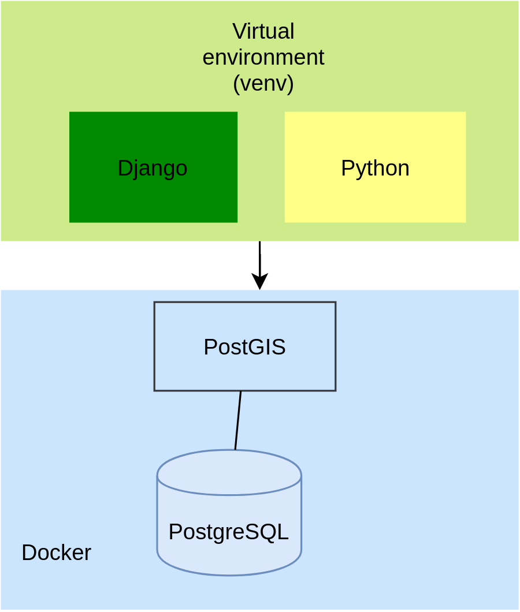
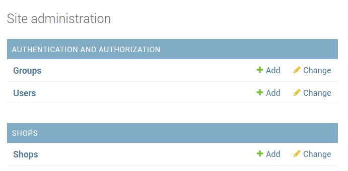
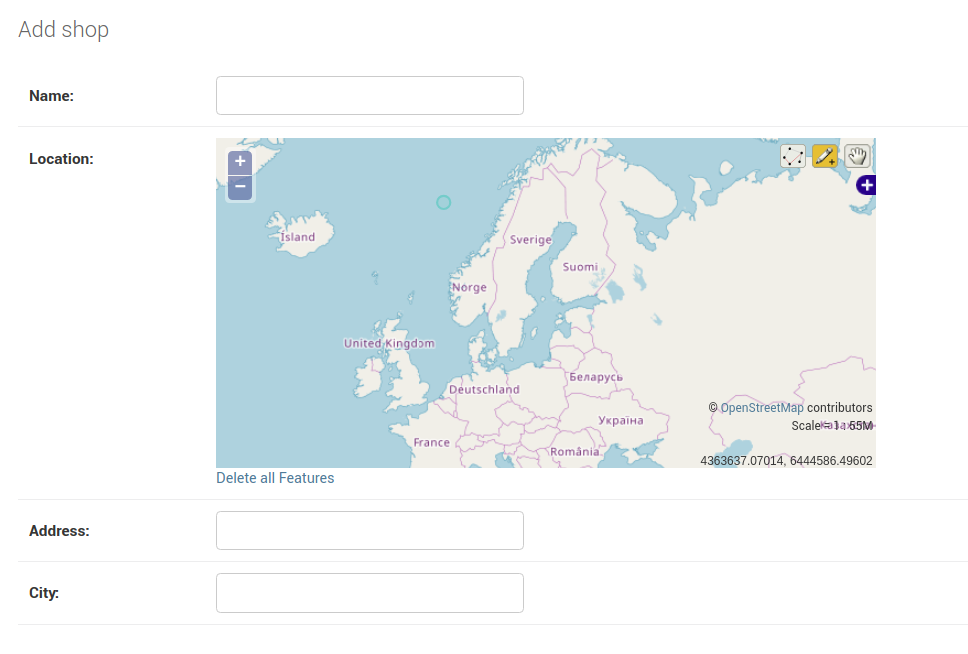
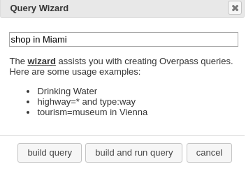
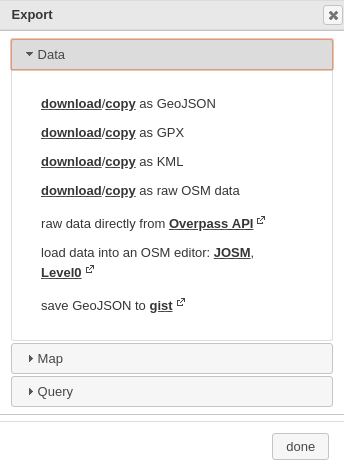
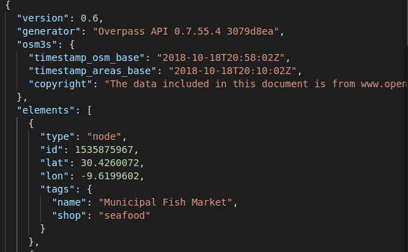
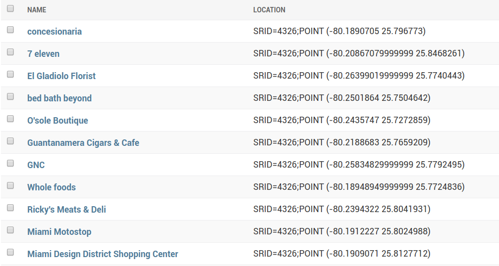
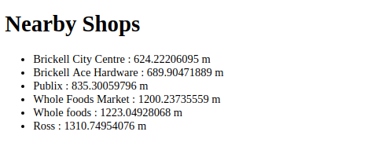

# Создание веб-приложения на основе местоположения с помощью Django и GeoDjango


Ссылка на оригинальную статью: [Make a Location-Based Web App With Django and GeoDjango](https://realpython.com/location-based-app-with-geodjango-tutorial/)

Опубликовано: ???

Автор: [Ahmed Bouchefra](https://realpython.com/location-based-app-with-geodjango-tutorial/#author)


## Оглавление

* Инструменты, которые вы будете использовать
* Предпосылки
  * Установка Python 3
  * Установка зависимостей GeoDjango (GEOS, GDAL и PROJ.4)
  * Настройка пространственной базы данных с помощью PostgreSQL и PostGIS
* Настройка вашего проекта
  * Создание виртуальной среды
  * Установка Джанго
  * Создание проекта Джанго
  * Настройка базы данных PostgreSQL
  * Добавление GeoDjango
* Создание приложения Django
  * Создание модели Джанго
  * Создание таблиц базы данных
  * Добавление суперпользователя
  * Регистрация модели в административном интерфейсе
  * Добавление исходных данных
  * Отображение ближайших магазинов
* Заключение


К этому руководству есть связанный видеокурс, созданный командой **Real Python**. Посмотрите его вместе с письменным учебным пособием, чтобы углубить свое понимание: [Make a Location-Based Web App With Django and GeoDjango](https://realpython.com/courses/make-location-based-web-app-django-and-geodjango/)


В этом руководстве вы узнаете, как использовать **Django** и **GeoDjango** для создания веб-приложения на основе определения местоположения с нуля. Вы будете создавать простое приложение для магазинов поблизости, в котором перечислены магазины, ближайшие к местоположению пользователя.

_**К концу этого урока вы сможете**_:

* Использовать **Django** для создания простого веб-приложения с нуля.
* Использовать подфреймворк **GeoDjango** для реализации функций геолокации в вашем приложении Django.
* Использовать пространственную базу данных (**PostgreSQL** и **PostGIS**), чтобы получить преимущества от пространственных функций и легко внедрять веб-приложения с учетом местоположения.


**Пример исходного кода приложения**. Полный исходный код приложения, которое вы будете создавать в этом руководстве, доступен в [репозитории realpython/materials на GitHub](https://github.com/realpython/materials/tree/master/nearbyshops).


## Инструменты, которые вы будете использовать

Вы будете использовать следующие инструменты для разработки веб-приложения для ближайших магазинов:

* Язык программирования Python
* Веб-фреймворк Django
* База данных PostgreSQL для сохранения данных
* Расширение PostGIS для поддержки пространственных функций в базе данных PostgreSQL.
* pip для установки зависимостей
* Модуль venv для управления виртуальной средой
* Docker для установки PostgreSQL и PostGIS

<figure><figcaption></figcaption></figure>

Прежде чем перейти к практическим шагам, давайте сначала представим фреймворки, которые вы будете использовать.

[Django](https://www.djangoproject.com/) — самая популярная среда Python для создания веб-приложений. Это позволяет разработчикам быстро создавать прототипы и укладываться в сроки своих проектов, предоставляя множество встроенных API и вспомогательных платформ, таких как GeoDjango.

[GeoDjango](https://docs.djangoproject.com/en/2.1/ref/contrib/gis/) — это встроенное приложение, которое входит в состав Django как вспомогательный модуль. На самом деле это полноценный фреймворк, который также можно использовать отдельно от Django. Он предоставляет набор инструментов для создания веб-приложений ГИС.

ГИС ([GIS](https://en.wikipedia.org/wiki/Geographic\_information\_system)) расшифровывается как Географическая информационная система. Это информационная система ([организованная система сбора, организации, хранения и передачи информации](https://en.wikipedia.org/wiki/Information\_system)), предназначенная для обработки и манипулирования данными, имеющими географические или пространственные характеристики.

**GeoDjango** также предоставляет привязки Python к популярным пространственным библиотекам, таким как [GEOS](https://trac.osgeo.org/geos/), [GDAL](https://www.gdal.org/) и [GeoIP](https://github.com/maxmind/geoip-api-c), которые можно использовать отдельно без Django в любом приложении Python или интерактивно в оболочке.

**GeoDjango** стремится предоставить географическую веб-инфраструктуру мирового класса. За прошедшие годы он был переработан с целью упростить работу с геопространственными данными, другими словами, данными, которые определяют географическое положение естественных или искусственных объектов на Земле и хранятся в виде координат и топологий.

**GeoDjango** очень хорошо интегрируется с Django ORM и предоставляет набор полей геометрии, определенных [Open Geospatial Consortium (OGS)](http://www.opengeospatial.org/), которые можно использовать для отображения различных типов геометрии в геопространственных базах данных:

* [GeometryField](https://docs.djangoproject.com/en/2.1/ref/contrib/gis/model-api/#geometryfield) — это базовый класс для всех геометрических полей в GeoDjango.
* [PointField](https://docs.djangoproject.com/en/2.1/ref/contrib/gis/model-api/#pointfield) используется для хранения объектов GEOS [Point](https://docs.djangoproject.com/en/2.1/ref/contrib/gis/geos/#django.contrib.gis.geos.Point).
* [PolygonField](https://docs.djangoproject.com/en/2.1/ref/contrib/gis/model-api/#polygonfield) используется для хранения объектов GEOS [Polygon](https://docs.djangoproject.com/en/2.1/ref/contrib/gis/geos/#polygon) и так далее.

**GeoDjango** — это очень мощная платформа для хранения и работы с географическими данными с использованием Django ORM. Он предоставляет простой в использовании API для определения расстояний между двумя точками на карте, площадями многоугольников, точками внутри многоугольника и т. д.

Чтобы иметь возможность работать с **GeoDjango**, вам понадобятся две вещи: пространственная база данных и геопространственные библиотеки. [Пространственная база данных](https://en.wikipedia.org/wiki/Spatial\_database) — это база данных, оптимизированная для хранения и запроса данных, представляющих объекты, определенные в геометрическом пространстве.

Чтобы в полной мере использовать все функции **GeoDjango**, вам необходимо установить следующие геопространственные библиотеки с открытым исходным кодом:

* **GEOS** расшифровывается как Geometry Engine с открытым исходным кодом. Это порт C++ JTS (Java Topology Suite), который реализует [простую функцию OCG для спецификации SQL](http://www.opengeospatial.org/standards/sfs).
* **GDAL** расшифровывается как библиотека абстракции геопространственных данных. Это библиотека с открытым исходным кодом для работы с растровыми и векторными [форматами геопространственных данных](https://en.wikipedia.org/wiki/GIS\_file\_formats).
* [PROJ.4](https://proj4.org/) предназначен для библиотеки картографических проекций. Это библиотека ГИС с открытым исходным кодом для простой работы с системами пространственной привязки и проекциями.
* **GeoIP** — это библиотека, которая помогает пользователям находить географическую информацию на основе IP-адреса.

В этом руководстве используется система **Ubuntu 18.04** для установки предварительных условий и **bash Unix** для запуска команд, но это не должно быть проблемой для вас, если вы используете любую другую систему, особенно системы на основе Unix, такие как macOS.

Для большинства инструкций по установке вы будете использовать менеджер пакетов [aptitude](https://help.ubuntu.com/lts/serverguide/aptitude.html.en), поэтому вам следует просто заменить его эквивалентным менеджером пакетов для вашей системы.

## Предпосылки

В этом разделе вы установите предварительные условия, необходимые для начальной загрузки вашего проекта, такие как [зависимости](https://realpython.com/courses/managing-python-dependencies/) Python 3 и GeoDjango (GEOS, GDAL и PROJ.4). Вы также будете использовать Docker для настройки базы данных PostgreSQL и PostGIS для вашего проекта.

### Установка Python 3

Есть большая вероятность, что в вашей системе уже установлен Python 3. Если нет, вы можете просто зайти на [официальный сайт](https://www.python.org/downloads/) и скачать бинарные файлы для вашей операционной системы.

В зависимости от вашей системы вы также можете установить Python 3 или обновить его до последней версии, если он уже установлен, с помощью официального диспетчера пакетов.

Если у вас возникли проблемы с установкой Python 3 или вам нужна дополнительная информация, вы можете обратиться к [Руководству по установке и настройке Python 3](https://realpython.com/installing-python), в котором представлены различные способы установки Python 3 в вашей системе.

Наконец, вы можете проверить, установлен ли у вас Python 3, выполнив следующую команду:

```bash
$ python3 --version
Python 3.6.5
```

### Установка зависимостей GeoDjango (GEOS, GDAL и PROJ.4)

GeoDjango требует пространственную базу данных и набор геопространственных библиотек с открытым исходным кодом:

* **GEOS** — это геометрический движок с открытым исходным кодом и порт C++ JTS (Java Topology Suite). Это требуется GeoDjango для выполнения геометрических операций.
* **PROJ.4** — это ГИС-библиотека с открытым исходным кодом для простой работы с системами пространственной привязки и проекциями. Вам это нужно, потому что вы будете использовать PostGIS в качестве пространственной базы данных.
* **GDAL** — это библиотека абстракции геопространственных данных с открытым исходным кодом для работы с растровыми и векторными форматами данных. Это необходимо для многих утилит, используемых GeoDjango.

Вы можете обратиться к документации для получения дополнительной информации о [пространственных базах данных и необходимых библиотеках](https://docs.djangoproject.com/en/2.1/ref/contrib/gis/install/geolibs/).

[GDAL 2.2](https://launchpad.net/ubuntu/bionic/+source/gdal) включен в Ubuntu 18.04, поэтому вы можете просто запустить следующую команду, чтобы установить его:

```bash
$ sudo aptitude install gdal-bin libgdal-dev
$ sudo aptitude install python3-gdal
```


**python3-gdal** — это привязка Python 3 для **GDAL**.


Затем вы можете установить другие библиотеки, используя следующее:

```bash
$ sudo aptitude install binutils libproj-dev
```


Поскольку вы используете бинарный пакет для **GEOS**, вам также необходимо [установить binutils](https://docs.djangoproject.com/en/2.1/ref/contrib/gis/install/#binutils).


Подробные инструкции по установке этих зависимостей в [macOS](https://docs.djangoproject.com/en/2.1/ref/contrib/gis/install/#macos) и [Windows](https://docs.djangoproject.com/en/2.1/ref/contrib/gis/install/#windows) см. в документации.

Для получения дополнительной информации о PROJ.4 вы можете обратиться к его официальной [документации](https://proj4.org/install.html).

### Настройка пространственной базы данных с помощью PostgreSQL и PostGIS

Вы будете использовать PostgreSQL, наиболее часто используемую базу данных с Django. Это не пространственная база данных, но благодаря PostGIS вы можете дополнить свою базу данных мощными геопространственными функциями.

[PostGIS](http://postgis.net/) — это пространственное расширение базы данных, которое необходимо установить в базу данных [PostgreSQL](https://www.postgresql.org/), что дает ему возможность хранить пространственные данные и работать с ними, а также выполнять пространственные операции. Он добавляет поддержку географических объектов, позволяющую выполнять запросы о местоположении в SQL.

Вы можете либо установить PostgreSQL в своей системе, создать базу данных, а затем добавить расширение PostGIS, либо, что еще лучше, использовать Docker для быстрого создания базы данных с использованием образа [kartoza postgis](https://hub.docker.com/r/kartoza/postgis/), который предоставляет контейнер с уже установленными PostgreSQL и PostGIS:

```bash
$ docker run --name=postgis -d \
    -e POSTGRES_USER=user001 \
    -e POSTGRES_PASS=123456789 \
    -e POSTGRES_DBNAME=gis \
    -p 5432:5432 \
    kartoza/postgis:9.6-2.4
```

После запуска команды у вас будет сервер PostgreSQL, прослушивающий порт **5432** с базой данных под названием **gis**. База данных использует имя пользователя **user001** и пароль **123456789**.


В вашей системе должен быть установлен Docker. Для получения инструкций вы можете просто обратиться к официальной [документации](https://docs.docker.com/install/).


## Настройка вашего проекта

Теперь, когда у вас настроена и готова база данных пространственных данных, вы можете приступить к настройке своего проекта Django. В этом разделе вы будете использовать **venv** для создания изолированной виртуальной среды для вашего проекта и установки всех необходимых пакетов, таких как Django.

### Создание виртуальной среды

Виртуальная среда позволяет вам создать изолированную среду для зависимостей вашего текущего проекта. Это позволит вам избежать конфликтов между одними и теми же пакетами, имеющими разные версии.

В Python 3 вы можете создавать виртуальные среды с помощью модуля **virtualenv** или **venv**.

Дополнительные сведения о виртуальных средах Python см. в статье [Виртуальные среды Python: введение](https://realpython.com/python-virtual-environments-a-primer/).

Теперь перейдите к своему терминалу и выполните следующую команду, чтобы создать виртуальную среду на основе Python 3:

```bash
$ python3 -m venv env
(env) $
```

Далее вам нужно активировать следующую команду:

```bash
$ source env/bin/activate
```

Вот и все. Теперь у вас активирована виртуальная среда, и вы можете установить пакеты для своего проекта.

### Установка Джанго

Первым шагом после создания и активации виртуальной среды является установка Django. Пакет Django доступен из [индекса пакетов Python](https://pypi.org/) (PyPI), поэтому вы можете просто использовать pip для его установки, выполнив следующую команду в своем терминале:

```bash
$ pip install django
```

### Создание проекта Джанго

Проект, который вы будете создавать, представляет собой веб-приложение, в котором перечислены магазины, отсортированные по расстоянию, чтобы ваши пользователи могли находить магазины, которые находятся рядом с их местоположением.

Веб-приложение использует GeoDjango для простой реализации требований к местоположению, таких как расчет расстояний магазинов от местоположения пользователя и упорядочение магазинов по расстоянию.

Используя GeoDjango, вы можете получить и отобразить ближайшие магазины, которые хранятся в базе данных PostgreSQL, настроенной с расширением PostGIS для включения пространственных операций.

Теперь вы готовы создать проект Django с помощью скрипта **django-admin.py**. Просто выполните следующую команду:

```bash
$ django-admin.py startproject nearbyshops
```

Это создаст проект с именем **nearbyshops**.

### Настройка базы данных PostgreSQL

Теперь, когда вы создали проект, давайте продолжим настройку подключения к базе данных пространственных данных PostgreSQL и PostGIS. Откройте файл **settings.py** и добавьте **django.contrib.gis.db.backends.postgis** в качестве механизма с учетными данными для базы данных PostGIS, которую вы настроили ранее:

```python
DATABASES = {
    'default': {
        'ENGINE': 'django.contrib.gis.db.backends.postgis',
        'NAME': 'gis',
        'USER': 'user001',
        'PASSWORD': '123456789',
        'HOST': 'localhost',
        'PORT': '5432'
    }
}

```


Вам необходимо соответствующим образом изменить учетные данные базы данных, если вы не указали те же учетные данные при запуске контейнера Docker.


Если вы попытаетесь запустить свой сервер Django на этом этапе, вы получите ошибку `ImportError: No module named 'psycopg2'`, связанную с **psycopg2**, который является самым популярным адаптером PostgreSQL для Python. Чтобы устранить ошибку, вам просто нужно установить двоичный файл **psycopg2** в вашей виртуальной среде, используя следующее:

```bash
$ pip install psycopg2-binary
```

### Добавление GeoDjango

**GeoDjango** — это фреймворк, максимально упрощающий создание веб-приложений с ГИС и определением местоположения. Вы можете добавить его, просто включив модуль **gis contrib** в список установленных приложений.

Откройте файл **settings.py** и найдите массив **INSTALLED\_APPS**. Затем добавьте модуль **django.contrib.gis**:

```python
INSTALLED_APPS = [
    # [...]
    'django.contrib.gis'
]
```

## Создание приложения Django

Проект Django состоит из приложений. По умолчанию он содержит несколько основных или встроенных приложений, таких как **django.contrib.admin**, но обычно вы добавляете хотя бы одно приложение, содержащее код вашего пользовательского проекта.


Для простых проектов вам может понадобиться только одно приложение, но как только ваш проект станет больше и у вас будут другие требования, вы можете организовать свой код в нескольких отдельных приложениях.


Теперь, когда вы создали проект Django, настроили соединение с пространственной базой данных и добавили GeoDjango в проект, вам нужно создать приложение Django, которое вы можете назвать **shops**.

Приложение **shops** будет содержать код для создания и отображения ближайших к пользователю магазинов. На следующих шагах вам предстоит выполнить следующие задачи:

* Создать приложение
* Добавить модель магазина
* Добавить миграцию данных для загрузки исходных демо-данных (магазины)
* Добавить функцию просмотра
* Добавить шаблон

Сначала выполните следующую команду, чтобы создать приложение:

```bash
$ python manage.py startapp shops
```

Затем вам нужно добавить его в список установленных приложений в файле **settings.py**, после чего Django распознает его как часть вашего проекта:

```python
INSTALLED_APPS = [
    # [...]
    'shops'
]
```

### Создание модели Джанго

После создания приложения **shops**, которое будет содержать фактический код вашего проекта, вам необходимо добавить модели в ваше приложение. Django использует ORM (Object Relational Mapper), который представляет собой уровень абстракции между Django и базой данных, который преобразует объекты Python (или модели) в таблицы базы данных.

В этом случае вам нужна одна модель, представляющая магазин в базе данных. Вы создадите модель **Shop** со следующими полями:

* **name**: название магазина
* **location**: расположение магазина в координатах широты и долготы
* **address**: адрес магазина
* **city**: город, в котором находится магазин

Откройте файл `shop/models.py` и добавьте следующий код:

```python
from django.contrib.gis.db import models

class Shop(models.Model):
    name = models.CharField(max_length=100)
    location = models.PointField()
    address = models.CharField(max_length=100)
    city = models.CharField(max_length=50)
```

Для местоположения вы используете [PointField](https://docs.djangoproject.com/en/2.1/ref/contrib/gis/model-api/#pointfield), специфичное для GeoDjango геометрическое поле для хранения объекта [GEOS Point](https://docs.djangoproject.com/en/2.1/ref/contrib/gis/geos/#django.contrib.gis.geos.Point), который представляет пару координат долготы и широты.

Остальные поля являются обычными полями Django типа **CharField**, которые можно использовать для хранения строк малого и большого размера.


Обратите внимание, что модуль **models** импортируется из **django.contrib.gis.db**, а не из обычного модуля **django.db**.


### Создание таблиц базы данных

С Django вам не нужно использовать SQL для создания таблиц базы данных благодаря его ORM. Давайте создадим таблицы базы данных с помощью команд **makemigrations** и **migrate**. Вернитесь к своему терминалу и выполните следующее:

```bash
$ python manage.py makemigrations
$ python manage.py migrate
```

Для получения дополнительной информации об этих командах ознакомьтесь с [Django Migrations — A Primer](https://realpython.com/django-migrations-a-primer/).

### Добавление суперпользователя

Вам нужно создать суперпользователя, чтобы вы могли получить доступ к интерфейсу администратора. Это можно сделать с помощью следующей команды:

```bash
$ python manage.py createsuperuser
```

В приглашении вас попросят ввести имя пользователя, адрес электронной почты и пароль, которые вы хотите использовать для доступа к учетной записи пользователя. Введите их и нажмите **Enter**.

### Регистрация модели в административном интерфейсе

[Административное приложение Django](https://docs.djangoproject.com/en/2.1/ref/contrib/admin/) предоставляет полный интерфейс CRUD для управления данными.

GeoDjango расширяет приложение администратора, добавляя поддержку работы с полями геометрии.

Прежде чем вы сможете получить доступ к своим моделям из административной панели Django, вам необходимо их зарегистрировать.

Откройте файл `shop/admin.py` и добавьте следующий код:

```python
from django.contrib.gis.admin import OSMGeoAdmin
from .models import Shop

@admin.register(Shop)
class ShopAdmin(OSMGeoAdmin):
    list_display = ('name', 'location')
```

Вы используете декоратор [@admin.register](https://docs.djangoproject.com/en/2.1/ref/contrib/admin/#the-register-decorator) для регистрации модели **Shop** в приложении администратора **admin**. Декорированный класс является представлением модели **Shop** в административном интерфейсе и позволяет настраивать различные аспекты, такие как поля магазина, которые вы хотите отобразить. (В вашем случае это имя **name** и местоположение **location**). Для получения дополнительной информации о декораторах вы можете прочитать [Primer on Python Decorators](https://realpython.com/primer-on-python-decorators/).

Поскольку модель **Shop** включает в себя поле **GeoDjango**, вам необходимо использовать специальный класс **OSMGeoAdmin**, доступный в пакете **django.contrib.gis.admin**.

Вы можете использовать **GeoModelAdmin** или **OSMGeoAdmin**, который является подклассом **GeoModelAdmin**, который использует слой [Open Street Map](https://www.openstreetmap.org/) в админке для отображения геометрических полей. Это предоставляет больше информации, такой как детали улиц и проездов, чем было бы доступно с классом **GeoModelAdmin**, который использует уровень векторной карты [Vector Map Level 0](http://earth-info.nga.mil/publications/vmap0.html).

Теперь вы можете запустить сервер Django:

```bash
$ python manage.py runserver
```

Ваше приложение будет запущено с `localhost: 8000`, и вы можете получить доступ к интерфейсу администратора с `localhost: 8000/admin`.

<figure><figcaption></figcaption></figure>

Это скриншот из интерфейса добавления магазина **Add shop**:

<figure><figcaption></figcaption></figure>

Вы можете видеть, что геометрическое поле **Location** отображается в виде интерактивной карты. Вы можете увеличивать и уменьшать масштаб карты, а также выбирать различные селекторы в правом верхнем углу карты, чтобы выбрать место, отмеченное зеленым кругом.

### Добавление исходных данных

Вам нужны некоторые начальные демонстрационные данные для вашего приложения, но вместо того, чтобы добавлять данные вручную, вы можете использовать миграцию данных.

Миграции данных можно использовать для нескольких сценариев, включая добавление исходных данных в вашу базу данных. Дополнительные сведения см. в статье [Миграция данных](https://realpython.com/data-migrations/).

Перед созданием миграции давайте сначала получим некоторые реальные данные из [OpenStreetMap](http://www.openstreetmap.org/), используя [overpass turbo](https://overpass-turbo.eu/), веб-инструмент фильтрации данных для **OpenStreetMap**. Вы можете запускать [API-запросы Overpass](http://wiki.openstreetmap.org/wiki/Overpass\_API) и интерактивно анализировать полученные данные на карте.

Вы также можете использовать встроенный мастер [Wizard](http://wiki.openstreetmap.org/wiki/Overpass\_turbo/Wizard), который упрощает создание запросов.

В вашем случае вы хотите получить все магазины в городе. Просто нажмите на кнопку **Wizard**. Появится небольшое окно. В текстовом поле напишите запрос, например `«shop in Miami»`, и нажмите _**build and run query**_.

<figure><figcaption></figcaption></figure>

Затем нажмите кнопку экспорта **export** и нажмите **download/copy as raw OSM data**, чтобы загрузить файл JSON, содержащий необработанные данные OSM. Сохраните файл как **data.json** в корневой папке вашего проекта:

<figure><figcaption></figcaption></figure>

Это скриншот примера данных из файла:

<figure><figcaption></figcaption></figure>

Вам нужно получить объекты в массиве **elements**. В частности, поля **lat**, **lon** и **tags (name)** для каждого магазина.

Вы можете найти более подробную информацию о том, как писать запросы **Overpass**, на этой [вики](http://wiki.openstreetmap.org/wiki/Overpass\_API/Overpass\_QL).

Теперь давайте создадим пустую миграцию для импорта содержимого файла **data.json** в базу данных с помощью следующей команды:

```bash
$ python manage.py makemigrations shops --empty
```

Откройте файл миграции. Он имеет следующий код:

```python
from django.db import migrations

class Migration(migrations.Migration):
    dependencies = [
        ('shops', '0001_initial'),
    ]
    operations = [
    ]
```

Затем вам нужно создать функцию `load_data()`, которая будет выполняться функцией **RunPython()**. Сначала в области импорта добавьте следующие импорты:

```python
from django.db import migrations
import json
from django.contrib.gis.geos import fromstr
from pathlib import Path
```

Вы импортируете класс **Path** из пакета [pathlib](https://docs.python.org/3/library/pathlib.html) для доступа к низкоуровневым системным функциям, пакет [json](https://docs.python.org/3.7/library/json.html) для работы с **JSON**, встроенный API миграции Django и [fromstr()](https://docs.djangoproject.com/en/2.1/ref/contrib/gis/geos/#django.contrib.gis.geos.fromstr), часть пакета [geos](https://docs.djangoproject.com/en/2.1/ref/contrib/gis/geos/).

Затем добавьте `load_data()`:

```python
DATA_FILENAME = 'data.json'
def load_data(apps, schema_editor):
    Shop = apps.get_model('shops', 'Shop')
    jsonfile = Path(__file__).parents[2] / DATA_FILENAME

    with open(str(jsonfile)) as datafile:
        objects = json.load(datafile)
        for obj in objects['elements']:
            try:
                objType = obj['type']
                if objType == 'node':
                    tags = obj['tags']
                    name = tags.get('name','no-name')
                    longitude = obj.get('lon', 0)
                    latitude = obj.get('lat', 0)
                    location = fromstr(f'POINT({longitude} {latitude})', srid=4326)
                    Shop(name=name, location=location).save()
            except KeyError:
                pass
```

Давайте объясним код, который вы только что добавили. Сначала вы создаете абсолютный путь, используя класс **Path** [библиотеки pathlib](https://realpython.com/python-pathlib/), и открываете файл **data.json**. Затем вы анализируете файл **JSON** в объект Python.

Вы перебираете объект **elements**, содержащий местоположения и теги магазинов. Внутри цикла вы извлекаете имя и координаты долготы и широты. Затем вы используете `formstr()` для возврата действительного объекта [GEOSGeometry](https://docs.djangoproject.com/en/2.1/ref/contrib/gis/geos/#django.contrib.gis.geos.GEOSGeometry), соответствующего пространственным данным в строке, которая может быть назначена полю местоположения модели **Shop**. Наконец, вы создаете и сохраняете экземпляр модели магазина, соответствующий извлеченным данным.

Вы используете оператор [with statement](https://dbader.org/blog/python-context-managers-and-with-statement), поэтому вам не нужно явно закрывать файл, и [f-строку](https://realpython.com/python-f-strings/) для форматирования аргумента `fromstr()`.

`fromstr()` принимает **srid** в качестве второго параметра. [srid](https://en.wikipedia.org/wiki/Spatial\_reference\_system) означает идентификатор пространственной системы отсчета. Это уникальное значение для идентификации систем пространственной привязки (систем проекций, используемых для интерпретации данных в базе данных пространственных данных).

**4326 srid** — самая популярная система, используемая с PostGIS. Он также известен как [WGS84](https://en.wikipedia.org/wiki/World\_Geodetic\_System#WGS84), где единицы измерения указываются в градусах долготы и широты. Вы можете найти на сайте [spacereference.org](http://spatialreference.org/) базу данных систем пространственной привязки на базе Django.

Затем добавьте класс миграции для выполнения вышеуказанной функции при запуске команды **migrate**:

```python
class Migration(migrations.Migration):

    dependencies = [
        ('shops', '0005_auto_20181018_2050'),
    ]

    operations = [
        migrations.RunPython(load_data)
    ]
```

Вот и все. Теперь вы можете вернуться к своему терминалу и запустить следующее:

```bash
$ python manage.py migrate
```

Данные из файла **data.json** будут загружены в вашу базу данных. Запустите свой сервер Django и перейдите в интерфейс администратора. Вы должны увидеть свои данные в таблице. В моем случае это скриншот части таблицы:

<figure><figcaption></figcaption></figure>

### Отображение ближайших магазинов

На этом этапе урока вы создали:

* Приложение **shops**, которое инкапсулирует код для создания и получения близлежащих магазинов в вашем проекте.
* Модель магазина **Shop** и соответствующие таблицы в базе данных
* Начального пользователя-администратора для доступа к интерфейсу администратора
* Начальные демонстрационные данные для загрузки реальных магазинов в базу данных, с которыми вы можете играть, не вводя вручную много поддельных данных.

Вы также зарегистрировали модель магазина **Shop** в приложении администратора, чтобы вы могли создавать, обновлять, удалять и перечислять магазины из интерфейса администратора.

Далее вы добавите функцию просмотра, используя общий класс [ListView](https://docs.djangoproject.com/en/2.1/ref/class-based-views/generic-display/#django.views.generic.list.ListView), который вы можете использовать для отображения списка ближайших магазинов. Вы также создаете HTML-шаблон, который будет использоваться функцией просмотра для отображения магазинов, и добавляете URL-адрес, который будет использоваться для отображения магазинов.

Давайте начнем с добавления шаблона и функции просмотра, которая будет использоваться для отображения ближайших магазинов из местоположения пользователя.

Откройте файл `shop/views.py` и начните с импорта необходимых API:

```python
from django.views import generic
from django.contrib.gis.geos import fromstr
from django.contrib.gis.db.models.functions import Distance
from .models import Shop
```

Затем добавьте переменную **user\_location**, где вы можете жестко указать местоположение пользователя:

```python
longitude = -80.191788
latitude = 25.761681

user_location = Point(longitude, latitude, srid=4326)
```

В этой части вы просто жестко закодируете местоположение пользователя (координаты Майами в США), но в идеале это должно быть указано пользователем или получено автоматически из браузера пользователя с его разрешения с помощью [JavaScript](https://realpython.com/python-vs-javascript/) и [HTML5 GeoLocation API](https://developer.mozilla.org/en-US/docs/Web/API/Geolocation\_API). Вы можете прокрутить страницу вниз до середины, чтобы увидеть живой пример реализации **Geolocation API**.

Наконец, добавьте следующий класс представления:

```python
class Home(generic.ListView):
    model = Shop
    context_object_name = 'shops'
    queryset = Shop.objects.annotate(
        distance=Distance('location', user_location)
    ).order_by('distance')[0:6]
    template_name = 'shops/index.html'
```

Вы используете общий [ListView](https://docs.djangoproject.com/en/2.1/ref/class-based-views/generic-display/#django.views.generic.list.ListView) на основе классов для создания представления.

Представления на основе классов — это альтернативный способ реализации представлений как классов Python, а не функций. Они используются для обработки распространенных случаев использования в веб-разработке без повторного изобретения колеса. В этом примере вы только что создали подкласс универсального представления **ListView** и переопределили атрибуты **model**, **context\_object\_name**, **queryset** и **template\_name**, чтобы создать представление списка, которое обрабатывает HTTP-запросы без дополнительного кода.

Теперь давайте сосредоточимся на атрибуте **queryset**. Чтобы получить ближайшие магазины, вы просто используете `.annotate()`, чтобы аннотировать каждый объект в возвращаемом наборе запросов с помощью аннотации расстояния, которая рассчитывается с помощью [Distance()](https://docs.djangoproject.com/en/2.1/ref/contrib/gis/functions/#distance), доступного в **GeoDjango**, между местоположением каждого магазина и местоположением пользователя. Вы также упорядочиваете возвращаемый набор запросов по аннотации расстояния и берете только шесть ближайших магазинов.

Вы можете узнать больше о представлениях на основе классов из [официальной документации](https://docs.djangoproject.com/en/2.1/topics/class-based-views/).

Далее добавим шаблон `shop/index.html` со следующим содержимым:

```django
<!DOCTYPE html>
<html lang="en">
    <head>
        <meta charset="utf-8">
        <title>Nearby Shops</title>
    </head>
<body>
    <h1>Nearby Shops</h1>
    

    <ul>
    
        <li>
        {{ shop.name }}: {{shop.distance}}
        </li>
    
    </ul>
    

</body>
</html>
```

Ближайшие магазины доступны из объекта контекста магазинов **shops**, который вы указали как **context\_object\_name** в представлении на основе классов. Вы перебираете объект **shops** и отображаете название и расстояние от местоположения пользователя для каждого магазина.

Наконец, давайте добавим URL-адрес в наш файл **urls.py**:

```python
from django.urls import path
from shops import views

urlpatterns = [
    # [...]
    path('', views.ShopList.as_view())
]
```

Вы используете `.as_view()` для возврата вызываемого представления, которое принимает запрос и возвращает ответ, который может быть передан в качестве второго параметра для `path()`, который отображает пути к представлениям.

Теперь вы можете запустить свой сервер Django. На главной странице будет отображаться простой не стилизованный список с ближайшими магазинами от жестко заданного местоположения пользователя. Это пример скриншота:

<figure><figcaption></figcaption></figure>

На скриншоте каждый элемент списка отображает название магазина (перед двоеточием) и расстояние в метрах от местоположения пользователя (после двоеточия). Буква **m** обозначает метры.


Функция просмотра, которую вы использовали для отображения результатов на снимке экрана, предназначена только для тестирования набора запросов, аннотированного **Distance()**.


Это завершает этот учебник. Теперь у вас есть базовые навыки, которые вы можете использовать либо для добавления простых элементов геолокации в свои приложения, либо для создания приложений ГИС. Вы можете прочитать [документы GeoDjango](https://docs.djangoproject.com/en/2.1/ref/contrib/gis/) для получения полного ресурса доступных API и того, что вы можете с ними делать.

Вы также научились использовать [Docker](https://www.docker.com/) для быстрого извлечения и запуска сервера PostgreSQL и PostGIS. Docker можно использовать не только для этого. Это инструмент контейнеризации для развертывания изолированных воспроизводимых сред приложений. Вы можете прочитать [Django Development with Docker Compose and Machine](https://realpython.com/django-development-with-docker-compose-and-machine/), если хотите узнать, как контейнеризовать свой проект Django.

## Заключение

Поздравляем с созданием вашего веб-приложения на основе местоположения с использованием **GeoDjango**, которое стремится стать географической структурой мирового класса для реализации приложений ГИС. В настоящее время в моде приложения с определением местоположения (приложения, которые знают ваше местоположение и помогают вам находить близлежащие объекты и услуги, предлагая результаты на основе вашего местоположения). Используя знания, полученные в этом руководстве, вы сможете внедрить эту современную функцию в свои приложения, разработанные с помощью Django.

Единственным требованием, помимо зависимостей **GeoDjango**, является использование пространственной базы данных (базы данных, способной хранить пространственные данные и управлять ими). Для PostgreSQL, одной из самых популярных систем управления базами данных, используемых с Django, вы можете просто установить [расширение PostGIS](https://postgis.net/) с вашей базой данных, чтобы превратить ее в пространственную базу данных. Другие популярные базы данных, такие как [Oracle](https://docs.oracle.com/cd/B28359\_01/appdev.111/b28400/sdo\_intro.htm) и [MySQL](https://dev.mysql.com/doc/refman/8.0/en/spatial-types.html), имеют встроенную поддержку пространственных данных.

_**В этом уроке вы использовали**_:

* Django для создания веб-приложения с нуля
* Подфреймворк GeoDjango для реализации функций геолокации в вашем приложении Django.
* Пространственная база данных, PostgreSQL и PostGIS, для получения преимуществ от пространственных функций и реализации веб-приложений с учетом местоположения.


**Пример исходного кода приложения**. Полный исходный код приложения, которое вы будете создавать в этом руководстве, доступен в [репозитории realpython/materials на GitHub](https://github.com/realpython/materials/tree/master/nearbyshops).

