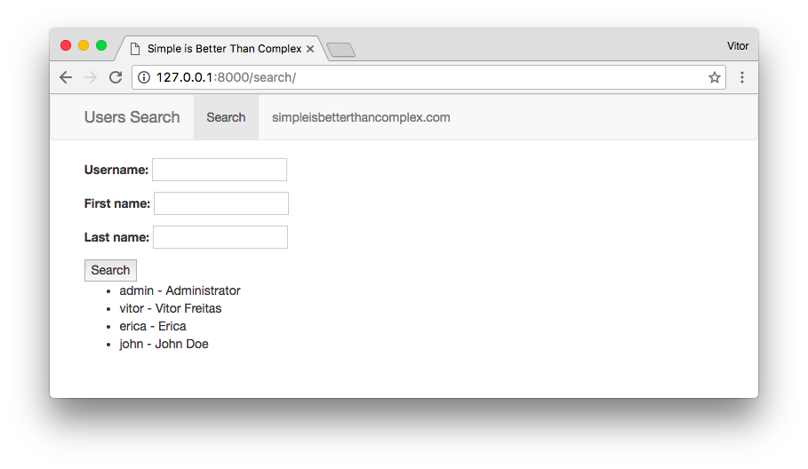
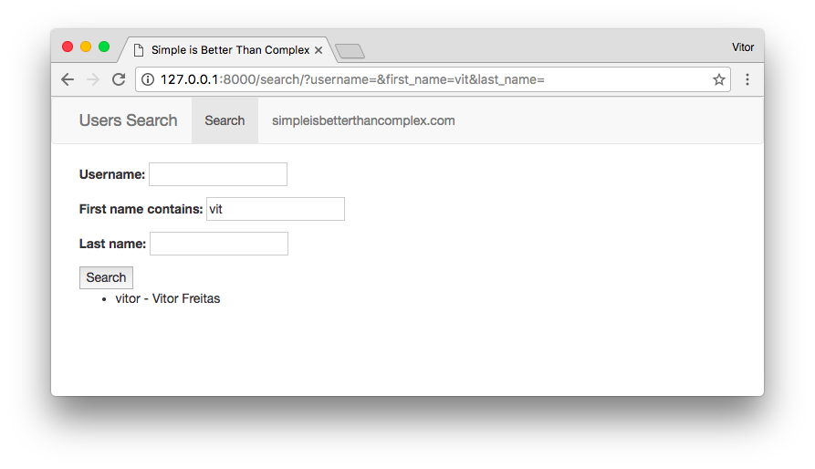
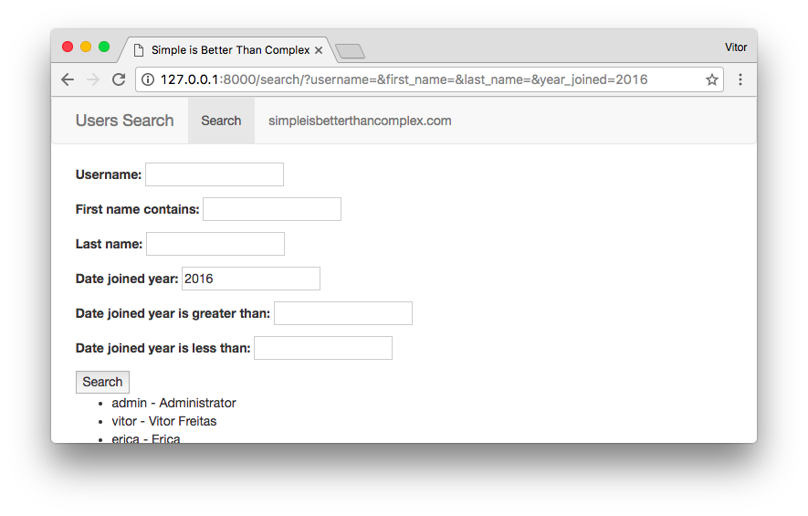

# Как динамически фильтровать queryset


Ссылка на оригинальную статью: [How to Filter QuerySets Dynamically](https://simpleisbetterthancomplex.com/tutorial/2016/11/28/how-to-filter-querysets-dynamically.html)

Опубликовано: 28 ноября 2016

Автор: [Vitor Freitas](https://simpleisbetterthancomplex.com/about/)


<figure><figcaption></figcaption></figure>

Динамическая фильтрация QuerySets является довольно распространенным вариантом использования. Конечно, есть подключаемое приложение, которое сделает вашу жизнь проще. В этом руководстве рассказывается, как использовать приложение **django-filter** для добавления простой фильтрации в ваши представления. Чтобы проиллюстрировать этот урок, я реализую представление для поиска пользователей. Как обычно, код, используемый в этом руководстве, доступен на GitHub. Ссылку вы найдете в конце этого поста.

## Установка

Самый простой способ - установить его с помощью **pip**:

```bash
pip install django-filter
```

Вот и все. Он готов к использованию. Убедитесь, что вы обновили файл **requirements.txt**.

Язык приложения по умолчанию — английский. Он уже поставляется с некоторой локализацией и языковой поддержкой. В настоящее время поддерживаются следующие языки: de, es\_AR, fr, pl, ru, zh\_CN. Если вы не хотите использовать какой-либо из этих языков в своем проекте, вам не нужно добавлять **django\_filter** в **INSTALLED\_APPS**.

## Использование

Создайте файл с именем **filter.py** в папке вашего приложения:

```python
from django.contrib.auth.models import User
import django_filters

class UserFilter(django_filters.FilterSet):
    class Meta:
        model = User
        fields = ['username', 'first_name', 'last_name', ]
```

Представление **views.py** так же просто, как:

```python
from django.contrib.auth.models import User
from django.shortcuts import render
from .filters import UserFilter

def search(request):
    user_list = User.objects.all()
    user_filter = UserFilter(request.GET, queryset=user_list)
    return render(request, 'search/user_list.html', {'filter': user_filter})
```

Затем маршрут **urls.py**:

```python
from django.conf.urls import url
from mysite.search import views

urlpatterns = [
    url(r'^search/$', views.search, name='search'),
]
```

И, наконец, шаблон **user\_list.html**:

```django




  <form method="get">
    {{ filter.form.as_p }}
    <button type="submit">Search</button>
  </form>
  <ul>
  
    <li>{{ user.username }} - {{ user.get_full_name }}</li>
  
  </ul>


```

Магия происходит внутри класса **UserFilter**. Нам просто нужно передать данные **request.GET** в класс **UserFilter** вместе с **QuerySet**, который мы хотим отфильтровать. Он сгенерирует форму Django с полями поиска, а также вернет отфильтрованный **QuerySet**.

Таким образом, в основном мы будем работать внутри определения **UserFilter** и шаблона HTML, правильно отображая данные.

Вот как выглядит исходный пример:

<figure><figcaption></figcaption></figure>

И после отправки формы:

<figure><figcaption></figcaption></figure>

## Использование универсального представления на основе классов

Если вы не будете делать ничего особенного внутри функции представления, вы можете легко заменить ее общим представлением на основе классов **django-filter**.

Вы можете либо передать **модель**, либо **filterset\_class** в качестве параметра. Мы будем работать в **urls.py** с **filterset\_class**, поэтому для большей гибкости:

```python
from django.conf.urls import url
from django_filters.views import FilterView
from mysite.search.filters import UserFilter

urlpatterns = [
    url(r'^search/$', FilterView.as_view(filterset_class=UserFilter,
        template_name='search/user_list.html'), name='search'),
]
```

Обратите внимание, что я также передал **template\_name** в качестве параметра. По умолчанию **django-filter** будет искать шаблон на основе приложения модели и его имени, следуя логике: `<app_name>/<model_name>_filter.html`.

Поскольку я реализую фильтр для пользователя Django **User**, который находится внутри приложения авторизации (и у меня нет к нему доступа), библиотека **django-filter** будет искать шаблон по пути: `auth/user_filter.html`.

## Изучение параметров фильтрации

Пользоваться фильтрами очень просто. В основном он использует [поиск по полю Django QuerySet](https://docs.djangoproject.com/en/dev/ref/models/querysets/#field-lookups).

Итак, допустим, мы хотим отфильтровать **first\_name**, ввод должен быть нечувствительным к регистру и может совпадать с частью имени. Для этого в **filters.py**:

```python
class UserFilter(django_filters.FilterSet):
    first_name = django_filters.CharFilter(lookup_expr='icontains')
    class Meta:
        model = User
        fields = ['username', 'first_name', 'last_name', ]
```

<figure><figcaption></figcaption></figure>

Мы также можем добавить поле **date\_joined** и отфильтровать его только по году в **filters.py**:

```python
class UserFilter(django_filters.FilterSet):
    first_name = django_filters.CharFilter(lookup_expr='icontains')
    year_joined = django_filters.NumberFilter(name='date_joined', lookup_expr='year')
    class Meta:
        model = User
        fields = ['username', 'first_name', 'last_name', ]
```

<figure><figcaption></figcaption></figure>

Обратите внимание, что я не добавил его в список полей **fields**. Если вы определяете его как атрибут класса, вам не нужно явно добавлять его в метакласс **Meta**.

Мы также можем добавить некоторые дополнительные атрибуты, связанные с годом:

```python
class UserFilter(django_filters.FilterSet):
    first_name = django_filters.CharFilter(lookup_expr='icontains')
    year_joined = django_filters.NumberFilter(name='date_joined', lookup_expr='year')
    year_joined__gt = django_filters.NumberFilter(name='date_joined', lookup_expr='year__gt')
    year_joined__lt = django_filters.NumberFilter(name='date_joined', lookup_expr='year__lt')
    class Meta:
        model = User
        fields = ['username', 'first_name', 'last_name', ]
```

<figure><figcaption></figcaption></figure>

Другой вариант — определить поля как словарь:

```python
class UserFilter(django_filters.FilterSet):
    class Meta:
        model = User
        fields = {
            'username': ['exact', ],
            'first_name': ['icontains', ],
            'last_name': ['exact', ],
            'date_joined': ['year', 'year__gt', 'year__lt', ],
        }
```

Отлично работает и с **ManyToManyField**:

```python
class UserFilter(django_filters.FilterSet):
    first_name = django_filters.CharFilter(lookup_expr='icontains')
    year_joined = django_filters.NumberFilter(name='date_joined', lookup_expr='year')

    class Meta:
        model = User
        fields = ['username', 'first_name', 'last_name', 'year_joined', 'groups']
```

<figure><figcaption></figcaption></figure>

Мы также можем переопределить виджет по умолчанию для поля групп **ManyToManyField**, используя вместо этого флажок:

```python
from django import forms
from django.contrib.auth.models import User, Group
import django_filters

class UserFilter(django_filters.FilterSet):
    first_name = django_filters.CharFilter(lookup_expr='icontains')
    year_joined = django_filters.NumberFilter(name='date_joined', lookup_expr='year')
    groups = django_filters.ModelMultipleChoiceFilter(queryset=Group.objects.all(),
        widget=forms.CheckboxSelectMultiple)

    class Meta:
        model = User
        fields = ['username', 'first_name', 'last_name', 'year_joined', 'groups']
```

<figure><figcaption></figcaption></figure>

Для получения более подробной информации об опциях поля, пожалуйста, обратитесь к [официальной документации django-filter](https://django-filter.readthedocs.io/).

## Улучшение шаблона

На самом деле это дополнение к посту. В конце концов, форма **filter.form**, к которой мы обращаемся в шаблоне, — это обычная форма Django. Но если вам интересно, как сделать его красивее, вот что мы можем сделать:

```django






  <form method="get">
    <div class="well">
      <h4 style="margin-top: 0">Filter</h4>
      <div class="row">
        <div class="form-group col-sm-4 col-md-3">
          {{ filter.form.username.label_tag }}
          
        </div>
        <div class="form-group col-sm-4 col-md-3">
          {{ filter.form.first_name.label_tag }}
          
        </div>
        <div class="form-group col-sm-4 col-md-3">
          {{ filter.form.last_name.label_tag }}
          
        </div>
        <div class="form-group col-sm-4 col-md-3">
          {{ filter.form.year_joined.label_tag }}
          
        </div>
        <div class="form-group col-sm-8 col-md-6">
          {{ filter.form.groups.label_tag }}
          <div>
            
              <label class="checkbox-inline">
                {{ choice.tag }} {{ choice.choice_label }}
              </label>
            
          </div>
        </div>
      </div>
      <button type="submit" class="btn btn-primary">
        <span class="glyphicon glyphicon-search"></span> Search
      </button>
    </div>
  </form>

  <table class="table table-bordered">
    <thead>
      <tr>
        <th>Username</th>
        <th>First name</th>
        <th>Last name</th>
        <th>Date joined</th>
        <th>Groups</th>
      </tr>
    </thead>
    <tbody>
      
        <tr>
          <td>{{ user.username }}</td>
          <td>{{ user.first_name }}</td>
          <td>{{ user.last_name }}</td>
          <td>{{ user.date_joined }}</td>
          <td>
            
              {{ group }}
            
              <em class="text-muted">No group</em>
            
          </td>
        </tr>
      
        <tr>
          <td colspan="5">No data</td>
        </tr>
      
    </tbody>
  </table>


```

Результат:

<figure><figcaption></figcaption></figure>

Обратите внимание, что тег `` доступен в приложении **django-widget-tweaks**. Если вы хотите узнать больше, как его использовать, посмотрите этот пост: [Пакет недели: настройки виджета Django](https://simpleisbetterthancomplex.com/2015/12/04/package-of-the-week-django-widget-tweaks.html).

## Выводы

Вот и все! Я просто хотел немного рассказать об этом пакете. Вы можете сделать с ним гораздо больше. Он также хорошо интегрируется с **Django Rest Framework**.

Код, используемый в этом руководстве, доступен на GitHub [simple-django-filter](https://github.com/sibtc/simple-django-filter).

Пакет **django-filter**:

* [django-filter documentation](https://django-filter.readthedocs.io/)
* [django-filter on GitHub](https://github.com/carltongibson/django-filter)
