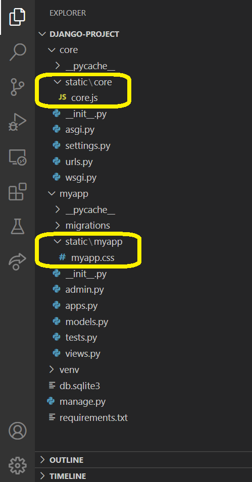
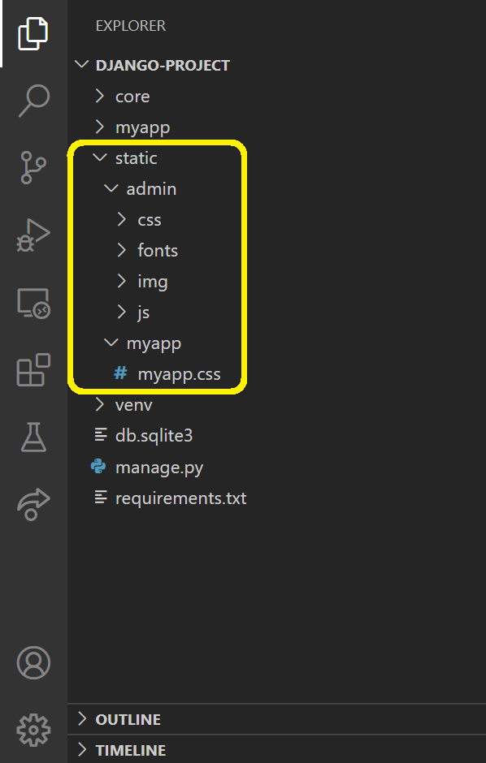
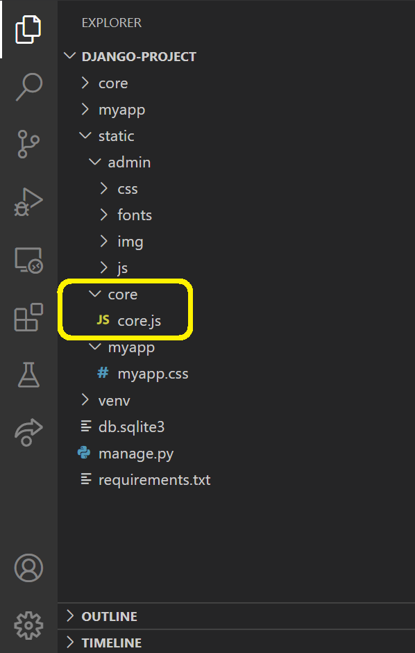
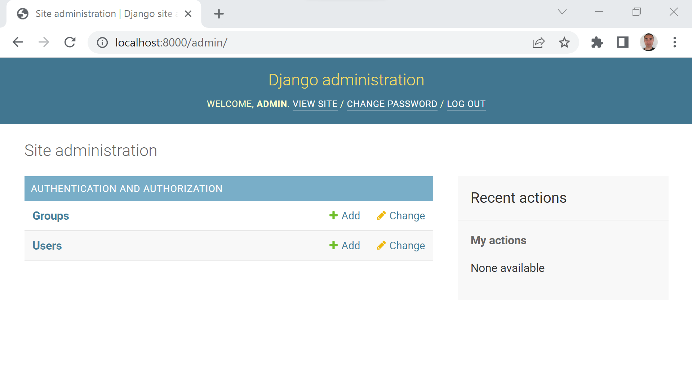
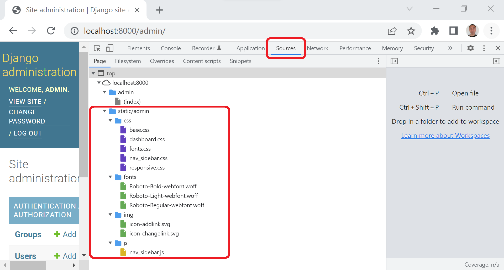
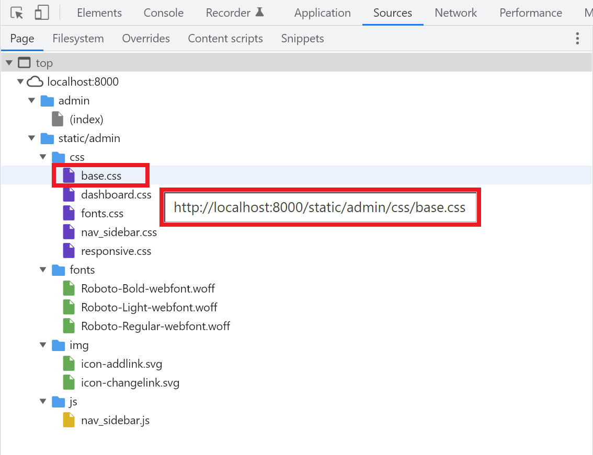
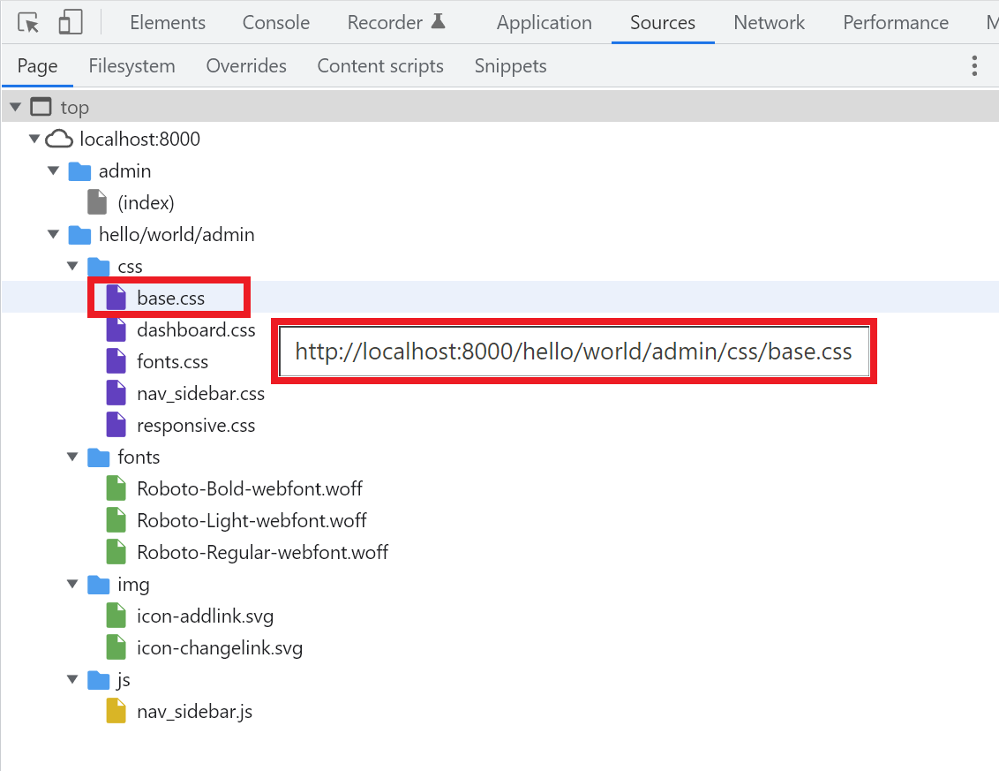

# Разница между STATIC\_URL и STATIC\_ROOT


Ссылка на оригинальную статью (**stackoverflow**): [Difference between static STATIC\_URL and STATIC\_ROOT on Django](https://stackoverflow.com/questions/8687927/difference-between-static-static-url-and-static-root-on-django)

Опубликовано: 31 декабря 2011

Автор: [user993563](https://stackoverflow.com/users/993563/user993563)


Меня смущает `static root`, и я хочу прояснить ситуацию.

Для обслуживания статических файлов в Django в `settings.py` и `urls.py` должно быть следующее:

```python
import os
PROJECT_DIR = os.path.dirname(__file__)
```

### 1. Абсолютный путь к каталогу, в котором должны быть собраны статические файлы

```python
STATIC_ROOT = os.path.join(PROJECT_DIR,'static_media/')
```

### 2. Префикс URL для статических файлов

```
STATIC_URL = '/static/'
```

### 3. Дополнительные места для статических файлов

```python
STATICFILES_DIRS = ( os.path.join(PROJECT_DIR,'static/'),)
```

... и в `urls.py` следующие строки:

```python
from django.contrib.staticfiles.urls import staticfiles_urlpatterns

urlpatterns += patterns('', (
    r'^static/(?P<path>.*)$',
    'django.views.static.serve',
    {'document_root': settings.STATIC_ROOT}
))
```

### 4. Мы также используем python manage.py collectstatic

Вопросы:

1. Может ли кто-нибудь объяснить мне рабочий процесс: как все должно быть сделано в идеале. На данный момент я копирую/вставляю приведенные выше фрагменты кода в назначенные места и продолжаю создавать новые файлы в статическом каталоге, и это работает. Однако в моих `settings.STATIC_ROOT` я указал на другой каталог.
2. Было бы здорово, если бы кто-нибудь мог объяснить рабочий процесс каждого параметра: как файлы собираются и управляются, и что было бы хорошей практикой для подражания.

## Ответ 1

### STATIC\_ROOT

> Абсолютный путь к каталогу, в котором `./manage.py collectstatic` будет собирать статические файлы для развертывания. **Пример**: `STATIC_ROOT="/var/www/example.com/static/"`

теперь команда `./manage.py collectstatic` **скопирует** все статические файлы (т. е. в папке **static** в ваших приложениях, статические файлы по всем путям) в каталог `/var/www/example.com/static/`. Теперь вам нужно только обслуживать этот каталог на **apache** или **nginx** или др.

### STATIC\_URL

> **URL**-адрес, по которому обслуживаются статические файлы в каталоге **STATIC\_ROOT** (Apache или nginx..etc). **Пример**: `/static/` или `http://static.example.com/`

Если вы установите `STATIC_URL = 'http://static.example.com/'`, вы должны обслуживать папку **STATIC\_ROOT** (т.е. `"/var/www/example.com/static/"`) с помощью apache или nginx по адресу `'http: //static.example.com/'`(чтобы вы могли ссылаться на статический файл `'/var/www/example.com/static/jquery.js'` с помощью `'http://static.example.com/jquery.js'` )

Теперь в ваших шаблонах django вы можете ссылаться на него:

```django


<script src="
"></script>
```

который будет отображаться в:

```html
<script src="http://static.example.com/jquery.js"></script>
```

## Ответ 2

**STATICFILES\_DIRS**: здесь вы можете хранить статические файлы для вашего проекта, например те, которые используются вашими шаблонами.

**STATIC\_ROOT**: оставьте это поле пустым, когда вы сделаете `manage.py collectstatic`, он будет искать все статические файлы в вашей системе и перемещать их сюда. Ваш статический файловый сервер должен быть привязан к этой папке, где бы он ни находился. Проверьте это после запуска **collectstatic**, и вы обнаружите структуру каталогов, созданную django.

Как указал @DarkCygnus, **STATIC\_ROOT** должен указывать на каталог в вашей файловой системе, папка должна быть пустой, так как она будет заполнена Django.

```python
STATIC_ROOT = os.path.join(BASE_DIR, 'staticfiles')
```

или

```python
STATIC_ROOT = '/opt/web/project/static_files'
```

**STATIC\_URL**: `'/static/'` обычно подходит, это просто префикс для статических файлов.

## Ответ 3 (подробный)

#### Обновление за май 2022 г.:

Прежде всего, я объясняю **STATIC\_ROOT**, затем **STATIC\_URL**.

### \<STATIC\_ROOT>

«**STATIC\_ROOT**» устанавливает **абсолютный путь к папке, в которой хранятся статические файлы**, используемые для приложений и администратора в проекте django, и эта команда ниже **создает папку и собирает статические файлы из приложений и админки** в проекте django в папку (\* Установка «**STATIC\_ROOT**» _**никогда не влияет**_ на статический URL-адрес файла):

```bash
python manage.py collectstatic 
```

И «**STATIC\_ROOT**» работает <mark style="color:red;">**только**</mark> в **production** режиме, который имеет значение «`DEBUG = False`», как показано ниже:

```python
# "core/settings.py"

DEBUG = False # Production Mode
```

Сейчас у нас есть проект django со **статическими файлами «core.js» в папке «core»**, которая находится «`settings.py`», и «`myapp.css`» - в папке **«myapp»**, которая является приложением **"app"**, как показано ниже:

<figure><figcaption></figcaption></figure>

И папки «**css**», «**fonts**», «**img**» и «**js**» в папке «**admin**» в папке «**venv**», как показано ниже. \* Я использую виртуальную среду с именем «**venv**» для этого проекта django, поэтому в ней находятся статические файлы для «**admin**», а **относительный путь к папке «admin»** — `"venv/lib/python3.8/site-packages/django/contrib/admin/static/admin"`:

<figure><figcaption></figcaption></figure>

Затем мы устанавливаем `"os.path.join(BASE_DIR, 'static')"`, который в моем случае является `«C:\Users\kai\django-project\static»` в Windows, на «**STATIC\_ROOT**». Кроме того, мы установили «**False**» в «**DEBUG**», потому что «**STATIC\_ROOT**» работает только в **production** режиме, как я уже говорил:

```python
# "core/settings.py"

DEBUG = False # Production Mode

STATIC_ROOT = os.path.join(BASE_DIR, 'static') # Вот здесь
STATIC_URL = '/static/'

```

Теперь мы запускаем команду ниже:

```bash
python manage.py collectstatic 
```

Затем создается папка **"static"**, а папки **«css»**, **«fonts»**, **«img»** и **«js»** в папке **«admin»** и **«myapp.css»** в папке **«myapp»** собираются в папку **"static"**, как показано ниже, но, как мы видим, **«core.js»** в папке **«core»** не собирается в папку **"static"**, как показано ниже, потому что, как я уже говорил, команда «`python manage.py collectstatic`» собирает статические файлы **из приложений и admin** в проекте django, но папка **«core»** с файлом **«settings.py»** не является приложением и админкой. Вот почему **«core.js»** в папке **«core»** не собирается в папку **"static"**:

<figure><figcaption></figcaption></figure>

Но есть способ собрать **«core.js»** из папки **«core»** в папку **«static»**. Для этого нам нужно использовать **"STATICFILES\_DIRS"**, а затем установить `"os.path.join(BASE_DIR, 'core/static')"`, который является `"C:\Users\kai\django-project\core\static"` в Windows в моем случае в "**STATICFILES\_DIRS**", как показано ниже:

```python
# "core/settings.py"

DEBUG = False

STATICFILES_DIRS = [ # Вот здесь
    os.path.join(BASE_DIR, 'core/static')
]

STATIC_ROOT = os.path.join(BASE_DIR, 'static')
STATIC_URL = '/static/'

```

Теперь снова запускаем команду ниже:

```bash
python manage.py collectstatic 
```

Затем введите **«yes»**, затем нажмите **«Enter»**, чтобы перезаписать существующую папку **"static"**:

> Вы запросили сбор статических файлов в месте назначения, как указано в ваших настройках:
>
> C:\Users\kai\django-project\static
>
> Это перезапишет существующие файлы! Вы уверены, что хотите это сделать?
>
> Введите «yes», чтобы продолжить, или «no», чтобы отменить: yes

Теперь «`core.js`» в папке «**core**» собирается в папку «**static**», как показано ниже:

<figure><figcaption></figcaption></figure>

### \<STATIC\_URL>

Далее я объясню о "**STATIC\_URL**".

«**STATIC\_URL**» устанавливает **первую** **часть каталога URL-адреса статического файла** между **частью хоста и файловой частью** URL-адреса статического файла, как показано ниже (\* Настройка «**STATIC\_URL**» **никогда не влияет на абсолютный путь к папке**, в которой статические файлы используются для приложений и admin в проекте django хранятся):

```
       |     Host      |   Directory    |  File  |
       |               |Front |  Back   |        |
        <-------------> <----> <-------> <------>      
https://www.example.com/static/admin/css/base.css
```

Например, мы устанавливаем для `'/static/'` значение "**STATIC\_URL**", как показано ниже (\*"**STATIC\_URL**" работает как в режиме разработки **development**, который имеет значение "`DEBUG = True`", так и в рабочем режиме **production**, который имеет значение "`DEBUG = False`"):

```python
# "core/settings.py"

DEBUG = False

STATICFILES_DIRS = [
    os.path.join(BASE_DIR, 'core/static')
]

STATIC_ROOT = os.path.join(BASE_DIR, 'static')
STATIC_URL = '/static/' # Вот здесь

```

Затем откройте **Django Admin**:

<figure><figcaption></figcaption></figure>

Затем нажмите «**F12**», чтобы открыть «**Developer Tools**», чтобы **проверить ресурсы**, используемые для текущей открытой страницы администратора Django, из «**Sources**», и есть статические файлы для «**admin**», которые мы только что собрали в папку **"static"**:

<figure><figcaption></figcaption></figure>

Затем наведите указатель мыши на «**base.css**» в «**css**», чтобы проверить URL-адрес:

<figure><figcaption></figcaption></figure>

Как мы видим, мы можем установить первую часть каталога **"static"**:

```
                      Здесь  
                     <------>
http://localhost:8000/static/admin/css/base.css
```

И этот URL-адрес ниже в этом случае «**www.example.com**» с «**https**»:

```
                        Здесь
    　　　　　　　　　　　<------>
https://www.example.com/static/admin/css/base.css
```

И мы можем изменить часть первого каталога **«static»** на **«hello/world»**.

Итак, просто измените «**STATIC\_URL**» с **«/static/»** на **«/hello/world/»**, как показано ниже:

```python
# "core/settings.py"

DEBUG = False

STATICFILES_DIRS = [
    os.path.join(BASE_DIR, 'core/static')
]

STATIC_ROOT = os.path.join(BASE_DIR, 'static')
STATIC_URL = '/hello/world/' # Вот здесь

```

Затем обновите страницу администратора Django:

<figure><figcaption></figcaption></figure>

Затем часть переднего каталога **«static»** заменяется на **«hello/world»**, как показано ниже:

```
                         Здесь  
                     <----------->
http://localhost:8000/hello/world/admin/css/base.css
```

## Ответ 4

Все приведенные выше ответы полезны, но ни один из них не решил мою проблему. В моем производственном (production) файле мой **STATIC\_URL** был `https://<URL>/static`, и я использовал тот же **STATIC\_URL** в своем файле **dev** `settings.py`.

Это вызывает тихий сбой в `django/conf/urls/static.py`.

Тестовый `elif not settings.DEBUG or '://' in prefix:` выбирает `«//»` в URL-адресе и не добавляет шаблон статического URL-адреса, в результате чего статические файлы не могут быть найдены.

Было бы разумно, если бы Django выдал сообщение об ошибке, в котором говорилось, что вы не можете использовать `http(s)://` с `DEBUG = True`.

Мне пришлось изменить **STATIC\_URL** на `'/static/'`

## Ответ 5

