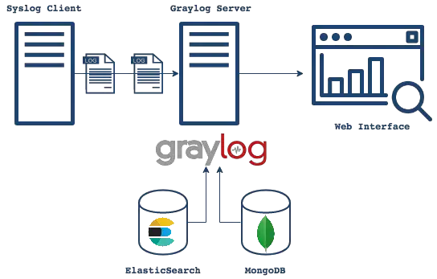
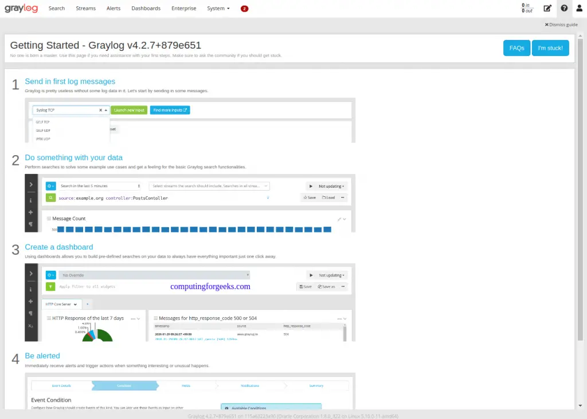
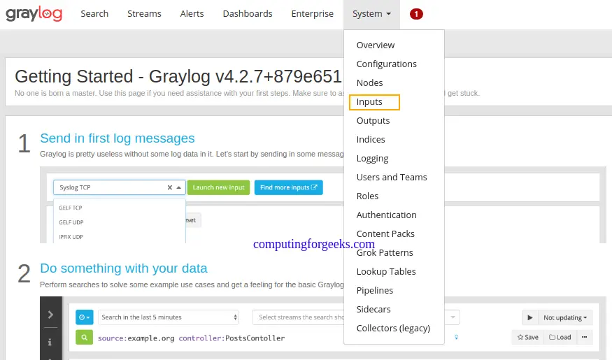
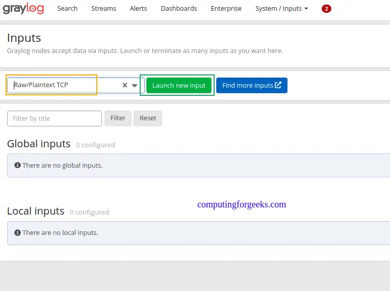
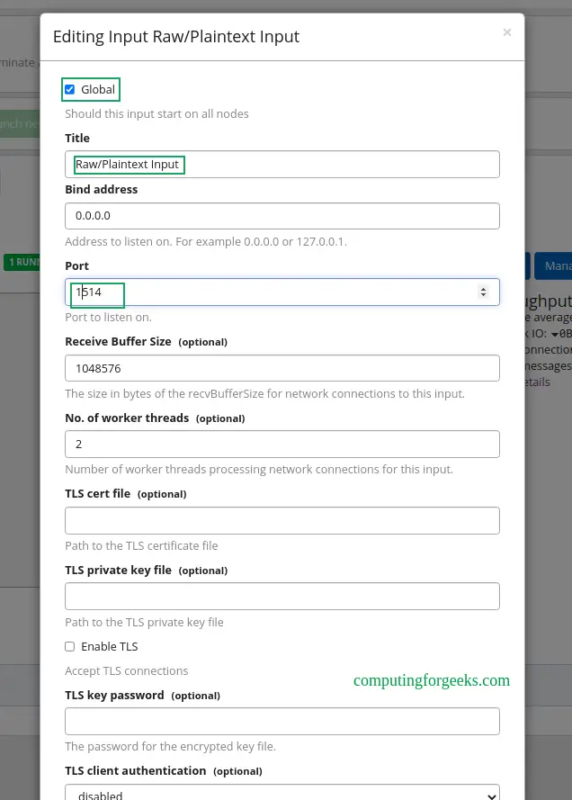
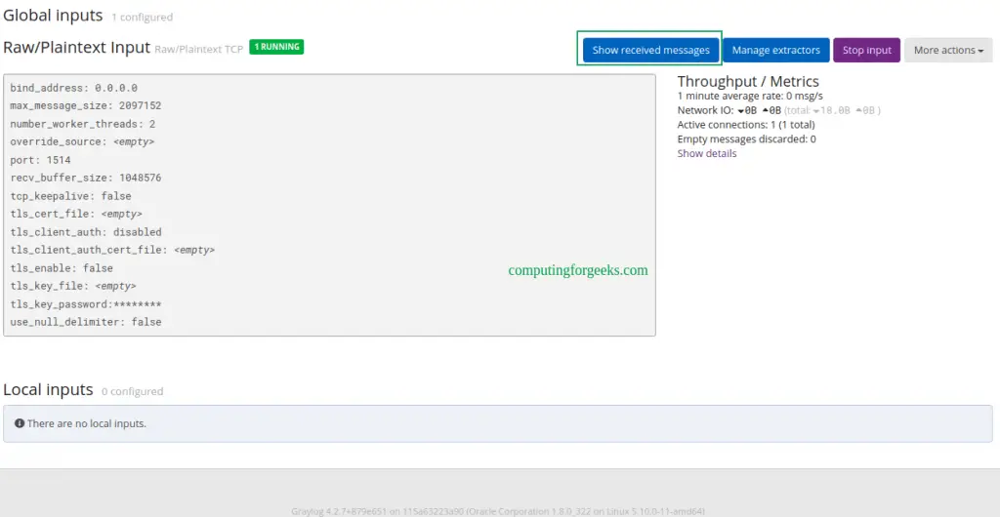
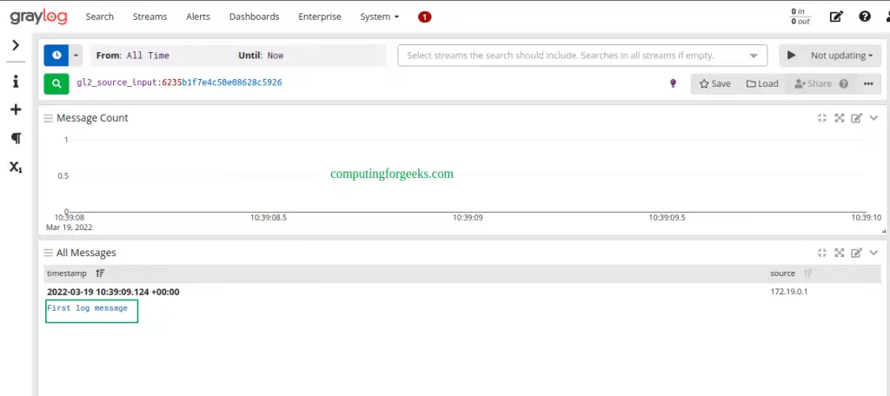
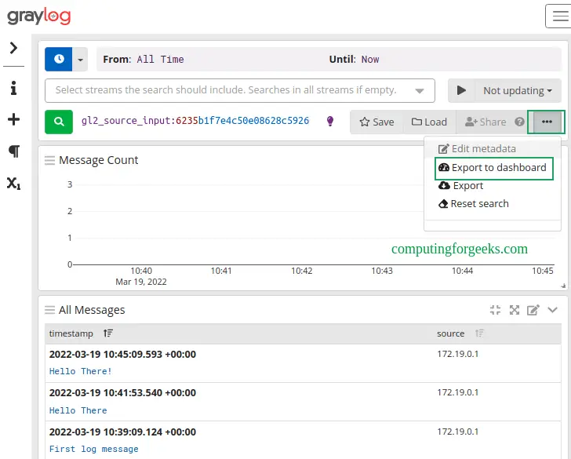
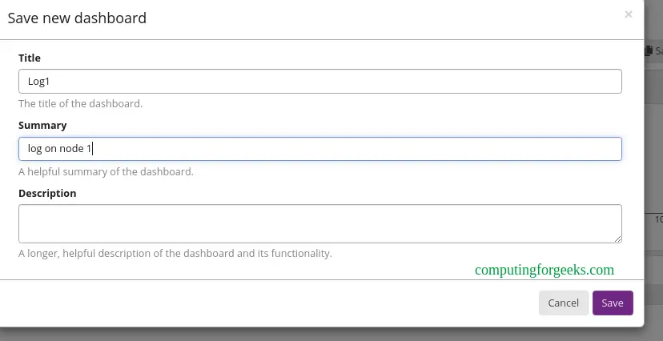
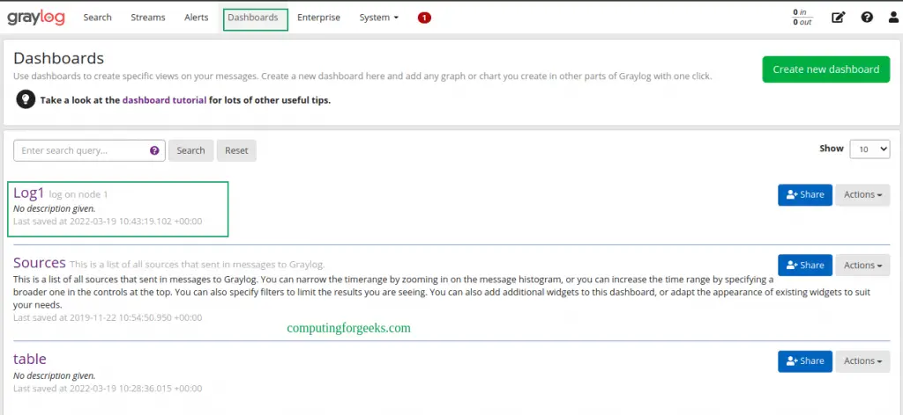

# Как запустить сервер Graylog в контейнерах Docker


Ссылка на оригинальную статью: [How To Run Graylog Server in Docker Containers](https://computingforgeeks.com/how-to-run-graylog-server-in-docker-containers/)

Опубликовано: 15 апреля 2022

Автор: [Klinsmann Öteyo](https://computingforgeeks.com/author/klinsmann/)


Все приложения генерируют информацию во время работы, эта информация хранится в виде журналов. Как системный администратор вы должны отслеживать эти журналы, чтобы обеспечить правильное функционирование системы и, следовательно, предотвратить риски и ошибки. Эти журналы обычно разбросаны по серверам, и управление ими усложняется по мере увеличения объема данных.

**Graylog** — это бесплатный инструмент управления журналами с открытым исходным кодом, который можно использовать для захвата, централизации и просмотра журналов в реальном времени с нескольких устройств в сети. Его можно использовать для анализа как структурированных, так и неструктурированных журналов. Установка **Graylog** состоит из **MongoDB**, **Elasticsearch** и сервера **Graylog**. Сервер получает данные от клиентов, установленных на нескольких серверах, и отображает их в веб-интерфейсе.

Ниже приведена диаграмма, иллюстрирующая архитектуру **Graylog**.

<figure><figcaption></figcaption></figure>

**Graylog** предлагает следующие возможности:

* **Сбор журналов логов**. Современная архитектура Graylog, ориентированная на журналы, может принимать практически любые типы структурированных данных, включая сообщения журналов и сетевой трафик из: **syslog** (TCP, UDP, AMQP, Kafka), **AWS** (журналы AWS, FlowLogs, CloudTrail), **JSON Path из HTTP API**, **Beats/Logstash**, **plain/raw текст** (TCP, UDP, AMQP, Kafka) и т. д.
* **Анализ журнала логов**. Graylog действительно помогает при изучении данных, чтобы понять, что происходит в вашей среде. Он использует расширенный поиск, рабочий процесс поиска и информационные панели.
* **Извлечение данных** — всякий раз, когда система управления журналами работает, будут сводные данные, которые необходимо передать в другое место в вашем Центре операций. Graylog предлагает несколько вариантов, включая: запланированные отчеты, механизм корреляции, REST API и отправитель данных.
* **Повышенная безопасность и производительность**. Graylog часто содержит конфиденциальные, регулируемые данные, поэтому крайне важно, чтобы сама система была безопасной, доступной и быстрой. Это достигается с помощью управления доступом на основе ролей, архивирования, отказоустойчивости и т. д.
* **Расширяемость** — благодаря феноменальному сообществу открытого исходного кода создаются и выпускаются на рынок расширения для улучшения функциональности Graylog.

В этом руководстве вы узнаете, как запустить сервер Graylog в контейнерах Docker. Этот метод предпочтительнее, поскольку вы можете запускать и настраивать Graylog со всеми зависимостями, Elasticsearch и MongoDB уже в комплекте.

### Предварительные условия установки.

Прежде чем мы начнем, вам необходимо обновить систему и установить необходимые пакеты.

```bash
## On Debian/Ubuntu
sudo apt update && sudo apt upgrade
sudo apt install curl vim git

## On RHEL/CentOS/RockyLinux 8
sudo yum -y update
sudo yum -y install curl vim git

## On Fedora
sudo dnf update
sudo dnf -y install curl vim git
```

## 1. Установите Docker и Docker-Compose в Linux.

Конечно, вам нужен механизм docker для запуска контейнеров docker. Чтобы установить Docker Engine, используйте специальное руководство ниже:

[Как установить Docker CE в системах Linux](https://computingforgeeks.com/install-docker-ce-on-linux-systems/)

После установки проверьте установленную версию.

```bash
$ docker -v
Docker version 20.10.13, build a224086
```

Вам также необходимо добавить системного пользователя в группу **docker**. Это позволит вам запускать команды Docker без использования **sudo**.

```bash
sudo usermod -aG docker $USER
newgrp docker
```

Установив докер, продолжайте и установите **docker-compose**, используя приведенное ниже руководство:

[Как установить Docker Compose в Linux](https://computingforgeeks.com/how-to-install-latest-docker-compose-on-linux/)

Проверьте установку.

```bash
$ docker-compose version
Docker Compose version v2.3.3
```

Теперь запустите и включите docker для автоматического запуска при загрузке системы.

```bash
sudo systemctl start docker && sudo systemctl enable docker
```

## 2. Подготовка контейнера Graylog

Контейнер Graylog будет состоять из сервера Graylog, Elasticsearch и MongoDB. Чтобы добиться этого, мы сохраним информацию и настройки в файле **YAML**.

Создайте файл YAML, как показано ниже:

```bash
vim docker-compose.yml
```

В файле добавьте следующие строки:

```yaml
version: '2'
services:
  # MongoDB: https://hub.docker.com/_/mongo/
  mongodb:
    image: mongo:4.2
    networks:
      - graylog
  # БД расшарена для сохранения данных
    volumes:
      - /mongo_data:/data/db
   # Elasticsearch: https://www.elastic.co/guide/en/elasticsearch/reference/7.10/docker.html
  elasticsearch:
    image: docker.elastic.co/elasticsearch/elasticsearch-oss:7.10.2
    # папка с данными расшарена для сохранения данных
    volumes:
      - /es_data:/usr/share/elasticsearch/data
    environment:
      - http.host=0.0.0.0
      - transport.host=localhost
      - network.host=0.0.0.0
      - "ES_JAVA_OPTS=-Xms512m -Xmx512m"
    ulimits:
      memlock:
        soft: -1
        hard: -1
    mem_limit: 1g
    networks:
      - graylog
  # Graylog: https://hub.docker.com/r/graylog/graylog/
  graylog:
    image: graylog/graylog:4.2
    # каталоги журнала и конфигурации в локальной NFS расшарены для сохранения данных
    volumes:
      - /graylog_journal:/usr/share/graylog/data/journal
    environment:
      # CHANGE ME (должно быть не менее 16 символов)!
      - GRAYLOG_PASSWORD_SECRET=somepasswordpepper
      # Пароль: admin
      - GRAYLOG_ROOT_PASSWORD_SHA2=e1b24204830484d635d744e849441b793a6f7e1032ea1eef40747d95d30da592
      - GRAYLOG_HTTP_EXTERNAL_URI=http://192.168.205.4:9000/
    entrypoint: /usr/bin/tini -- wait-for-it elasticsearch:9200 --  /docker-entrypoint.sh
    networks:
      - graylog
    links:
      - mongodb:mongo
      - elasticsearch
    restart: always
    depends_on:
      - mongodb
      - elasticsearch
    ports:
      # Веб-интерфейс Graylog и REST API
      - 9000:9000
      # Syslog TCP
      - 1514:1514
      # Syslog UDP
      - 1514:1514/udp
      # GELF TCP
      - 12201:12201
      # GELF UDP
      - 12201:12201/udp
# Тома для сохранения данных, см. https://docs.docker.com/engine/admin/volumes/volumes/
volumes:
  mongo_data:
    driver: local
  es_data:
    driver: local
  graylog_journal:
    driver: local
networks:
    graylog:
      driver: bridge
```

В файле заменить:

* **GRAYLOG\_PASSWORD\_SECRET** с вашим собственным паролем, длина которого должна быть не менее 16 символов.
* **GRAYLOG\_ROOT\_PASSWORD\_SHA2** с паролем SHA2, полученным с помощью команды:

```bash
echo -n "Enter Password: " && head -1 </dev/stdin | tr -d '\n' | sha256sum | cut -d" " -f1
```

* **GRAYLOG\_HTTP\_EXTERNAL\_URI** с IP-адресом вашего сервера.

Вы также можете настроить дополнительные параметры для своего сервера с помощью **GRAYLOG\_**, например, чтобы включить SMTP для отправки предупреждений:

```yaml
.......
    graylog:
......
      environment:
        GRAYLOG_TRANSPORT_EMAIL_ENABLED: "true"
        GRAYLOG_TRANSPORT_EMAIL_HOSTNAME: smtp
        GRAYLOG_TRANSPORT_EMAIL_PORT: 25
        GRAYLOG_TRANSPORT_EMAIL_USE_AUTH: "false"
        GRAYLOG_TRANSPORT_EMAIL_USE_TLS: "false"
        GRAYLOG_TRANSPORT_EMAIL_USE_SSL: "false"
.....
```

## 3. Создание постоянных томов

Чтобы сохранить данные, вы будете использовать внешние тома для хранения данных. В этом руководстве мы уже сопоставили тома в файле **YAML**. Создайте 3 тома для **MongoDB**, **Elasticsearch** и **Graylog**, как показано ниже:

```bash
sudo mkdir /mongo_data
sudo mkdir /es_data
sudo mkdir /graylog_journal
```

Установите правильные разрешения:

```bash
sudo chmod 777 -R /mongo_data
sudo chmod 777 -R /es_data
sudo chmod 777 -R /graylog_journal
```

В системах на основе **Rhel** вам необходимо установить SELinux в режим permissive, чтобы пути были доступны.

```bash
sudo setenforce 0
sudo sed -i 's/^SELINUX=.*/SELINUX=permissive/g' /etc/selinux/config
```

## 4. Запустите сервер Graylog в контейнерах Docker.

Теперь, когда контейнер подготовлен, мы можем легко запустить его с помощью команды:

```bash
docker-compose up -d
```

Пример вывода:

```
[+] Running 30/30
 ⠿ graylog Pulled                                                                                                                     23.2s
   ⠿ f7a1c6dad281 Pull complete                                                                                                        8.0s
   ⠿ ea8366d5a4a5 Pull complete                                                                                                        9.7s
   ⠿ 3c38647db2f9 Pull complete                                                                                                       10.2s
   ⠿ 8c1622fde1b3 Pull complete                                                                                                       12.9s
   ⠿ a51becc643cd Pull complete                                                                                                       17.6s
   ⠿ a363c7a2d0d7 Pull complete                                                                                                       18.5s
   ⠿ 208d9143b0ee Pull complete                                                                                                       19.1s
   ⠿ c30263374f43 Pull complete                                                                                                       19.4s
 ⠿ mongodb Pulled                                                                                                                     17.5s
   ⠿ cf06a7c31611 Pull complete                                                                                                        2.2s
   ⠿ 5e8cbd051978 Pull complete                                                                                                        2.5s
   ⠿ 22d2e18323fe Pull complete                                                                                                        3.0s
   ⠿ ea17d81261d5 Pull complete                                                                                                        3.6s
   ⠿ ec6d044e0932 Pull complete                                                                                                        3.9s
.......
```

После того, как все образы будут загружены и контейнеры запущены, проверьте статус, как показано ниже:

```bash
$ docker ps
CONTAINER ID   IMAGE                                                      COMMAND                  CREATED          STATUS                             PORTS                                                                                                                                                                                                                           NAMES
7f969caa48f5   graylog/graylog:4.2                                        "/usr/bin/tini -- wa…"   30 seconds ago   Up 27 seconds (health: starting)   0.0.0.0:1514->1514/tcp, :::1514->1514/tcp, 0.0.0.0:9000->9000/tcp, 0.0.0.0:1514->1514/udp, :::9000->9000/tcp, :::1514->1514/udp, 0.0.0.0:12201->12201/tcp, 0.0.0.0:12201->12201/udp, :::12201->12201/tcp, :::12201->12201/udp   thor-graylog-1
1a21d2de4439   docker.elastic.co/elasticsearch/elasticsearch-oss:7.10.2   "/tini -- /usr/local…"   31 seconds ago   Up 28 seconds                      9200/tcp, 9300/tcp                                                                                                                                                                                                              thor-elasticsearch-1
1b187f47d77e   mongo:4.2                                                  "docker-entrypoint.s…"   31 seconds ago   Up 28 seconds                      27017/tcp                                                                                                                                                                                                                       thor-mongodb-1
```

Если у вас включен брандмауэр, разрешите порт службы Graylog через него.

```bash
## Для Firewalld
sudo firewall-cmd --zone=public --add-port=9000/tcp --permanent
sudo firewall-cmd --reload

## Для UFW
sudo ufw allow 9000/tcp
```

## 5. Доступ к веб-интерфейсу Graylog

Теперь откройте веб-интерфейс Graylog, используя URL-адрес `http://IP_address:9000`.

<figure><figcaption></figcaption></figure>

Войдите в систему, используя имя пользователя **admin** и пароль SHA2 (StrongPassw0rd), установленные в YAML.

<figure><figcaption></figcaption></figure>

На панели инструментов давайте создадим первый **input** для получения журналов, перейдя на вкладку системы и выбрав **input**.

<figure><figcaption></figcaption></figure>

Теперь найдите **Raw/Plaintext TCP** и нажмите **launch new input**.

<figure><figcaption></figcaption></figure>

После запуска появится всплывающее окно, как показано ниже. Вам нужно только изменить имя для входа, порт (1514) и выбрать узел или `"Global"` для местоположения для входа. Остальные детали оставьте как есть.

<figure><figcaption></figcaption></figure>

Сохраните файл и попробуйте отправить текстовое сообщение на вход **Graylog Raw/Plaintext TCP** через порт **1514**.

```bash
echo 'First log message' | nc localhost 1514

## ИЛИ с другого сервера ##

echo 'First log message' | nc 192.168.205.4 1514
```

При работающем входе Raw/Plaintext **показывать полученные сообщения**

<figure><figcaption></figcaption></figure>

Полученное сообщение должно отображаться, как показано ниже.

<figure><figcaption></figcaption></figure>

Вы также можете экспортировать это на панель инструментов, как показано ниже.

<figure><figcaption></figcaption></figure>

Создайте информационную панель, предоставив необходимую информацию.

<figure><figcaption></figcaption></figure>

Панель инструментов появится на вкладке **dashboard**.

<figure><figcaption></figcaption></figure>

## Заключение

Вот оно!

Мы с триумфом прошлись по тому, как запустить сервер Graylog в контейнерах Docker. Теперь вы можете легко отслеживать и получать доступ к журналам на нескольких серверах. Я надеюсь, что это было важно для вас.

Похожие сообщения:

* [Install Graylog Server on Debian with Let’s Encrypt](https://computingforgeeks.com/install-graylog-on-debian-with-lets-encrypt-ssl/)
* [Install Graylog Server on Ubuntu with Let’s Encrypt SSL](https://computingforgeeks.com/install-graylog-on-ubuntu-with-lets-encrypt/)
* [Install Graylog on CentOS 8 / RHEL 8](https://computingforgeeks.com/how-to-install-graylog-on-centos-rhel/)
