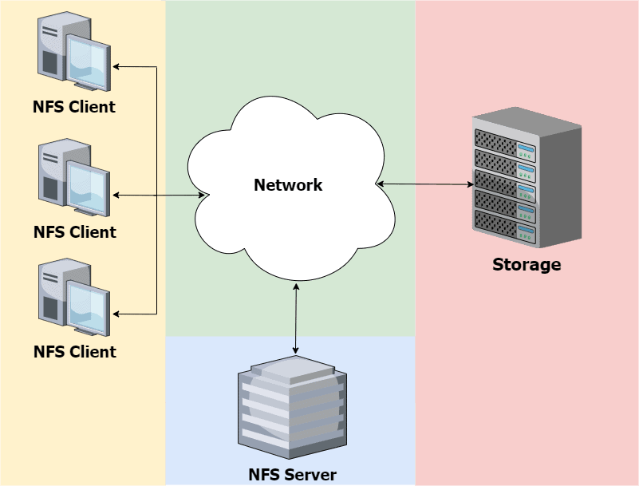

# Что такое сетевая файловая система NFS?


Ссылка на оригинальную статью: [What Is a Network File System?](https://www.baeldung.com/cs/nfs#introduction-to-nfs)

Опубликовано: 18 марта 2024

Автор: [Subham Datta](https://www.baeldung.com/cs/author/subhamdatta)

Редактор: [Michal Aibin](https://www.baeldung.com/cs/editor/michal-author)


## 1. Обзор

В этом уроке **мы подробно обсудим сетевую файловую систему (NFS)**.

Кроме того, мы рассмотрим преимущества и недостатки NFS.

## 2. Введение в NFS

**Сетевая файловая система позволяет пользователям получать доступ к файлам, хранящимся на удаленных серверах**. Более того, пользователи не осознают, что файлы находятся на удаленном сервере, и получают к ним доступ как к локальным файлам. Кроме того, NFS также обеспечивает безопасность и масштабируемость. Например, продавец, который в течение года ездит в разные города, может продолжать получать доступ к необходимым файлам с разных ноутбуков с помощью NFS, не осознавая, что этих файлов нет в локальной системе.

Это возможно, поскольку продавец может удаленно получать доступ к файлам, хранящимся на [центральном сетевом сервере](https://www.baeldung.com/cs/centralized-vs-distributed-computing), и взаимодействовать с ними, даже если они физически не расположены в конкретной системе. Мы широко используем NFS в средах [UNIX](https://en.wikipedia.org/wiki/Unix) для обмена файлами между разными пользователями и компьютерами с доступом на чтение или запись.

**NFS — это протокол с открытым исходным кодом, который использует для связи стандартный** [**TCP/IP**](https://www.baeldung.com/cs/udp-vs-tcp). Это стандартный протокол распространения данных. NFS позволяет организациям использовать его практически на любом компьютере или операционной системе. NFS была впервые представлена ​​в 1985 году и несколько раз обновлялась. Текущая версия сетевой файловой системы — NFSv4 (NFS версии 4).

Первая версия была разработана для подключения хостов UNIX к удаленным компьютерам. NFSv2 был выпущен в 1989 году. Он был разработан для подключения хостов UNIX к удаленным компьютерам в среде TCP/IP. Кроме того, в 1994 году был выпущен NFSv3 для поддержки большего количества сетевых функций и повышения эффективности. Основными преимуществами NFSv4 являются безопасность, интеграция данных и улучшенная производительность.

## 3. Рабочий процесс

**Сетевая файловая система реализована с использованием** [**клиент-серверной архитектуры**](https://www.baeldung.com/cs/client-vs-server-terminology). В этой архитектуре один компьютер действует как сервер, а другие компьютеры — как клиенты. Клиентский компьютер отправляет запросы на данные, которые серверный компьютер должен выполнить. Клиентские компьютеры выдают два типа запросов: запросы на чтение и запись.

Клиентский компьютер отправляет серверу запрос на чтение данных. Кроме того, клиентский компьютер также может выдать серверному компьютеру запрос на запись для записи данных. Запросы на чтение и запись реализуются с использованием стандартных операций чтения/записи. Компьютер-сервер выполняет запрос, используя соответствующий протокол. Затем он возвращает данные на компьютер клиента:

<figure><figcaption></figcaption></figure>

Как мы видим, все запросы данных от клиентов NFS проходят через сервер NFS. Сервер извлекает запрошенные данные из хранилища и пересылает их клиентам NFS.

**Среди особенностей программного обеспечения протокола NFS — поддержка безопасности и блокировка общих файлов**. Чтобы правильно реализовать функцию доступа к общим файлам, необходимо правильно определить как блокировку файлов, так и [кэширование](https://www.baeldung.com/cs/caching-vs-cdn). Если эти параметры не указаны и данные файла существуют только в кэше хоста, все клиенты хранилища NFS используют одни и те же параметры блокировки и кэширования для смонтированной файловой системы.

Поэтому, когда множество компьютеров или потоков одновременно пытаются получить доступ к одному и тому же файлу, функция доступа к общему файлу может работать неправильно. Для повышения эффективности совместного доступа к файлам была разработана блокировка файлов. Общий доступ к файлу может осуществляться внутри одного хоста или между несколькими хостами, использующими NFS для доступа к одному и тому же файлу.

## 4. Преимущества NFS

Теперь поговорим о преимуществах сетевой файловой системы.

**NFS прост в использовании и не требует какой-либо настройки**. Все, что нам нужно сделать, это войти на сервер и создать столько папок, сколько необходимо. Следовательно, это обеспечивает простоту использования. Более того, мы можем использовать NFS для обмена файлами между разными хостами. Кроме того, мы также можем использовать его для обмена файлами с удаленным компьютером.

NFS также обеспечивает безопасность своих пользователей. **Протокол использует строгую** [**аутентификацию**](https://www.baeldung.com/cs/authentication-vs-authorization) **для защиты от несанкционированного доступа к данным**. NFS позволяет пользователям обмениваться большими файлами, не разбивая их на более мелкие части. Он позволяет организациям сотрудничать и обмениваться данными между отделами. Это помогает им достичь более высокого уровня производительности.

**Интеграция данных — еще одна особенность NFS**. NFS обладает высокой масштабируемостью и может интегрировать данные из удаленных мест в локальное хранилище. Это помогает организациям оптимизировать свои центры обработки данных и сократить расходы за счет консолидации хранилищ.

Со времени первого выпуска NFS в него было внесено несколько изменений. С каждым обновлением производительность улучшалась. С помощью NFS организации могут повысить производительность, устранив узкие места, связанные с доступом к удаленным данным. Более того, **NFS обеспечивает более быстрый доступ к данным за счет устранения задержек в** [**глобальных сетях (WAN)**](https://en.wikipedia.org/wiki/Wide\_area\_network).

Дополнительные возможности NFS включают аварийное восстановление. **Организации также могут использовать NFS для создания плана аварийного восстановления**. В случае сбоя администраторы могут использовать NFS для создания виртуализированной удаленной копии своих данных.

Наконец, NFS — это безопасный протокол, защищающий данные от несанкционированного доступа. Это также позволяет организациям проверять и контролировать деятельность удаленных пользователей.

## 5. Недостатки NFS

NFS остается сегодня одним из наиболее часто используемых протоколов для обмена файлами, поскольку он предоставляет широкий спектр преимуществ и услуг. Теперь давайте поговорим о некоторых недостатках использования NFS.

NFS страдает от проблем с синхронизацией. **Он не обеспечивает никакой синхронизации между клиентом и сервером**. Следовательно, это означает, что данные на удаленном компьютере не синхронизируются с данными на компьютере клиента.

Когда пользователь хочет получить доступ к файлу на сервере, файл должен пройти через сеть к его компьютеру. В медленной сети доступ к файлу может занять много времени. **Следовательно, время доступа к файлу с использованием NFS может быть медленным в зависимости от скорости и размера сети**.

Как мы видим, все клиентские запросы проходят через NFS-сервер. **Следовательно, если сервер выйдет из строя, доступ к файлам будет невозможен**. Более того, сеть NFS поддерживает только один хост. Поэтому мы не можем обмениваться файлами между разными серверами, поскольку структура сети NFS позволяет использовать только один сервер.

Наконец, **NFS не поддерживает** [**иерархическое управление хранилищем**](https://en.wikipedia.org/wiki/Hierarchical\_storage\_management). Если пользователь хочет хранить данные централизованно, он не сможет сделать это с помощью NFS.

## 6. Заключение

В этом уроке мы подробно обсудили сетевую файловую систему.

Основными преимуществами использования NFS являются централизованное хранение данных, повышение эффективности, безопасности данных и масштабируемости. Однако это не лучший выбор для обмена конфиденциальными данными в общедоступных сетях, поскольку он не поддерживает иерархическое управление хранилищем.
