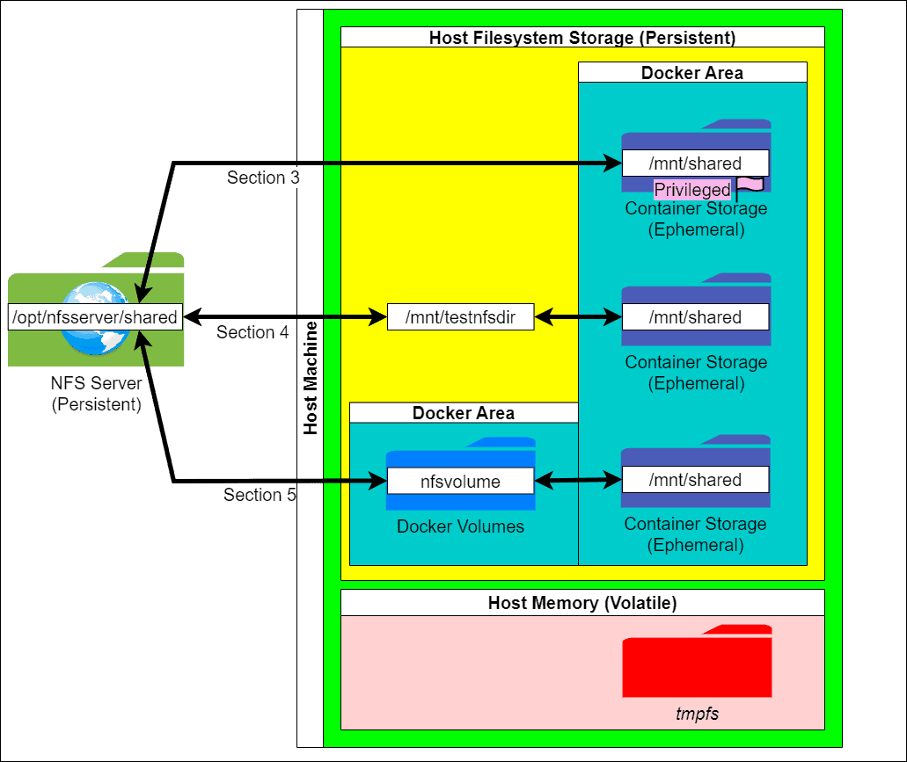

# Монтирование общих ресурсов NFS внутри контейнера Docker


Ссылка на оригинальную статью: [Mount NFS Shares Inside Docker Container](https://www.baeldung.com/linux/docker-mount-nfs-shares)

Опубликовано: 5 декабря 2023

Автор: [Purujit Srinivasan](https://www.baeldung.com/linux/author/purujitsrinivasan)

Соавтор: [Korbin Brown](https://www.baeldung.com/linux/editor/korbinbrown)


## 1. Обзор

[Сетевая файловая система (NFS)](https://www.baeldung.com/cs/nfs#introduction-to-nfs) **обеспечивает удаленный доступ к** [**файловым системам**](https://www.baeldung.com/linux/filesystems) **через общую сеть**. Следовательно, она **подходит для сценариев, в которых нескольким** [**контейнерам**](https://www.baeldung.com/linux/docker-containers-evolution#understanding\_docker\_containers) [**Docker**](https://www.baeldung.com/ops/docker-dockerfile-docker-compose#docker) **требуется доступ к общим файлам**, например, для [контейнерных микросервисов](https://www.baeldung.com/dockerizing-spring-boot-application), имеющих одинаковые файлы конфигурации.

В этом руководстве демонстрируются различные способы [подключения](https://www.baeldung.com/linux/mount-unmount-filesystems#mounting) [общих ресурсов NFS](https://www.baeldung.com/cs/file-sharing-nfs-vs-smb-vs-cifs#nfs) внутри [контейнера Docker](https://www.baeldung.com/linux/docker-image-run-container). Мы подключимся к предварительно настроенному серверу NFS через хост Docker, который действует как клиент NFS.

Команды в этом руководстве запускались в CentOS 7 в Bash после установки nfs-utils или nfs-common в некоторых дистрибутивах и Docker Engine.

## 2. Хранилище контейнеров Docker и общие ресурсы NFS

**Файлы контейнера Docker не сохраняются после** [**удаления контейнера**](https://www.baeldung.com/ops/remove-docker-containers). Тем не менее, мы можем [смонтировать внешние файловые системы в контейнер](https://www.baeldung.com/linux/docker-mount-host-filesystem).

Контейнер поддерживает три типа подключения хранилища: [bind mounts](https://www.baeldung.com/linux/bind-mounts), [volumes](https://www.baeldung.com/ops/docker-volumes#3-docker-volumes) и [tmpfs](https://www.baeldung.com/linux/files-ram#mounting-tmpfsto-directory-usingmount-command). Однако tmpfs — это энергозависимое хранилище памяти. Следовательно, он непригоден для постоянных внешних файловых систем, таких как NFS. С другой стороны, **мы можем монтировать такие файловые системы как с помощью привязки bind, так и с помощью томов volumes**. Более того, **при определенных условиях мы можем напрямую смонтировать файловую систему через** [**терминал работающего контейнера**](https://www.baeldung.com/ops/docker-container-shell#connecting-to-an-existing-container).

На изображении ниже показаны методы монтажа, описанные в следующих разделах:

<figure><figcaption></figcaption></figure>

На этом изображении также показана иерархия [хранилища Docker](https://www.baeldung.com/linux/docker-containers-evolution#4-storage-with-docker) на хост-компьютере.

### 2.1. Проверка соединения NFS

**Контейнер подключается к серверу NFS через** [**IP-адрес**](https://www.baeldung.com/cs/ipv4-vs-ipv6#ip-address) **своего хост-компьютера**. Поэтому IP-адрес хоста должен быть включен в NFS exports. Кроме того, [брандмауэру](https://www.baeldung.com/cs/firewalls-intro#what-is-a-firewall) сервера может потребоваться дополнительная [настройка для разрешения работы этого клиента NFS](https://www.baeldung.com/linux/firewalld-nfs-connections-settings).

Сервер NFS для этого руководства имеет IP-адрес 32.55.178.8. При использовании сценариев этого руководства важно заменить этот адрес фактическим адресом сервера.

Файл сервера [/etc/exports](https://linux.die.net/man/5/exports) предоставляет общий путь к файлу `/opt/nfsserver/shared` хоста с IP-адресом 32.93.10.15:

```ini
/opt/nfsserver/shared 32.93.10.15(no_root_squash,rw,sync)
```

Давайте создадим каталог с именем `/mnt/testnfsdir` на хост-компьютере. Затем мы проверим соединение NFS, смонтировав общий файловый ресурс с помощью команды [mount](https://linux.die.net/man/8/mount):

```bash
sudo mkdir /mnt/testnfsdir
sudo mount -t nfs -o nfsvers=4 32.55.178.8:/opt/nfsserver/shared /mnt/testnfsdir
```

Здесь отсутствие вывода ошибки указывает на успех. В случае [NFS версии 3](https://www.baeldung.com/linux/check-nfs-version) мы можем изменить nfsvers=4 на nfsvers=3.

Давайте теперь создадим файл с именем b0.txt внутри этого каталога с помощью [touch](https://www.baeldung.com/linux/touch-command#1-creating-a-new-file), а затем запустим [ls](https://www.baeldung.com/linux/ls-asterisk-variants#the-ls-command):

```bash
sudo touch /mnt/testnfsdir/b0.txt
ls /mnt/testnfsdir
b0.txt
```

Теперь мы подтвердили, что хост может получить доступ к общему файловому ресурсу.

## 3. Монтаж непосредственно внутри контейнера.

**Docker не поддерживает запуск mount в терминале контейнера, если мы не назначим некоторые** [**дополнительные привилегии**](https://www.baeldung.com/linux/docker-mount-host-filesystem#using-elevated-privileges) **— например, указав флаг** [**–privileged**](https://www.baeldung.com/linux/docker-mount-host-filesystem#1-running-the-container-with---privileged).

Давайте запустим контейнер образа [Alpine Linux](https://www.baeldung.com/linux/bash-alpine-docker-images#what-is-alpine) с именем priv с интерактивным терминалом, передав параметры `–interactive (-i)` и `–tty (-t)` команде запуска docker:

```bash
sudo docker run -it --privileged --name priv alpine:latest
```

Теперь мы можем создать каталог с именем `/mnt/shared` и запустить команду монтирования mount:

```bash
mkdir /mnt/shared
mount -t nfs -o nfsvers=4 32.55.178.8:/opt/nfsserver/shared /mnt/shared
```

Далее мы можем проверить, можем ли мы читать и записывать файлы NFS. Давайте создадим файл с именем b1.txt внутри `/mnt/shared` в контейнере:

```bash
/ #  ls /mnt/shared
b0.txt
/ # touch /mnt/shared/b1.txt
/ # ls /mnt/shared
b0.txt b1.txt
/ # exit
```

Мы успешно смонтировали общий файловый ресурс прямо внутри контейнера. Однако **это не лучший вариант, поскольку он требует запуска привилегированного контейнера и его сложнее настроить**. Фактически, без флага `–privileged` команда mount выводит ошибку:

```bash
$ sudo docker run -it --name unpriv alpine:latest
/  mkdir /mnt/shared
/ # mount -t nfs -o nfsvers=4 32.55.178.8:/opt/nfsserver/shared /mnt/shared
mount: permission denied (are you root?)
/ # whoami
root
/ # exit
```

Несмотря на запуск команды от имени пользователя root, мы получили ошибку отказа в разрешении.

## 4. Установка в качестве привязки bind mount

[Привязка монтирования](https://docs.docker.com/storage/bind-mounts/) представляет собой путь из файловой системы хоста, сопоставленный с путем в файловой системе контейнера. **Мы можем смонтировать общий ресурс NFS на хост, а затем подключить его как привязку**. Этот метод перекладывает ответственность за управление точкой монтирования привязки с Docker на пользователя хост-компьютера.

Давайте повторно используем `/mnt/testnfsdir`, каталог, который мы создали выше при тестировании монтирования NFS с нашего хоста:

```bash
$ ls /mnt/testnfsdir
b0.txt b1.txt
```

Здесь мы можем увидеть файлы, созданные в предыдущих разделах.

### 4.1. Использование docker run

[docker run](https://docs.docker.com/engine/reference/commandline/run/) удобен для запуска одного контейнера с меньшим количеством параметров конфигурации. Давайте передадим исходный путь source как `/mnt/testnfsdir`. Затем мы можем указать целевой путь target к `/mnt/shared` внутри контейнера, куда отображается монтирование привязки.

Давайте запустим контейнер с именем bindmount1 и проверим настройку:

```bash
$ sudo docker run -it --name bindmount1 \
  --mount type=bind,source=/mnt/testnfsdir,target=/mnt/shared \
  alpine:latest
/ # touch /mnt/shared/b2.txt
/ # ls /mnt/shared
b0.txt b1.txt b2.txt
/ # exit
```

Как показано здесь, мы успешно создали b2.txt в общей папке.

### 4.2. Использование Docker Compose

Давайте создадим файл с именем [docker-compose.yml](https://www.baeldung.com/dockerizing-spring-boot-application#2-the-docker-compose-file) и укажем привязку для томов:

```yaml
version: "3.8"
services:
    bindmount2:
        image: alpine:latest
        container_name: bindmount2
        volumes:
            - "/mnt/testnfsdir:/mnt/shared:rw"
        tty: true
```

Давайте вызовем сервис с помощью [docker compose up](https://docs.docker.com/engine/reference/commandline/compose\_up/) с флагом `–detach (-d)`:

```bash
$ sudo docker compose up -d
[+] Running 2/2
 ✔ Network baeldung_default    Created    0.2s
 ✔ Container bindmount2    Started    0.0s
```

Здесь мы можем заменить [docker compose](https://docs.docker.com/compose/reference/) на docker-compose для устройств, использующих [Docker Compose](https://www.baeldung.com/ops/docker-dockerfile-docker-compose#docker-compose) V1.

Давайте теперь откроем терминал этого контейнера, передав параметры -it вместе с [sh](https://www.baeldung.com/linux/sh-vs-bash#sh) в [docker exec](https://docs.docker.com/engine/reference/commandline/exec/). Затем давайте создадим новый файл с именем b3.txt:

```bash
$ sudo docker exec -it bindmount2 sh
/ # touch /mnt/shared/b3.txt
/ # ls /mnt/shared
b0.txt b1.txt b2.txt b3.txt
/ # exit
```

Успешно создав файл, мы можем отключить службу, используя команду [docker compose down](https://docs.docker.com/engine/reference/commandline/compose\_down/):

```bash
$ sudo docker compose down
[+] Running 2/2
✔ Container bindmount2    Removed    10.2s
✔ Network baeldung_default    Removed    0.2s
```

Таким образом, мы показали, что можем монтировать общие файловые ресурсы в качестве привязки. Однако это создает зависимость от настройки файловой системы хоста. **Исходный каталог монтирования привязки должен быть подключен к общему файловому ресурсу, прежде чем мы создадим какой-либо контейнер.**

## 5. Монтирование как том

**Docker управляет** [**томами**](https://docs.docker.com/storage/volumes/) **изолированно от других файлов на хосте**. Поэтому **тома предпочтительнее, чем привязки**. Поддержка томов Docker для общих ресурсов NFS доступна, начиная с [docker](https://docs.docker.com/engine/reference/commandline/docker/) v17.06.

Сначала давайте создадим том Docker, предоставив данные NFS команде создания тома [docker volume create](https://docs.docker.com/engine/reference/commandline/volume\_create/). Том подключается к NFS только при подключении к контейнеру. Назовем том nfsvolume1:

```bash
$ sudo docker volume create --driver local \
  -o type=nfs \
  -o o=addr="32.55.178.8,rw,nfsvers=4" \
  -o device=:/opt/nfsserver/shared \
  nfsvolume1
nfsvolume1
```

Мы можем проверить том, используя [docker volume inspect](https://docs.docker.com/engine/reference/commandline/volume\_inspect/):

```bash
$ sudo docker volume inspect nfsvolume1
[
    {
        "CreatedAt": "2023-10-14T00:01:19Z",
        "Driver": "local",
        "Labels": null,
        "Mountpoint": "/var/lib/docker/volumes/nfsvolume1/_data",
        "Name": "nfsvolume1",
        "Options": {
            "device": ":/opt/nfsserver/shared",
            "o": "addr=32.55.178.8,rw,nfsvers=4",
            "type": "nfs"
        },
        "Scope": "local"
    }
]

```

Как показано выше, том имеет локальный драйвер и параметры монтирования NFS.

### 5.1. Использование docker run с внешним томом

Давайте запустим новый контейнер с именем volumecont1 с помощью docker run и укажем том в качестве источника для параметра `–mount`:

```bash
$ sudo docker run -it --name volumecont1 \
  --mount type=volume,source=nfsvolume1,target=/mnt/shared \
  alpine:latest
/ # ls /mnt/shared
b0.txt b1.txt b2.txt b3.txt
/ # touch /mnt/shared/b4.txt
/ # ls /mnt/shared
b0.txt b1.txt b2.txt b3.txt b4.txt
/ # exit
```

Операция создания файла прошла успешно.

### 5.2. Использование docker run для создания тома

Мы можем позволить Docker создать том автоматически, указав новое имя вместе с необходимыми параметрами тома в качестве параметра volume-opt для параметра `–mount`:

```bash
$ sudo docker run -it --name volumecont2 \
  --mount 'type=volume,source=nfsvolume2,target=/mnt/shared,volume-driver=local,volume-opt=type=nfs,"volume-opt=o=addr=32.55.178.8,rw,nfsvers=4",volume-opt=device=:/opt/nfsserver/shared' \
  alpine:latest
/  
```

Мы можем повторить шаги из предыдущего раздела, чтобы создать файл с именем b5.txt.

### 5.3. Использование docker compose с внешним томом

Docker распознает внешний том по флагу `external: true`.

Давайте создадим новый файл с именем `docker-compose-volume-ext.yml`:

```yaml
version: "3.8"
services:
    volumecont3:
        image: alpine:latest
        container_name: volumecont3
        volumes:
            - nfsvolume1:/mnt/shared:rw
        tty: true
volumes:
    nfsvolume1:
        external: true
```

Docker будет использовать ранее созданный том nfsvolume1 при создании этого контейнера. Более того, **несколько контейнеров во многих файлах Compose на одном хосте могут повторно использовать этот том**.

Давайте запустим сервис и повторим шаги из предыдущих разделов для нового файла:

```bash
$ sudo docker compose -f docker-compose-volume-ext.yml up -d
[+] Running 2/2
 ✔ Network baeldung_default    Created    0.2s
 ✔ Container volumecont3    Started    0.2s
$ sudo docker exec -it volumecont3 sh
/ # touch /mnt/shared/b6.txt
/ # ls /mnt/shared
b0.txt b1.txt b2.txt b3.txt b4.txt b5.txt b6.txt
/ # exit
$ sudo docker compose -f docker-compose-volume-ext.yml down
[+] Running 2/2
 ✔ Container volumecont3    Removed    10.2s
 ✔ Network baeldung_default    Removed    0.2s
```

Как видно выше, мы создали файл с именем b6.txt в общей папке.

### 5.4. Использование docker compose для создания тома

**Мы можем позволить Docker создать том, если он не существует, указав параметры в файле Compose**. Назовем этот файл `docker-compose-volume-auto.yml`:

```yaml
version: "3.8"
services:
    volumecont4:
        image: alpine:latest
        container_name: volumecont4
        volumes:
            - nfsvolume3:/mnt/shared:rw
        tty: true
volumes:
    nfsvolume3:
        driver: local
        driver_opts:
            type: "nfs"
            o: "addr=32.55.178.8,rw,nfsvers=4"
            device: ":/opt/nfsserver/shared"
```

Мы можем повторить шаги из предыдущего раздела, заменив `docker-compose-volume-ext.yml` на `docker-compose-volume-auto.yml`.

**Это наиболее настраиваемый подход, поскольку на хосте не требуется никакой настройки, кроме помещения туда этого файла**.

## 6. Заключение

В этой статье мы увидели несколько способов монтирования общих ресурсов NFS внутри контейнера Docker. Сначала **мы смонтировали общий ресурс непосредственно в привилегированном контейнере** через его интерактивный терминал. Затем **мы использовали монтирование с привязкой через смонтированный каталог в файловой системе хоста**. Наконец, **мы использовали тома Docker для подключения общего файлового ресурса к контейнеру**. Мы также узнали, как использовать привязку монтирования и томов с командами docker run и docker compose.
