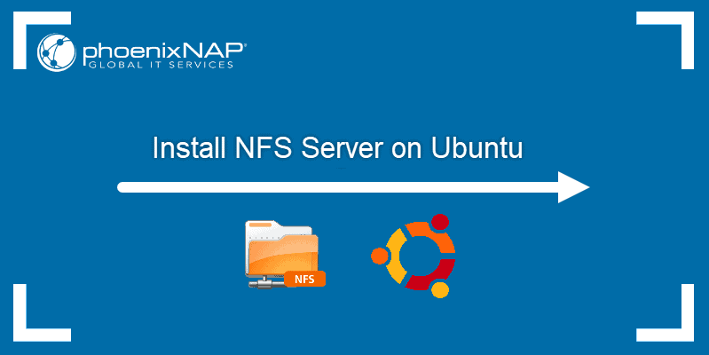
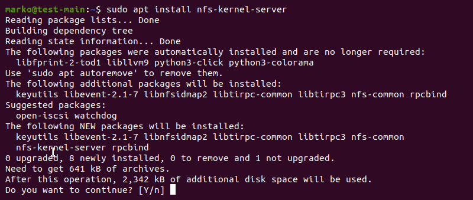
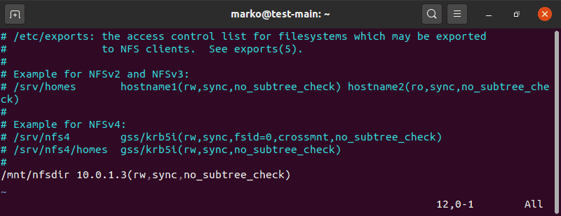
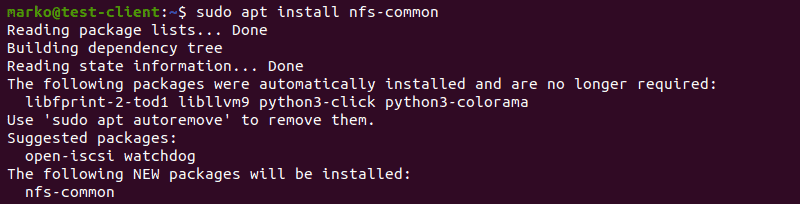
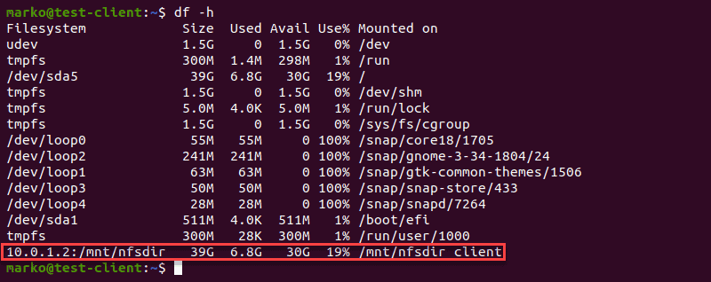
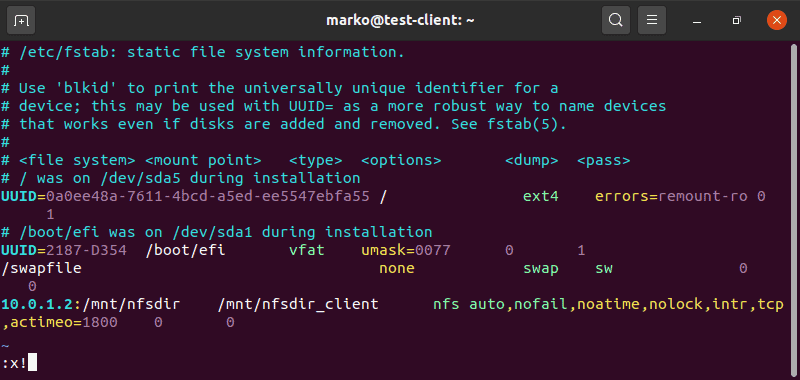

# Установка NFS-сервера в Ubuntu


Ссылка на оригинальную статью: [Install NFS Server on Ubuntu](https://phoenixnap.com/kb/ubuntu-nfs-server)

Опубликовано: 10 ноября 2020

Автор: Marko Aleksic


## Введение

Сетевая файловая система (NFS) — это файловая система, которая обеспечивает локальный доступ к удаленным файлам из нескольких мест в сети. Для этого доступа NFS использует стандартную архитектуру клиент/сервер, поддерживающую совместное использование компьютеров Linux независимо от их распространения.

В этом руководстве вы узнаете, как установить и настроить сервер и клиенты NFS в Ubuntu.

<figure><figcaption></figcaption></figure>

## Предварительные условия

* Две или более машины Ubuntu
* Доступ к командной строке/терминалу
* [Привилегии Sudo](https://phoenixnap.com/kb/linux-sudo-command) на всех машинах


Закончив изучение этого руководства, вы также можете посетить наше руководство по [томам NFS Docker](https://phoenixnap.com/kb/nfs-docker-volumes), чтобы узнать, как их создавать и использовать.


## Настройка стороны хоста NFS

Шаги этого руководства охватывают установку и настройку NFS в Ubuntu и других дистрибутивах на основе Debian. Другие дистрибутивы Linux, такие как Fedora и CentOS/RHEL, имеют немного другой синтаксис команд. Однако процесс происходит по той же схеме.

### Установка сервера ядра NFS

Начните настройку NFS с выбора хост-машины.

Затем обновите репозиторий пакетов:

```bash
sudo apt update
```

Затем установите сервер ядра NFS на выбранную вами машину с помощью следующей команды:

```bash
sudo apt install nfs-kernel-server
```

<figure><figcaption></figcaption></figure>

Введите «y» и нажмите ENTER, чтобы начать установку.

### Настройка общего каталога

На хост-компьютере создайте каталог, которым вы хотите поделиться с клиентской системой. Выберите любое имя, какое захотите.

```bash
sudo mkdir -p /mnt/nfsdir
```

Измените пользователя и группу владельца на none и nogroup. Этот параметр делает папку общедоступной:

```bash
sudo chown nobody:nogroup /mnt/nfsdir
```

Установите права доступа 777, чтобы каждый мог читать, записывать и выполнять файлы в этой папке:

```bash
sudo chmod 777 /mnt/nfsdir
```

### Отредактируйте файл экспорта NFS, чтобы предоставить клиентам доступ к серверу

Разрешение на доступ к компьютеру хост-сервера предоставляется в файле exports, расположенном в каталоге `/etc`. Откройте файл в [текстовом редакторе по вашему выбору](https://phoenixnap.com/kb/best-linux-text-editors-for-coding), в этом уроке используется Vi:

```bash
sudo vi /etc/exports
```

Для каждого клиента, которому вы хотите предоставить доступ, добавьте в файл следующую строку: `/mnt/nfsdir clientIP (rw, sync, no_subtree_check)`

<figure><figcaption></figcaption></figure>

Выйдите из файла и сохраните изменения


**Совет**: Если вам нужно добавить больше клиентов в той же подсети, введите: `/mnt/nfsdir subnetIP/24(rw,sync,no_subtree_check)`


Опции в скобках имеют следующие функции:

* Опция "rw" предоставляет клиентам доступ на чтение и [запись](https://phoenixnap.com/glossary/write-access) к каталогам на сервере.
* "sync" заставляет NFS записывать изменения перед ответом клиенту. Эта опция гарантирует, что состояние хоста будет точно представлено клиентам.
* "no\_subtree\_check" отключает проверку поддерева. Процесс поддерева может вызвать проблемы, когда пользователи переименовывают файлы.

### Экспорт общего каталога

После внесения необходимых изменений в файл `/etc/exports` используйте команду exportfs для экспорта всех общих каталогов, которые вы зарегистрировали в этом файле:

```bash
sudo exportfs -a
```

Затем перезапустите сервер ядра NFS, чтобы применить изменения в конфигурации:

```bash
sudo systemctl restart nfs-kernel-server
```

Если вы используете UFW, вам необходимо разрешить клиентам доступ к серверу:

```bash
sudo ufw allow from [clientIP or clientSubnetIP] to any port nfs
```

Вывод подтверждает добавление IP-адреса:

<figure><figcaption></figcaption></figure>

Чтобы убедиться, что вы успешно завершили операцию, введите:

```bash
sudo ufw status
```

Найдите в выводе добавленный вами IP-адрес:

<figure><figcaption></figcaption></figure>

## Настройка клиентской части NFS

Выполните следующие шаги на всех компьютерах, которые вы хотите настроить в качестве клиентов для общего доступа.

### Установить NFS Common

Чтобы включить NFS на клиентских машинах, установите общий пакет NFS:

```bash
sudo apt update
```

```bash
sudo apt install nfs-common
```

<figure><figcaption></figcaption></figure>

Введите «y» и нажмите ENTER, чтобы начать установку.

### Настройка точки монтирования

Клиентскому компьютеру необходима точка монтирования для общего каталога, экспортированного сервером.

Создайте каталог, набрав:

```bash
sudo mkdir -p /mnt/nfsdir_client
```

Чтобы смонтировать общий каталог в точке монтирования, используйте следующую команду:

```bash
sudo mount host_IP:/mnt/nfsdir /mnt/nfsdir_client
```

Используйте команду `df -h`, чтобы проверить, успешно ли вы смонтировали папку:

<figure><figcaption></figcaption></figure>

Если общая папка вам больше не нужна, отключите ее, набрав:

```bash
sudo umount /mnt/nfsdir_client
```


Правильная команда — umount, а не "unmount".


### Монтирование общих каталогов NFS при загрузке ОС

Если вы хотите, чтобы папки оставались подключенными даже после перезагрузки компьютера, вам необходимо добавить их в файл `/etc/fstab`.

Чтобы отредактировать файл `/etc/fstab`, введите:

```bash
sudo vim /etc/fstab
```

Скопируйте следующую строку в конец файла, заменив "host\_IP" фактическим IP-адресом хоста:

```ini
host_IP:/mnt/nfsdir /mnt/nsfdir_client nfs auto,nofail,noatime,nolock,intr,tcp,actimeo=1800 0 0
```

<figure><figcaption></figcaption></figure>

Добавьте эту строку для каждой нужной вам папки. Таким образом, все папки в списке будут автоматически монтироваться при каждой загрузке.

## Заключение

NFS часто является лучшим решением для удаленного доступа к данным. Его легко настроить, и он хорошо работает, особенно в сценариях с небольшими сетями.

Прочитав эту статью, вы сможете настроить сеть NFS на своих компьютерах с Ubuntu как на стороне сервера, так и на стороне клиента.
