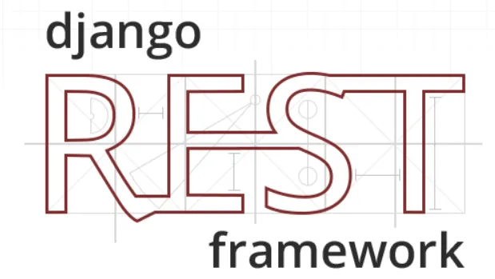

# Проверка запросов и обработка пользовательских исключений в DRF


Ссылка на оригинальную статью: [Request Validation and Custom Exception Handling in Django Rest Framework](https://medium.com/turkcell/request-validation-and-custom-exception-handling-in-django-rest-framework-649fddecb415)

Опубликовано: 23 сентября 2022

Автор: [Fatih Koprucu](https://medium.com/@fatih.koprucu?source=post\_page-----649fddecb415--------------------------------)


<figure><figcaption></figcaption></figure>

Ошибаться может каждый, даже клиенты REST API. Если вы разработчик, вы должны учитывать вероятные ошибки и подготовить свой код для правильного уведомления клиента. Нам нужно определить ожидаемый запрос, и если клиент отправляет какие-либо недопустимые данные, ответ API должен быть информативным в соответствии с ошибкой.

Вы можете найти код [здесь](https://github.com/fatopato/CustomerManagementAPI).

Также, если вы хотите протестировать API, вы можете найти коллекцию **Postman** [здесь](https://www.getpostman.com/collections/ec53c5e2096eedd8a677).

Давайте создадим простой REST API с помощью Django Rest Framework (DRF).

## Что делает этот REST API?

Это очень простой API, у нас есть только одна модель клиента **Customer**, и мы выполняем операции CRUD в этой модели.

### Модель

Модель — это то, как вы храните информацию об объекте в базе данных. Итак, вы можете себе представить, что мы в основном определяем типы и свойства столбцов таблицы **Customer**.

Модель Customer здесь:

```python
from django.db import models

CUSTOMER_TYPES = (("INDIVIDUAL", "INDIVIDUAL"),
                 ("CORPORATE", "INDIVIDUAL"))


class Customer(models.Model):
    id = models.AutoField(primary_key=True)
    notification_email = models.CharField(max_length=100, default="a@gmail.com")
    customer_type = models.CharField(
        choices=CUSTOMER_TYPES, default="INDIVIDUAL", max_length=20
    )

    def __str__(self):
        return self.notification_email
```

Поле **id** автоматически генерируется Django ORM, поэтому его не нужно устанавливать перед сохранением процесса. Формат уведомления (_Notification Email_) по электронной почте должен соответствовать обычному формату электронной почты. Так что это нужно проверить перед сохранением. Поле **CustomerType** можно рассматривать как **Enum** (как в Java), которое может быть только INDIVIDUAL или CORPORATE.

### Сериализатор

Вы можете представлять свои сложные структуры данных с помощью сериализатора. Как следует из названия, он может сериализовать данные в распространенные форматы, такие как JSON, и десериализовать JSON, как входные данные для объектов Python.

Я создал класс **CustomerSerializer**, который наследуется от **ModelSerializer**. Если вы укажете модель и представленные поля, он выполнит остальные операции за вас.

```python
from rest_framework import serializers
from .models import Customer

class CustomerSerializer(serializers.ModelSerializer):

    class Meta:
        model = Customer
        fields = ["id", "notification_email", "customer_type"]
```

### Представления (вьюхи)

В Django Rest Framework есть много красивых универсальных представлений API, которые помогут вам быстро писать код. Например, если вы расширяете свое представление из **RetrieveUpdateDestroyAPIView**, вы можете напрямую сопоставлять свои запросы с параметром **id**. Например, вы можете обрабатывать запросы **GET**, **PUT**, **DELETE**, которые приходят к `«/customer/<id>»`, просто создавая представление, расширяющее **RetrieveUpdateDestroyAPIView**. Как следует из его названия, вы можете выполнять с ним операции **getById**, **updateById** и **deleteById**.

Точно так же, если вы расширяете свое представление из **ListCreateAPIView**, вы можете обрабатывать запросы **GET** и **POST**, поступающие в `«/customer/»`. Просто вы можете представить **getAll** и операции сохранения **save**…

Дополнительную информацию об общих представлениях можно найти [здесь](https://www.django-rest-framework.org/api-guide/generic-views/#generic-views).

```python
from rest_framework.generics import (
    CreateAPIView, ListAPIView, ListCreateAPIView,
    RetrieveUpdateDestroyAPIView
)

from .models import Customer
from .serializers import CustomerSerializer

class CustomerRetrieveUpdateDeleteAPIView(RetrieveUpdateDestroyAPIView):

    queryset = Customer.objects.all()
    serializer_class = CustomerSerializer


class CustomerListCreateAPIView(ListCreateAPIView):

    queryset = Customer.objects.all()
    serializer_class = CustomerSerializer
```

### URL-адреса

Мы можем сделать сопоставление запросов в `urls.py`. Если вы знакомы с Spring Boot, вы можете рассмотреть, как контроллер сопоставляет запрос в соответствии с путем.

```python
from django.urls import path, include
from .views import CustomerListCreateAPIView, CustomerRetrieveUpdateDeleteAPIView

urlpatterns = [
    path('', CustomerListCreateAPIView.as_view()),
    path('<int:pk>/', CustomerRetrieveUpdateDeleteAPIView.as_view()),
]
```

## Действие

До сих пор это был простой REST API без какой-либо проверки. Но нам нужно проверить входные данные запроса клиента, чтобы получить необходимую информацию.

Мне нужно 3 типа проверки: во-первых, **id** должен быть нулевым во время сохранения. Во-вторых, **notification\_email** должно соответствовать шаблону электронной почты. Наконец, **notification\_email** должен быть уникальным вместе с **customer\_type**. Это означает, что если есть какая-либо запись клиента с таким же **notificaton\_email** и **customer\_type**, вы не можете создать новую запись.

Начнем проверку и обработку особых исключений…

### Шаг 1. Создайте настраиваемые исключения

Чтобы использовать ваше пользовательское исключение, вы должны расширить его из **APIException**. Поэтому я создал базовое пользовательское исключение: **BaseCustomerException** расширяется от **APIException**. Поле сведений для сообщения **message** об исключении и **status\_code** для HTTP-статуса ответа.

```python
from rest_framework import status
from rest_framework.exceptions import APIException


class BaseCustomException(APIException):
    detail = None
    status_code = None

    def __init__(self, detail, code):
        super().__init__(detail, code)
        self.detail = detail
        self.status_code = code
```

Мне нужно создать исключение, когда идентификатор **id** клиента не равен нулю, а **notification\_email** недействительно во время сохранения. Поэтому я создал **InvalidCustomerRequestException**:

```python
class InvalidCustomerRequestException(BaseCustomException):

    def __init__(self, detail):
        super().__init__(detail, status.HTTP_400_BAD_REQUEST)
```

Как видите, он принимает только один аргумент: **detail**, который будет использоваться в качестве сообщения об исключении. Если возникнет это исключение, статус ответа HTTP будет **400 (BAD\_REQUEST)**.

Я хочу создать еще одно исключение, которое будет использоваться, когда **notification\_email** уже используется с тем же **customer\_type**. Так и будет: **NotificationEmailAlreadyExistsException**

```python
class NotificationEmailAlreadyExistsException(BaseCustomException):

    def __init__(self):
        detail = "Notification email has already used with the customer type"
        super().__init__(detail, status.HTTP_409_CONFLICT)
```

Это исключение не принимает никаких аргументов, потому что подробное сообщение фиксировано, а статус ответа будет **409 (CONFLICT)**.

Что ж, мы создали исключения, но недостаточно использовать их в нашем API. Нам нужно определить обработчик исключений для обработки и сопоставления ответов.

### Шаг 2: Создайте обработчик исключений

В Django Rest Framework уже есть обработчик исключений. Поскольку у нас есть собственные исключения, мы можем определить новый обработчик для управления поведением. Я хочу изменить ответ API при возникновении исключения. Итак, вот мой собственный обработчик исключений:

```python
from rest_framework.views import exception_handler
from datetime import datetime


def custom_exception_handler(exc, context):
    response = exception_handler(exc, context)

    if response is not None:
        response.data['message'] = response.data['detail']
        response.data['time'] = datetime.now()
        del response.data['detail']
    return response
```

Что я здесь делаю? Я использую обработчик исключений rest фреймворка, чтобы получить ответ обработчика. Как я уже сказал, я хочу изменить ответ при возникновении исключения. Поэтому я создаю поле с именем сообщение и устанавливаю его значение как деталь из исключения. Кроме того, я добавляю поле времени, чтобы поделиться временем исключения. Затем я удалю поле сведений из ответа, потому что у нас уже есть поле сообщения.

Поэтому мой ответ будет выглядеть так:

```json
{
    "message": "Notification email has already used with the customer type",
    "time": "2022-09-23T15:52:37.790723"
}
```

Помните, что свойство сообщения **message** исходит из поля **detail** нашего пользовательского исключения.

### Шаг 3. Укажите обработчик исключений в настройках

Теперь пришло время сообщить приложению, чтобы оно использовало ваш обработчик исключений для rest фреймворка.

Вы должны определить значение **EXCEPTION\_HANDLER** в `settings.py`, например:

`<your_app_name>.<path_to_exception_handler_method>`

Итак, имя моего приложения — **customerapp**, и я поместил его в файл **utils**, поэтому я определил его в `settings.py`, как показано ниже:

```python
REST_FRAMEWORK = {
    'EXCEPTION_HANDLER': 'customerapp.utils.custom_exception_handler'
}
```

После того, как вы выполнили этот шаг, Django использует ваш собственный обработчик исключений для остальных операций фреймворка.

### Шаг 4: Проверка и создание исключений

Мы готовы использовать наши исключения. Я проверю запрос на этапе сериализации. Итак, давайте определим метод проверки для управления нашим запросом:

```python
from rest_framework import serializers
from .models import Customer


class CustomerSerializer(serializers.ModelSerializer):

    def validate(self, data):
        #validations
        
        return data

    class Meta:
        model = Customer
        fields = ["id", "notification_email", "customer_type"]
```

#### Валидация id

Для первой проверки я хочу проверить свойство **id** запроса. Если **id** не нулевой, сгенерируйте **InvalidCustomerRequestException**:

```python
class CustomerSerializer(serializers.ModelSerializer):

    def validate(self, data):
        
        # id validation
        if "id" in data.keys():
            raise InvalidCustomerRequestException(
                "Customer ID must be null while saving"
            )
```

#### Валидация notification\_email

Мне нужно проверить шаблон электронной почты с помощью регулярного выражения. Если формат электронной почты недействителен, снова вызовите **InvalidCustomerRequestException** с другим сообщением:

```python
import re

EMAIL_REGEX = r'\b[A-Za-z0-9._%+-]+@[A-Za-z0-9.-]+\.[A-Z|a-z]{2,}\b'

class CustomerSerializer(serializers.ModelSerializer):

    def validate(self, data):
    
        # id validation
        if "id" in data.keys():
            raise InvalidCustomerRequestException(
                "Customer ID must be null while saving"
            )

        # email validation
        if not re.fullmatch(EMAIL_REGEX, data["notification_email"]):
            raise InvalidCustomerRequestException("Notification email is not valid")
```

#### Валидация notification\_email и customer\_type как уникальных вместе

Затем я могу контролировать, существует ли уведомление **notification\_email** по электронной почте с таким же типом клиента **customer\_type**. Если он уже существует, создайте исключение **NotificationEmailAlreadyExistsException**.

```python
import re

EMAIL_REGEX = r'\b[A-Za-z0-9._%+-]+@[A-Za-z0-9.-]+\.[A-Z|a-z]{2,}\b'

class CustomerSerializer(serializers.ModelSerializer):

    def validate(self, data):
    
        # id validation
        if "id" in data.keys():
            raise InvalidCustomerRequestException(
                "Customer ID must be null while saving"
            )

        # email validation
        if not re.fullmatch(EMAIL_REGEX, data["notification_email"]):
            raise InvalidCustomerRequestException("Notification email is not valid")
            
        # notification_email uniqueness validation
        if Customer.objects.filter(notification_email=data['notification_email'],
                                     customer_type=data['customer_type']).exists():
            raise NotificationEmailAlreadyExistsException()
```

Окончательная версия `serializer.py` выглядит так:

```python
from rest_framework import serializers
from .models import Customer
import re
from .api_exceptions import (
    NotificationEmailAlreadyExistsException, InvalidCustomerRequestException
)

EMAIL_REGEX = r'\b[A-Za-z0-9._%+-]+@[A-Za-z0-9.-]+\.[A-Z|a-z]{2,}\b'


class CustomerSerializer(serializers.ModelSerializer):

    def validate(self, data):

        # id validation
        if "id" in data.keys():
            raise InvalidCustomerRequestException(
                "Customer ID must be null while saving"
            )

        # notification_email validation
        if not re.fullmatch(EMAIL_REGEX, data["notification_email"]):
            raise InvalidCustomerRequestException("Notification email is not valid")

        # notification_email uniqueness validation
        if Customer.objects.filter(notification_email=data['notification_email'],
                                     customer_type=data['customer_type']).exists():
            raise NotificationEmailAlreadyExistsException()

        else:
            return data

    class Meta:
        model = Customer
        fields = ["id", "notification_email", "customer_type"]
        extra_kwargs = {'id': {'read_only': False, 'required': False}}
```

## Заключительные слова

Если вы дожили до этого момента, я благодарю вас за чтение :)

Как я уже говорил, вы можете найти код [здесь](https://github.com/fatopato/CustomerManagementAPI) и коллекцию Postman [здесь](https://www.getpostman.com/collections/ec53c5e2096eedd8a677). Я попытался дать общее представление о проверке и пользовательских исключениях в Django REST Framework. Надеюсь, вам понравилось.

Ваше здоровье :)
