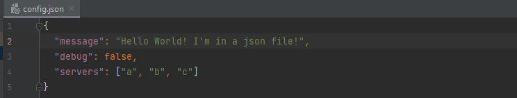

# Динамическая настройка приложений Python — FastAPI Pro (часть 1)


Ссылка на оригинальную статью: [Dynamically configure Python Apps - FastAPI Pro (Part 1)](https://www.vidavolta.io/dynamically-configure-python-apps-fastapi/)

Опубликовано: 10 июня 2023

Авторы: [**VidaVolta**](https://www.vidavolta.io/author/vidavolta/)


<figure><figcaption></figcaption></figure>

**Хватит возиться с переменными среды — сейчас не 1997 год.**

> Это первая часть нашей серии FastAPI Pro. Подпишитесь на нашу рассылку, чтобы оставаться в курсе.

Подобно [аду Данте](https://en.wikipedia.org/wiki/Inferno\_\(Dante\)?ref=vidavolta.io), каждый разработчик в какой-то момент развивал свою программу через множество уровней конфигурационного ада. Локальные переменные, глобальные переменные, переменные среды, файлы переменных среды, переменные, указывающие на разные файлы переменных среды. Это может быть... неудобно.

> Настройка приложения — это скорее искусство, чем наука: она существует на стыке человека и машины — интерфейс, с помощью которого вы можете настроить свое творение.

Однако давайте не будем слишком вычурными: в конечном итоге мы просто хотим не быть ограниченными нашим методом настройки (_кхе_ переменные среды _кхе_), а также мы хотим, чтобы было легко и безопасно изменять нашу конфигурацию во время выполнения.

> Существует решение, отвечающее этим критериям — динамически загружаемая конфигурация JSON.

Ух ты, как повезло, это именно то, что мы строим сегодня. Если вам просто нужен пример кода, посетите репозиторий.

## Кому следует это прочитать?

Любой, кто создает приложения Python и хочет иметь простой и удобный способ динамической настройки своего приложения. Сегодня мы будем создавать веб-сервер [FastAPI](https://fastapi.tiangolo.com/tutorial/first-steps/?ref=vidavolta.io), но аналогичные методы применимы к любому приложению Python.

## А как насчет [DynaConf](https://www.dynaconf.com/?ref=vidavolta.io)?

Это еще один способ достижения нашей цели — хотя в этой реализации вы увидите, что в нем вряд ли есть необходимость — сложность реализации минимальна.

## FastAPI HelloWorld

Итак, начнем с нашего минимального приложения — здесь нет ничего особенного. Если вы новичок в FastAPI и не понимаете этот фрагмент кода, прочитайте это [краткое руководство](https://fastapi.tiangolo.com/tutorial/first-steps/?ref=vidavolta.io) (займет всего пару минут).

<figure><figcaption></figcaption></figure>

Запускаем с помощью uvicorn: `"uvicorn main:app --port 8080"`. Обратите внимание, что мы не указываем флаг `"--reload"` — это параметр отладки, который перезагружает ваше приложение при изменениях путем его перезапуска — но нам нужна более готовая к работе настройка, которая поддерживает работу приложения при перезагрузке конфигурации.

Мы можем запрашивать наш молодой API, как и любой другой.

<figure><figcaption></figcaption></figure>

## Выбор формата конфигурации

Здесь вам нужно проявить немного самоуверенности. Может быть, вам нравится [.yaml](https://yaml.org/?ref=vidavolta.io), может быть, вам нравится [.toml](https://toml.io/en/?ref=vidavolta.io), может быть, вам нравятся [wingdings](https://lingojam.com/WingdingsTranslator?ref=vidavolta.io), вписанные в ваш жесткий диск, но я предпочитаю [JSON](https://www.json.org/json-en.html?ref=vidavolta.io). К счастью для вас, вы можете легко применить метод, который я вам покажу, к другим форматам данных (пробег может варьироваться в зависимости от изменений крыльев).

Мы просто предоставим некоторые базовые свойства конфигурации, которые могут потребоваться любому обычному приложению:

<figure><figcaption></figcaption></figure>

JSON удобен, потому что он позволяет представлять данные произвольной сложности и использовать несколько отличных библиотек. Нам, конечно, нужно будет представить конфигурацию нашего приложения в нашем коде, поэтому для этого мы определяем [класс данных](https://docs.python.org/3/library/dataclasses.html?ref=vidavolta.io) Config.

<figure><figcaption></figcaption></figure>

`"@dataclass(frozen=True)"` предоставляет нам хороший неизменяемый объект (он не предоставляет методов установки **setter**).

`"@dataclass_json"` предоставляет очень полезные методы `".to_json()"` и `".from_json()"`.

Посмотрите, насколько точно наш класс **Config** имитирует нашу конфигурацию JSON — потрясающе! И вы можете использовать всю мощь классов данных Python для проверки значений, сделать некоторые поля необязательными и многое другое.

## Загрузка конфигурации при запуске

Это довольно просто — просто определите путь к файлу конфигурации (статически в вашем приложении или через переменную среды) и загрузите его при запуске приложения.

<figure><figcaption></figcaption></figure>

Все, что мы здесь делаем, — это загружаем путь к нашему файлу конфигурации из старой доброй переменной среды и используем ее для чтения нашего файла в наш объект **Config**, используя вышеупомянутый вспомогательный метод `".from_json()"`. Давайте попробуем:

<figure><figcaption></figcaption></figure>

Хорошо, это здорово, но мы загружали нашу конфигурацию только при запуске, а это значит, что изменения, внесенные во время выполнения, ни на что не повлияют.

> На этом большинство уроков заканчиваются, но мы продолжим добиваться динамической загрузки конфигурации.

## Перезагрузка конфигурации во время выполнения

Разве не было бы здорово, если бы вы могли изменить конфигурацию, не перезапуская приложение, и изменения вступили бы в силу в вашем коде?

Ну, на самом деле это не так уж и сложно. Есть несколько способов решить эту проблему. Основная идея заключается в том, что вам нужна периодическая фоновая задача, которая будет перезагружать вашу конфигурацию. Однако необходимо решить пару быстрых проблем безопасности:

1. Если конфигурация недействительна, оставьте старую.
2. Не допускайте «частичных изменений». Представьте, что вы загружаете конфигурацию посередине между `"80"` и `"8080"` — вы можете загрузить `"808"`! в вашем приложении!

Второй вопрос обычно решается путем контроля того, как операторы могут изменять конфигурации (копировать конфигурацию, редактировать ее, затем `"mv"` перезаписывать существующую конфигурацию), поэтому мы не будем об этом здесь говорить.

Поскольку мы используем **FastAPI**, мы можем найти удобную утилиту, которая периодически выполняет фоновые задачи, но если бы мы разрабатывали приложения другого типа, мы могли бы выполнить нечто подобное с помощью [Celery](https://docs.celeryq.dev/en/stable/getting-started/introduction.html?ref=vidavolta.io) или [фонового потока](https://geo.rocks/post/run-a-thread-in-background-python-image-download/?ref=vidavolta.io).

Наша перезагрузка конфига выглядит так:

<figure><figcaption></figcaption></figure>

Это будет загружать нашу конфигурацию при запуске и впоследствии каждые 5 секунд. В случае неудачи мы просто регистрируем ошибку и продолжаем, сохраняя старую конфигурацию «загруженной» в нашем приложении.

Журналы наших приложений теперь демонстрируют, что происходит после запуска:

<figure><figcaption></figcaption></figure>

## Тестирование

Изменение недопустимой конфигурации не влияет на наше поведение во время выполнения:

<figure><figcaption></figcaption></figure>

С другой стороны, действительные изменения конфигурации автоматически перезагружаются, и мы можем видеть изменения в поведении нашего приложения:

<figure><figcaption></figcaption></figure>

## Заключение

На данный момент это все! Теперь у нас есть динамически настраиваемое веб-приложение. Чтобы проследить за этим, мы можем обобщить нашу фоновую задачу, чтобы реализовать это решение не только для веб-сервера FastAPI, но на сегодняшний день это выходит за рамки.

Если вам понравилась эта статья, вам понравится и другой контент с [веб-сайта VidaVolta](http://vidavolta.io/?ref=vidavolta.io) и [страницы Medium](https://vidavolta.medium.com/?ref=vidavolta.io), где содержатся статьи по темам разработки программного обеспечения.

Чтобы увидеть код, используемый в этой статье, посетите [репозиторий Github](https://github.com/adamcyber1/fastapi-dynamicconfig?ref=vidavolta.io).

## Рекомендации

* [https://fastapi.tiangolo.com/](https://fastapi.tiangolo.com/?ref=vidavolta.io)
* [https://github.com/dynaconf/dynaconf](https://github.com/dynaconf/dynaconf?ref=vidavolta.io)
* [https://johndanielraines.medium.com/write-a-better-config-py-1a443cf5bb36](https://johndanielraines.medium.com/write-a-better-config-py-1a443cf5bb36?ref=vidavolta.io)
* [https://github.com/celery/celery](https://github.com/celery/celery?ref=vidavolta.io)
* [https://betterdatascience.com/python-json-configuration-file/](https://betterdatascience.com/python-json-configuration-file/?ref=vidavolta.io)
* [https://fastapi-utils.davidmontague.xyz/user-guide/repeated-tasks/](https://fastapi-utils.davidmontague.xyz/user-guide/repeated-tasks/?ref=vidavolta.io)
