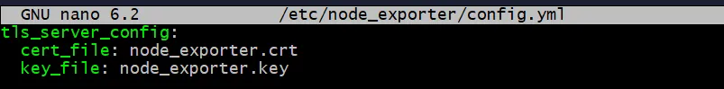
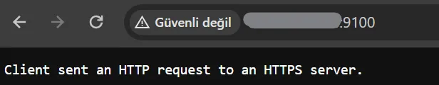
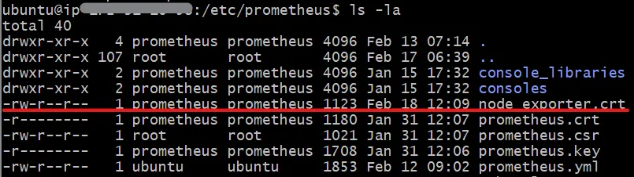
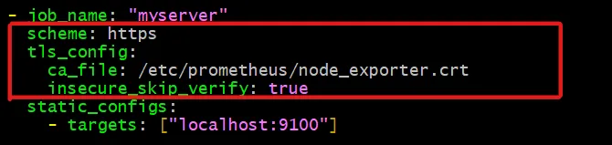
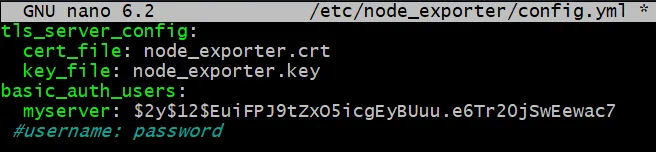
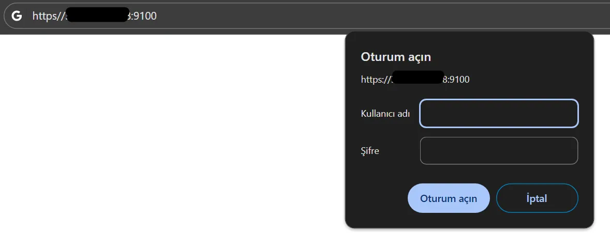
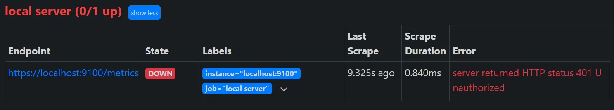
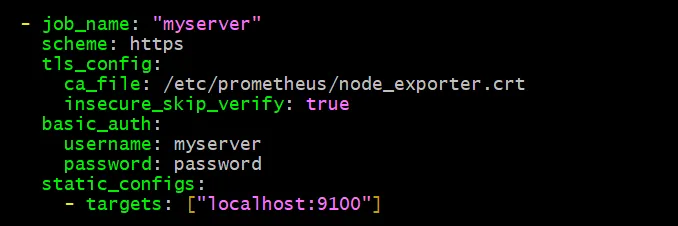
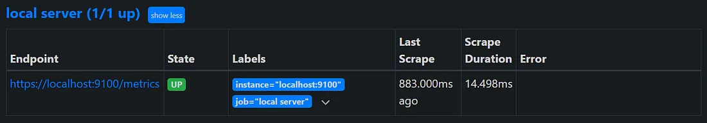

# Безопасность Node Exporter Prometheus


Ссылка на оригинальную статью: [Prometheus Node Exporter Security](https://medium.com/@abdullah.eid.2604/prometheus-node-exporter-security-9118f65a9f59)

Опубликовано: 14 февраля 2024

Авторы: [Abdullah Eid](https://medium.com/@abdullah.eid.2604?source=post\_page-----9118f65a9f59--------------------------------)


### Руководство по TLS и базовой настройке аутентификации Node Exporter

В сфере системного мониторинга и сбора метрик обеспечение безопасности передачи данных имеет первостепенное значение. В этой статье рассматривается настройка Transport Layer Security (TLS) и HTTPS для Prometheus Node Exporter, а также реализация базовой аутентификации. Эти меры имеют решающее значение для защиты целостности и конфиденциальности данных при их перемещении между Node Exporter и сервером Prometheus, обеспечивая существенный уровень безопасности от потенциального подслушивания или несанкционированного доступа.

Для целей данного руководства мы будем исходить из предположения, что Prometheus Node Exporter и сервер Prometheus уже установлены и работают на вашем компьютере. Эта базовая настройка имеет решающее значение, поскольку мы фокусируемся на усилении мер безопасности посредством настройки TLS/HTTPS и базовой аутентификации для защиты ваших данных мониторинга.

#### 1. Сгенерируйте 2048-битный закрытый ключ RSA, который используется для расшифровки трафика:

```bash
sudo openssl genrsa -out /etc/node_exporter/node_exporter.key 2048
```

#### 2. Создайте сертификат, используя закрытый ключ из предыдущего шага.

```bash
sudo openssl req -new -key /etc/node_exporter/node_exporter.key \
                      -out /etc/node_exporter/node_exporter.csr
```

При появлении запроса ответьте на вопросы, которые могут включать ваше полное доменное имя, адрес электронной почты, код страны и другие. Следующий пример аналогичен подсказкам, которые вы увидите.

```bash
You are about to be asked to enter information that will be incorporated
into your certificate request.
What you are about to enter is what is called a Distinguished Name or a DN.
There are quite a few fields but you can leave some blank
For some fields there will be a default value,
If you enter '.', the field will be left blank.
-----
Country Name (2 letter code) [AU]:US
State or Province Name (full name) [Some-State]:Virginia
Locality Name (eg, city) []:Richmond
Organization Name (eg, company) [Internet Pty Ltd]:
Organizational Unit Name (eg, section) []:
Common Name (e.g. server FQDN or YOUR name) []:subdomain.mysite.com
Email Address []:me@mysite.com

Please enter the following 'extra' attributes
to be sent with your certificate request
A challenge password []:
An optional company name []:
```

#### 3. Запустите следующую команду, чтобы самостоятельно подписать сертификат закрытым ключом на срок действия 365 дней.

```bash
sudo openssl x509 -req -days 365 \
             -in /etc/node_exporter/node_exporter.csr \
             -signkey /etc/node_exporter/node_exporter.key \
             -out /etc/node_exporter/node_exporter.crt
```

#### 4. Создайте файл `config.yml` с указанным ниже содержимым в том же каталоге.

<figure><figcaption></figcaption></figure>

```bash
sudo nano /etc/node_exporter/config.yml
```

```yaml
tls_server_config:
  cert_file: node_exporter.crt
  key_file: node_exporter.key
```

#### 5. Откройте файл `node_exporter.service`

```bash
sudo nano /etc/systemd/system/node_exporter.service
```

Добавьте эту строку, как показано в приведенном ниже коде.

```systemd
--web.config.file="/etc/node_exporter/config.yml"
```

```systemd
[Unit]
Description=Node Exporter
Wants=network-online.target
After=network-online.target
[Service]
ExecStart=/etc/node_exporter/node_exporter --web.config.file="/etc/node_exporter/config.yml"
Restart=always
[Install]
WantedBy=multi-user.target
```

#### 6. Перезагрузите демон и перезапустите Node Exporter.

```bash
sudo systemctl daemon-reload
```

```bash
sudo systemctl restart node_exporter
```

#### 7. Перейдите к `<SERVER_IP_ADDRESS>:9100`, если все в порядке, вы должны увидеть это.

<figure><figcaption></figcaption></figure>

### Теперь нам нужно обновить конфиги Prometheus, чтобы получать метрики от узлов с конечными точками HTTPS.

#### 1. Скопируйте файл `node_exporter.crt` с сервера экспорта узлов на сервер Prometheus в /etc/prometheus/.

#### 2. Обновите разрешение файла `node_exporter.crt`, чтобы Prometheus мог использовать

```bash
sudo chown prometheus:prometheus node_exporter.crt
```

<figure><figcaption></figcaption></figure>

#### 3. Обновите конфигурацию для конкретной цели со схемой, изменения tls в конфигурации Prometheus, как показано ниже.

```bash
sudo nano /etc/prometheus/prometheus.yml
```

```yaml
scheme: https
tls_config:
  ca_file: /etc/prometheus/node_exporter.crt
  insecure_skip_verify: true
```

<figure><figcaption></figcaption></figure>

### Настройка базовой аутентификации

#### 1. Установите apache2-utils

```bash
sudo apt-get update && sudo apt install apache2-utils -y
```

#### 2. Создайте хешированный пароль

```bash
htpasswd -nBC 12 "" | tr -d ':\n'
```

#### 3. Откройте `/etc/node_exporter/config.yml` и поместите в него свое имя пользователя и пароль.

```bash
sudo nano /etc/node_exporter/config.yml
```

```yaml
basic_auth_users:
    YOUR_USERNAME: <YOUR_PASSWORD>
   #other_username: its_password
   #...
```

<figure><figcaption></figcaption></figure>

#### 4. Перезапустите node\_exporter.

```bash
sudo systemctl restart node_exporter
```

<figure><figcaption></figcaption></figure>

Теперь, если вы перейдете к целям в своем Prometheus, вы должны увидеть это

<figure><figcaption></figcaption></figure>

#### 5. Откройте `/etc/prometheus/prometheus.yml` и измените его, как показано на изображении.

```bash
sudo nano /etc/prometheus/prometheus.yml
```

```yaml
basic_auth:
  username: <YOUR_USERNAME>
  password: <YOUR_PASSWORD>
```

<figure><figcaption></figcaption></figure>

#### 7. Перезапустите Prometheus

```bash
sudo systemctl restart prometheus
```

Теперь, если вы перейдете к targets в своем Prometheus, вы должны увидеть это

<figure><figcaption></figcaption></figure>
