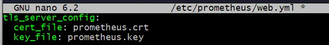
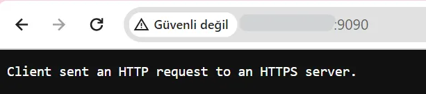
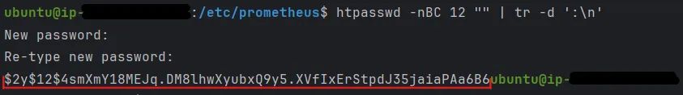
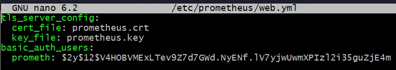
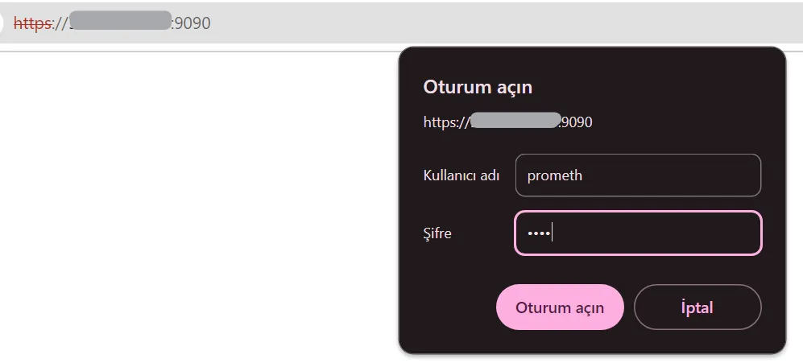
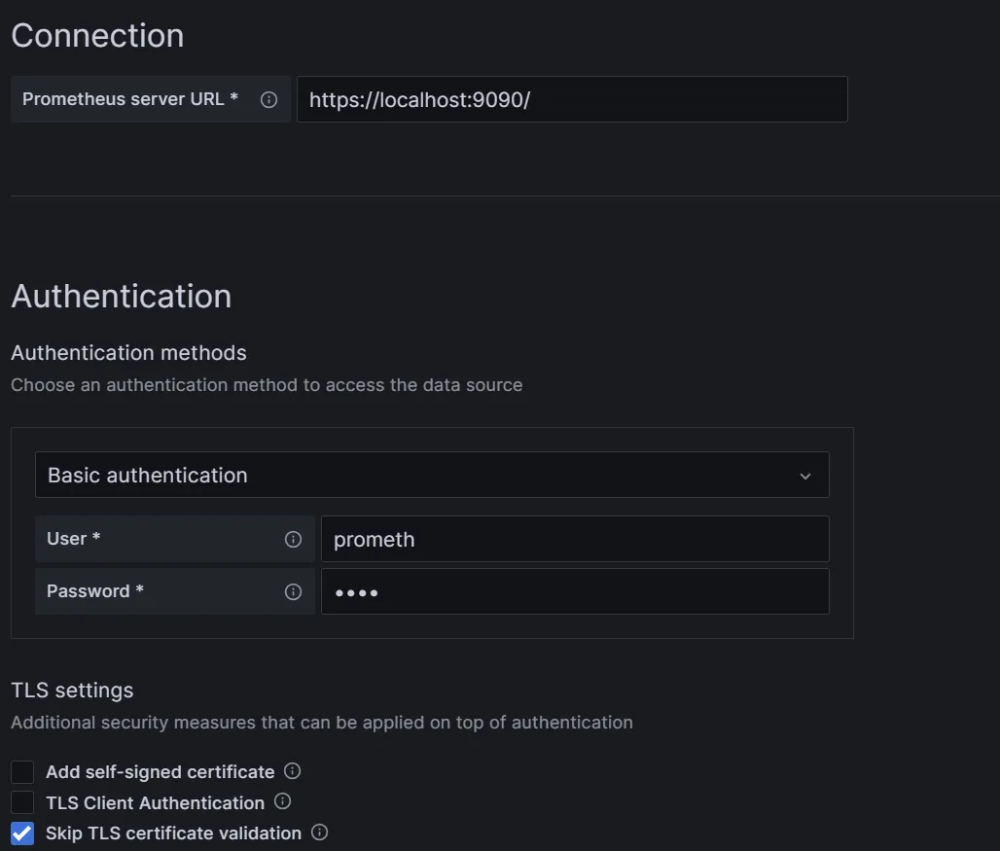

# Безопасность Prometheus


Ссылка на оригинальную статью: [Prometheus Security](https://medium.com/@abdullah.eid.2604/prometheus-security-c2652c32303d)

Опубликовано: 14 февраля 2024

Авторы: [Abdullah Eid](https://medium.com/@abdullah.eid.2604?source=post\_page-----9118f65a9f59--------------------------------)


### Руководство по TLS и базовой настройке аутентификации Prometheus

В критической ситуации мониторинга инфраструктуры невозможно переоценить безопасность Prometheus, краеугольного камня сбора метрик и оповещения. В этой статье рассматривается повышение уровня безопасности Prometheus за счет интеграции протоколов Transport Layer Security (TLS) и HTTPS, а также применения базовых механизмов аутентификации. Такие меры безопасности жизненно важны для защиты передачи конфиденциальных данных метрик и обеспечения строгого контроля доступа к веб-интерфейсу и API Prometheus. Внедряя эти функции безопасности, организации могут значительно снизить риск утечки данных и несанкционированного доступа, гарантируя, что данные мониторинга остаются конфиденциальными и целостность сохраняется на протяжении всего жизненного цикла данных. Этот стратегический подход к обеспечению безопасности Prometheus не только усиливает его роль в мониторинге системы, но и согласуется с лучшими практиками защиты цифровых активов во все более взаимосвязанной среде.

Для целей данного руководства мы будем исходить из предположения, что Prometheus и Grafana уже установлены и работают на вашем компьютере. Эта базовая настройка имеет решающее значение, поскольку мы фокусируемся на усилении мер безопасности посредством настройки TLS/HTTPS и базовой аутентификации для защиты ваших данных мониторинга.

#### 1. Сгенерируйте 2048-битный закрытый ключ RSA, который используется для расшифровки трафика:

```bash
sudo openssl genrsa -out /etc/prometheus/prometheus.key 2048
```

#### 2. Создайте сертификат, используя закрытый ключ из предыдущего шага

```bash
sudo openssl req -new \
             -key /etc/prometheus/prometheus.key \
             -out /etc/prometheus/prometheus.csr
```

При появлении запроса ответьте на вопросы, которые могут включать ваше полное доменное имя, адрес электронной почты, код страны и другие. Следующий пример аналогичен подсказкам, которые вы увидите.

```bash
You are about to be asked to enter information that will be incorporated
into your certificate request.
What you are about to enter is what is called a Distinguished Name or a DN.
There are quite a few fields but you can leave some blank
For some fields there will be a default value,
If you enter '.', the field will be left blank.
-----
Country Name (2 letter code) [AU]:US
State or Province Name (full name) [Some-State]:Virginia
Locality Name (eg, city) []:Richmond
Organization Name (eg, company) [Internet Pty Ltd]:
Organizational Unit Name (eg, section) []:
Common Name (e.g. server FQDN or YOUR name) []:subdomain.mysite.com
Email Address []:me@mysite.com
Please enter the following 'extra' attributes
to be sent with your certificate request
A challenge password []:
An optional company name []:
```

#### 3. Запустите следующую команду, чтобы самостоятельно подписать сертификат закрытым ключом на срок действия 365 дней

```bash
sudo openssl x509 -req -days 365 \
                  -in /etc/prometheus/prometheus.csr \
                  -signkey /etc/prometheus/prometheus.key \
                  -out /etc/prometheus/prometheus.crt
```

#### 4. Установите соответствующие разрешения для файлов

```bash
sudo chown prometheus:prometheus /etc/prometheus/prometheus.crt
sudo chown prometheus:prometheus /etc/prometheus/prometheus.key
sudo chmod 400 /etc/prometheus/prometheus.key /etc/prometheus/prometheus.crt
```

#### 5. Создайте файл `web.yml` с указанным ниже содержимым в том же каталоге.

<figure><figcaption></figcaption></figure>

```bash
sudo nano /etc/prometheus/web.yml
```

```yaml
tls_server_config:
  cert_file: prometheus.crt
  key_file: prometheus.key
```

#### 6. Открыть `prometheus.servicefile`

```bash
sudo nano /etc/systemd/system/prometheus.service
```

Добавьте эту строку, как показано в приведенном ниже коде.

```systemd
--web.config.file="/etc/prometheus/web.yml"
```

```systemd
[Unit]
Description=Prometheus
Wants=network-online.target
After=network-online.target

[Service]
User=prometheus
Group=prometheus
Type=simple
ExecStart=/usr/local/bin/prometheus \
 --config.file /etc/prometheus/prometheus.yml \
 --storage.tsdb.path /var/lib/prometheus/ \
 --web.console.templates=/etc/prometheus/consoles \
 --web.console.libraries=/etc/prometheus/console_libraries \
 --web.config.file=/etc/prometheus/web.yml

[Install]
WantedBy=multi-user.target
```

#### 7. Перезагрузите демон и перезапустите prometheus

```bash
sudo systemctl daemon-reload
```

```bash
sudo systemctl restart prometheus
```

#### 8. Перейдите к `<SERVER_IP_ADDRESS>:9090`, если все в порядке, вы должны увидеть это

<figure><figcaption></figcaption></figure>

На стороне Grafana просто измените `http://<SERVER_IP_ADDRESS>:9090` с `https://<SERVER_IP_ADDRESS>:9090`.

### Настройка базовой аутентификации

#### 1. Установите apache2-utils

```bash
sudo apt-get update && sudo apt install apache2-utils -y
```

#### 2. Создайте хешированный пароль

```bash
htpasswd -nBC 12 "" | tr -d ':\n'
```

<figure><figcaption></figcaption></figure>

#### 3. Откройте `/etc/prometheus/web.yml` и поместите в него свое имя пользователя и пароль

```bash
sudo nano /etc/prometheus/web.yml
```

```yaml
basic_auth_users:
    YOUR_USERNAME: <YOUR_PASSWORD>
   #other_username: its_password
   #...
```

<figure><figcaption></figcaption></figure>

#### 4. Перезапустите prometheus

```bash
sudo systemctl restart prometheus
```

#### 5. Перейдите по адресу `https//:<SERVER_IP>:9090`. Если все в порядке, вы должны увидеть этот экран.

<figure><figcaption></figcaption></figure>

На стороне Grafana измените источник данных Prometheus, как показано ниже.

* Смените http на https
* Выберите `«Basic authentification»` и введите свое имя пользователя и пароль.
* Установите флажок `Skip TLS certificate validation` и сохраните источник данных.

<figure><figcaption></figcaption></figure>
