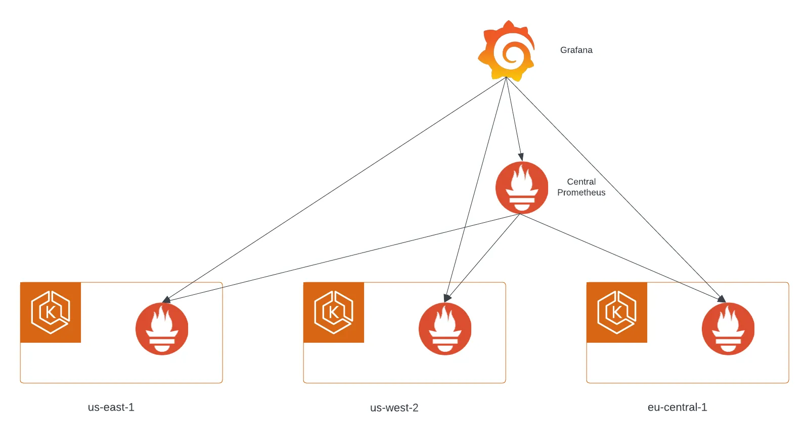

# Масштабирование мониторинга Kubernetes с помощью Prometheus Federation


Ссылка на оригинальную статью: [Scaling kubernetes monitoring with prometheus federation](https://medium.com/@alex.ivenin/scaling-kubernetes-monitoring-with-prometheus-federation-1d4e00b3c744)

Опубликовано: 4 апреля 2023

Авторы: [Alexandr Ivenin](https://medium.com/@alex.ivenin?source=post\_page-----1d4e00b3c744--------------------------------)


Prometheus — это система мониторинга и оповещения с открытым исходным кодом, которая широко используется в контейнерной экосистеме для мониторинга работоспособности и производительности приложений и инфраструктуры. Он обеспечивает мощный язык запросов, эффективное хранилище и множество возможностей интеграции с различными системами.

Одной из ключевых особенностей Prometheus является возможность объединения данных с нескольких серверов Prometheus, известная как Prometheus Federation. В этой статье мы рассмотрим, что такое Prometheus Federation, почему она важна и как ее настроить.

## Что такое Prometheus Federation?

Prometheus Federation — это возможность объединять метрики с нескольких серверов Prometheus на одном сервере. Это полезно, когда у вас есть несколько команд или организаций, использующих свои собственные серверы Prometheus, но вы хотите иметь глобальное представление всех показателей в одном месте. С помощью Prometheus Federation вы можете создать иерархию серверов Prometheus, где один сервер действует как шлюз для всех остальных и объединяет все показатели в одном представлении.

## Зачем использовать Prometheus Federation?

Есть несколько причин, по которым вы можете захотеть использовать Prometheus Federation:

1. Масштабируемость. По мере роста ваших потребностей в мониторинге вам может потребоваться масштабирование серверов Prometheus. С помощью Prometheus Federation вы можете создать иерархическую структуру, в которой каждый сервер отвечает за подмножество метрик.
2. Изоляция. В некоторых случаях вам может потребоваться изолировать метрики для разных команд или организаций. С помощью Prometheus Federation вы можете создавать отдельные серверы Prometheus для каждой команды, а затем объединять показатели на одном сервере для глобальной видимости.
3. Агрегация: Prometheus Federation позволяет объединять показатели из нескольких центров обработки данных или облачных провайдеров в единое представление, что упрощает мониторинг вашей инфраструктуры в целом.

## Архитектура Prometheus Federation с Kubernetes

<figure><figcaption></figcaption></figure>

Prometheus Federation — отличная функция, если вы хотите собирать метрики из множества кластеров Kubernetes в разных средах, регионах, облачных провайдерах и локальных развертываниях.

Типичная архитектура Prometheus Federation с одним центральным Prometheus и несколькими серверами Kubernetes Prometheus выглядит следующим образом:

* В каждом кластере Kubernetes есть сервер Prometheus, который собирает метрики со всех контейнеров и узлов в кластере.
* Центральный сервер Prometheus собирает метрики со всех серверов Kubernetes Prometheus и сохраняет их в своем локальном хранилище.
* Grafana, популярный инструмент визуализации, можно использовать для запроса и визуализации метрик, хранящихся на центральном сервере Prometheus и на каждом из серверов Kubernetes Prometheus.

Основное преимущество этого подхода заключается в том, что он позволяет создать распределенную систему мониторинга, в которой каждый кластер Kubernetes может иметь собственный сервер Prometheus, собирающий и хранящий метрики локально. Затем центральный сервер Prometheus собирает все метрики и сохраняет их в одном месте, что позволяет легко запрашивать и визуализировать метрики по всем кластерам.

Еще одним преимуществом этого подхода является то, что он позволяет устанавливать разные интервалы очистки для каждого сервера Prometheus в Kubernetes. Например, в некоторых кластерах могут быть более важные рабочие нагрузки, требующие более частого очистки, в то время как в других могут быть менее важные рабочие нагрузки, которые можно очищать реже.

Наконец, центральный сервер Prometheus также может выступать в качестве холодного хранилища исторических данных. Prometheus имеет ограниченный период хранения, по истечении которого старые данные автоматически удаляются. Сохраняя метрики на центральном сервере Prometheus, исторические данные можно сохранять в течение более длительных периодов времени.

## Как настроить Prometheus Federation?

Чтобы настроить Prometheus Federation, вам необходимо создать иерархическую структуру серверов Prometheus. Сервер верхнего уровня действует как сервер-шлюз и собирает показатели с серверов нижнего уровня.

Вот шаги по настройке Prometheus Federation:

### Шаг 1. Настройте сервер шлюза

Первым шагом является настройка сервера шлюза, который является сервером верхнего уровня, который собирает показатели с серверов нижнего уровня. Вам необходимо добавить серверы нижнего уровня в качестве целевых объектов в файле конфигурации сервера шлюза. Вот пример:

```yaml
global:
  scrape_interval: 15s
  external_labels:
    monitor: 'gateway'

scrape_configs:
  - job_name: 'gateway'
    scrape_interval: 15s
    honor_labels: true
    metrics_path: '/federate'
    params:
      'match[]':
        - '{job="app1"}'
        - '{job="app2"}'
        - '{job="app3"}'
    static_configs:
      - targets:
        - 'prometheus.cluster-1.domain.com:9090'
        - 'prometheus.cluster-2.domain.com:9090'
        - 'prometheus.cluster-3.domain.com:9090'
```

В этом примере сервер шлюза настроен на сбор метрик с серверов нижнего уровня (`prometheus.cluster-[1..3].domain.com:909`0), используя конечную точку `/federate`. В разделе params указывается, какие метрики следует очищать по имени задания (job).

### Шаг 2. Настройте серверы нижнего уровня.

Следующим шагом является настройка серверов нижнего уровня для предоставления своих метрик.

```yaml
scrape_configs:
  - job_name: 'app1'
    # Добавьте сюда обнаружение обычных служб
    static_configs:
      - targets: ['<exporter-ip>:<exporter-port>']
```

## Заключение

Prometheus Federation — мощный инструмент для масштабирования мониторинга Kubernetes путем агрегирования показателей из нескольких кластеров в разных средах, регионах и облачных провайдерах. Настроив центральный сервер Prometheus и настроив федерацию, вы можете легко собирать и визуализировать метрики со всех ваших кластеров Kubernetes в одном месте. Кроме того, вы можете использовать дополнительные объединенные кластеры Prometheus для хранения исторических данных и оптимизации использования ресурсов. С Prometheus Federation вы можете быть уверены, что ваш мониторинг Kubernetes масштабируется по мере роста вашей инфраструктуры и остается надежным и эффективным.
