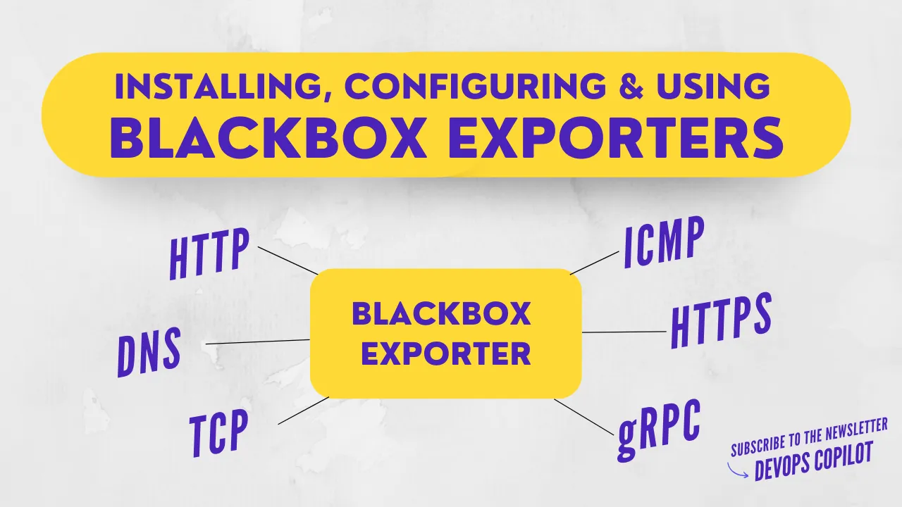
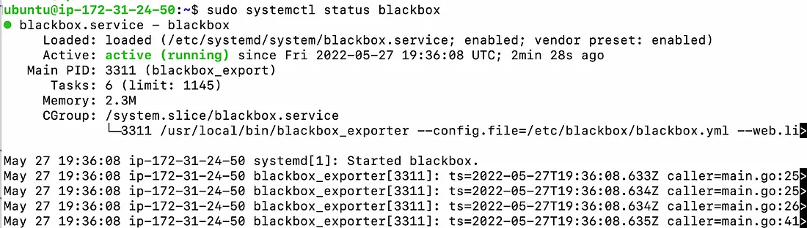
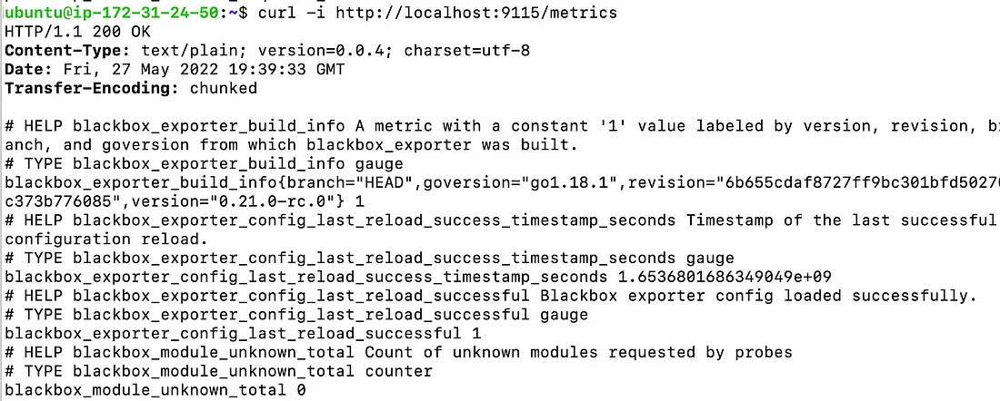
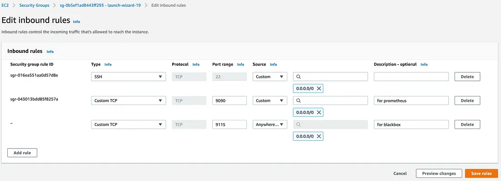
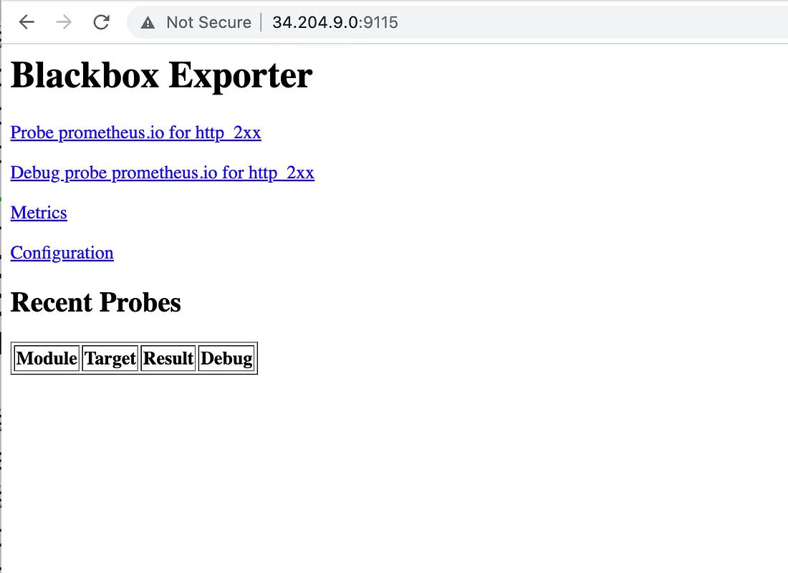
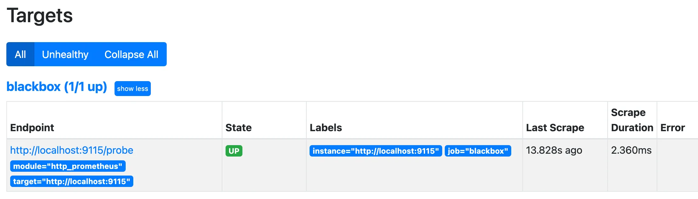

# Настройка стека мониторинга — Часть 4: Blackbox exporter


Ссылка на оригинальную статью: [Monitoring stack setup — Part 4: Blackbox exporter](https://shishirkh.medium.com/monitoring-stack-setup-part-4-blackbox-exporter-f7ba54d0ed99)

Опубликовано: 26 ноября 2022

Авторы: [Shishir Khandelwal](https://shishirkh.medium.com/?source=post_page-----f7ba54d0ed99--------------------------------)


<figure><figcaption></figcaption></figure>

В этой статье мы увидим следующее:

* Установка blackbox
* Настройка blackbox
* Концепции blackbox
* Отправка метрик в Prometheus для хранения метрик

## Blackbox exporters

Экспортер blackbox позволяет зондировать конечные точки по HTTP, HTTPS, DNS, TCP, ICMP и gRPC. Он предоставляет метрики задержек для HTTP-запросов и DNS, а также статистику об истечении срока действия сертификата SSL.

## Необходимость экспортеров blackbox

Можно удивиться, зачем нужен такой компонент, если разработчики могут добавлять аналогичные возможности мониторинга в код с помощью библиотек метрик.

Ответ заключается в том, что:

* Эти библиотеки, скорее всего, избыточны для базовых метрик, таких как время отклика или достижимость конечной точки, поскольку они обычно создаются, когда цель состоит в том, чтобы сделать доступными подробные метрики производительности.
* Приложения требуют изменения кода для использования библиотек. Поэтому, если у приложения раньше не было кода, его нужно будет переделать.

Вот почему экспортеры blackbox обычно используются в мониторинге стеков. Экспортер blackbox в основном используется для измерения времени отклика и доступности.

## Установка blackbox

#### 1. Добавляем пользователя blackbox

```bash
sudo useradd --no-create-home blackbox
```

#### 2. Загрузите и распакуйте двоичный файл Blackbox:

```bash
wget https://github.com/prometheus/blackbox_exporter/releases/download/v0.21.0-rc.0/blackbox_exporter-0.21.0-rc.0.linux-amd64.tar.gz
tar -xvf blackbox_exporter-0.21.0-rc.0.linux-amd64.tar.gz
sudo mkdir /etc/blackbox
```

#### 3. Скопируйте файлы из настроек blackbox:

```bash
sudo cp blackbox_exporter-0.21.0-rc.0.linux-amd64/blackbox_exporter /usr/local/bin/
sudo cp blackbox_exporter-0.21.0-rc.0.linux-amd64/blackbox.yml /etc/blackbox/
```

#### 4. Добавление контента в файл конфигурации blackbox

```bash
sudo vim /etc/blackbox/blackbox.yml
```

```yaml
---
modules:
  http_prometheus:
    prober: http
    timeout: 5s
    http:
      method: GET
      valid_http_versions: ["HTTP/1.1", "HTTP/2"]
      fail_if_ssl: false
      fail_if_not_ssl: false
```

#### 5. Предоставьте пользователю разрешение «blackbox» на доступ к файлу, используемому для запуска двоичного файла blackbox.

```bash
sudo chown blackbox:blackbox /usr/local/bin/blackbox_exporter
sudo chown -R blackbox:blackbox /etc/blackbox/*
```

#### 6. Добавьте конфигурации запуска blackbox в скрипт service.

Это позволит нам легко запускать, останавливать, перезапускать устройство и проверять его состояние.

```bash
sudo vim /etc/systemd/system/blackbox.service
```

```ini
[Unit]
Description=Blackbox
Wants=network-online.target
After=network-online.target

[Service]
User=blackbox
Group=blackbox
Type=simple
ExecStart=/usr/local/bin/blackbox_exporter --config.file=/etc/blackbox/blackbox.yml --web.listen-address="0.0.0.0:9115"

[Install]
WantedBy=multi-user.target
```

#### 7. Выполните следующую команду, чтобы добавить указанный выше сервисный модуль и запустить blackbox.

```bash
sudo systemctl daemon-reload
sudo systemctl enable blackbox
sudo systemctl start blackbox
sudo systemctl status blackbox
```

Установка завершена. Давайте протестируем blackbox.

## Тестирование blackbox

#### 1. Проверьте, запущен ли процесс или произошел сбой.

```bash
sudo systemctl status blackbox
```

<figure><figcaption></figcaption></figure>

#### 2. Здесь blackbox занимает порт 9115. Проверьте ответ.

```bash
curl http://localhost:9115/metrics
```

<figure><figcaption></figcaption></figure>

## Доступ к blackbox

Давайте откроем порт 9115 для доступа к пользовательскому интерфейсу: `http://<public-ip-address>:9115`

<figure><figcaption></figcaption></figure>

<figure><figcaption></figcaption></figure>

Пока все хорошо. Поздравляем с успешной установкой Blackbox.

Давайте теперь интегрируем Blackbox в Prometheus. Сначала мы разберемся с важными концепциями для создания фундамента на основе Blackbox, а затем настроим зонд с помощью экспортера Blackbox и отправим метрики зонда в Prometheus.

Чтобы настроить Prometheus, следуйте этому руководству — [https://medium.com/@shishirkh/monitoring-stack-setup-part-1-prometheus-grafana-372e5ae25402](https://medium.com/@shishirkh/monitoring-stack-setup-part-1-prometheus-grafana-372e5ae25402)&#x20;

## Настройка Blackbox с Prometheus

Чтобы понять, как Blackbox интегрируется с Prometheus, важно сначала понять еще несколько концепций, касающихся Blackbox, например:

* Модули
* Проверка конечных точек
* Перемаркировка

## Модули

Файл конфигурации экспортера черного ящика (`/etc/blackbox/blackbox.yml`) состоит из модулей **modules**. Модуль можно рассматривать как одну из многих конфигураций зондирования для экспортера blackbox.

Давайте разберемся, рассмотрев некоторые практические примеры.

### Пример 1

Если бы я создавал конфигурации для зондирования конечной точки HTTP, мне пришлось бы создать для нее модуль. Этот модуль включал бы такие вещи, как

* Коды статуса следует считать действительными. Обычно это 200, но вы также можете изменить его в соответствии с вариантом использования.
* Базовые конфигурации аутентификации, такие как имя пользователя и пароль, для доступа к конечной точке, если этого требует вариант использования.

### Пример 2

Если бы я создал конфигурацию для проверки конечной точки HTTPS, мне пришлось бы создать для нее еще один модуль. Этот модуль включал бы в себя другие вещи, например:

* Конфигурации для проверки действительности SSL, поскольку в этом случае проверка должна завершиться неудачей, если конечная точка не защищена.

Вот что вкратце означает «модули». Более подробную информацию об этих конфигурациях можно найти здесь — [https://github.com/prometheus/blackbox\_exporter/blob/master/CONFIGURATION.md](https://github.com/prometheus/blackbox_exporter/blob/master/CONFIGURATION.md)

## Проверка конечных точек (targets)

В экспортерах blackbox есть два способа запроса

1. Запрос метрик самого экспортера (сам по себе означает экспортер blackbox здесь). Обычно доступно в `/metrics`.
2. Запрос экспортера для скрапинга другой цели. Обычно доступно в `/probe`.

Нас больше интересует второй тип. Чтобы использовать второй тип, нам нужно предоставить:

* Target: Target указывает, «где» должно быть применено зондирование. Target — это адрес конечной точки, которую мы хотим зондировать.
* Module: Этот модуль будет определять, как будет работать зондирование. Модуль должен быть определен в конфигурации экспортера.

### Пример

Приведенный ниже curl проверяет цель `localhost:9090` с помощью спецификаций модуля http\_prometheus.

```bash
curl 'localhost:9115/probe?target=localhost:9090&module=http_prometheus'
```

Поскольку у нас есть Prometheus, работающий на 9090, и модуль «http\_prometheus», определенный ранее в `/etc/blackbox/blackbox.yml` — вы можете видеть из ответа, что проверка прошла успешно.

Ответ на curl выше

```
# HELP probe_success Displays whether or not the probe was a success
# TYPE probe_success gauge
probe_success 1
```

Мы также получаем множество полезных метрик, таких как задержка по фазам, код состояния, статус SSL или срок действия сертификата в формате Unix и т. д.

```
# HELP probe_http_duration_seconds Duration of http request by phase, summed over all redirects
# TYPE probe_http_duration_seconds gauge
probe_http_duration_seconds{phase="connect"} 0.000512049
probe_http_duration_seconds{phase="processing"} 0.002300611
probe_http_duration_seconds{phase="resolve"} 7.3717e-05
probe_http_duration_seconds{phase="tls"} 0
probe_http_duration_seconds{phase="transfer"} 0.000107346# HELP probe_http_status_code Response HTTP status code
# TYPE probe_http_status_code gauge
probe_http_status_code 200
```

## Перемаркировка

Когда Prometheus скрейпит цель, он назначает цели метки — эти метки помогают определить цель, например ее address, scrape\_interval и т.д.

### Пример

* Метка job цели устанавливается на значение job\_name соответствующей конфигурации скрейпа.
* Метка `__address__` устанавливается на адрес `<host>:<port>` цели.
* Метки `__scheme__` и `__metrics_path__` устанавливаются на схему и путь к метрикам цели соответственно.
* Метка `__param_<name>` устанавливается на значение первого переданного параметра URL с именем `<name>`.

Перемаркировка используется для динамической перезаписи набора меток на цели перед тем, как он будет очищен. Они применяются к набору меток на каждой цели в порядке их появления в файле конфигурации (`/etc/prometheus/prometheus.yml`)

Временные метки упрощают перемаркировку. Давайте посмотрим, как это сделать.

## Временные метки

Метки, начинающиеся с `__`, будут удалены из набора меток Prometheus после завершения перемаркировки цели.

_Если шагу перемаркировки необходимо сохранить значение метки только временно (в качестве входных данных для последующего шага перемаркировки), используйте префикс имени метки `__tmp`. Этот префикс гарантированно никогда не будет использоваться самим Prometheus._

Раздел relabel\_configs содержит новые правила перемаркировки.

#### Давайте разберемся с помощью примера.

```yaml
relabel_configs:
    - source_labels: [__address__]
      target_label: __param_target
    - source_labels: [__param_target]
      target_label: instance
    - target_label: __address__
      replacement: localhost:9115
```

Давайте посмотрим, что здесь происходит:

Первое:

```yaml
- source_labels: [__address__]
  target_label: __param_target
```

Здесь мы берем значение из метки `"__address__"` и присваиваем его метке `"__param_target"`.

Второе:

```yaml
- source_labels: [__param_target]
  target_label: instance
```

Затем мы берем значения из метки `"__param_target"` и создаем метку `"instance"` с этими значениями.

Третье:

```yaml
- target_label: __address__
  replacement: localhost:9115
```

Здесь значение `localhost:9115` (URI нашего экспортера) присваивается метке `__address__`.

## Интеграция Prometheus

Чтобы поручить Prometheus запросить `«localhost:9115/probe?target=localhost:9090&module=http_prometheus»`, нам нужно добавить конфигурацию в `prometheus.yml`.

**Но перед этим — попробуйте подумать, что этот запрос нам вернет. На самом деле, этот запрос запрашивает экспортер blackbox для выполнения проверки в соответствии с конфигурациями «http\_prometheus» на «localhost:9090».**

Мы определяем конечные точки, которые мы хотим проверить с помощью экспортера черного ящика, через файл конфигурации Prometheus — (`/etc/prometheus/prometheus.yml`)

### Пример

```yaml
scrape_configs:
  - job_name: 'prometheus'
    static_configs:
      - targets: ['localhost:9090']
  - job_name: 'blackbox'
    metrics_path: /probe
    params:
      module: [http_prometheus] //укажите здесь модуль, который будет использоваться
    static_configs:
      - targets:
        - http://localhost:9115    
    relabel_configs:
      - source_labels: [__address__]
        target_label: __param_target
      - source_labels: [__param_target]
        target_label: instance
      - target_label: __address__
        replacement: localhost:9115
```

Принцип работы заключается в том, что blackbox использует собственный файл конфигурации (`/etc/blackbox/blackbox.yml`) для определения различных модулей и зависит от файла конфигурации Prometheus для получения имени модуля, который будет использоваться для конкретной цели.

Наконец, чтобы увидеть, происходит ли зондирование blackbox на цели, перезапустите Prometheus и проверьте его пользовательский интерфейс.

```bash
sudo systemctl restart prometheus
```

<figure><figcaption></figcaption></figure>

Вот и все. У нас есть зондирование, происходящее на localhost:9115 с использованием экспортера blackbox. Используя ту же технику, мы можем настроить зондирование на любой конечной точке и отправить эти метрики в Prometheus.
