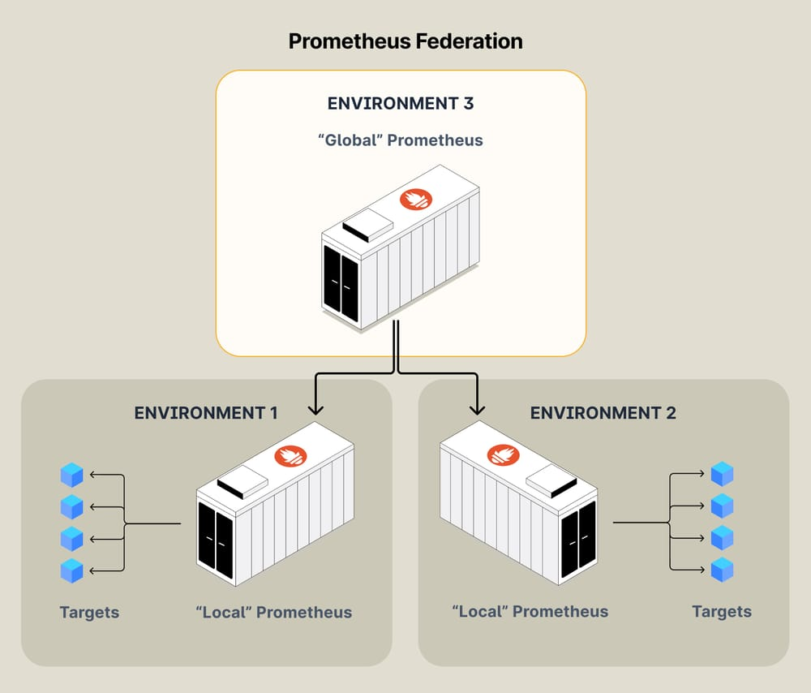

# Prometheus Federation ⏤ Руководство по масштабированию Prometheus


Ссылка на оригинальную статью: [Prometheus Federation ⏤ Scaling Prometheus Guide](https://last9.io/blog/prometheus-federation-guide/)

Опубликовано: 10 января 2024

Авторы: [Tripad Mishra](https://last9.io/blog/authors/tripad/)


В этой статье мы обсуждаем нюансы федерации в Prometheus, решаем ее проблемы и рассматриваем альтернативы.

## Что такое Prometheus Federation?

Федерация в Prometheus — это метод горизонтального масштабирования и управления крупномасштабными средами мониторинга. Он включает в себя настройку нескольких серверов Prometheus для сбора данных на разных уровнях или из разных сегментов вашей инфраструктуры, а затем их агрегирование на более высоком уровне для глобального просмотра.

<figure><figcaption><p>Пример Prometheus Federation</p></figcaption></figure>

Федерация необходима для эффективной работы со сложными и большими инфраструктурами, где одного экземпляра Prometheus будет недостаточно из-за нагрузки или географического распределения.

Стратегия федерации в Prometheus обычно требуется в крупномасштабных, географически распределенных средах или в средах со сложной инфраструктурой.

Сюда входят такие сценарии, как:

* **Операции с несколькими центрами обработки данных**. Организации, работающие в нескольких центрах обработки данных, нуждаются в агрегированных представлениях своих распределенных систем.
* **Крупные предприятия**: крупные предприятия с обширной инфраструктурой, где одного экземпляра Prometheus будет недостаточно из-за огромного объема данных.
* **Требования высокой доступности**: системы, требующие высокой доступности, где мониторинг должен быть устойчивым к сбоям отдельных экземпляров.
* **Сложные сервисные архитектуры**. Среды со сложной сервисной архитектурой, в которых конкретные межсервисные метрики необходимо агрегировать для комплексного обзора.
* **Мультикластерные архитектуры K8s**. Каждый кластер Kubernetes имеет свой собственный экземпляр Prometheus (так называемый «листовой» узел), который собирает метрики из этого конкретного кластера. Затем экземпляр Prometheus более высокого уровня, или «глобальный», используется для объединения данных из этих «листовых» узлов.

## Случаи использования, для которых Prometheus Federation НЕ является ответом:

### Полное дублирование метрик между двумя экземплярами

Передача больших объемов данных временных рядов через федерацию не идеальна, поскольку может значительно снизить производительность очистки и серверов Prometheus. Федерация не предназначена для создания резервной системы мониторинга с высокой доступностью. Типичный подход к настройке высокой доступности предполагает параллельную работу идентичных серверов Prometheus с репликацией конфигураций и целей.

### «Глобальное» оповещение или визуализация

Полагаться на интегрированный Prometheus для всех оповещений может быть проблематично из-за присущих ему задержек данных и потенциальной потери. Поскольку федерация включает в себя сбор данных через определенные промежутки времени, обычно возникает задержка в отображении самого последнего состояния показателей. Эта задержка может привести к пропущению или задержке оповещений. Кроме того, риск несогласованности данных или гонок в федеративной настройке может повлиять на надежность оповещений. В идеале оповещения должны располагаться как можно ближе к источнику данных, чтобы обеспечить быстрое и точное реагирование на изменения в системе.

### Задача метрик "High Cardinality"

Федерация не помогает обрабатывать метрики с [high cardinality](https://last9.io/blog/what-is-high-cardinality/). [Потоковая агрегация](https://docs.last9.io/docs/streaming-aggregations) от [Levitate](https://last9.io/levitate-tsdb/) — лучший ответ для управления метриками с high cardinality.

## Как настроить федерацию в Prometheus

В этом примере давайте рассмотрим центральный «глобальный» сервер Prometheus, собирающий метрики из двух разных экземпляров Prometheus:

```yaml
global:
  scrape_interval: 15s

scrape_configs:
  - job_name: 'global-view'
    honor_labels: true
    metrics_path: '/federate'
    params:
      'match[]':
        - '{job="app1-aggregate"}'
        - '{job="app2-aggregate"}'
    static_configs:
      - targets:
        - 'prom.domain1.com:9090'
        - 'prom.domain2.com:9090'
```

В приведенной выше конфигурации сервер "global-view" будет собирать метрики с экземпляров Prometheus `domain1.com` и `domain2.com` (используя конечную точку `/federate`).

Honor\_labels обычно устанавливается в конфигурации федерации, поскольку мы агрегируем данные из нескольких экземпляров Prometheus и хотим сохранить исходные метки из каждого исходного экземпляра для точной идентификации и различия в агрегированных данных.

## Надо быть внимательным.

### Дублирование метрик

Федерация Prometheus потенциально может привести к дублированию данных на центральном сервере, особенно если одни и те же метрики собираются из нескольких источников или конфигурация федерации перекрывается. Уникальные внешние метки, которые используются последовательно, могут помочь идентифицировать и дифференцировать показатели из разных источников, сокращая дублирование.

### Условия гонки

Условия гонки в федерации Prometheus могут возникнуть из-за времени сбоев. Поскольку федерация включает в себя очистку данных из различных экземпляров Prometheus через заданные интервалы времени, существует вероятность того, что некоторые данные могут не фиксироваться последовательно, если они меняют состояние между этими интервалами. Эта несогласованность может привести к пробелам или неточностям в агрегированных данных, особенно в быстро меняющихся показателях.

### Большие записи = тайм-ауты очистки и ошибка записи - сломанный канал

Некоторые потенциальные сценарии сбоев в федерациях Prometheus включают проблемы с сетью, приводящие к сбоям очистки и перегрузке центрального экземпляра Prometheus из-за извлечения слишком большого количества данных. Это приводит к превышению тайм-аута очистки, и обычно вы получаете ошибку записи — сломанный канал.

## Альтернативы Prometheus Federation

Thanos является альтернативой Prometheus Federation, поскольку он обеспечивает более масштабируемый и эффективный способ управления крупномасштабными развертываниями Prometheus. Thanos расширяет Prometheus, добавляя глобальное представление запросов, эффективное хранилище и межкластерное агрегирование данных.

Связанный пост — [Prometheus против Thanos](https://last9.io/blog/prometheus-vs-thanos/)

Он позволяет хранить метрики Prometheus в централизованном месте, например в хранилище объектов, что облегчает долгосрочное хранение и анализ данных. Такая настройка снижает нагрузку на отдельные экземпляры Prometheus и устраняет необходимость переносить большие объемы данных на разные серверы Prometheus, как в случае федерации.

Levitate — [управляемое удаленное хранилище Prometheus](https://last9.io/managed-prometheus/)

Упростите проблемы масштабирования и обслуживания с помощью [Levitate](https://last9.io/levitate-tsdb/) — полностью управляемого, высокодоступного решения для мониторинга, совместимого с Prometheus, со встроенным встроенным Grafana и превосходными возможностями оповещения.

## В заключение и сопутствующие материалы:

Масштабирование Prometheus, в основном посредством федерации, — это тонкий процесс, необходимый для крупномасштабных и распределенных сред. Путь масштабирования Prometheus заключается в балансировании производительности, надежности и точности мониторинга, гарантируя, что по мере роста вашей инфраструктуры ваши возможности мониторинга масштабируются для поддержания надежного и глубокого наблюдения за вашими системами.

Если вы имеете дело с проблемами масштабируемости Prometheus, вот несколько других написанных нами статей, которые могут вас заинтересовать.

* [Как управлять метриками высокой мощности в Prometheus](https://last9.io/blog/how-to-manage-high-cardinality-metrics-in-prometheus/) : Понимание метрик высокой мощности Prometheus и проверенные способы управления
* [Понижение выборки и агрегирование метрик в Prometheus](https://last9.io/blog/downsampling-aggregating-metrics-in-prometheus-practical-strategies-to-manage-cardinality-and-query-performance/): комплексное руководство по понижению метрик
* [Сократите затраты на мониторинг на 50 %](https://last9.io/reduce-monitoring-costs/): как Levitate может помочь вам снизить затраты на наблюдение и мониторинг.
