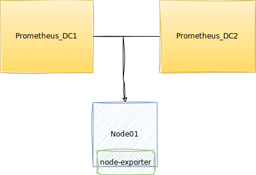
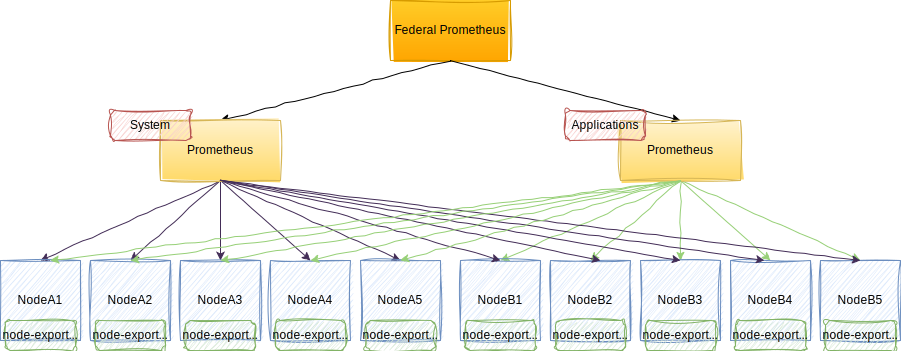
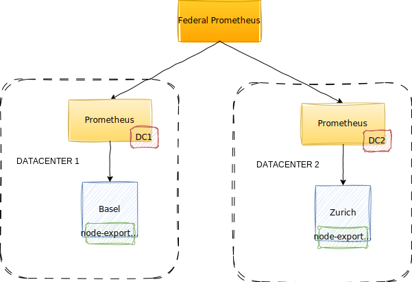
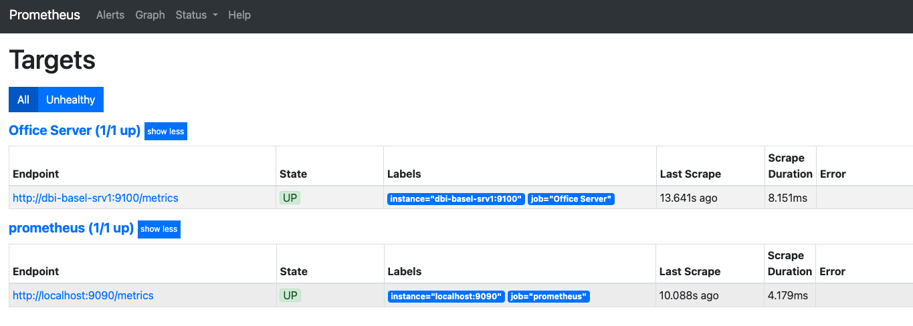
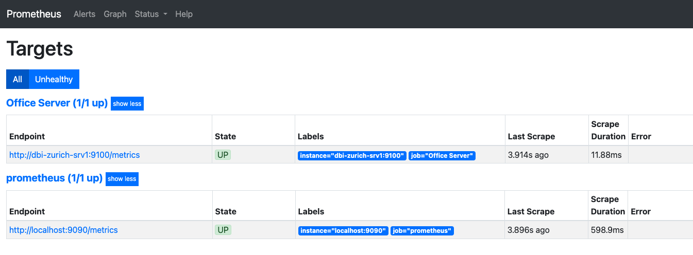
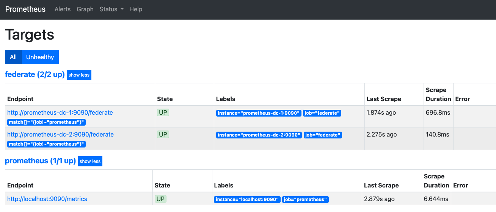

# Высокая доступность и иерархическая федерация с Prometheus


Ссылка на оригинальную статью: [High Availability and Hierarchical Federation with Prometheus](https://www.dbi-services.com/blog/high-availability-and-hierarchical-federation-with-prometheus/)

Опубликовано: 23 марта 2023

Авторы: [Nabil Laabid](https://www.dbi-services.com/blog/author/nabil-laabid/)


Когда мы говорим о создании инфраструктуры, наступает момент, когда нам нужно задаться вопросом о ее надежности и устойчивости. То же самое относится и к мониторингу, поэтому совершенно нормально интересоваться решениями, предлагаемыми Prometheus.

Например, можно ли реализовать высокую доступность с помощью Prometheus? И что нам делать, когда Prometheus начинает проявлять признаки усталости? Будет ли достаточно развертывания нового сервера Prometheus или мы рискуем оказаться разбросанными по скоплению серверов?

Именно такие вопросы я и буду рассматривать в этом посте. Итак, давайте углубимся и посмотрим, чему мы можем научиться!

## Высокая доступность

Прежде всего, давайте займемся вопросом высокой доступности. В отличие от Alertmanager, который обеспечивает кластеризацию и связь между несколькими экземплярами, Prometheus не предоставляет таких привилегий. Однако правда в том, что кластеризация Prometheus не требуется для достижения высокой доступности. Этот инструмент был тщательно разработан для обеспечения высокой доступности без необходимости подключения к серверу.

Фактически, настроить высокодоступную систему Prometheus очень просто, просто запустив несколько серверов Prometheus с идентичными конфигурациями.

<figure><figcaption></figcaption></figure>

Без лишних слов, если вы не против, я в несколько шагов объясню, как настроить эту HA.

Предположим, что у нас есть два сервера Prometheus: Prometheus\_DC1 и Prometheus\_DC2. Чтобы настроить HA, нам нужно скопировать все конфигурации Prometheus из Prometheus\_DC1 в Prometheus\_DC2:

* Скопируйте файл конфигурации Prometheus `/etc/prometheus/prometheus.yml` из Prometheus\_DC1 в Prometheus\_DC2.
* Скопируйте конфигурацию правил `/etc/prometheus/rules/rules.yaml` из Prometheus\_DC1 в Prometheus\_DC2.
* На Prometheus\_DC2 включите службу Prometheus и запустите ее.

```bash
sudo systemctl enable prometheus
sudo systemctl start prometheus
```

Вот и все. Для настройки HA на уровне Prometheus нам больше ничего не нужно. При желании мы можем добавить балансировщик нагрузки, настроенный в циклическом режиме. Это может быть полезно, если мы используем Grafana.

## Федерация

Когда мы начинаем мониторинг с помощью Prometheus, мы обычно начинаем с одного сервера на центр обработки данных или среду, что достаточно из-за его эффективности и более низкой частоты отказов. Однако при возникновении проблем с эксплуатационными расходами и производительностью может возникнуть необходимость разделить сервер Prometheus на отдельные серверы для мониторинга сети, инфраструктуры и приложений, что называется вертикальным сегментированием. Команды также могут запускать собственные серверы Prometheus для большей гибкости и контроля над целевыми метками и интервалами очистки. Социальные факторы часто приводят к разделению серверов Prometheus до того, как возникают проблемы с производительностью.

### Но как нам объединить все эти данные?

Для выполнения глобального агрегирования федерация позволяет глобальному серверу Prometheus получать агрегированные показатели с серверов Prometheus в центре обработки данных. Это обеспечивает надежность и простоту систем мониторинга, особенно для целей построения графиков и оповещений.

Мы можем легко поделиться нашими метрическими данными с Federation на разных серверах Prometheus.

В информационных целях существует два типа федераций.

### Иерархическая Федерация

Это означает, что у нас есть более крупные серверы Prometheus, которые собирают данные временных рядов с меньших. У нас есть нисходящий подход, при котором данные собираются с разных уровней.

<figure><figcaption></figcaption></figure>

### Межсервисная федерация

Этот метод предполагает, что один сервер Prometheus отслеживает конкретную службу или группу служб, собирая определенные временные ряды с другого сервера, который отслеживает другой набор служб. Сделав это, мы можем запускать запросы и оповещения по объединенным данным с обоих серверов.

<figure><figcaption></figcaption></figure>

## Реализация иерархической федерации

В этом блоге мы предположим конфигурацию с двумя серверами для мониторинга — один в Базеле, а другой в Цюрихе, на каждом из которых размещен node\_exporter. Эти серверы будут контролироваться выделенными серверами Prometheus с именами dc1 и dc2 соответственно. Наконец, метрики с этих двух серверов Prometheus будут агрегированы сервером федерации.

<figure><figcaption></figcaption></figure>

Из пользовательского интерфейса Prometheus мы можем наблюдать, что задания «Офисный сервер» собирают метрики с серверов Базеля и Цюриха через их соответствующие конечные точки `http:/dbi-basel-srv1:9100/metrics` и `http:/dbi-zurich-srv1: 9100/metrics` через серверы Prometheus DC1 и DC2.

Prometheus DC1:

<figure><figcaption></figcaption></figure>

Prometheus DC2:

<figure><figcaption></figcaption></figure>

Теперь мы можем войти на наш третий сервер Prometheus (федеральный) и отредактировать файл конфигурации Prometheus `/etc/prometheus/prometheus.yml`. Добавьте следующий блок внизу файла, сразу после статической настройки имени задания "Prometheus".

```yaml
# Federation configuration
  - job_name: 'federation'
    scrape_interval: 15s
    honor_labels: true
    metrics_path: '/federate'
    params:
      'match[]':
        - '{job!~"prometheus"}'
    static_configs:
    - targets:
      - 'prometheus-dc-1:9090'
      - 'prometheus-dc-2:9090'
```

Файл конфигурации должен выглядеть следующим образом:

```yaml
# my global config
global:
  scrape_interval:     15s # Set the scrape interval to every 15 seconds. Default is every 1 minute.
  evaluation_interval: 15s # Evaluate rules every 15 seconds. The default is every 1 minute.
  # scrape_timeout is set to the global default (10s).

# Alertmanager configuration
alerting:
  alertmanagers:
  - static_configs:
    - targets:
      # - alertmanager:9093

# Load rules once and periodically evaluate them according to the global 'evaluation_interval'.
rule_files:
  # - "first_rules.yml"
  # - "second_rules.yml"

# A scrape configuration containing exactly one endpoint to scrape:
# Here it's Prometheus itself.
scrape_configs:
  # The job name is added as a label `job=<job_name>` to any timeseries scraped from this config.
  - job_name: 'prometheus'

    # metrics_path defaults to '/metrics'
    # scheme defaults to 'http'.

    static_configs:
    - targets: ['localhost:9090']

# Federation configuration
  - job_name: 'federation'
    scrape_interval: 15s
    honor_labels: true
    metrics_path: '/federate'
    params:
      'match[]':
        - '{job!~"prometheus"}'
    static_configs:
    - targets:
      - 'prometheus-dc-1:9090'
      - 'prometheus-dc-2:9090'
```

После настройки мы включаем Федеральный сервер Prometheus.

```bash
sudo systemctl enable prometheus
```

И запускаем Prometheus

```bash
sudo systemctl start prometheus
```

Мы можем получить доступ к федеральному серверу Prometheus через веб-интерфейс по адресу `http://<публичный IP-адрес федеративного сервера Prometheus>:9090`.

Затем нажмите на статус и, наконец, на цель.

<figure><figcaption></figcaption></figure>
