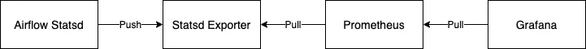
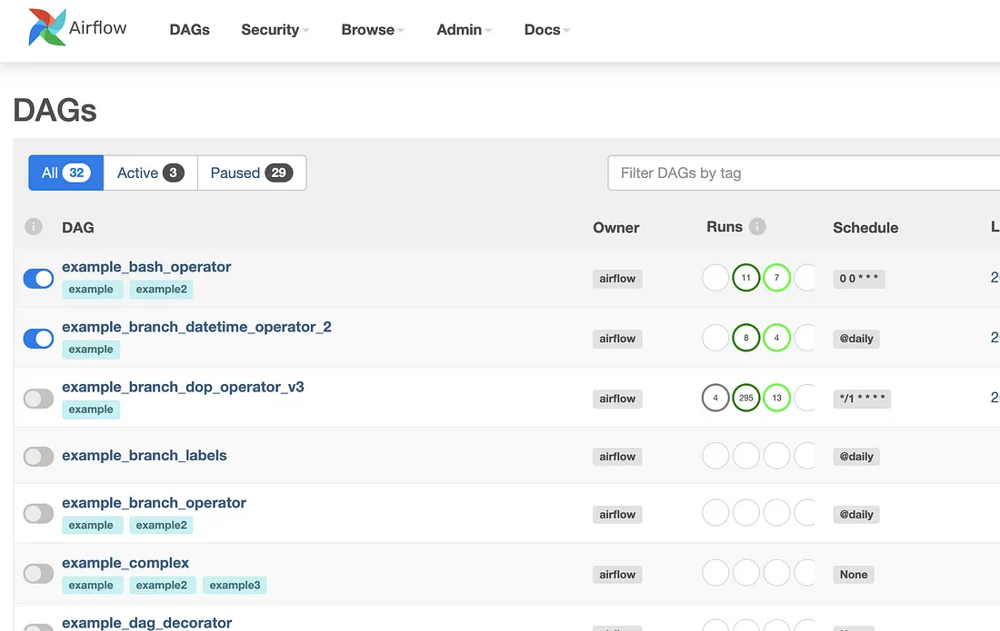
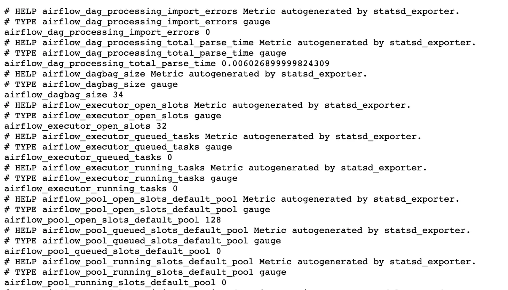

# Мониторинг показателей Airflow с помощью Grafana


**Оригинальное название**: [Monitoring Airflow Metrics with Grafana](https://medium.com/@perkasaid.rio/monitoring-airflow-metrics-with-grafana-29ebb43100a3)

**Автор**: [Rio Dwi Putra Perkasa](https://medium.com/@perkasaid.rio?source=post\_page-----29ebb43100a3--------------------------------)

**Дата**: 19 сентября 2021


<figure><figcaption><p>Airflow x Grafana</p></figcaption></figure>

Airflow — важный инструмент в мире обработки данных. Airflow — это инструмент планирования, который позволяет обеспечить своевременную доставку данных, выполнить этап преобразования данных и проверить зависимости для каждого процесса. Иногда вы сталкиваетесь с проблемами с Airflow и хотите знать, что произошло. Вот почему вам нужно следить за Airflow.

По сути, в вашей установке airflow предварительно установлен демон под названием statsd. Statsd отправит метрики на определенный порт. Эти метрики будут использоваться для нашего мониторинга. Процесс будет похож на схему ниже.

<figure><figcaption><p>Мониторинг Airflow с помощью Grafana</p></figcaption></figure>

В этом уроке мы рассмотрим среду внутри Docker-контейнера на вашем локальном компьютере. Продолжим предварительное условие. Установите это необходимое условие, прежде чем переходить к следующему шагу.

## Предварительное условие

* [Docker](https://docs.docker.com/get-docker/)

## Установка Airflow

Прежде всего, вам нужно установить то, что вы хотите отслеживать, да, Airflow. Я не буду подробно рассказывать об установке Airflow в Docker, поскольку у них уже есть официальная документация о том, [как запустить Airflow в Docker](https://airflow.apache.org/docs/apache-airflow/stable/start/docker.html). Пожалуйста, следуйте инструкциям выше, чтобы установить Airflow в Docker с помощью Docker Compose.

### Настройка установки Airflow:

* Включите пример загрузки ядра для проверки Airflow, установив `AIRFLOW__CORE__LOAD_EXAMPLES=True` в среде внутри файла `docker-compose.yml`. Эта переменная предназначена для создания примеров DAG в вашем Airflow в целях тестирования.
* Добавьте приведенную ниже конфигурацию в свой `docker-compose.yaml` в среде. Эта конфигурация позволит вашей статистике Airflow отправлять метрики.

```yaml
AIRFLOW__SCHEDULER__STATSD_ON: 'true'
AIRFLOW__SCHEDULER__STATSD_HOST: statsd-exporter
AIRFLOW__SCHEDULER__STATSD_PORT: 8125
AIRFLOW__SCHEDULER__STATSD_PREFIX: airflow
```

После этого войдите на свой веб-сервер airflow и используйте «airflow» в качестве имени пользователя и пароля. Ваш Airflow будет выглядеть так.

<figure><figcaption><p>пример данных из примера нагрузки на ядро Airflow</p></figcaption></figure>

## Установка Statsd-экспортера

После завершения установки airflow следующим шагом будет установка экспортера statsd. В statsd-exporter есть функция переназначения метрик, полученных от Airflow, и экспорта их как метрик Prometheus. Таким образом, statsd-exporter играет роль моста между airflow и prometheus.

Чтобы установить statsd-exporter, вам необходимо добавить службу в ваш docker-compose.yml для Airflow с помощью этой строки кода.

```yaml
statsd-exporter:
        image: prom/statsd-exporter
        container_name: airflow-statsd-exporter
        command: "--statsd.listen-udp=:8125 --web.listen-address=:9102"
        ports:
            - 9102:9102
            - 8125:8125/udp
```

**image**: определите место, куда вы хотите переместить докер-образ. В моем случае используется общедоступный образ из Docker Hub.

**volumes**: определите дополнительную конфигурацию сопоставления statsd. Если вы не используете дополнительную конфигурацию сопоставления, ваши метрики будут экспортированы так же, как в Prometheus. Эта конфигурация зависит от ваших потребностей. Вы можете перейти по этой ссылке [Statsd-exporter](https://hub.docker.com/r/prom/statsd-exporter), чтобы узнать, какую конфигурацию вы можете использовать в statsd-exporter. Сохраните дополнительную конфигурацию в файле yml и подключитесь к службе, используя тома, как указано выше.

**command**: вы можете перейти к документации statsd-exporter, чтобы узнать, какие команды вы можете здесь использовать. В этом случае мы используем три команды. `-- statsd.listen-udp` для определения порта, через который Airflow может передавать метрики. `-- web.listen-address`, чтобы определить, откуда Prometheus может получать метрики.

(Опционально) Вы можете добавить еще одну команду на основе документации из statsd-exporter [здесь](https://github.com/prometheus/statsd\_exporter). Например, если вы хотите переназначить показатели Airflow, чтобы упростить запрос в prometheus/grafana, вы можете добавить дополнительное сопоставление. Чтобы добавить дополнительное сопоставление, вы можете использовать statsd.mapping-config.

```yaml
statsd-exporter:
        image: prom/statsd-exporter
        container_name: airflow-statsd-exporter
        command: "--statsd.listen-udp=:8125 --web.listen-address=:9102 --statsd.mapping-config=/tmp/statsd_mapping.yml"
        ports:
            - 9102:9102
            - 8125:8125/udp
```

Вы заметите, что `statsd.mapping-config` использует файл yaml, поэтому вам необходимо определить файл yaml, содержащий дополнительную конфигурацию сопоставления. Создайте новый файл с именем `statsd_mapping.yaml` в корневом проекте и добавьте эту конфигурацию.

```yaml
mappings:
  - match: "(.+)\\.operator_successes_(.+)$"
    match_metric_type: counter
    name: "af_agg_operator_successes"
    match_type: regex
    labels:
      airflow_id: "$1"
      operator_name: "$2"
  - match: "*.ti_failures"
    match_metric_type: counter
    name: "af_agg_ti_failures"
    labels:
      airflow_id: "$1"
  - match: "*.ti_successes"
    match_metric_type: counter
    name: "af_agg_ti_successes"
    labels:
      airflow_id: "$1"
```

Это пример дополнительной конфигурации сопоставления показателей Airflow. Вы можете посетить [документацию statsd](https://github.com/prometheus/statsd\_exporter) для получения подробной информации о сопоставлении метрик и некоторых примеров переназначения метрик Airflow [здесь](https://github.com/databand-ai/airflow-dashboards/tree/main/statsd).

После определения файла конфигурации вам необходимо смонтировать его к службе statsd-exporter, используя том.

```yaml
statsd-exporter:
        image: prom/statsd-exporter
        container_name: airflow-statsd-exporter
        volumes:
            - $PWD/statsd_mapping.yml:/tmp/statsd_mapping.yml 
        command: "--statsd.listen-udp=:8125 --web.listen-address=:9102 --statsd.mapping-config=/tmp/statsd_mapping.yml"
        ports:
            - 9102:9102
            - 8125:8125/udp
```

После того, как вы добавите statsd-exporter в службу Docker Compose, вам нужно создать новый сервис.

```bash
docker-compose up -d
```

Эта команда создаст новый контейнер для statsd-exporter, который вы добавили ранее. Вы также можете проверить свой докер и найти там имя контейнера. После запуска докера вы можете перейти по адресу `http://127.0.0.1:9102`, чтобы проверить метрики, которые отправляются в statsd-exporter.

<figure><figcaption></figcaption></figure>
