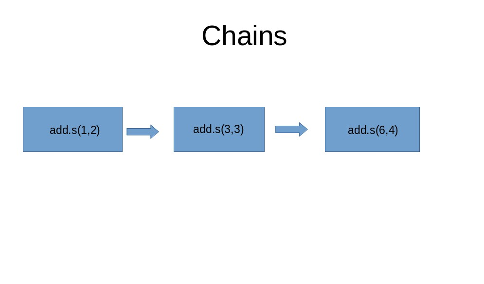

# Цепи, группы и хорды в Celery


**Оригинальное название**: [Chains, Groups and Chords in Celery](https://sayari3.com/articles/18-chains-groups-and-chords-in-celery/)

**Автор**: [Felix Kimutai](https://sayari3.com/articles/about/)

**Дата**: 6 февраля 2021


Если вы раньше использовали Celery с Django, это руководство поможет вам понять несколько важных концепций. Если Celery для вас новичок, я предлагаю вам сначала ознакомиться с их [официальной документацией](https://docs.celeryproject.org/en/stable/), чтобы ознакомиться с ней.

## ЦЕПИ (chains)

Мы собираемся использовать этот пример задачи в наших примерах.

```python
@app.task
def add(x, y):
    return x + y
```

Когда мы объединяем задачи, вторая задача будет принимать результаты первой задачи в качестве своего первого аргумента, например

```python
from celery import chain

res = chain(add.s(1, 2), add.s(3)).apply_async() 
```

В приведенном выше примере вы можете заметить, что вторая задача имеет только один аргумент, это потому, что возвращаемое значение первой задачи, которое в нашем примере равно 3, будет первым аргументом второй задачи, вторая задача теперь будет выглядеть так

```python
add.s(3, 3)
```

Надеюсь, это изображение ниже поможет вам лучше понять это.

<figure><figcaption></figcaption></figure>

Обратите внимание, что первый аргумент второй задачи равен 3, а первый аргумент третьей задачи — 6, что является результатом второй задачи.

Другой способ объединения задач — использование этого синтаксиса с символом вертикальной черты (`"|"`).

```python
res2 = (add.s(1, 2) | add.s(3)).apply_async()
```

Приведенный выше код аналогичен коду ниже, вы можете выбрать, какой из них вы предпочитаете.

```python
res2 = chain(add.s(1, 2), add.s(3)).apply_async()
```

## ГРУППЫ (groups)

В документации Celery говорится:

> Группы используются для параллельного выполнения задач. Функция **group** принимает список сигнатур.

Пример кода:

```python
>>> from celery import group
>>> from tasks import add

>>> job = group([
...             add.s(2, 2),
...             add.s(4, 4),
... ])

>>> result = job.apply_async()

>>> result.ready()  # все подзадачи выполнены?
True
>>> result.successful() # все ли подзадачи были выполнены успешно?
True
>>> result.get()
[4, 8 ]
```

Пример изображения, иллюстрирующего работу групп

<figure><figcaption></figcaption></figure>

## ХОРДЫ (chords)

Хорда обычно состоит из двух частей: заголовка и обратного вызова.

Синтаксис выглядит следующим образом:

```python
chord(header)(callback)
```

**header** здесь — это просто группа задач, обратный вызов **callback** запускается или выполняется после завершения групп задач.

Чтобы продемонстрировать, как работает хорда, нам понадобится функция, которая будет выполнять функцию обратного вызова **callback**.

Мы вызовем нашу функцию обратного вызова **tsum**, она принимает список чисел и складывает их.

**tsum**:

```python
@app.task
def tsum(numbers):
    return sum(numbers)
```

Пример хорды:

```python
>>> callback = tsum.s()
>>> header = [ add.s(2, 2),  add.s(4, 4) ]
>>> result = chord(header)(callback)
>>> result.get()
12
```

Приведенный выше код похож на это математическое выражение:

$$
∑ ((2 + 2) + (4 + 4))
$$

Изображение ниже иллюстрирует, как работают хорды.

<figure><figcaption></figcaption></figure>


В [документации Celery](https://docs.celeryproject.org/en/stable/userguide/canvas.html) говорится, что нам следует избегать использования хорд, насколько это возможно, но вы все равно можете использовать их, если действительно необходимо. Подробнее о том, почему не следует использовать аккорды, читайте в документации Celery.


## Ресурсы

* [Canvas: Designing Work-flows](https://docs.celeryproject.org/en/stable/userguide/canvas.html)
* [How to Use Celery and RabbitMQ with Django](https://simpleisbetterthancomplex.com/tutorial/2017/08/20/how-to-use-celery-with-django.html)
* Header photo by [@vivekdoshi](https://unsplash.com/@vivekdoshi) on [unsplash](https://unsplash.com/@vivekdoshi)
