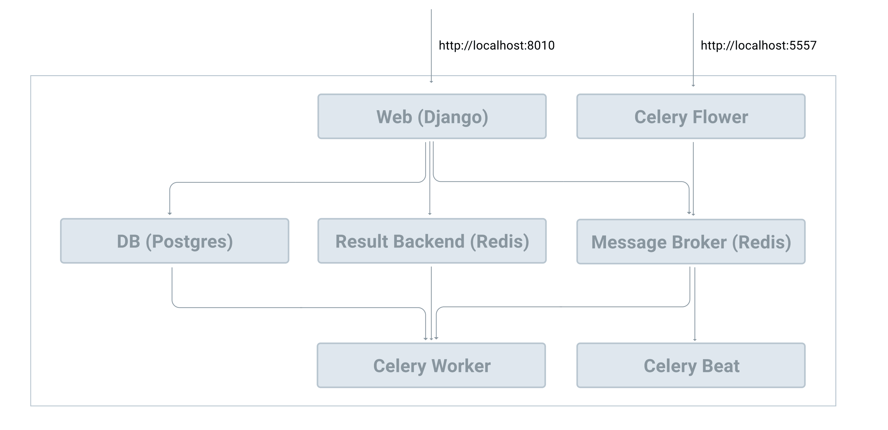

# Докеризация Celery и Django


**Оригинальное название**: Dockerizing Celery and Django

**Ссылка**: [https://testdriven.io/courses/django-celery/docker/](https://testdriven.io/courses/django-celery/docker/)

**Автор**:&#x20;

**Дата**:&#x20;


## Цели

К концу этой главы вы сможете:

1. Объяснить, для чего используется Docker Compose и почему вы можете захотеть его использовать
2. Использовать Docker Compose для создания и управления Django, Postgres, Redis и Celery
3. Ускорить разработку приложения с помощью Docker и Docker Compose

## Docker Compose

[Docker Compose](https://docs.docker.com/compose/) — это инструмент, используемый для определения и запуска многоконтейнерных приложений Docker. Он использует файлы YAML для настройки служб приложения и выполняет процессы создания и запуска для всех контейнеров с помощью одной команды.

Мы уже рассмотрели, как обслуживать экземпляр Redis с помощью Docker с помощью одной команды:

```bash
$ docker run -p 6379:6379 --name some-redis -d redis
```

Что ж, в этой главе мы сделаем еще один шаг вперед и контейнеризируем всю нашу инфраструктуру, чтобы упростить разработку. Прежде чем мы это сделаем, давайте посмотрим, почему: почему мы должны обслуживать нашу среду разработки в контейнерах Docker с помощью Docker Compose?

1. Вместо того, чтобы запускать каждый процесс (например, Django, Celery worker, Celery beat, Flower, Redis, Postgres и т. д.) вручную, каждый из другого окна терминала, после контейнеризации каждого сервиса, Docker Compose позволяет нам управлять и запускать контейнеры с помощью одной команды.
2. Docker Compose также упростит настройку. Конфигурация Celery в настоящее время привязана к конфигурации нашего приложения Django. Это не идеально. С помощью Docker Compose мы можем легко создавать различные конфигурации для Django и Celery из одного файла YAML.
3. Docker, как правило, позволяет нам создавать изолированные, воспроизводимые и переносимые среды разработки. Таким образом, вам не придется возиться с виртуальной средой или устанавливать такие инструменты, как Postgres и Redis, в вашей локальной ОС.

## Установка Docker Compose

Начните с загрузки и установки [Docker](https://docs.docker.com/get-docker/), если вы еще этого не сделали.

> Если вы работаете на компьютере Mac или Windows, [Docker Desktop](https://www.docker.com/products/docker-desktop) установит и Docker, и Docker Compose. Пользователям Linux придется скачивать и устанавливать их отдельно.

```bash
$ docker --version
Docker version 20.10.7, build f0df350

$ docker-compose --version
docker-compose version 1.29.2, build 5becea4c
```

## Структура файла конфигурации

Давайте начнем со структуры нашего конфигурационного файла, которая должна помочь вам лучше понять весь рабочий процесс:

```
├── compose
│   ├── local
│   │   └── django
│   │       ├── Dockerfile
│   │       ├── celery
│   │       │   ├── beat
│   │       │   │   └── start
│   │       │   ├── flower
│   │       │   │   └── start
│   │       │   └── worker
│   │       │       └── start
│   │       ├── entrypoint
│   │       └── start
│   └── production
│       ├── django
│       │   ├── Dockerfile
│       │   ├── celery
│       │   │   ├── beat
│       │   │   │   └── start
│       │   │   ├── flower
│       │   │   │   └── start
│       │   │   └── worker
│       │   │       └── start
│       │   ├── entrypoint
│       │   └── start
│       └── nginx
│           ├── Dockerfile
│           └── nginx.conf
├── django_celery_example
│     # файлы опущены для краткости
├── docker-compose.prod.yml
├── docker-compose.yml
├── manage.py
├── polls
│     # файлы опущены для краткости
└── requirements.txt
```

Пока не создавайте новые файлы и папки; мы будем создавать их в оставшейся части главы.

С помощью Docker Compose вы описываете желаемое конечное состояние вашей среды, используя декларативный синтаксис в файле `docker-compose.yml`. В приведенной выше файловой структуре используются два таких файла: один для разработки, а другой для производства — `docker-compose.yml` и `docker-compose.prod.yml` соответственно.

Папка «compose» содержит файлы конфигурации, сценарии оболочки и связанные файлы Docker для каждой среды.

> Приведенная выше структура конфигурации основана на конфигурации, найденной в проекте [cookiecutter-django](https://github.com/pydanny/cookiecutter-django), которая является чистой и простой в обслуживании.

## Службы приложений

<figure><figcaption></figcaption></figure>

Начните с добавления файла `docker-compose.yml` в корень проекта:

```yaml
version: '3.8'

services:
  web:
    build:
      context: .
      dockerfile: ./compose/local/django/Dockerfile
    image: django_celery_example_web
    # '/start' это сценарий оболочки, используемый для запуска службы
    command: /start
    # этот том (volume) используется для сопоставления файлов и папок на хосте
    # с контейнером, поэтому, если мы изменим код на хосте, код в контейнере докера
    # также будет изменен.
    volumes:
      - .:/app
    ports:
      - 8010:8000
    # env_file используется для управления переменными env нашего проекта
    env_file:
      - ./.env/.dev-sample
    depends_on:
      - redis
      - db

  db:
    image: postgres:14-alpine
    volumes:
      - postgres_data:/var/lib/postgresql/data/
    environment:
      - POSTGRES_DB=hello_django
      - POSTGRES_USER=hello_django
      - POSTGRES_PASSWORD=hello_django

  redis:
    image: redis:7-alpine

  celery_worker:
    build:
      context: .
      dockerfile: ./compose/local/django/Dockerfile
    image: django_celery_example_celery_worker
    command: /start-celeryworker
    volumes:
      - .:/app
    env_file:
      - ./.env/.dev-sample
    depends_on:
      - redis
      - db

  celery_beat:
    build:
      context: .
      dockerfile: ./compose/local/django/Dockerfile
    image: django_celery_example_celery_beat
    command: /start-celerybeat
    volumes:
      - .:/app
    env_file:
      - ./.env/.dev-sample
    depends_on:
      - redis
      - db

  flower:
    build:
      context: .
      dockerfile: ./compose/local/django/Dockerfile
    image: django_celery_example_celery_flower
    command: /start-flower
    volumes:
      - .:/app
    env_file:
      - ./.env/.dev-sample
    ports:
      - 5557:5555
    depends_on:
      - redis
      - db

volumes:
  postgres_data:
```

Здесь мы определили шесть сервисов:

1. **web** - это сервер разработки Django.
2. **db** - это сервер Postgres.
3. **redis** - это служба Redis, которая будет использоваться в качестве брокера сообщений Celery и серверной части результатов.
4. **celery\_worker** - рабочий процесс Celery.
5. **celery\_beat** - это процесс Celery beat для запланированных задач.
6. **flower** -  это дашборд Calery

Просмотрите службы **web**, **db** и **redis** самостоятельно, принимая к сведению комментарии. Для упрощения сервисы **web**, **celery\_worker**, **celery\_beat** и **flower** будут использовать один и тот же файл `Dockerfile`.

## Переменные среды

Создайте новую папку для хранения переменных среды в корне проекта с именем `.env`. Затем добавьте в эту папку новый файл с именем `.dev-sample`:

```bash
DEBUG=1
SECRET_KEY=dbaa1_i7%*3r9-=z-+_mz4r-!qeed@(-a_r(g@k8jo8y3r27%m
DJANGO_ALLOWED_HOSTS=*

SQL_ENGINE=django.db.backends.postgresql
SQL_DATABASE=hello_django
SQL_USER=hello_django
SQL_PASSWORD=hello_django
SQL_HOST=db
SQL_PORT=5432

CELERY_BROKER=redis://redis:6379/0
CELERY_BACKEND=redis://redis:6379/0
```

Учетные данные для входа в базу данных должны соответствовать переменным среды службы **db**:

| Переменные Django | Переменные Postrges | Значения      |
| ----------------- | ------------------- | ------------- |
| SQL\_DATABASE     | POSTGRES\_DB        | hello\_django |
| SQL\_USER         | POSTGRES\_USER      | hello\_django |
| SQL\_PASSWORD     | POSTGRES\_PASSWORD  | hello\_django |

Затем обновите настройки **DATABASES**, **CELERY\_BROKER\_URL** и **CELERY\_RESULT\_BACKEND** в `settings.py`:

```python
DATABASES = {
    "default": {
        "ENGINE": os.environ.get("SQL_ENGINE", "django.db.backends.sqlite3"),
        "NAME": os.environ.get("SQL_DATABASE", os.path.join(BASE_DIR, "db.sqlite3")),
        "USER": os.environ.get("SQL_USER", "user"),
        "PASSWORD": os.environ.get("SQL_PASSWORD", "password"),
        "HOST": os.environ.get("SQL_HOST", "localhost"),
        "PORT": os.environ.get("SQL_PORT", "5432"),
    }
}

CELERY_BROKER_URL = os.environ.get("CELERY_BROKER", "redis://127.0.0.1:6379/0")
CELERY_RESULT_BACKEND = os.environ.get("CELERY_BACKEND", "redis://127.0.0.1:6379/0")

```

Обязательно импортируйте **os** вверху:

```python
import os
```

## Dockerfile
