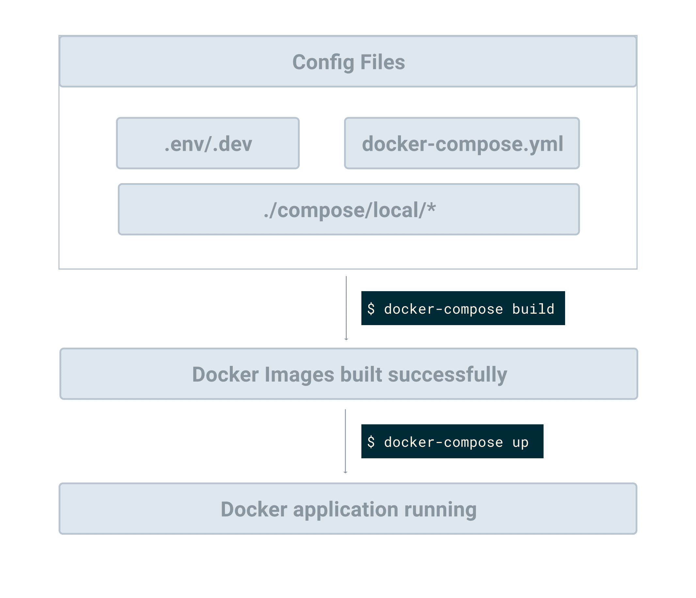

# Докеризация Celery и Django


**Оригинальное название**: Dockerizing Celery and Django

**Ссылка**: [https://testdriven.io/courses/django-celery/docker/](https://testdriven.io/courses/django-celery/docker/)

**Автор**:&#x20;

**Дата**:&#x20;


## Цели

К концу этой главы вы сможете:

1. Объяснить, для чего используется Docker Compose и почему вы можете захотеть его использовать
2. Использовать Docker Compose для создания и управления Django, Postgres, Redis и Celery
3. Ускорить разработку приложения с помощью Docker и Docker Compose

## Docker Compose

[Docker Compose](https://docs.docker.com/compose/) — это инструмент, используемый для определения и запуска многоконтейнерных приложений Docker. Он использует файлы YAML для настройки служб приложения и выполняет процессы создания и запуска для всех контейнеров с помощью одной команды.

Мы уже рассмотрели, как обслуживать экземпляр Redis с помощью Docker с помощью одной команды:

```bash
$ docker run -p 6379:6379 --name some-redis -d redis
```

Что ж, в этой главе мы сделаем еще один шаг вперед и контейнеризируем всю нашу инфраструктуру, чтобы упростить разработку. Прежде чем мы это сделаем, давайте посмотрим, почему: почему мы должны обслуживать нашу среду разработки в контейнерах Docker с помощью Docker Compose?

1. Вместо того, чтобы запускать каждый процесс (например, Django, Celery worker, Celery beat, Flower, Redis, Postgres и т. д.) вручную, каждый из другого окна терминала, после контейнеризации каждого сервиса, Docker Compose позволяет нам управлять и запускать контейнеры с помощью одной команды.
2. Docker Compose также упростит настройку. Конфигурация Celery в настоящее время привязана к конфигурации нашего приложения Django. Это не идеально. С помощью Docker Compose мы можем легко создавать различные конфигурации для Django и Celery из одного файла YAML.
3. Docker, как правило, позволяет нам создавать изолированные, воспроизводимые и переносимые среды разработки. Таким образом, вам не придется возиться с виртуальной средой или устанавливать такие инструменты, как Postgres и Redis, в вашей локальной ОС.

## Установка Docker Compose

Начните с загрузки и установки [Docker](https://docs.docker.com/get-docker/), если вы еще этого не сделали.

> Если вы работаете на компьютере Mac или Windows, [Docker Desktop](https://www.docker.com/products/docker-desktop) установит и Docker, и Docker Compose. Пользователям Linux придется скачивать и устанавливать их отдельно.

```bash
$ docker --version
Docker version 20.10.7, build f0df350

$ docker-compose --version
docker-compose version 1.29.2, build 5becea4c
```

## Структура файла конфигурации

Давайте начнем со структуры нашего конфигурационного файла, которая должна помочь вам лучше понять весь рабочий процесс:

```
├── compose
│   ├── local
│   │   └── django
│   │       ├── Dockerfile
│   │       ├── celery
│   │       │   ├── beat
│   │       │   │   └── start
│   │       │   ├── flower
│   │       │   │   └── start
│   │       │   └── worker
│   │       │       └── start
│   │       ├── entrypoint
│   │       └── start
│   └── production
│       ├── django
│       │   ├── Dockerfile
│       │   ├── celery
│       │   │   ├── beat
│       │   │   │   └── start
│       │   │   ├── flower
│       │   │   │   └── start
│       │   │   └── worker
│       │   │       └── start
│       │   ├── entrypoint
│       │   └── start
│       └── nginx
│           ├── Dockerfile
│           └── nginx.conf
├── django_celery_example
│     # файлы опущены для краткости
├── docker-compose.prod.yml
├── docker-compose.yml
├── manage.py
├── polls
│     # файлы опущены для краткости
└── requirements.txt
```

Пока не создавайте новые файлы и папки; мы будем создавать их в оставшейся части главы.

С помощью Docker Compose вы описываете желаемое конечное состояние вашей среды, используя декларативный синтаксис в файле `docker-compose.yml`. В приведенной выше файловой структуре используются два таких файла: один для разработки, а другой для производства — `docker-compose.yml` и `docker-compose.prod.yml` соответственно.

Папка «compose» содержит файлы конфигурации, сценарии оболочки и связанные файлы Docker для каждой среды.

> Приведенная выше структура конфигурации основана на конфигурации, найденной в проекте [cookiecutter-django](https://github.com/pydanny/cookiecutter-django), которая является чистой и простой в обслуживании.

## Службы приложений

<figure><figcaption></figcaption></figure>

Начните с добавления файла `docker-compose.yml` в корень проекта:

```yaml
version: '3.8'

services:
  web:
    build:
      context: .
      dockerfile: ./compose/local/django/Dockerfile
    image: django_celery_example_web
    # '/start' это сценарий оболочки, используемый для запуска службы
    command: /start
    # этот том (volume) используется для сопоставления файлов и папок на хосте
    # с контейнером, поэтому, если мы изменим код на хосте, код в контейнере докера
    # также будет изменен.
    volumes:
      - .:/app
    ports:
      - 8010:8000
    # env_file используется для управления переменными env нашего проекта
    env_file:
      - ./.env/.dev-sample
    depends_on:
      - redis
      - db

  db:
    image: postgres:14-alpine
    volumes:
      - postgres_data:/var/lib/postgresql/data/
    environment:
      - POSTGRES_DB=hello_django
      - POSTGRES_USER=hello_django
      - POSTGRES_PASSWORD=hello_django

  redis:
    image: redis:7-alpine

  celery_worker:
    build:
      context: .
      dockerfile: ./compose/local/django/Dockerfile
    image: django_celery_example_celery_worker
    command: /start-celeryworker
    volumes:
      - .:/app
    env_file:
      - ./.env/.dev-sample
    depends_on:
      - redis
      - db

  celery_beat:
    build:
      context: .
      dockerfile: ./compose/local/django/Dockerfile
    image: django_celery_example_celery_beat
    command: /start-celerybeat
    volumes:
      - .:/app
    env_file:
      - ./.env/.dev-sample
    depends_on:
      - redis
      - db

  flower:
    build:
      context: .
      dockerfile: ./compose/local/django/Dockerfile
    image: django_celery_example_celery_flower
    command: /start-flower
    volumes:
      - .:/app
    env_file:
      - ./.env/.dev-sample
    ports:
      - 5557:5555
    depends_on:
      - redis
      - db

volumes:
  postgres_data:
```

Здесь мы определили шесть сервисов:

1. **web** - это сервер разработки Django.
2. **db** - это сервер Postgres.
3. **redis** - это служба Redis, которая будет использоваться в качестве брокера сообщений Celery и серверной части результатов.
4. **celery\_worker** - рабочий процесс Celery.
5. **celery\_beat** - это процесс Celery beat для запланированных задач.
6. **flower** -  это дашборд Calery

Просмотрите службы **web**, **db** и **redis** самостоятельно, принимая к сведению комментарии. Для упрощения сервисы **web**, **celery\_worker**, **celery\_beat** и **flower** будут использовать один и тот же файл `Dockerfile`.

## Переменные среды

Создайте новую папку для хранения переменных среды в корне проекта с именем `.env`. Затем добавьте в эту папку новый файл с именем `.dev-sample`:

```bash
DEBUG=1
SECRET_KEY=dbaa1_i7%*3r9-=z-+_mz4r-!qeed@(-a_r(g@k8jo8y3r27%m
DJANGO_ALLOWED_HOSTS=*

SQL_ENGINE=django.db.backends.postgresql
SQL_DATABASE=hello_django
SQL_USER=hello_django
SQL_PASSWORD=hello_django
SQL_HOST=db
SQL_PORT=5432

CELERY_BROKER=redis://redis:6379/0
CELERY_BACKEND=redis://redis:6379/0
```

Учетные данные для входа в базу данных должны соответствовать переменным среды службы **db**:

| Переменные Django | Переменные Postrges | Значения      |
| ----------------- | ------------------- | ------------- |
| SQL\_DATABASE     | POSTGRES\_DB        | hello\_django |
| SQL\_USER         | POSTGRES\_USER      | hello\_django |
| SQL\_PASSWORD     | POSTGRES\_PASSWORD  | hello\_django |

Затем обновите настройки **DATABASES**, **CELERY\_BROKER\_URL** и **CELERY\_RESULT\_BACKEND** в `settings.py`:

```python
DATABASES = {
    "default": {
        "ENGINE": os.environ.get("SQL_ENGINE", "django.db.backends.sqlite3"),
        "NAME": os.environ.get("SQL_DATABASE", os.path.join(BASE_DIR, "db.sqlite3")),
        "USER": os.environ.get("SQL_USER", "user"),
        "PASSWORD": os.environ.get("SQL_PASSWORD", "password"),
        "HOST": os.environ.get("SQL_HOST", "localhost"),
        "PORT": os.environ.get("SQL_PORT", "5432"),
    }
}

CELERY_BROKER_URL = os.environ.get("CELERY_BROKER", "redis://127.0.0.1:6379/0")
CELERY_RESULT_BACKEND = os.environ.get("CELERY_BACKEND", "redis://127.0.0.1:6379/0")

```

Обязательно импортируйте **os** вверху:

```python
import os
```

## Dockerfile

Далее создайте в корне проекта следующие файлы и папки:

```
└── compose
    └── local
        └── django
            └── Dockerfile
```

Затем обновите **Dockerfile**:

```docker
FROM python:3.10-slim-buster

ENV PYTHONUNBUFFERED 1
ENV PYTHONDONTWRITEBYTECODE 1

RUN apt-get update \
  # зависимости для сборки пакетов Python
  && apt-get install -y build-essential \
  # зависимости psycopg2
  && apt-get install -y libpq-dev \
  # Зависимости переводов
  && apt-get install -y gettext \
  # очистка неиспользуемых файлов
  && apt-get purge -y --auto-remove -o APT::AutoRemove::RecommendsImportant=false \
  && rm -rf /var/lib/apt/lists/*

# Требования устанавливаются здесь, чтобы обеспечить их кеширование.
COPY ./requirements.txt /requirements.txt
RUN pip install -r /requirements.txt

COPY ./compose/local/django/entrypoint /entrypoint
RUN sed -i 's/\r$//g' /entrypoint
RUN chmod +x /entrypoint

COPY ./compose/local/django/start /start
RUN sed -i 's/\r$//g' /start
RUN chmod +x /start

COPY ./compose/local/django/celery/worker/start /start-celeryworker
RUN sed -i 's/\r$//g' /start-celeryworker
RUN chmod +x /start-celeryworker

COPY ./compose/local/django/celery/beat/start /start-celerybeat
RUN sed -i 's/\r$//g' /start-celerybeat
RUN chmod +x /start-celerybeat

COPY ./compose/local/django/celery/flower/start /start-flower
RUN sed -i 's/\r$//g' /start-flower
RUN chmod +x /start-flower

WORKDIR /app

ENTRYPOINT ["/entrypoint"]

```

> **Dockerfile** — это текстовый файл, содержащий команды, необходимые для создания образа.

Примечания:

1. `RUN sed -i 's/\r$//g' /entrypoint` используется для обработки окончаний строк сценариев оболочки, которые преобразуют окончания строк Windows в окончания строк UNIX.
2. Мы скопировали различные сценарии запуска службы в корневой каталог окончательного образа.
3. Поскольку исходный код будет размещен в каталоге «/app» контейнера (из тома `.:/app` в файле Docker Compose), мы устанавливаем рабочий каталог в `/app`.

## Entrypoint

Мы использовали ключ **depend\_on** для службы **web**, чтобы гарантировать, что она не запустится до тех пор, пока не будут запущены службы **redis** и **db**. Однако то, что контейнер **db** запущен, не означает, что база данных запущена и готова к обработке подключений. Таким образом, мы можем использовать сценарий оболочки, называемый точкой входа, чтобы убедиться, что мы действительно можем подключиться к базе данных, прежде чем запускать службу **web**.

`compose/local/django/entrypoint`:

```bash
#!/bin/bash

# если какая-либо из команд в вашем коде по какой-либо причине не работает,
# весь скрипт не работает
set -o errexit
# fail exit, если одна из ваших команд pipe не удалась
set -o pipefail
# выход, если какая-либо из ваших переменных не установлена
set -o nounset

postgres_ready() {
python << END
import sys

import psycopg2

try:
    psycopg2.connect(
        dbname="${SQL_DATABASE}",
        user="${SQL_USER}",
        password="${SQL_PASSWORD}",
        host="${SQL_HOST}",
        port="${SQL_PORT}",
    )
except psycopg2.OperationalError:
    sys.exit(-1)
sys.exit(0)

END
}
until postgres_ready; do
  >&2 echo 'Waiting for PostgreSQL to become available...'
  sleep 1
done
>&2 echo 'PostgreSQL is available'

exec "$@"

```

Примечания:

1. Мы определили функцию **postgres\_ready**, которая вызывается в цикле. Затем код будет продолжать выполняться до тех пор, пока сервер Postgres не будет доступен.
2. `exec "$@"` используется, чтобы сделать точку входа сквозной, чтобы гарантировать, что Docker выполняет команду, которую передает пользователь (команда: `/start`, в нашем случае). Для получения дополнительной информации просмотрите этот [ответ Stack Overflow](https://stackoverflow.com/a/39082923/2371995).

Опять же, этот сценарий точки входа **entrypoint** и указанный выше файл **Dockerfile** будут использоваться с сервисами **web**, **celery\_worker**, **celery\_beat** и **flower**, чтобы убедиться, что они не запускают соответствующие стартовые сценарии, пока не будет запущен Postgres.

> Почему мы не дождались появления **Redis** в сценарии точки входа? **Postgres** обычно запускается намного медленнее, чем Redis, поэтому мы можем предположить, что Redis заработает, как только Postgres заработает.

## Стартовые скрипты

Добавим стартовые скрипты.

Начните с добавления файлов и папок в папку `"compose/local/django"`, чтобы она выглядела так:

```
└── django
    ├── Dockerfile
    ├── celery
    │   ├── beat
    │   │   └── start
    │   ├── flower
    │   │   └── start
    │   └── worker
    │       └── start
    ├── entrypoint
    └── start
```

Теперь обновите каждый из четырех сценариев запуска.

`compose/local/django/start`:

```bash
#!/bin/bash

set -o errexit
set -o pipefail
set -o nounset

python manage.py migrate
python manage.py runserver 0.0.0.0:8000
```

`compose/local/django/celery/beat/start`:

```bash
#!/bin/bash

set -o errexit
set -o nounset

rm -f './celerybeat.pid'
celery -A django_celery_example beat -l INFO
```

`compose/local/django/celery/worker/start`:

```bash
#!/bin/bash

set -o errexit
set -o nounset

celery -A django_celery_example worker -l INFO
```

`compose/local/django/celery/flower/start`:

```bash
#!/bin/bash

set -o errexit
set -o nounset

worker_ready() {
    celery -A django_celery_example inspect ping
}

until worker_ready; do
  >&2 echo 'Celery workers not available'
  sleep 1
done
>&2 echo 'Celery workers is available'

celery -A django_celery_example  \
    --broker="${CELERY_BROKER}" \
    flower
```

В этом финальном сценарии мы использовали ту же логику из нашей точки входа **entrypoint**, чтобы гарантировать, что **Flower** не запустится, пока рабочие процессы не будут готовы.

## Основной рабочий процесс

<figure><figcaption></figcaption></figure>

Закончив настройку, давайте посмотрим, как все работает вместе, чтобы лучше понять весь рабочий процесс.

Убедитесь, что у вас есть файл `requirements.txt` в корне проекта:

```python
django==4.0.7
celery==5.2.7
redis==4.3.4
flower==1.2.0
psycopg2-binary==2.9.2              # new
```

Начнем с создания образов:

```bash
$ docker-compose build
```

После создания образов запустите контейнеры в автономном режиме:

```bash
$ docker-compose up -d
```

Это запустит каждый из контейнеров в порядке, указанном в параметре **depend\_on**:

1. контейнеры **redis** и **db** в первую очередь
2. Затем контейнеры **web**, **celery\_worker**, **celery\_beat** и **flower**.

Как только контейнеры будут запущены, будут выполняться сценарии точки входа **entrypoint**, а затем, как только **Postgres** будет запущен, будут выполнены соответствующие стартовые сценарии **start**. Будут применены миграции Django и запущен сервер разработки. Приложение Django должно быть доступно.

Убедитесь, что вы можете просмотреть экран приветствия Django по адресу `http://localhost:8010/`. Вы также должны иметь возможность просматривать панель инструментов Flower по адресу `http://localhost:5557/`.

## Поиск неисправностей

Если у вас возникнут проблемы, вы можете просмотреть журналы по адресу:

```bash
$ docker-compose logs -f
```

Попробуйте устранить проблему, а затем заново создайте образы и снова запустите контейнеры.

Для пользователей Mac Silicon, если вы получаете какие-то странные ошибки, вам может потребоваться запустить `export DOCKER_DEFAULT_PLATFORM=linux/amd64` перед запуском команд **Docker Compose**. Для получения более подробной информации, пожалуйста, ознакомьтесь с этой [проблемой GitHub](https://github.com/testdrivenio/fastapi-celery-project/issues/7#issuecomment-1416787688).

## Полезные команды

Чтобы войти в оболочку определенного работающего контейнера, выполните следующую команду:

```bash
$ docker-compose exec <service-name> bash

# для примера:
# docker-compose exec web bash
```

Если вы хотите запустить команду для нового контейнера, который в данный момент не запущен, запустите:

```bash
$ docker-compose run --rm web bash
```

> Параметр `--rm` указывает докеру удалить контейнер после выхода из оболочки bash.

## Простой тест

Давайте проверим, войдя в оболочку Django работающего веб-сервиса **web**:

```bash
$ docker-compose exec web python manage.py shell
```

Затем запустите следующий код:

```python
>>> from django_celery_example.celery import divide
>>>
>>> divide.delay(1, 2)
<AsyncResult: ea7b49f0-250c-4b21-b3ed-7ad1493e22ee>
```

Обратите внимание на идентификатор задачи (**ea7b49f0-250c-4b21-b3ed-7ad1493e22ee** в приведенном выше случае).

Откройте новое окно терминала, перейдите в каталог проекта и просмотрите журналы рабочего процесса **Celery**:

```bash
$ docker-compose logs celery_worker
```

Вы должны увидеть что-то похожее на:

```bash
celery_worker_1  | [2022-08-13 05:04:18,096: INFO/MainProcess] Task django_celery_example.celery.divide[ea7b49f0-250c-4b21-b3ed-7ad1493e22ee] received
celery_worker_1  | [2022-08-13 05:04:23,110: INFO/ForkPoolWorker-2] Task django_celery_example.celery.divide[ea7b49f0-250c-4b21-b3ed-7ad1493e22ee] succeeded in 5.01021368200054s: 0.5
```

В первом окне выйдите из оболочки.

Теперь давайте войдем в оболочку службы **redis**:

```bash
$ docker-compose exec redis sh
```

> Мы использовали **sh**, так как **bash** недоступен в этом контейнере.

Далее, используя идентификатор задачи из приведенного выше, давайте посмотрим результат задачи непосредственно из **Redis**:

```bash
$ redis-cli
127.0.0.1:6379> MGET celery-task-meta-ea7b49f0-250c-4b21-b3ed-7ad1493e22ee
1) "{\"status\": \"SUCCESS\", \"result\": 0.5, \"traceback\": null, \"children\": [], \"date_done\": \"2022-08-13T05:04:23.105482\", \"task_id\": \"ea7b49f0-250c-4b21-b3ed-7ad1493e22ee\"}"
```

Убедитесь, что вы также видите результат на панели **flower**.

## Заключение

В этой главе мы рассмотрели, как использовать Docker и Docker Compose для запуска Django, Postgres, Redis и Celery. Вы должны иметь возможность запускать каждую службу из одного окна терминала с помощью Docker Compose.

Ваша окончательная структура проекта после этой главы должна теперь выглядеть так:

```
├── .env
│   └── .dev-sample
├── celerybeat-schedule
├── compose
│   └── local
│       └── django
│           ├── Dockerfile
│           ├── celery
│           │   ├── beat
│           │   │   └── start
│           │   ├── flower
│           │   │   └── start
│           │   └── worker
│           │       └── start
│           ├── entrypoint
│           └── start
├── django_celery_example
│   ├── __init__.py
│   ├── asgi.py
│   ├── celery.py
│   ├── settings.py
│   ├── urls.py
│   └── wsgi.py
├── docker-compose.yml
├── manage.py
├── polls
│   ├── __init__.py
│   ├── admin.py
│   ├── apps.py
│   ├── migrations
│   │   └── __init__.py
│   ├── models.py
│   ├── tests.py
│   └── views.py
└── requirements.txt
```

Обязательно удалите старый файл базы данных **SQLite**, `db.sqlite3`, и папку `"venv"`, если вы еще этого не сделали.
