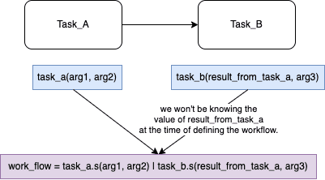
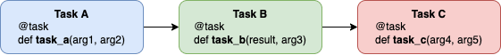
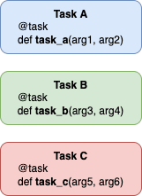
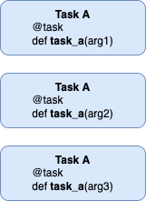
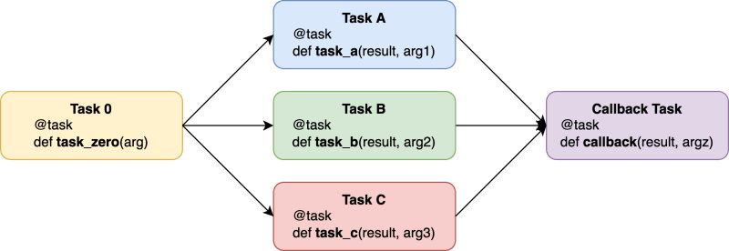
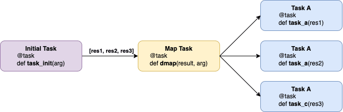
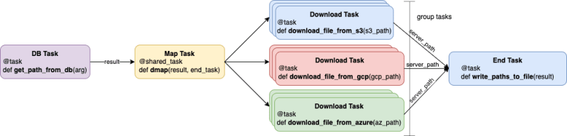

# Загадочный случай рабочих процессов с Celery


**Оригинальное название**: [The Curious Case of Celery Work-flows](https://dev.to/akarshan/the-curious-case-of-celery-work-flows-39f7)

**Автор**: [Akarshan Gandotra](https://dev.to/akarshan)

**Дата**: 21 марта 2022


Привет, сообщество! В то время как большинство людей сделали бы перерыв, я решил пропустить отдых и провести следующие несколько часов (в субботу), обсуждая реализацию различных случаев в рабочих процессах Celery. Я считаю, что документация немного сложна для понимания, поэтому я решил написать этот блог.

## Когда нужен рабочий процесс (workflow) Celery?

Если задачи Celery имеют некоторую зависимость друг от друга в зависимости от порядка выполнения. Порядок выполнения может быть определен исходя из:

* Задача должна быть запущена раньше другой
* Задача должна вернуть некоторые данные, важные для выполнения другой.
* Задачи необходимо выполнять параллельно, чтобы оптимизировать производительность.
* Условное выполнение задачи по результату предыдущей.

**Celery** — это мощная очередь задач, которая обеспечивает более сложный рабочий процесс, чем выполнение задачи. Рабочий процесс позволяет нам организовывать различные задачи.

## Назад к основам ⚡️

Пройдем курс повышения квалификации по **Celery**. Первое, что мы собираемся обсудить, — это термины, актуальные в контексте этого блога.

### Task против Subtask против Sharedtask

* [Task vs Subtask](https://stackoverflow.com/questions/39821099/whats-the-difference-between-celery-task-and-subtask)
* [Task vs Sharedtask](https://www.reddit.com/r/django/comments/s9iycj/celery\_whats\_the\_difference\_between\_apptask\_and/)

### &#x20;Сигнатура

Давайте рассмотрим пример, в котором нам нужно создать рабочий процесс **Celery**, в котором мы хотим, чтобы две задачи, например **Task\_A** и **Task\_B**, выполнялись одна за другой. **Task\_A** возвращает результат, который будет использован или запрошен **Task\_B**.

<figure><figcaption></figcaption></figure>

У нас не будет **result\_from\_task\_a** в качестве результата/возвращаемого значения предыдущей задачи (**Task A**) при определении рабочего процесса. Итак, здесь мы будем использовать сигнатуры, которые позволят нам предоставить заполнитель **placeholder** для аргумента. Сигнатуры могут быть записаны как

```python
task.signature(arg1, arg2...)
# или
task.s(arg1, arg2...)
```

## Варианты создания рабочего процесса Celery 💁

### 1. Выполнение задач сериями (цепочкой)

<figure><figcaption></figcaption></figure>

Это простой случай, когда мы хотим выполнять одну задачу за другой. Либо предыдущая задача возвращает некоторое значение, необходимое для текущей задачи, либо нам нужно создать рабочий процесс, в котором задачи выполняются последовательно.

Для этого используем цепочку **chain**. Функция chain принимает список сигнатур.

Предположим, нам нужно создать рабочий процесс, аналогичный приведенной выше диаграмме. Задача A возвращает результат, который затем передается задаче B. Рабочий процесс будет следующим:

```python
from celery import chain
from task import task_a, task_b, task_c

work_flow = chain(task_a(arg1, arg2), task_b(result, arg4, arg5), task_c(arg6, arg7))

# еще один способ выразить цепочку с помощью каналов

work_flow = task_a(arg1, arg2) | task_b(result, arg4) | task_c(arg5, arg6)
```

Обратите внимание, что первый аргумент **Task\_b** является результатом **Task\_a**.

### 2. Параллельное (групповое) выполнение задач.

<figure><figcaption></figcaption></figure>

Может быть случай, когда нам потребуется выполнять задачи параллельно. Мы можем параллельно запускать разные задачи или одну и ту же задачу с разными аргументами.

<figure><figcaption></figcaption></figure>

Мы используем **Group** для параллельного выполнения задач. Функция **group** принимает список сигнатур.

> Сценарии, в которых мы можем использовать группу Group:
>
> * Ожидание ответов от задач, связанных с операциями ввода/вывода, таких как чтение из БД, вызов внешнего API или загрузка файла из внешнего хранилища.
> * Выполнение тяжелых вычислений на разных узлах.

```python
from celery import group
from task import task_a, task_b, task_c

work_flow = group(task_a(arg1, arg2), task_b(arg4, arg5), task_c(arg6, arg7))

# выполнить одну и ту же задачу с разными аргументами в группе
work_flow = group(task_a(arg1), task_a(arg2), task_a(arg3))
```

### 3. Выполнение заданий как сериями, так и группой (сочетание цепи, группы и хорды).

<figure><figcaption></figcaption></figure>

Теперь поговорим о случае, когда у нас есть совокупность задач, которые необходимо выполнять как последовательно, так и параллельно. Рассматривая приведенную выше диаграмму рабочего процесса в качестве примера, мы можем дополнительно обсудить приведенные ниже подсценарии.

### 3.1 Выполнение задач перед групповыми задачами

Это тот случай, когда мы хотим запускать групповые задачи после выполнения задачи. Другими словами, нам нужно связать задачу с групповыми задачами. В данном случае мы используем **и group, и chain**. Наблюдая за диаграммой рабочего процесса, мы должны выполнить задачу **Task 0**, а после ее выполнения нам нужно запустить задачу **Task A**, задачу **Task B** и задачу **Task C**.

Рабочий процесс можно записать так:

```python
from celery import group, chain
from task import task_zero, task_a, task_b, task_c

work_flow = chain(
    task_zero,
    group(task_a(result, arg1), task_b(result, arg2), task_c(result, arg3))
)

# если мы хотим выразить цепочку с помощью каналов
work_flow = task_zero | group(task_a(result, arg1), task_b(result, arg2)
```

Обратите внимание, как **Task\_zero** передает результат задачам в группе.

### 3.2 Выполнение задач после групповых задач

После выполнения групповых задач другая задача объединяет возвращаемые ими результаты. Эта задача является обратным вызовом **callback** (или задачей обратного вызова **callback task**).

Мы используем **chord** для определения как групповых задач, так и задач обратного вызова. Он состоит из двух частей (заголовок **header** и обратный вызов **callback**). Заголовок **header** — это группа задач, тогда как обратный вызов **callback** — это задача, которая выполняется после завершения выполнения групповой задачи. Результаты групповых задач объединяются и передаются в задачу обратного вызова в качестве первого аргумента в виде **списка**. Диаграмма рабочего процесса требует, чтобы мы запускали задачу обратного вызова после задачи **Task A**, задачи **Task B** и задачи **Task C**.

Полный рабочий процесс можно записать как:

```python
from celery import group, chain, chord
from task import task_zero, task_a, task_b, task_c

header = group(task_a(result, arg1), task_b(result, arg2), task_c(result, arg3))

callback = callback(result, argz)

work_flow = chain(task_zero, chord(header)(callback))
```

### 4. Генерация групповых задач из цепочки задач (Map)

<figure><figcaption></figcaption></figure>

Вот интересный случай, когда мы хотим создать группу из списка, возвращаемого задачей, чтобы для каждого элемента в наборе результатов задачи была указана задача в группе.

Поясню на примере. Допустим, нам нужно перебрать файлы в корзине S3 (в момент выполнения задачи) и загрузить их на сервер. Для этого определим две задачи. Первая задача **get\_files\_from\_bucket** сгенерирует и вернет список путей к файлам в S3.

```python
[
    "s3://foo-bucket/path/to/file1",
    "s3://foo-bucket/path/to/file2",
    "s3://foo-bucket/path/to/file3",
]
```

Теперь для каждого пути в списке мы добавим в группу задачу **download\_file\_from\_s3** (еще одну задачу, отвечающую за загрузку файла с S3 на сервер). Эти групповые задачи затем могут выполняться параллельно и загружать файлы на сервер. Это отличается от версии **3.1**, поскольку здесь у нас есть ясность относительно задач, которые необходимо выполнить в группе при планировании или определении рабочего процесса. Но здесь групповые задачи, которые необходимо выполнить, определяются предыдущей задачей.

В данном случае мы будем использовать **Map**. Карта **map**, в отличие от хорды, цепочки и группы, сама по себе является задачей. Задача карты снабжена результатом и задачей, к которой применяется список аргументов, полученных из результата. Другими словами, карта создает временную задачу, к которой применяется список аргументов.

```python
from celery import subtask, group, shared_task

@shared_task
def dmap(result, some_task):
    # Задача Map с результатом и возвратом группы.

    # Подзадача — это задача, для которой параметры переданы, но она еще не запущена.
    some_task = subtask(some_task)
    # перебор результата и задачи клонирования

    group_task = group(some_task.clone([arg]) for arg in result)

    return group_task()
```

```python
from task import get_files_from_bucket, download_file_from_s3, dmap

work_flow = chain(get_files_from_bucket.s(), dmap.s(download_file_from_s3.s())
```

### Выполнение условных задач (Map)

Это тот случай, когда на основе результата задачи мы решаем, какую задачу выполнить следующей.

В примере предыдущего раздела мы скачиваем файл только с S3, нам нужно его расширить и на другие хранилища. У нас есть 3 типа задач:

1. Задача **get\_paths\_from\_db**, которая будет получать пути к файлам из базы данных. Эта задача вернет список путей.
2. Задача **download\_file\_from\_xxxx**, которая загружает файл по заданному пути на сервер из соответствующего хранилища. Эта задача вернет путь к файлу, по которому он был загружен на сервер.
3. Задача **write\_paths\_to\_file**, которая будет объединять и печатать пути к загруженному файлу в текстовый файл. Это задание, в свою очередь, действует как хорда.

<figure><figcaption></figcaption></figure>

```python
from celery import subtask, group, shared_task

@shared_task
def dmap(result, end_task):
    task_list = []
    for arg in result:
        storage = get_storage_from_path(arg)
        if storage == "s3":
            task = sub_task(download_file_from_s3.s(arg))
        elif storage == "gcp":
            task = sub_task(download_file_from_gcp.s(arg))
        elif storage == "azure":
            task = sub_task(download_file_from_azure.s(arg))
        else:
            pass
        task_list.append(task)

    group_task = group(task_list)
    pipeline = group_task | end_task
    return pipeline()
```

```python
from task import dmap, get_paths_from_db, callback

work_flow = dmap.s(get_paths_from_db.s(), write_paths_to_file.s())
```

Спасибо за чтение. Буду рад принять предложения в разделе комментариев.

Приветствую 🍻
