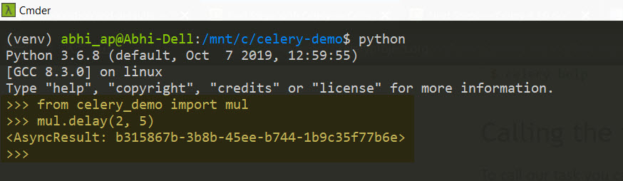

# Запуск Celery в Windows 10


**Оригинальное название**: Running Celery on Windows 10

**Ссылка**: [https://www.codedisciples.in/celery-windows.html](https://www.codedisciples.in/celery-windows.html)

**Автор**: [Abhishek Pednekar](https://codedisciples.in/author/abhishek-pednekar.html)

**Дата**: 22 октября 2019


Celery — это асинхронная очередь задач, которую довольно легко интегрировать с приложением Python. Для отправки и получения сообщений требуется очередь сообщений (также известная как брокер). Популярными брокерами являются Redis и RabbitMQ.

В этом посте мы увидим, как установить и запустить Celery с помощью подсистемы Windows для Linux (WSL) в Windows 10. В этом примере нашим брокером будет **Redis**. Мы также будем использовать расширение **Remote-WSL** в VS Code для разработки нашего приложения Python в среде Linux. Наконец, мы будем хранить результаты задач, выполненных Celery, в базе данных **SQLite**.

В этом посте предполагается, что читатель уже настроил WSL и установил Python и pip на WSL. Если нет, можно обратиться к приведенным ниже ресурсам, прежде чем продолжить:

1. [Setting up WSL](https://www.youtube.com/watch?v=xzgwDbe7foQ\&t=533s)
2. [Python setup on WSL](https://medium.com/@rhdzmota/python-development-on-the-windows-subsystem-for-linux-wsl-17a0fa1839d)

Теперь, когда у нас установлен Python с WSL, мы создадим виртуальную среду и установим необходимые зависимости. Для этой демонстрации мы используем консольное приложение **cmder**. Те же команды можно запускать в Ubuntu или других дистрибутивах Linux. В текущем примере мы откроем окно WSL в **cmder** для запуска команд.

1. Создайте виртуальную среду в папке проекта — `python3 -m venv venv`
2. Активируйте виртуальную среду - `source venv/bin/activate`
3. Установите библиотеки celery — redis и sqlalchemy — `pip3 install celery[redis] sqlalchemy`
4. Создайте файл требований — `pip3 freeze > requirements.txt`
5. Откройте папку проекта в VS Code через проводник или запустив `code .` в консоли

Как упоминалось ранее, мы будем использовать расширение **Remote-WSL** для запуска нашего кода в среде на базе Linux. Этот плагин можно установить с площадки VS Code.


После установки у нас будет возможность повторно открыть папку нашего проекта (Windows) в WSL.


Последнее, что нам нужно сделать перед написанием нашего кода, — это установить экземпляр сервера Redis локально. Выполнение следующих команд в **WSL** установит сервер **Redis server** на ваш компьютер.

```bash
sudo apt-get update
sudo apt-get upgrade
sudo apt-get install redis-server
```

После завершения установки мы перезапустим сервер с помощью `sudo service redis-server restart`, чтобы убедиться, что он работает.

Наш простой код состоит из функции, которая умножает два числа. Однако вместо того, чтобы печатать результат в REPL, мы позволим **Celery** выполнить задачу и сохранить результат в базе данных **SQLite**.

```python
# имя модуля - celery_demo.py

from celery import Celery

app = Celery("celery_demo", 
             broker="redis://localhost:6379",
             backend="db+sqlite:///results.db")

@app.task
def multiply(num1, num2):
    return num1 * num2
```

Давайте пройдемся по строчке за строчкой -

1. Сначала мы импортируем класс **Celery** из модуля **celery**.
2. Затем мы создаем экземпляр класса (называемый приложением) и передаем имя нашего модуля, которое в нашем случае **celery\_demo**, URL-адрес нашего сервера Redis (работает на локальном хосте с портом по умолчанию 6379) и, наконец, ссылку на нашу базу данных **SQLite**, которая будет хранить результаты задачи
3. Наконец, у нас есть функция, которая умножает два числа, переданные ей в качестве параметров, и возвращает их произведение. Обратите внимание, что функция декорирована `@app.task`, что позволит нам выполнить эту функцию/задачу с помощью нашего воркера **Celery**.

Затем мы запустим наш рабочий процесс **Celery**. Нам нужно убедиться, что мы находимся в виртуальной среде при выполнении приведенной ниже команды. Команда будет запущена в окне **WSL**. Обратите внимание, что мы передаем имя нашего модуля, аргумент **worker** и устанавливаем уровень ведения журнала с помощью аргумента **--loglevel**, что позволит нам видеть результаты в нашей консоли.

```bash
celery -A celery_demo worker --loglevel=info
```


Теперь мы вызовем нашу задачу в Python REPL, используя метод **delay()**. Вызов задачи вернет экземпляр **AsyncResult**, который имеет уникальный идентификатор. Опять же, мы будем использовать **WSL** для запуска REPL.



Если задача вызвана успешно, мы можем увидеть результат задачи, выполненной нашим воркером **Celery**.


На этом этапе наша база данных **SQLite** создана. Таблица **celery-taskmeta** будет хранить результаты всех наших задач. Задачи могут быть идентифицированы на основе **guid** экземпляра асинхронного результата. Результаты будут сохранены в двоичном формате (BLOB).


Вот удобочитаемая версия нашего результата BLOB.

```json
{
  "data": [
    128,
    4,
    149,
    3,
    0,
    0,
    0,
    0,
    0,
    0,
    0,
    75,
    10,
    46
  ],
  "type": "Buffer"
}
```
