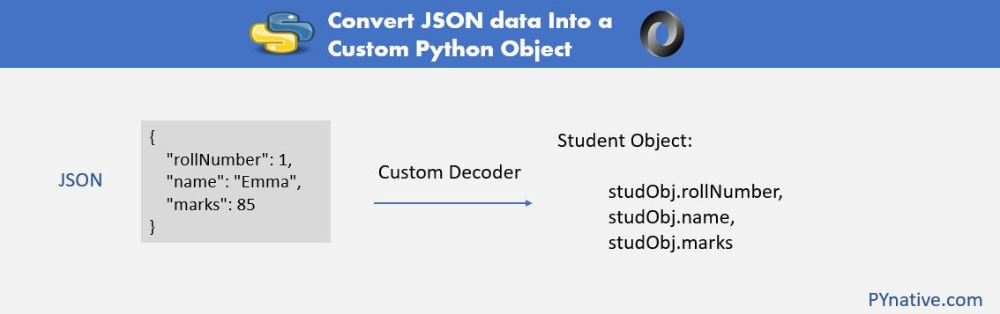

# Преобразование данных JSON в пользовательский объект Python


Ссылка на оригинальную статью: [Python Convert JSON data Into a Custom Python Object](https://pynative.com/python-convert-json-data-into-custom-python-object/)

Опубликовано: 14 мая 2021

Автор: [Vishal Hule](https://pynative.com/about-us/)


В этой статье мы **узнаем, как преобразовать данные JSON в собственный объект Python,** т. е. анализировать и конвертировать JSON в класс Python. Например, вы получаете данные JSON о сотрудниках из API или читаете JSON из файла и хотите преобразовать его в пользовательский тип Employee.

Вы знаете, как кодировать объект Python в JSON. Когда вы загружаете данные JSON из файла или строки с помощью методов [json.load() и json.loads()](https://pynative.com/python-json-load-and-loads-to-parse-json/), он возвращает dict.

Если мы загружаем данные JSON непосредственно в наш собственный тип, мы можем манипулировать ими и использовать их с меньшими усилиями. Существуют различные способы добиться этого. Вы можете выбрать способ, который считаете более полезным для вашей проблемы. Давайте посмотрим, как десериализовать строку JSON в пользовательский объект Python.


Дальнейшее чтение:

* Решите [упражнение Python JSON](https://pynative.com/python-json-exercise/), чтобы попрактиковаться в навыках Python JSON.


<figure><figcaption><p>Объяснение, как преобразовать JSON в пользовательский объект Python.</p></figcaption></figure>

### Использование namedtuple и object\_hook для преобразования данных JSON в пользовательский объект Python

Мы можем использовать параметр object\_hook методов `json.loads()` и `json.load()`. object\_hook — это необязательная функция, которая будет вызываться с результатом любого декодированного литерала объекта (словаря). Поэтому, когда мы выполняем `json.loads()`, вместо dict будет использоваться возвращаемое значение object\_hook. Используя эту функцию, мы можем реализовать собственные декодеры.

Чтобы преобразовать JSON в пользовательский тип Python, нам необходимо выполнить следующее:

Как мы знаем, методы `json.load()` и `json.loads()` преобразуют JSON в объект dict, поэтому нам нужно создать специальную функцию, в которой мы можем преобразовать dict в пользовательский тип Python. и передайте эту вновь созданную функцию параметру object\_hook метода json.loads. Поэтому мы можем получить собственный тип во время декодирования JSON.

Namedtuple — это класс в модуле коллекций. Как и объекты типа словаря, он содержит ключи, которые сопоставлены с некоторыми значениями. В этом случае мы можем получить доступ к элементам, используя ключи и индексы.

Давайте сначала посмотрим простой пример, а затем перейдем к практическому примеру. В этом примере мы преобразуем данные Student JSON в пользовательский тип Student Class.

```python
import json
from collections import namedtuple
from json import JSONEncoder

def customStudentDecoder(studentDict):
    return namedtuple('X', studentDict.keys())(*studentDict.values())

# Предположим, вы получили этот ответ в формате JSON.
studentJsonData = '{"rollNumber": 1, "name": "Emma"}'

# Разберите JSON в объект с атрибутами, соответствующими ключам dict
student = json.loads(studentJsonData, object_hook=customStudentDecoder)

print("After Converting JSON Data into Custom Python Object")
print(student.rollNumber, student.name)
```

Вывод:

```bash
After Converting JSON Data into Custom Python Object
1 Emma
```

Как видите, мы преобразовали данные JSON, которые присутствовали в формате JSON String, в пользовательский объект Python Student. Теперь мы можем получить доступ к его членам с помощью оператора точки `(.)`.

Теперь давайте посмотрим на сценарий работы со сложными объектами Python в реальном времени. И нам нужно **преобразовать пользовательский объект Python в JSON**. Кроме того, мы хотим **создать собственный объект Python из JSON**.

В этом примере мы используем два класса Student и Marks. Класс Marks является членом класса Student.

* Сначала мы кодируем класс Student в данные JSON.
* Затем мы используем те же данные JSON для декодирования их в класс Student.

Давайте теперь посмотрим пример.

<pre class="language-python"><code class="lang-python">import json
from collections import namedtuple
from json import JSONEncoder

class Student:
    def __init__(self, rollNumber, name, marks):
        self.rollNumber, self.name, self.marks = rollNumber, name, marks

class Marks:
    def __init__(self, english, geometry):
        self.english, self.geometry = english, geometry

class StudentEncoder(JSONEncoder):
        def default(self, o):
            return o.__dict__

def customStudentDecoder(studentDict):
    return namedtuple('X', studentDict.keys())(*studentDict.values())

marks = Marks(82, 74)
student = Student(1, "Emma", marks)

<strong># dumps() создает JSON в собственном формате str.
</strong># Если вы хотите записать это в файл, используйте dump()
studentJson = json.dumps(student, indent=4, cls=StudentEncoder)
print("Student JSON")
print(studentJson)

# Разберите JSON в объект с атрибутами, соответствующими ключам dict.
studObj = json.loads(studentJson, object_hook=customStudentDecoder)

print("After Converting JSON Data into Custom Python Object")
print(studObj.rollNumber, studObj.name, studObj.marks.english, studObj.marks.geometry)
</code></pre>

Вывод:

```bash
Student JSON
{
    "rollNumber": 1,
    "name": "Emma",
    "marks": {
        "english": 82,
        "geometry": 74
    }
}
After Converting JSON Data into Custom Python Object
1 Emma 82 74
```

### Использование types.SimpleNamespace и object\_hook для преобразования данных JSON в пользовательский объект Python

Мы можем использовать `types.SimpleNamespace` в качестве контейнера для объектов JSON. Он предлагает следующие преимущества по сравнению с решением Namedtuple:

* Время его выполнения меньше, поскольку для каждого объекта не создается класс.
* Это точно и очень просто

В этом примере мы будем использовать types.SimpleNamespace и object\_hook для преобразования данных JSON в пользовательский объект Python.

```bash
from __future__ import print_function
import json
from json import JSONEncoder
try:
    from types import SimpleNamespace as Namespace
except ImportError:
    # при падении в Python 2.x
    from argparse import Namespace

class Student:
    def __init__(self, rollNumber, name, marks):
        self.rollNumber, self.name, self.marks = rollNumber, name, marks

class Marks:
    def __init__(self, english, geometry):
        self.english, self.geometry = english, geometry

class StudentEncoder(JSONEncoder):
        def default(self, o): return o.__dict__

marks = Marks(82, 74)
student = Student(1, "Emma", marks)

# dumps() создает JSON в собственном формате str.
# Если вы хотите записать это в файл, используйте dump()
studentJsonData = json.dumps(student, indent=4, cls=StudentEncoder)
print("Student JSON")
print(studentJsonData)

# Разберите JSON в объект с атрибутами, соответствующими ключам dict.
studObj = json.loads(studentJsonData, object_hook=lambda d: Namespace(**d))
print("After Converting JSON Data into Custom Python Object using SimpleNamespace")
print(studObj.rollNumber, studObj.name, studObj.marks.english, studObj.marks.geometry)
```

Вывод:

```bash
Student JSON
{
    "rollNumber": 1,
    "name": "Emma",
    "marks": {
        "english": 82,
        "geometry": 74
    }
}
After Converting JSON Data into Custom Python Object using SimpleNamespace
1 Emma 82 74
```

### Использование декодирования объекта класса JSONDecoder для преобразования данных JSON в пользовательский объект Python

Мы можем использовать класс `json.JSONDecoder` модуля json для специализации декодирования объекта JSON. Здесь мы можем декодировать объект JSON в пользовательский тип Python.

Нам нужно создать новую функцию в классе, которая будет отвечать за проверку типа объекта в строке JSON. После получения правильного типа в данных JSON мы сможем построить наш объект.

Давайте посмотрим пример.

```python
import json

class Student(object):
    def __init__(self, rollNumber, name, marks):
        self.rollNumber = rollNumber
        self.name = name
        self.marks = marks

def studentDecoder(obj):
    if '__type__' in obj and obj['__type__'] == 'Student':
        return Student(obj['rollNumber'], obj['name'], obj['marks'])
    return obj

studentObj = json.loads(
    '{"__type__": "Student", "rollNumber":1, "name": "Ault kelly", "marks": 78}',
    object_hook=studentDecoder
)

print("Type of decoded object from JSON Data")
print(type(studentObj))
print("Student Details")
print(studentObj.rollNumber, studentObj.name, studentObj.marks)
```

Вывод:

```bash
Type of decoded object from JSON Data
<class '__main__.Student'>
Student Details
1 Ault kelly 78
```

### Использование модуля jsonpickle для преобразования данных JSON в пользовательский объект Python

jsonpickle — это библиотека Python, предназначенная для работы со сложными объектами Python. Вы можете использовать jsonpickle для сериализации и десериализации сложных данных Python и JSON. Для получения более подробной информации вы можете обратиться к [документации Jsonpickle](https://jsonpickle.github.io/).

Встроенный модуль JSON Python может обрабатывать только примитивы Python. Для любого пользовательского объекта Python нам нужно написать собственные JSONEncoder и Decoder.

Используя jsonpickle, мы сделаем следующее:

* Сначала мы закодируем объект Student в JSON, используя jsonpickle.
* Затем мы декодируем Student JSON в Student Object.

Теперь давайте посмотрим на пример jsonpickle для преобразования данных JSON в пользовательский объект Python.

```python
import json
import jsonpickle
from json import JSONEncoder

class Student(object):
    def __init__(self, rollNumber, name, marks):
        self.rollNumber = rollNumber
        self.name = name
        self.marks = marks

class Marks(object):
    def __init__(self, english, geometry):
        self.english = english
        self.geometry = geometry

marks = Marks(82, 74)
student = Student(1, "Emma", marks)

print("Encode Object into JSON formatted Data using jsonpickle")
studentJSON = jsonpickle.encode(student)
print(studentJSON)

print("Decode and Convert JSON into Object using jsonpickle")
studentObject = jsonpickle.decode(studentJSON)
print("Object type is: ", type(studentObject))

print("Student Details")
print(
    studentObject.rollNumber, studentObject.name, studentObject.marks.english,
    studentObject.marks.geometry
)
```

Вывод:

```bash
Encode Object into JSON formatted Data using jsonpickle
{"marks": {"english": 82, "geometry": 74, "py/object": "__main__.Marks"}, "name": "Emma", "py/object": "__main__.Student", "rollNumber": 1}
Decode JSON formatted Data using jsonpickle
1 Emma 82 74
```

### Создание нового объекта и передача словаря результатов в виде карты для преобразования данных JSON в пользовательский объект Python.

Как мы знаем, методы `json.loads()` и `json.load()` возвращают объект dict. Мы можем создать новый пользовательский объект, передав объект dict в качестве параметра конструктору объекта Student. То есть мы можем сопоставить объект dict с пользовательским объектом.

```python
import json
from json import JSONEncoder

class Student(object):
    def __init__(self, rollNumber, name, *args, **kwargs):
        self.rollNumber = rollNumber
        self.name = name

class StudentEncoder(JSONEncoder):
        def default(self, o):
            return o.__dict__

student = Student(1, "Emma")

# закодировать Object
studentJson = json.dumps(student, cls=StudentEncoder, indent=4)

# Декодировать JSON
resultDict = json.loads(studentJson)

print("Converting JSON into Python Object")
studentObj = Student(**resultDict)

print("Object type is: ", type(studentObj))

print("Student Details")
print(studentObj.rollNumber, studentObj.name)
```

Вывод:

```bash
Converting JSON into Python Object
Object type is:  <class '__main__.Student'>
Student Details
1 Emma
```

### Итак. Что ты думаешь?

Я хочу услышать от вас. Что вы думаете об этой статье? Или, может быть, я пропустил один из способов преобразования данных JSON в пользовательский объект Python. В любом случае, дайте мне знать, **оставив комментарий ниже**.

Кроме того, попробуйте выполнить [упражнение Python JSON](https://pynative.com/python-json-exercise/), чтобы лучше понять [работу с данными JSON в Python](https://pynative.com/python/json/).
