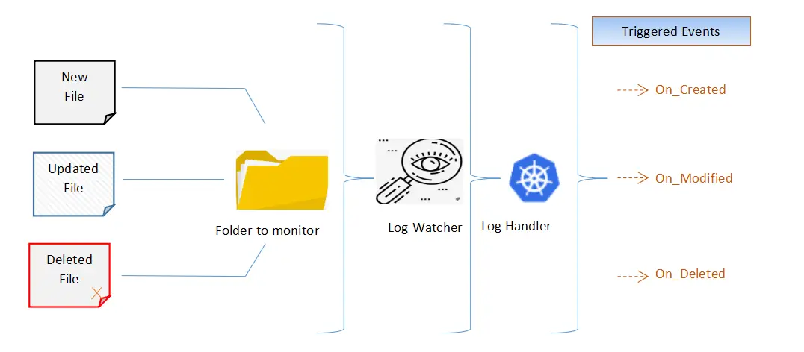
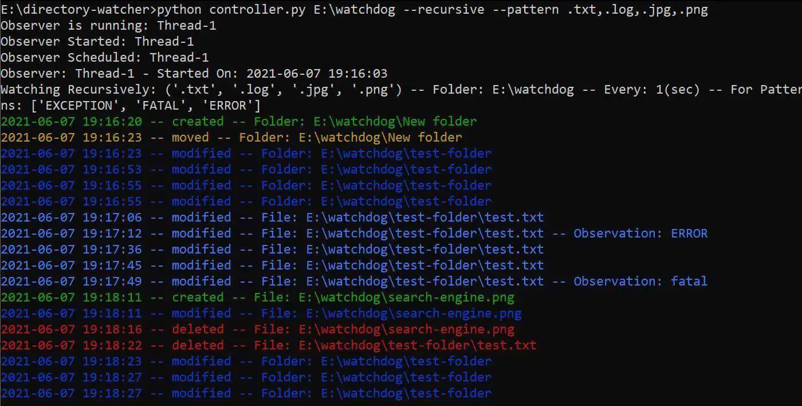

# Как создать Watchdog в Python


Ссылка на оригинальную статью: [How to Create a Watchdog in Python](https://www.thepythoncode.com/article/create-a-watchdog-in-python)

Опубликовано: август 2022

Авторы:   [Bassem Marji ](https://www.thepythoncode.com/author/bassem-marji)· [Abdou Rockikz](https://www.thepythoncode.com/author/abdou-rockikz)


_Узнайте, как отслеживать события в вашей файловой системе, создав сторожевой таймер на Python с помощью библиотек **watchdog** и **pygtail**._

При разработке программного обеспечения ведение журнала приложений играет ключевую роль. Как бы мы ни хотели, чтобы наше программное обеспечение было совершенным, проблемы всегда будут возникать, поэтому важно иметь надежный мониторинг и ведение журнала, чтобы контролировать и управлять неизбежным хаосом.

В настоящее время инженеры по поддержке приложений должны иметь возможность легко получать доступ и анализировать огромные объемы данных журналов, генерируемых их приложениями и инфраструктурой. Когда возникает проблема, они не могут позволить себе ждать минуту или две, пока запрос не вернет результаты. Им нужна скорость, независимо от объема данных, которые они собирают и запрашивают.

В этом уроке вы узнаете, как создать сторожевой таймер в Python; мы объясним, как обнаруживать изменения в определенном каталоге (предположим, что это каталог, в котором хранятся журналы вашего приложения (приложений)). Всякий раз, когда происходит изменение, измененные или вновь созданные файлы предопределенных типов будут своевременно обработаны для извлечения строк, соответствующих заданным шаблонам.

С другой стороны, все строки в этих файлах, которые не соответствуют указанным шаблонам, считаются выбросами и отбрасываются в нашем анализе.

Мы будем использовать библиотеки [watchdog](https://pypi.org/project/watchdog/) и [pygtail](https://pypi.org/project/pygtail/) для обнаружения происходящих изменений, также существует версия Flask, Redis и SocketIO, где веб-приложение с графическим интерфейсом создается для той же цели, вы всегда можете обратиться к нему [здесь](https://github.com/bassemmarji/Flask\_Log\_Inspector).

## График процесса

<figure><figcaption></figcaption></figure>

Для начала установим requirements:

```python
$ pip3 install Pygtail==0.11.1 watchdog==2.1.1
```

Во-первых, давайте определим параметры конфигурации для нашего приложения в `config.py`:

```python
# Файл конфигурации приложения
################################
# Каталог для наблюдения. Если не указано, следующее значение будет учитываться явно.
WATCH_DIRECTORY = "C:\\SCRIPTS"
# Задержка между циклами просмотра в секундах
WATCH_DELAY = 1
# Проверять WATCH_DIRECTORY и его дочерние элементы.
WATCH_RECURSIVELY = False
# следить ли за событиями каталога
DO_WATCH_DIRECTORIES = True
# Шаблоны файлов для просмотра
WATCH_PATTERN = '.txt,.trc,.log'
LOG_FILES_EXTENSIONS = ('.txt', '.log', '.trc')
# Шаблоны для наблюдений
EXCEPTION_PATTERN = ['EXCEPTION', 'FATAL', 'ERROR']

```

Параметры в `config.py` будут параметрами по умолчанию, позже в скрипте мы можем переопределить их, если захотим.

Далее давайте определим механизм проверки, этот механизм будет использовать модули **pygtail** и **re** для точного определения наблюдений на основе параметра **EXCEPTION\_PATTERN**, который мы только что определили в `config.py`:

```python
import datetime
from pygtail import Pygtail

# Загрузка пакета с именем re из модуля RegEx для работы с регулярными выражениями
import re

class FileChecker:
    def __init__(self, exceptionPattern):
        self.exceptionPattern = exceptionPattern

    def checkForException(self, event, path):
        # Получить текущую дату и время в соответствии с указанным форматом.
        now = (datetime.datetime.now()).strftime("%Y-%m-%d %H:%M:%S")
        # Прочитать строки файла (указанные в пути), которые еще не были прочитаны
        # Это означает, что он начнется с того места, где он был
        # в последний раз остановлен.
        for num, line in enumerate(Pygtail(path), 1):
            # Удалите начальные и конечные пробелы, включая символы новой строки.
            line = line.strip()
            # Возвращает все непересекающиеся совпадения значений,
            # указанных в шаблоне исключения.
            # Строка сканируется слева направо, и совпадения возвращаются
            # в том порядке, в котором они были найдены.
            if line and any(
                re.findall('|'.join(self.exceptionPattern), line, flags=re.I | re.X)
            ):
                # Обнаружено наблюдение
                type = 'observation'
                msg = f"{now} -- {event.event_type} -- File = {path} -- Observation: {line}"
                yield type, msg
            elif line:
                # Наблюдение не обнаружено
                type = 'msg'
                msg = f"{now} -- {event.event_type} -- File = {path}"
                yield type, msg
```

Метод `checkForException()`, определенный в приведенном выше коде, будет принимать события, отправленные классом наблюдателя модуля **watchdog** (будет рассмотрено позже).

Эти события будут срабатывать при любом изменении файла в данном каталоге, объект события имеет 3 атрибута:

* **event\_type**: тип события в виде строки (modified, created, moved или deleted).
* **is\_directory**: логическое значение, указывающее, было ли событие сгенерировано для каталога.
* **src\_path**: исходный путь к объекту файловой системы, вызвавшему событие.

Теперь давайте определим наш `controller.py`, во-первых, давайте импортируем библиотеки:

```python
# Наблюдатель Observer следит за любым изменением файла и затем отправляет
# соответствующие события обработчику событий.
from watchdog.observers import Observer
# Обработчик событий будет уведомлен, когда произойдет событие.
from watchdog.events import FileSystemEventHandler
import time
import config
import os
from checker import FileChecker
import datetime
from colorama import Fore, init

init()

GREEN = Fore.GREEN
BLUE = Fore.BLUE
RESET = Fore.RESET
RED = Fore.RED
YELLOW = Fore.YELLOW

event2color = {
    "created": GREEN,
    "modified": BLUE,
    "deleted": RED,
    "moved": YELLOW,
}

def print_with_color(s, color=Fore.WHITE, brightness=Style.NORMAL, **kwargs):
    """Вспомогательная функция, обертывающая обычную функцию `print()`,
    но с цветами и яркостью"""
    print(f"{brightness}{color}{s}{Style.RESET_ALL}", **kwargs)
```

Мы будем [использовать colorama](https://www.thepythoncode.com/article/change-text-color-in-python), чтобы различать разные события с помощью цветов текста. Чтобы узнать больше о **colorama**, ознакомьтесь с [этим руководством](https://www.thepythoncode.com/article/change-text-color-in-python).

Далее давайте определим наш обработчик событий:

```python
# Класс, наследуемый от FileSystemEventHandler для обработки событий,
# отправляемых наблюдателем.
class LogHandler(FileSystemEventHandler):

    def __init__(self, watchPattern, exceptionPattern, doWatchDirectories):
        self.watchPattern = watchPattern
        self.exceptionPattern = exceptionPattern
        self.doWatchDirectories = doWatchDirectories
        # Создайте экземпляр средства проверки
        self.fc = FileChecker(self.exceptionPattern)

    def on_any_event(self, event):
        now = (datetime.datetime.now()).strftime("%Y-%m-%d %H:%M:%S")
        # print("event happened:", event)
        # Наблюдать только за файлами, а не за каталогами
        if not event.is_directory:
            # Для обслуживания события on_move
            path = event.src_path
            if hasattr(event, 'dest_path'):
                path = event.dest_path
            # Убедитесь, что расширение файла входит в число предопределенных.
            if path.endswith(self.watchPattern):
                msg = f"{now} -- {event.event_type} -- File: {path}"
                if event.event_type in ('modified', 'created', 'moved'):
                    # проверить наличие исключений в лог-файлах
                    if path.endswith(config.LOG_FILES_EXTENSIONS):
                        for type, msg in self.fc.checkForException(event=event, path=path):
                            print_with_color(msg, color=event2color[event.event_type])
                    else:
                        print_with_color(msg, color=event2color[event.event_type])
                else:
                    print_with_color(msg, color=event2color[event.event_type])
        elif self.doWatchDirectories:
            msg = f"{now} -- {event.event_type} -- Folder: {event.src_path}"
            print_with_color(msg, color=event2color[event.event_type])

    def on_modified(self, event):
        pass

    def on_deleted(self, event):
        pass

    def on_created(self, event):
        pass

    def on_moved(self, event):
        pass
```

Класс **LogHandler** наследуется от класса с именем **FileSystemEventHandler** библиотеки сторожевого таймера и в основном перезаписывает его метод `on_any_event()`.

Ниже приведены некоторые полезные методы, если этот класс:

* `on_any_event()`: вызывается для любого события.
* `on_created()`: вызывается при создании файла или каталога.
* `on_modified()`: вызывается при изменении файла или переименовании каталога.
* `on_deleted()`: вызывается при удалении файла или каталога.
* `on_moved()`: вызывается при перемещении файла или каталога.

Код, выделенный для метода `on_any_event()`, будет:

* Наблюдает за файлами и каталогами.
* Проверяет, что расширение файла, связанного с событием, входит в число предварительно определенных в переменной **WATCH\_PATTERN** в `config.py`.
* Создает сообщение, иллюстрирующее событие или наблюдение, если оно обнаружено.

Теперь давайте напишем наш класс **LogWatcher**:

```python
class LogWatcher:
    # Инициализировать наблюдатель
    observer = None
    # Инициализируйте переменную стоп-сигнала
    stop_signal = 0
    # Наблюдатель — это класс, который отслеживает любое изменение файловой системы,
    # а затем отправляет событие обработчику событий.
    def __init__(
        self, watchDirectory, watchDelay, watchRecursively, watchPattern,
        doWatchDirectories, exceptionPattern, sessionid, namespace
    ):
        # Инициализировать переменные в отношении
        self.watchDirectory = watchDirectory
        self.watchDelay = watchDelay
        self.watchRecursively = watchRecursively
        self.watchPattern = watchPattern
        self.doWatchDirectories = doWatchDirectories
        self.exceptionPattern = exceptionPattern
        self.namespace = namespace
        self.sessionid = sessionid

        # Создайте экземпляр watchdog.observer
        self.observer = Observer()
        # Обработчик событий — это объект, который будет уведомлен, когда что-то
        # произойдет с файловой системой.
        self.event_handler = LogHandler(
            watchPattern, exceptionPattern, self.doWatchDirectories
        )

    def schedule(self):
        print("Observer Scheduled:", self.observer.name)
        # Вызов функции расписания через экземпляр Observer, присоединяющий событие
        self.observer.schedule(
            self.event_handler, self.watchDirectory, recursive=self.watchRecursively
        )

    def start(self):
        print("Observer Started:", self.observer.name)
        self.schedule()
        # Запускает поток наблюдателя и ждет, пока он сгенерирует события.
        now = (datetime.datetime.now()).strftime("%Y-%m-%d %H:%M:%S")
        msg = f"Observer: {self.observer.name} - Started On: {now} - Related To Session: {self.sessionid}"
        print(msg)

        msg = (
            f"Watching {'Recursively' if self.watchRecursively else 'Non-Recursively'}: {self.watchPattern}"
            f" -- Folder: {self.watchDirectory} -- Every: {self.watchDelay}(sec) -- For Patterns: {self.exceptionPattern}"
        )
        print(msg)
        self.observer.start()

    def run(self):
        print("Observer is running:", self.observer.name)
        self.start()
        try:
            while True:
                time.sleep(self.watchDelay)

                if self.stop_signal == 1:
                    print(
                        f"Observer stopped: {self.observer.name}  stop signal:{self.stop_signal}")
                    self.stop()
                    break
        except:
            self.stop()
        self.observer.join()

    def stop(self):
        print("Observer Stopped:", self.observer.name)

        now = (datetime.datetime.now()).strftime("%Y-%m-%d %H:%M:%S")
        msg = f"Observer: {self.observer.name} - Stopped On: {now} - Related To Session: {self.sessionid}"
        print(msg)
        self.observer.stop()
        self.observer.join()

    def info(self):
        info = {
            'observerName': self.observer.name,
            'watchDirectory': self.watchDirectory,
            'watchDelay': self.watchDelay,
            'watchRecursively': self.watchRecursively,
            'watchPattern': self.watchPattern,
        }
        return info
```

Вот что мы сделали в классе **LogWatcher**:

* Создали экземпляр класса потока **watchdog.observer**, наблюдатель следит за любыми изменениями в файловой системе, а затем отправляет соответствующее событие обработчику событий.
* Создали экземпляр обработчика событий **LogHandler**, который наследуется от **FileSystemEventHandler**. Обработчик событий уведомляется, когда происходят какие-либо изменения.
* Назначили расписание нашему наблюдателю и определили другие входные параметры, такие как каталог для просмотра, режим просмотра и другие. Имейте в виду, что при установке для параметра **recursive** значения `True` вы должны убедиться, что у вас есть достаточные права доступа к подпапкам.

Наконец, давайте создадим аргументы командной строки вокруг кода, используя **argparse**:

```python
def is_dir_path(path):
    """Вспомогательная функция для проверки того, является ли путь фактическим каталогом"""
    if os.path.isdir(path):
        return path
    else:
        raise NotADirectoryError(path)

if __name__ == "__main__":
    import argparse
    parser = argparse.ArgumentParser(
        description="Watchdog script for watching for files & directories' changes")
    parser.add_argument("path",
                        default=config.WATCH_DIRECTORY,
                        type=is_dir_path,
                        )
    parser.add_argument("-d", "--watch-delay",
                        help=f"Watch delay, default is {config.WATCH_DELAY}",
                        default=config.WATCH_DELAY,
                        type=int,
                        )
    parser.add_argument("-r", "--recursive",
                        action="store_true",
                        help=f"Whether to recursively watch for the path's children, default is {config.WATCH_RECURSIVELY}",
                        default=config.WATCH_RECURSIVELY,
                        )
    parser.add_argument("-p", "--pattern",
                        help=f"Pattern of files to watch, default is {config.WATCH_PATTERN}",
                        default=config.WATCH_PATTERN,
                        )
    parser.add_argument("--watch-directories",
                        action="store_true",
                        help=f"Whether to watch directories, default is {config.DO_WATCH_DIRECTORIES}",
                        default=config.DO_WATCH_DIRECTORIES,
                        )
    # проанализировать аргументы
    args = parser.parse_args()
    # определить и запустить наблюдатель журнала
    log_watcher = LogWatcher(
        watchDirectory=args.path,
        watchDelay=args.watch_delay,
        watchRecursively=args.recursive,
        watchPattern=tuple(args.pattern.split(",")),
        doWatchDirectories=args.watch_directories,
        exceptionPattern=config.EXCEPTION_PATTERN,
    )
    log_watcher.run()
```

Мы определили `is_dir_path()`, чтобы гарантировать, что введенный путь является допустимым каталогом. Давайте используем скрипт:

<figure><figcaption></figcaption></figure>

Я передал **--recursive** для просмотра всего, что происходит в каталоге `E:\watchdog`, включая подпапки, я также указал шаблон `.txt, .log, .jpg, .png` для просмотра текстовых и графических файлов.

Потом создал папку и начал писать в текстовый файл, потом переместил изображение и удалил его, сторожевой таймер все ловит!

Обратите внимание, что у вас может быть возможность переопределить параметры в `config.py` или передать параметры здесь.

## Заключение

Я надеюсь, что эта статья помогла вам после того, как мы подробно изучили доступные функции библиотек [watchdog](https://pythonhosted.org/watchdog/) и [pygtail](https://pypi.org/project/pygtail/).

Стоит отметить, что, расширив описанные функции, вы можете связать механизм оповещения или воспроизводить звук всякий раз, когда в одном из ваших файлов журнала возникает фатальная ошибка. Таким образом, когда наблюдение точно определено, настроенный рабочий процесс или оповещение будут запускаться автоматически.

Вы можете расширить функции, разработанные в этом руководстве, добавив механизм оповещения, основанный на шаблонах, обнаруженных в отслеживаемых файлах; это может быть достигнуто с использованием нескольких механизмов, таких как:

* [Отправка предупреждения по электронной почте с помощью встроенной библиотеки Python smtplib](https://www.thepythoncode.com/article/sending-emails-in-python-smtplib).
* Создание звукового сигнала в Python с использованием [библиотеки Simpleaudio](https://pypi.org/project/simpleaudio/).
* Отправка уведомлений в Slack с помощью [библиотеки KnockKnock](https://pypi.org/project/knockknock/).

Проверьте полный код [здесь](https://www.thepythoncode.com/code/create-a-watchdog-in-python).

Наконец, если вы новичок и хотите изучать Python, я предлагаю вам пройти [курс Python для всех Coursera](https://coursera.pxf.io/yRPNqb), в ходе которого вы узнаете много нового о Python. Вы также можете проверить нашу [страницу ресурсов и курсов](https://www.thepythoncode.com/resources), чтобы увидеть ресурсы Python, которые я рекомендую по различным темам!

Связано: [Logging in Python](https://www.thepythoncode.com/article/logging-in-python).
