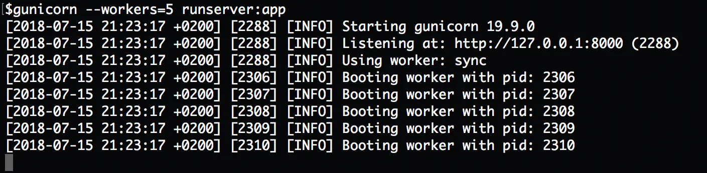
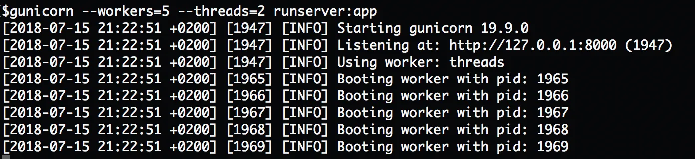

# Повышение производительности за счет оптимизации конфигурации Gunicorn


Ссылка на оригинальную статью: [Better performance by optimizing Gunicorn config](https://medium.com/building-the-system/gunicorn-3-means-of-concurrency-efbb547674b7)

Опубликовано: 16 июля 2018

Авторы: [Omar Rayward](https://medium.com/@orayward?source=post\_page-----efbb547674b7--------------------------------)


> TL;DR, для приложений, ограниченных ЦП, увеличьте число рабочих и/или ядер. Для приложений, ограниченных вводом-выводом, используйте «псевдопотоки».

<figure><figcaption></figcaption></figure>

[Gunicorn](http://gunicorn.org/) — это HTTP-сервер Python WSGI, который обычно находится между [обратным прокси-сервером](https://en.wikipedia.org/wiki/Reverse\_proxy) (например, Nginx) или [балансировщиком нагрузки](https://f5.com/glossary/load-balancer) (например, [AWS ELB](https://aws.amazon.com/elasticloadbalancing/)) и веб-приложением, таким как Django или Flask.

## Архитектура Gunicorn

Gunicorn реализует веб-сервер, предшествующий форку UNIX.

Отлично, что это значит?

* Gunicorn запускает один главный процесс, который разветвляется, а полученные дочерние процессы становятся рабочими.
* Роль главного процесса — следить за тем, чтобы количество воркеров было таким же, как указано в настройках. Таким образом, если кто-либо из воркеров умирает, главный процесс запускает другой, снова разветвляя себя.
* Роль воркеров заключается в обработке HTTP-запросов.
* Pre в pre-fork означает, что главный процесс создает рабочие процессы перед обработкой любого HTTP-запроса.
* Ядро ОС обеспечивает балансировку нагрузки между рабочими процессами.

Чтобы повысить производительность при использовании Gunicorn, нам нужно учитывать три способа параллелизма.

## 1-е значение конкурентности (воркеры, иначе UNIX-процессы)

Каждый из рабочих процессов представляет собой процесс UNIX, загружающий приложение Python. Между воркерами нет общей памяти.

Рекомендуемое количество workers — `(2*CPU)+1`.

Для двухъядерной машины (2 CPU) рекомендуемое значение workers — 5.

```bash
gunicorn --workers=5 main:app
```

<figure><figcaption><p>Gunicorn с классом worker по умолчанию (sync). Обратите внимание на четвертую строку на изображении: "Using worker: sync".</p></figcaption></figure>

## 2-е значение конкурентности (потоки)

Gunicorn также позволяет каждому из рабочих процессов иметь несколько потоков. В этом случае приложение Python загружается один раз для каждого рабочего процесса, и каждый из потоков, созданных одним и тем же рабочим процессом, использует одно и то же пространство памяти.

Чтобы использовать потоки с Gunicorn, мы используем настройку threads. Каждый раз, когда мы используем threads, класс воркера устанавливается на gthread:

```bash
gunicorn --workers=5 --threads=2 main:app
```

<figure><figcaption><p>Gunicorn с настройкой потоков, которая использует класс воркера gthread. Обратите внимание на четвертую строку на изображении: "Using worker: threads".</p></figcaption></figure>

Предыдущая команда аналогична:

```bash
gunicorn --workers=5 --threads=2 --worker-class=gthread main:app
```

Максимальное количество одновременных запросов — в нашем случае workers \* threads = 10.

Рекомендуемое максимальное количество одновременных запросов при использовании воркеров и потоков по-прежнему равно `(2*CPU)+1`.

Итак, если мы используем четырехъядерный компьютер (4 CPU) и хотим использовать сочетание рабочих процессов и потоков, мы можем использовать 3 рабочих процесса и 3 потока, чтобы получить максимальное количество одновременных запросов 9.

```bash
gunicorn --workers=3 --threads=3 main:app
```

## 3-е значение конкурентности («псевдопотоки»)

Существуют некоторые библиотеки Python, такие как [gevent](http://www.gevent.org/) и [Asyncio](https://docs.python.org/3/library/asyncio.html), которые обеспечивают параллелизм в Python с помощью «псевдопотоков», реализованных с помощью [сопрограмм](https://en.wikipedia.org/wiki/Coroutine).

Gunicorn позволяет использовать эти асинхронные библиотеки Python, устанавливая соответствующий  класс воркера.

Вот настройки, которые будут работать для одноядерной машины, которую мы хотим запустить с помощью gevent:

```bash
gunicorn --worker-class=gevent --worker-connections=1000 --workers=3 main:app
```

> worker-connections — это особый параметр рабочего класса gevent.

`(2*CPU)+1` по-прежнему является рекомендуемым рабочим процессом, поскольку у нас только 1 ядро, поэтому мы будем использовать 3 рабочих процесса.

В этом случае максимальное количество одновременных запросов составляет 3000 (3 воркера \* 1000 подключений на каждого воркера).

## Конкурентность против параллелизма

* Конкурентность — это когда две или более задач выполняются одновременно, что может означать, что только одна из них работает, а остальные приостановлены.
* Параллелизм — это когда две или более задачи выполняются одновременно.

В Python потоки и псевдопотоки являются средством конкурентности, но не параллелизма; в то время как воркеры являются средством как конкурентности, так и параллелизма.

Это все хорошая теория, но что мне следует использовать в своей программе?

## Практические примеры использования

Устанавливая настройки Gunicorn, мы хотим оптимизировать производительность приложения.

1. Если приложение [ограничено вводом-выводом](https://en.wikipedia.org/wiki/I/O\_bound), наилучшая производительность обычно достигается за счет использования «псевдопотоков» (gevent или asyncio). Как мы видели, Gunicorn поддерживает эту парадигму программирования, устанавливая соответствующий класс воркера и изменяя значение workers на `(2*CPU)+1`.
2. Если приложение [ограничено CPU](https://en.wikipedia.org/wiki/CPU-bound), не имеет значения, сколько одновременных запросов обрабатывается приложением. Единственное, что имеет значение — это количество параллельных запросов. Из-за [GIL Python](https://wiki.python.org/moin/GlobalInterpreterLock) потоки и «псевдопотоки» не могут работать параллельно. Единственный способ добиться параллелизма — увеличить количество воркеров до предложенного `(2*CPU)+1`, понимая, что максимальное количество параллельных запросов — это количество ядер.
3. Если есть опасения по поводу [объема памяти](https://en.wikipedia.org/wiki/Memory\_footprint) приложения, использование threads и соответствующего ему рабочего класса gthread в пользу workers дает лучшую производительность, поскольку приложение загружается один раз для каждого рабочего процесса, и каждый поток, выполняющийся на воркере, разделяет некоторую память, это приводит к расходам некоторого дополнительного потребления процессора.
4. Если вы не знаете, что делаете, начните с самой простой конфигурации, которая устанавливает для workers только значение `(2*CPU)`+1 и не беспокойтесь о потоках. С этого момента бенчмаркинг проводится методом проб и ошибок. Если узким местом является память, начните вводить threads. Если узким местом является ввод-вывод, рассмотрите другую парадигму программирования на Python. Если узким местом является CPU, рассмотрите возможность использования большего количества ядер и корректировки значения workers.

## Построение системы

Мы, разработчики программного обеспечения, обычно думаем, что любое узкое место в производительности можно устранить путем оптимизации кода приложения, но это не всегда так.

Бывают случаи, когда настройка параметров HTTP-сервера, использование большего количества ресурсов или перепроектирование приложения для использования другой парадигмы программирования — это решения, необходимые для повышения общей производительности приложения.

В этом случае построение системы означает понимание типов вычислительных ресурсов (процессов, потоков и «псевдопотоков»), которые у нас есть для развертывания производительного приложения.

Понимая, разрабатывая и реализуя правильное техническое решение с использованием правильных ресурсов, мы избегаем попадания в ловушку попыток повысить производительность за счет оптимизации кода приложения.

## Рекомендации

1. Gunicorn портирован из проекта Ruby [Unicorn](https://bogomips.org/unicorn/). Его [схема дизайна](https://bogomips.org/unicorn/DESIGN.html) помогла прояснить некоторые из наиболее фундаментальных концепций. [Архитектура Gunicorn](http://docs.gunicorn.org/en/latest/design.html) закрепила некоторые из этих концепций.
2. [Мнение в блоге](https://tomayko.com/blog/2009/unicorn-is-unix) о том, что Unicorn перенес некоторые из наиболее важных функций на Unix, это хорошо.
3. Ответ на вопрос Stack Overflow о модели pre-fork веб-сервера.
4. [Еще](https://github.com/benoitc/gunicorn/issues/1045) [несколько](https://stackoverflow.com/questions/38425620/gunicorn-workers-and-threads) [ссылок](http://docs.gunicorn.org/en/stable/settings.html), чтобы понять, как точно настроить Gunicorn.
