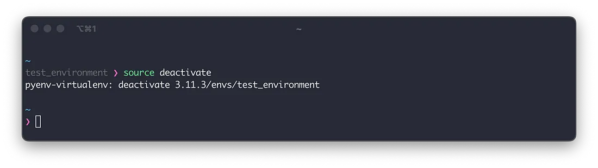
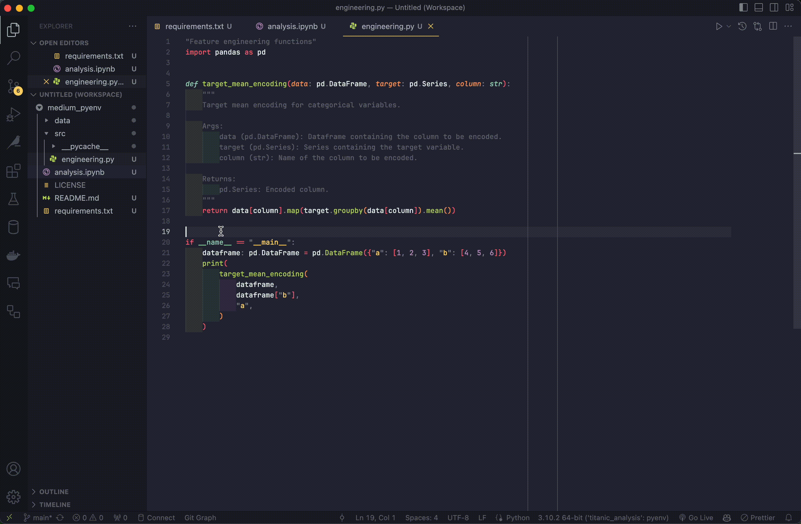

# Как управлять виртуальными средами Python


Ссылка на оригинальную статью: [How To Manage Your Python Virtual Environments](https://medium.com/@adocquin/mastering-python-virtual-environments-with-pyenv-and-pyenv-virtualenv-c4e017c0b173)

Опубликовано: 27 сентября 2023

Авторы: [Avel Docquin](https://medium.com/@adocquin?source=post\_page-----c4e017c0b173--------------------------------)


Работая над проектами и блокнотами Python, вы, возможно, пытались запустить проект, требующий Python 3.6, но в вашей системе установлен только Python 3.8. Или запустить скрипт, требующий определенную версию пакета, которая конфликтует с другой ранее установленной версией.

Чтобы избежать этих проблем, вы можете использовать [pyenv](https://github.com/pyenv/pyenv) и [pyenv-virtualenv](https://github.com/pyenv/pyenv-virtualenv). Pyenv позволит вам легко переключаться между несколькими версиями Python и pyenv-virtualenv для создания изолированных виртуальных сред.

Эти инструменты помогут вам избежать падения вашей системы, разрешить конфликты зависимостей и воспроизвести результаты анализа ваших коллег, создав выделенные среды со своими собственными пакетами для каждого проекта.

В этом руководстве вы сначала узнаете, как установить pyenv и pyenv-virtualenv на Mac и Ubuntu. Затем просмотрите команды, которые вы будете использовать чаще всего. Наконец, вы примените их в простом примере использования с помощью VS Code. Давайте начнем!

## 1. Установка Pyenv и pyenv-virtualenv

Установка pyenv и pyenv-virtualenv проста. Во-первых, в вашей системе должны быть установлены [git](https://git-scm.com/) и [curl](https://curl.se/).

Вы можете установить их в свой терминал, используя на Mac:

```bash
brew install git
brew install curl
```

Или на Ubuntu:

```bash
sudo apt install git
sudo apt install curl
```

Как только они у вас есть, все, что вам нужно сделать, это запустить:

```bash
curl https://pyenv.run | bash
```

И добавьте это в конец вашего файла `$HOME/.bashrc` или `$HOME/.zshrc`:

```bash
export PYENV_ROOT="$HOME/.pyenv"
command -v pyenv >/dev/null || export PATH="$PYENV_ROOT/bin:$PATH"
eval "$(pyenv init -)"
eval "$(pyenv virtualenv-init -)"
```

Перезагрузите терминал, и вы сможете запустить команду `pyenv`, которая выведет список возможных параметров.

<figure><figcaption><p>Вывод команды pyenv после установки.</p></figcaption></figure>

Мы также проверим, работает ли команда `pyenv virtualenv`. В этом случае он должен возвращать `no virtualenv name given`, поскольку для его создания необходимо указать имя среды.

<figure><figcaption><p>Имя среды, с которой вы хотите взаимодействовать, должно следовать за командой pyenv virtualenv.</p></figcaption></figure>

Установив pyenv и pyenv-virtualenv, мы можем перейти к следующей части!

## 2. Обзор команд

В этой части вы узнаете команды pyenv, которые будете использовать чаще всего:

* `pyenv install`: установка новой версии Python.
* `pyenv update`: обновление pyenv
* `pyenv virtualenv`: для создания новой виртуальной среды Python.
* `pyenv active`: для активации ранее созданной виртуальной среды.
* `source deactivate`: деактивировать виртуальную среду, используемую в данный момент.
* `pyenv uninstall`: Чтобы удалить виртуальную среду или версию Python.

### 2.1 Установите новую версию Python

Используя pyenv, вы можете установить новую версию Python, скажем, 3.11.3. Сначала вы можете ввести эту команду в своем терминале:

```bash
pyenv install -l
```

Он покажет все доступные версии Python.

<figure><figcaption><p>Версия 3.11.3 не показана на этом снимке экрана из-за большого количества доступных версий Python.</p></figcaption></figure>

В списке вы увидите версию 3.11.3, которую можно установить с помощью:

```bash
pyenv install 3.11.3
```

<figure><figcaption><p>Всего за 2 минуты в вашей системе будет доступен Python 3.11.3.</p></figcaption></figure>

### 2.2 Обновление pyenv

Новые версии Python выпускаются регулярно. Если вы хотите установить последнюю версию, все, что вам нужно сделать, это запустить команду:

```bash
pyenv update
```

<figure><figcaption><p>В этом случае последняя версия pyenv уже установлена.</p></figcaption></figure>

Он обновит pyenv и список версий Python, доступных для установки.

### 2.3 Создайте виртуальную среду

После установки версии Python все, что вам нужно сделать для создания среды, — это ввести:

```bash
pyenv virtualenv <python_version> <environment_name>
```

Что в нашем случае может быть:

```bash
pyenv virtualenv 3.11.3 test_environment
```

<figure><figcaption><p>В случае успешного создания среды команды не возвращают никаких результатов.</p></figcaption></figure>

### 2.4 Активируйте виртуальную среду

Чтобы использовать существующую виртуальную среду, вы можете активировать ее, набрав:

```bash
pyenv activate <environment_name>
```

После активации каждый установленный пакет и запущенный скрипт Python будут находиться в этой среде.

<figure><figcaption><p>Как видите, Python 3.11.3 выполняется.</p></figcaption></figure>

### 2.5 Деактивация виртуальной среды

Если вы хотите выйти из текущей виртуальной среды, вы можете деактивировать ее, введя команду:

```bash
source deactivate
```

<figure><figcaption><p>После запуска деактивации источника вы вернетесь к своей версии системы Python.</p></figcaption></figure>

### 2.6 Удаление среды или версии Python

Если вам больше не нужна среда или версия Python, вы можете удалить ее, используя:

```bash
pyenv uninstall <environment_name or python version>
```

<figure><figcaption><p>И test_environment, и Python 3.11.3 теперь удалены.</p></figcaption></figure>

## 3. Простой вариант использования в VS Code

Зная все основные команды pyenv, мы можем рассмотреть простой пример их применения.

Коллега работает над анализом и хочет поделиться с вами исходными кодами через этот [репозиторий GitHub](https://github.com/adocquin/medium\_pyenv). Они используют Python 3.10.2 и конкретную версию pandas, указанную в файле `requirement.txt`.

Первым шагом является создание среды и установка пакетов. Перейдите в каталог репозитория (medium\_pyenv) и выполните следующие команды:

```bash
pyenv install 3.10.2
pyenv virtualenv 3.10.2 titanic_analysis
pyenv activate titanic_analysis
pip install -r requirements.txt
```

<figure><figcaption><p>Ваша среда анализа теперь готова.</p></figcaption></figure>

Теперь откройте блокнот `analysis.ipynb` в VS Code и выберите новую среду в качестве ядра в правом верхнем углу экрана (`Select Kernel -> Select Another Kernel... -> Python Environments... -> titanic_analysis (Python)`) :

<figure><figcaption><p>Возможно, вам придется перезапустить VS Code, чтобы увидеть вновь созданную среду.</p></figcaption></figure>

Чтобы редактировать исходные коды в новой среде, откройте палитру команд (`⇧⌘P` на Mac и `Ctrl⇧P` на Ubuntu) в `src/environment.py` и выберите ``Python: Select Interpreter -> Python 3.10.2 64-bit (`titanic_analysis`)`` .

<figure><figcaption><p>Если вы не выполните этот шаг, код будет выполнен под версией системного Python.</p></figcaption></figure>

Вы можете запустить этот файл, щелкнув `Right clic -> Run Python -> Run Python File in Terminal` или открыв терминал и запустив `python engineering.py`.

<figure><figcaption><p>Теперь вы можете продолжить работу над анализом в этой специальной среде Python.</p></figcaption></figure>

## 4. Заключение

Подводя итог, можно сказать, что использование pyenv и pyenv-virtualenv позволит вам управлять несколькими версиями и средами Python, избегая конфликтов и головной боли при работе с пакетами.

Теперь, когда у вас есть способ последовательно управлять своими виртуальными средами, вы сможете легко переключаться между ними и делиться проектами со своими коллегами.
