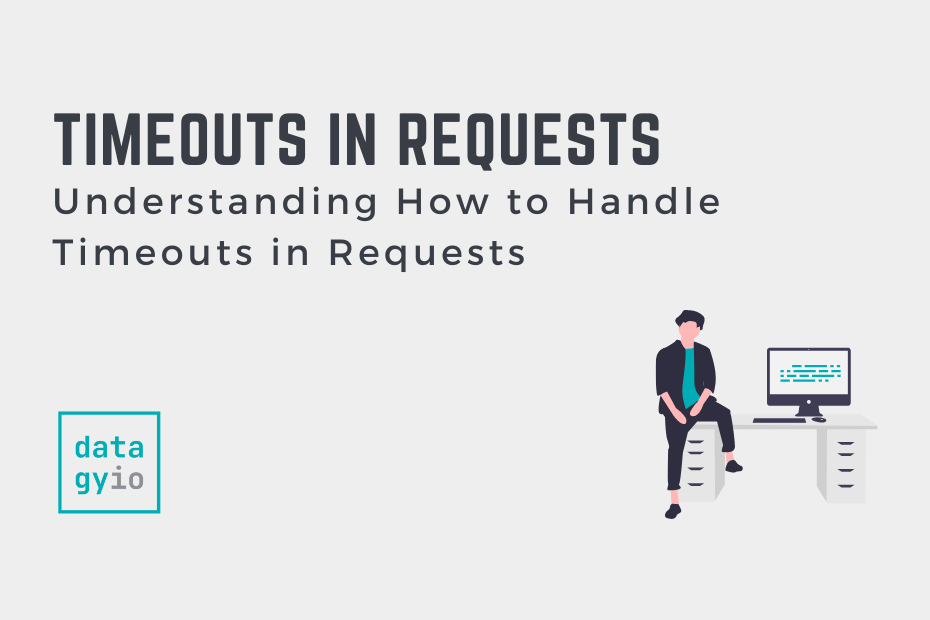

# Тайм-ауты в Python requests


Ссылка на оригинальную статью: [Timeouts in Python requests](https://datagy.io/python-requests-timeouts/)

Опубликовано: 24 августа 2022

Авторы:


<figure><figcaption></figcaption></figure>

В этом руководстве **вы узнаете, как использовать тайм-ауты в библиотеке запросов Python при работе с любым типом выполняемых HTTP-запросов**. По умолчанию библиотека **requests** не закончит ожидание времени любого вашего запроса, что может привести к тому, что ваша программа будет работать бесконечно, если сервер не отвечает.

К концу этого урока вы узнаете:

* Как установить таймауты в запросах
* Как установить уникальные тайм-ауты для подключения и чтения в запросах Python
* Как поймать и обработать ошибки тайм-аута в запросах Python

## Как Python requests обрабатывает тайм-ауты?

По умолчанию библиотека запросов Python не устанавливает тайм-аут для любого отправляемого запроса. Это верно для запросов **GET**, **POST** и **PUT**. Хотя это может предотвратить непредвиденные ошибки, это может привести к тому, что ваш запрос будет выполняться бесконечно.

Из-за этого важно установить тайм-аут, чтобы предотвратить неожиданное поведение. **Помните, что библиотека Python `requests` по умолчанию не имеет таймаута, если только это не указано явным образом.**

## Как установить тайм-аут для Python requests

**Чтобы установить тайм-аут в HTTP-запросе, сделанном через библиотеку requests, вы можете использовать параметр `timeout`**. Параметр принимает либо целое число, либо значение с плавающей запятой, которое описывает время в секундах.

Важно отметить, что такое поведение отличается от многих других библиотек HTTP-запросов, например, в JavaScript. В других библиотеках или языках это поведение обычно выражается в миллисекундах.

Давайте рассмотрим пример того, как мы можем отправить запрос **GET** с тайм-аутом:

```python
# Установка тайм-аута для запроса GET с целым числом
import requests
resp = requests.get('https://datagy.io', timeout=3)
```

В приведенном выше примере мы установили тайм-аут в 3 секунды. Мы использовали целое число для представления времени нашего тайм-аута. Если бы мы хотели быть более точными, мы могли бы также передать значение с плавающей запятой:

```python
# Установка времени ожидания для запроса GET со значением с плавающей запятой
import requests
resp = requests.get('https://datagy.io', timeout=3.5)
```

Передавая одно значение, мы устанавливаем время ожидания для запроса. Если мы хотим установить разные тайм-ауты для подключения и чтения запроса, мы можем передать кортеж значений.

## Как установить тайм-ауты для подключения и чтения в Python requests

В некоторых случаях вам может потребоваться установить разные тайм-ауты для установления соединения и чтения результатов. Это легко сделать с помощью параметра **timeout** в библиотеке **requests**. Подобно приведенному выше примеру, это может быть применено к любому типу выполняемого запроса.

Давайте посмотрим, как мы можем передать различные ограничения времени ожидания для запросов на подключение и чтение в библиотеке запросов Python:

```python
# Установка разных тайм-аутов для запросов на подключение и чтение
import requests
resp = requests.get('https://datagy.io', timeout=(1, 2))
```

В приведенном выше примере мы устанавливаем тайм-аут запроса на 1 секунду для подключения и 2 секунды для чтения запроса.

В следующем разделе вы узнаете, как перехватывать и обрабатывать ошибки, возникающие из-за истечения времени ожидания запросов.

## Как перехватывать и обрабатывать ошибки тайм-аута в Python requests

При применении тайм-аута **важно отметить, что это не ограничение по времени для всего ответа**. Вместо этого он вызывает исключение, если на базовый сокет не было получено ни одного байта.

Если запрос не получает ни одного байта в течение указанного времени **timeout**, возникает ошибка **Timeout**. Давайте посмотрим, как это выглядит:

```python
# Вызов ошибки тайм-аута в запросах Python GET Request
import requests
resp = requests.get('https://datagy.io', timeout=0.0001)

# Raises:
# ConnectTimeoutError(
#    <urllib3.connection.HTTPSConnection object at 0x7fbc988f59a0>,
#    'Connection to datagy.io timed out. (connect timeout=0.0001)'
# )
```

Чтобы предотвратить сбой вашей программы, вам необходимо обработать исключение с помощью блока `try-except`. Давайте посмотрим, как это можно сделать:

```python
# Обработка ошибки тайм-аута
import requests
from requests.exceptions import ConnectTimeout

try:
    requests.get('https://datagy.io', timeout=0.0001)
except ConnectTimeout:
    print('Request has timed out')

# Возвращает:
# Срок запроса истек
```

В приведенном выше коде мы видим, что ошибка была обработана безопасно. Для этого мы:

1. Импортирована ошибка из модуля исключений библиотеки **requests**
2. Мы создали блок `try-except` для обработки ошибки **ConnectTimeout**.

## Часто задаваемые вопросы

### Каков тайм-аут по умолчанию для Python requests?

`None`. Тайм-аут по умолчанию для Python requests отсутствует, если только он явно не задан с помощью параметра **timeout**.

### Как вы устанавливаете тайм-аут для запросов, сделанных в Python?

Вы устанавливаете время ожидания (в секундах) с помощью параметра `timeout=` при выполнении HTTP-запросов в библиотеке Python requests.

### Какое время лучше всего установить для тайм-аута для запросов, сделанных в Python?

Хотя лучшего значения тайм-аута для HTTP-запросов, сделанных в Python, не существует, рекомендуется устанавливать их менее **500 мс**. Это позволяет вашему приложению обеспечивать лучший пользовательский интерфейс и обрабатывать больше запросов.

## Заключение

В этом руководстве вы узнали, как обрабатывать тайм-ауты в библиотеке Python **requests**. Вы впервые узнали, как библиотека Python **requests** обрабатывает тайм-ауты. Затем вы узнали, как устанавливать тайм-ауты при выполнении HTTP-запросов, используя как целые числа, так и значения с плавающей запятой. Затем вы узнали, как указать определенные тайм-ауты для запросов на подключение и чтение. Наконец, вы узнали, как обрабатывать исключения тайм-аута в библиотеке Python requests.

## Дополнительные ресурсы

Чтобы узнать больше о связанных темах, ознакомьтесь с руководствами ниже:

* [Python Requests Response Object Explained](https://datagy.io/python-requests-response)
* [Python Requests Headers Explained](https://datagy.io/python-requests-headers)
* [Python Requests Sessions Explained](https://datagy.io/python-requests-session)
* [Official Documentation: Python requests Timeout](https://requests.readthedocs.io/en/latest/user/quickstart/?highlight=timeout#timeouts)
