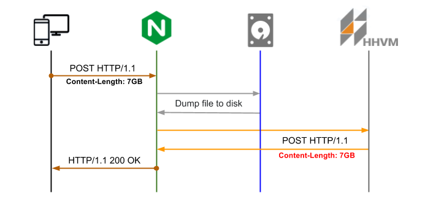
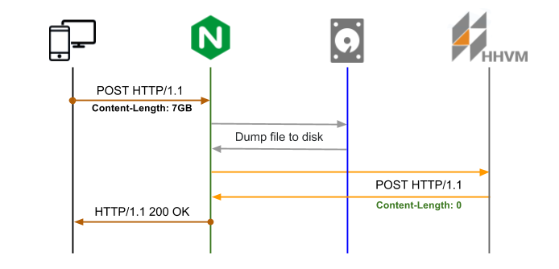
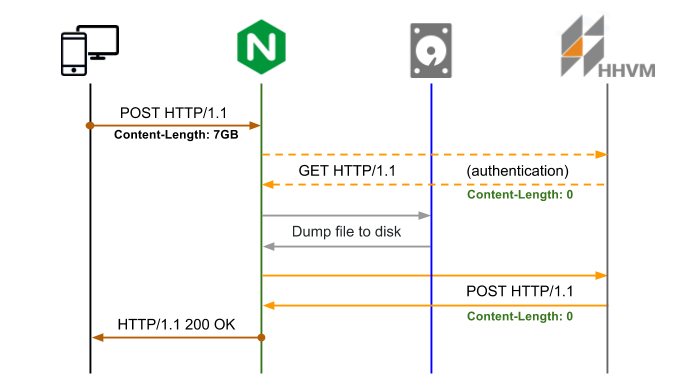

# Nginx PHP не работает при загрузке больших файлов (более 6 ГБ)

## Вопрос


Ссылка на оригинальную статью: [Nginx PHP Failing with Large File Uploads (Over 6 GB)](https://stackoverflow.com/questions/44371643/nginx-php-failing-with-large-file-uploads-over-6-gb)

Опубликовано: 5 июня 2017

Авторы: [Devin Dixon](https://stackoverflow.com/users/456850/devin-dixon)


У меня очень странная проблема с загрузкой больших файлов размером более 6 ГБ. Мой процесс работает следующим образом:

1. Файлы загружаются через Ajax в php-скрипт.
2. Сценарий загрузки PHP берет $\_FILE и копирует его частями, как в [этом ответе](https://stackoverflow.com/questions/6564643/copy-large-files-over-2-gb-in-php), в местоположение tmp.
3. Местоположение файла хранится в БД.
4. Сценарий cron загрузит файл в s3 позже, снова используя функции fopen и буферизацию, чтобы снизить использование памяти.

Моя конфигурация PHP (HHVM) и NGINX настроена на разрешение до 16 ГБ файла, мой тестовый файл составляет всего 8 ГБ.

Вот что самое странное: время ожидания ajax ВСЕГДА истекает. Но файл успешно загружен, он копируется в местоположение tmp, местоположение, хранящееся в базе данных, s3 и т. д. Но AJAX работает в течение часа даже ПОСЛЕ завершения всего выполнения (что занимает 10-15 минут) и только заканчивается, когда истекает время.

Что может быть причиной того, что сервер не отправляет ответ только на большие файлы?

Также журналы ошибок на стороне сервера пусты.

## Ответ 1

Загрузка большого файла — дорогостоящая операция, чреватая ошибками. Nginx и серверная часть должны иметь правильный таймаут, настроенный для обработки медленного ввода-вывода с диска в случае возникновения. Теоретически управлять загрузкой файлов с помощью кодирования multipart/form-data RFC 1867 несложно.

Согласно сайту [developer.mozilla.org](https://developer.mozilla.org/en-US/docs/Web/HTTP/Headers/Content-Disposition), в теле multipart/form-data общий заголовок HTTP Content-Disposition представляет собой заголовок, который можно использовать в подчасти составного тела для предоставления информации о поле, к которому он применяется. Подчасть ограничена границей, определенной в заголовке Content-Type. Используемый на самом теле Content-Disposition не оказывает никакого эффекта.

Давайте посмотрим, что происходит во время загрузки файла.

1. клиент отправляет HTTP-запрос с содержимым файла на веб-сервер
2. веб-сервер принимает запрос и инициирует передачу данных (или возвращает ошибку 413, если размер файла превышает лимит)
3. веб-сервер начинает заполнять буферы (зависит от размера файла и буферов)
4. веб-сервер отправляет содержимое файла через файловый/сетевой сокет на серверную часть
5. Серверная часть аутентифицирует первоначальный запрос
6. бэкэнд читает файл и вырезает заголовки (Content-Disposition, Content-Type)
7. Серверная часть сохраняет полученный файл на диск
8. любые последующие процедуры, такие как изменения базы данных

<figure><figcaption></figcaption></figure>

При загрузке больших файлов возникает ряд проблем:

* запрос тела HTTP сбрасывается на диск и передается на серверную часть, которая обрабатывает и копирует файл
* невозможно аутентифицировать запрос до загрузки содержимого HTTP-запроса на сервер
* хотя серверная часть загрузки больших файлов редко требует немедленного получения содержимого файла

Начнем с того, что Nginx настроен с новым расположением http://backend/upload для приема больших файлов, взаимодействие с серверной частью сведено к минимуму (Content-Legth: 0), файл хранится только на диске. Используя буферы, Nginx выгружает файл на диск (файл хранится во временном каталоге со случайным именем, его нельзя изменить) с последующим POST-запросом к бэкэнду в местоположение http://backend/file с именем файла в заголовке X-File-Name.

Чтобы сохранить дополнительную информацию, вы можете использовать заголовки с первоначальным запросом POST. Например, наличие заголовков X-Original-File-Name из первоначальных запросов поможет вам сопоставить файл и сохранить необходимую информацию о сопоставлении с базой данных.

<figure><figcaption></figcaption></figure>

Давайте посмотрим, как это произойдет:

1. настройте Nginx для выгрузки содержимого тела HTTP в файл и сохранения его в client\_body\_in\_file\_only;
2. создайте новую конечную точку серверной части http://backend/file для обработки сопоставления между именем временного файла и заголовком X-File-Name
3. AJAX-запрос инструмента с заголовком X-File-Name, который Nginx будет использовать для отправки запроса на загрузку

Конфигурация:

```nginx
location /upload {
  client_body_temp_path      /tmp/;
  client_body_in_file_only   on;
  client_body_buffer_size    1M;
  client_max_body_size       7G;

  proxy_pass_request_headers on;
  proxy_set_header           X-File-Name $request_body_file; 
  proxy_set_body             off;
  proxy_redirect             off;
  proxy_pass                 http://backend/file;
}
```

> Параметр конфигурации Nginx [client\_body\_in\_file\_only](http://nginx.org/en/docs/http/ngx\_http\_core\_module.html#client\_body\_in\_file\_only) несовместим с загрузкой multi-part данных, но вы можете использовать его с AJAX, т. е. XMLHttpRequest2 (двоичные данные).

Если вам нужна внутренняя аутентификация, единственный способ справиться с этим — использовать [auth\_request](http://nginx.org/en/docs/http/ngx\_http\_auth\_request\_module.html), например:

```nginx
location = /upload {
  auth_request               /upload/authenticate;
  ...
}

location = /upload/authenticate {
  internal;
  proxy_set_body             off;
  proxy_pass                 http://backend;
}
```

<figure><figcaption></figcaption></figure>

Логика аутентификации перед загрузкой защищает от неаутентифицированных запросов независимо от исходного размера Content-Length POST.

## Комментарии

Великолепно! Как бы вы это настроили для работы без прокси? Поможет ли добавить строку `return 201 $request_body_file;` вместо этого?

proxy\_pass не обязательно должен быть восходящим URL-адресом серверной части, это может быть именованное внутреннее расположение, чего вы пытаетесь достичь?

загрузить файл в js:

```javascript
const file = document.getElementById('file').files[0];
const xhr = new XMLHttpRequest();
xhr.open('POST', '/upload', false);
xhr.send(file);
```

html:

```html
<input id="file" type="file" onchange="upload()" />
```

просто пример: используйте async на проде

для первого комментария и всем, кто задается вопросом: это не сработает, если вы вернетесь в конце директивы местоположения. Я обнаружил, что это не работает после пары часов проб различных вариантов конфигурации. Но вы можете использовать сам nginx в качестве цели-прокси. См. [spielwiese.fontein.de/2017/04/23/simple-file-uploading-in-nginx](https://spielwiese.fontein.de/2017/04/23/simple-file-uploading-in-nginx/), где приведен пример настройки сервера для прослушивания порта 4000 и установки значения proxy\_pass на 127.0.0.1:4000.

тот же код, который я использую, но в веб-браузере отображается ошибка 405. вы можете мне помочь?
